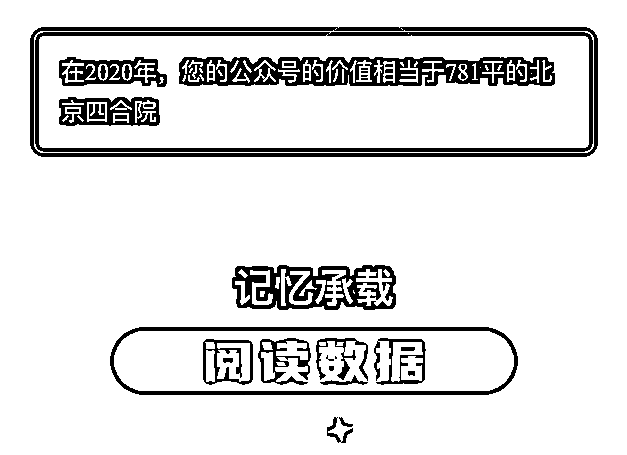
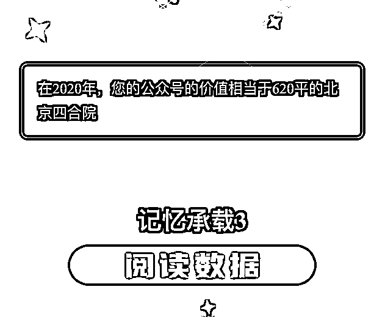

# 传国玉玺，传国玉玺，你仔细想想，为什么没有传国鞋垫呢？

> 原文：[`mp.weixin.qq.com/s?__biz=MzU3NDc5Nzc0NQ==&mid=2247499473&idx=1&sn=1e2f3ac23e413ade0649ef06b3b350a4&chksm=fd2e5c0fca59d51916eef04d889e0a2ce13771ead70428cb32d7beb90e6c6ed20e522af14237#rd`](http://mp.weixin.qq.com/s?__biz=MzU3NDc5Nzc0NQ==&mid=2247499473&idx=1&sn=1e2f3ac23e413ade0649ef06b3b350a4&chksm=fd2e5c0fca59d51916eef04d889e0a2ce13771ead70428cb32d7beb90e6c6ed20e522af14237#rd)

[今天大号的文章](http://mp.weixin.qq.com/s?__biz=MzU0MjYwNDU2Mw==&mid=2247496400&idx=1&sn=78e73781ef8a01d1e5110e9c36c417a0&chksm=fb1a9eaccc6d17ba430b44f9dc4fd52df2d73853afbbd7d53b4702712bc9e961db733c9049a9&scene=21#wechat_redirect)，看完之后好些人问了我一个很搞笑的问题。 

比如有人问我，咱们这两个号谁来传承？

你说的是谁？是记忆承载和记忆承载 3 么？ 

咱们这两个号是有价值的，但有价值的东西多了。 

过去农民背后背个框框，你知道他干啥的？捡粪。路上捡到一个，放进去，回头搁在自家地里，这叫纯天然有机肥料。 

好东西，它是有价值的。 

不要笑，真是有价值的，唐代的首富你以为做什么生意的？就是经营公厕的。

唐代的首富在长安城里开公厕，大家方便了之后，他把留下的那点东西，卖给种田的，于是就成了首富。

**所以有价值的东西很多，但并不是说所有有价值的东西都值得传承。**

有没有人会指着一团臭臭，说：儿子，看，这是你爹留给你的传家宝？

会不会？

不会，如果这样，那就上相声段子了。

比如《我爱我家》里面，老傅同志交代后事，拿出一双鞋垫子，要交给志国，大家都被逗乐了。

**你看到了，并不是所有有价值的都值得传承，鞋垫子肯定有价值，但上升不到传承的程度。** 

甚至搬家的时候，你可能就扔了。谁搬家没事儿了还非得带着一双旧鞋垫子？ 

回过头来看咱们两个公众号。 

它们是有价值的：

这是第三方的一种估值，你看到了，无论它估高了还是估低了，它都肯定比一双鞋垫的估值要高，高挺多。 

所以它就值得传承了么？ 

值得个 P。

你去看下公众号的排名，排行榜第一的是谁？

是人民日报。 

任何行业里你做到第一位，肯定是有传承价值的，只要行业还在，第一肯定算得上事业，事业是需要后继有人的。

就算整个行业都不在了，第一也会被历史铭记，这是惯例。 

当年我高中的时候，母校会把谁记入校史？会把状元和奥赛金牌得主记入校史。

比如我曾经的一任同桌，她就被记入校史了，我就没有。

我没有不是因为我是个差生，我没有是因为我还没有混到被值得记录的地步。

在学校看来，如果拿不了高考状元或者奥赛全世界金牌，那你就是一个过客，仅此而已。 

在公众号的排行榜里，我们一个排在 1500~2000 之间，一个排在 2500~3000 之间。 

排名附近都是些中小城市都市报或者一些不出名的刊物。 

这么低的地位，传承个毛线啊。 

就像你有一套房子，五环开外，那是一种价值；二环内，是另一种价值。但是，都跟传世不沾边。

你说我有套房子，独栋，二环内，各种优势占尽，是不是轮到传世了？依然没有。

得看谁的宅子。 

要是恭王府，那甭提了，这是值得传世的。那是历史名人故居，那是上了榜的。

就像我的母校跟后面的学生们讲故事，一定是讲我曾经那位同桌如何如何好好学习，天天向上，不会提我。

所以恭王府是你们家的，和恭王府斜对面那个公厕是你们家的，两个意思。

前者是不可复制的，后者是可以复制的。 

其实后者挺值钱，公厕也是占了一块地，拆迁也赔不少钱。但那玩意儿，推倒了重盖，想怎么盖怎么盖，没有稀缺性。

收藏也是一码事。 

你说司母戊鼎要不要传承？当然要，太要了。

国之大事，在祀及戎，那可是祭祀用品，一等一的珍贵，民族之瑰宝。

就像传国玉玺，皇上祭天，出征用的宝剑。 

如果你说，乾隆爷小时候用过的尿布，慈禧太后用过的马桶，那些东西当然也有价格，而且价格昂贵，但传承轮得上么？

你觉得那玩意儿，有那么大的文物价值？ 

所以你去看下文物等级名单，是有严格规定的。 

要看这东西哪朝哪代，当年是用来干啥的，里面是否蕴含了历史信息，珍稀程度如何。

王羲之的字当然是无价之宝，王羲之他们家隔壁邻居儿子小时候的作业本，如果留下来，那就只是古人生活用品。 

把这个话题想清楚，你们问我的那些问题自然而然的答案就浮出来了。 

你到底要人家继承你什么嘛？你想明白没有？ 

过年的时候，去了一户亲戚的亲戚，那家特别喜欢收藏，我看了一圈，当面啥也没说，但心里嘀咕。我老爹随便拿任何一样，都比这里最好的好。 

所以我老爹是藏家？是个毛线。 

我老爹就是玩儿。

我 18 岁的时候，他跟我说，让我继承他所有的藏品，我反问了他一句，您有藏品么？ 

您知道什么叫藏品？ 

能够代表一个民族，一个文化圈，蕴含了特殊的历史信息，且为孤品，或者近乎孤品。

您这些，只是你喜欢玩儿，这叫玩儿品。 

你玩儿着高兴，那就玩儿呗。

不要把玩儿和传世混淆了。

这年头有价格的东西多了去，手办也有很贵的，七位数的手办有，八位数的手办都有，但那就是个手办而已。 

你买了一套房子，回头留给你孩子，给孩子住呗，他不想住了，就卖呗。 

那东西有价格，但谈不上传世，您那房子又不是鲁迅故居，最后不是卖就是拆，这是它最后的宿命，一定一定的。

**回过头来看这俩公众号，这就是咱们大家伙儿跟这儿玩儿。** 

**我说相声，您喜欢听，大家图个开心，就这回事。**

这东西如果我乐意，明天想做三个做三个，想做五个做五个。它没有什么稀缺性，更不值得当回事。 

我一直有一个很朴素的观念。 

钱和人，谁重要？一般来讲，当然人重要。

除非这钱大的没边了，大到可以关系千万人的生计。

一般情况下，一套房子和一个人，谁重要？当然人重要，哪怕他是乞丐。十套房子和一个人，谁重要？当然还是人重要，哪怕他还是个乞丐。

他哪怕是个喷子，是个笨蛋，是个乞丐，他也始终是我们的同类。 

我们犯不着用人这么高档的东西，去传承玩具，不值当的事儿。

除非这个玩意儿已经不是玩意儿了，它升华了。

比如《伯远帖》，你说到了那个级别，我们不惜以人为代价去保存，去传承，才说得通。

传国玉玺，传国玉玺，你仔细想想，为什么没有传国鞋垫呢？

好好想想，鞋垫，值不值得传国嘛？

故宫博物院里面那么多工匠耗尽一生，是保留文化瑰宝的。注意前提，前提是瑰宝。

您好好琢磨下，自己手里到底有什么能称得上不世之物，或者有什么行业排名第一的企业，有，您再琢磨传承这档子事儿，也不迟。