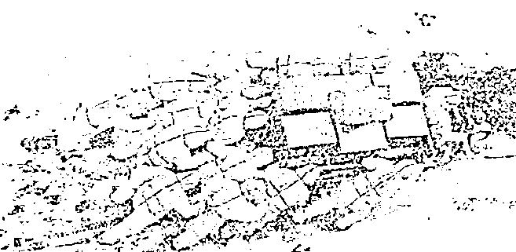
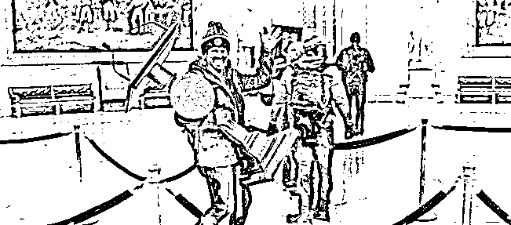
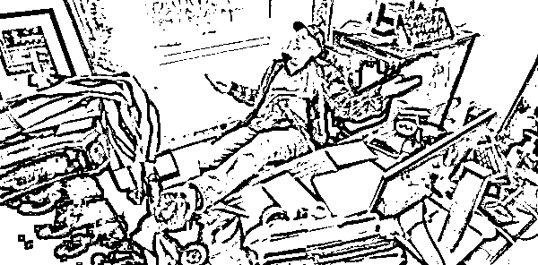

# 川普失去了他的推特，永远！

> 原文：[`mp.weixin.qq.com/s?__biz=MzU3NDc5Nzc0NQ==&mid=2247498460&idx=2&sn=81ea8434fd5ffbc8af53f2b86ff4efa8&chksm=fd2e5802ca59d1143e33b65c066781f42b2938ed11613a3b9410f7d13fb80a6222fe30210ddc#rd`](http://mp.weixin.qq.com/s?__biz=MzU3NDc5Nzc0NQ==&mid=2247498460&idx=2&sn=81ea8434fd5ffbc8af53f2b86ff4efa8&chksm=fd2e5802ca59d1143e33b65c066781f42b2938ed11613a3b9410f7d13fb80a6222fe30210ddc#rd)

推特昨天宣布，永久删除川普的账号，你注意，不是永久禁言，是删除。

他挥一挥手，走时没留下一条历史消息...... 

我曾经还说，作为 8000 多万粉丝的德云社美国分社社长，即便竞选总统失败了，还可以说相声，现在看来，连这条路都堵住了。

接下来很重要，我相信这几天你们会收到如下短信：

“你好，我是川普，我目前被人控制了，他们封了我的推特，我偷偷跑出来借这位好心人的手机给你发个短信，我急需 200 块钱买车票回到白宫，请尽快给我汇款，账户是怎样怎样，待我回到白宫，必有重谢，赏你 2 个亿云云......”

小心哦，从这会儿开始，此类消息绝对少不了，你不会上当不等于别人不会。大数定律告诉你，一万个人里面总有一个傻到会相信，会打款的。

通知说完了，言归正传，我为什么要给你讲川皇失去推特这件事？

就是要修正你的预期。

川皇这辈子也许最珍视的就两样东西，白宫和推特，现在他都没有了，真的可以唱王健林唱过的那首“一无所有”了。

前者，不稀奇，咱们预测过，后者，的确出人预料。 

你想一想，连川皇都能失去说话的机会，你有什么不知足的？

起码你还可以跟我聊天，川皇可以么？川皇可以么？

呵呵。

再想想他的出身，想想你的出身，他是富二代，你是么？他好歹是个成功人士，你是么？

他那样，都沦落成这样，你这样，还能比他那样，咱们今天不该开一瓶香槟，为自己庆祝么？

这就叫知足常乐。

知足就是要让你看清现实，看清现实就是自我预期管理。

有很多读者看了[今天大号的文章](https://mp.weixin.qq.com/s?__biz=MzU0MjYwNDU2Mw==&mid=2247495636&idx=1&sn=6fd8a8710b2abfdea10877aaeca3a083&chksm=fb1a83a8cc6d0abe46ad9c32b972936660680336c8fdefcb5889cba1a04028fa4fef2c03d365&token=2012706401&lang=zh_CN&scene=21#wechat_redirect)，跟我说，很沮丧。

理想很丰满，现实太骨感。

是的，如果你按照理想去看待这个世界，你会发现几无可嫁之男，几无可娶之女。

为什么呢？因为你的预期那么高，现实却那么低。 

可是，我给你换个参照系，恐怕你的感觉就大不一样了。 

比如下面这几张图。

这张，发生在大连，暴风雪中，大连海洋大学的志愿者在运送物资。大连，东北哦，什么温度，你自己想。 

为什么呢？因为此前大连海洋大学有一名学生确诊感染新冠。所以该治疗的治疗，该封校的封校，该隔离的隔离。

于是就有了送物资的这一幕。

与此同时，华盛顿在干嘛？我们[昨天大号写了](http://mp.weixin.qq.com/s?__biz=MzU0MjYwNDU2Mw==&mid=2247495633&idx=1&sn=46146c1ea9b47581c27caee543f19468&chksm=fb1a83adcc6d0abb5fe190d2d6b277a3423676555fc4bd0978e582405a68ce62e6ea29568f3f&scene=21#wechat_redirect)，他们也在忙着运送物资，把国会大厦的物资，往家搬，上网拍卖。

我在两年前，就说的很清楚，**中美之间长期来看，是人的问题**。 

就像你买房子，短期看金融，中期看土地，长期看人。

国家与国家之间，乃至家与家之间，也是如此，长期看人。

《流金岁月》里蒋南孙她们家迟早得没落，因为没有人才了。

你们家兴，不是坟头风水好，就是因为有人才，[昨天说的很清楚](http://mp.weixin.qq.com/s?__biz=MzU3NDc5Nzc0NQ==&mid=2247498441&idx=1&sn=1329d25e22f8c21b016ba51a6ba3ec5d&chksm=fd2e5817ca59d101013393a3d730cd239bcf8656284335b5c1eb096a411dcd7ceca1215eb5a9&scene=21#wechat_redirect)，只要有人才，别人兜里的钱也由你花，别人手里的权力也归你使。 

但如果没有了人才，那合该你没落。

我们平时因为互联网的头部效应，大家永远都盯着双方最顶尖的那几个人物来看。 

马云确实不如马斯克优秀，所以有时候我们是发怵的。

但问题在于，这么对比没意义，国与国之间的竞争并不是由几个人的 PK 来决定。

这又不是古代打仗，关羽斩了颜良，河北军马一哄而散，不是的。

现实中哪怕关羽斩了颜良，也会被颜良的手下打成筛子。所以就算马云远不如马斯克，也无关大局，哪怕我们头部的 1%整体都不如美国的头部 1%，也无关大局。

因为你分层对比，会发现我们整体上，人的优势很明显。

比如拿我们 10%这个位置的和美国 10%这个位置的人才去对比。

比如拿我们 50%这个位置的和美国 50%这个位置的人力去对比。

我们优势巨大。

单单是精神面貌就差好远。 

开头对比的那几张照片，太严肃，太煽情，我说个笑话。 

网上有个段子，说有两个女生抱怨。

一个说，我男朋友每个月把所有工资都交给我了，每逢节日他居然不给我买礼物，这样的男朋友该不该要？

另一个说，我男朋友每个月把所有工资都交给我了，他居然还有钱给我买礼物，这样的男朋友该不该休？ 

这两个段子都很有内涵。

第一个段子，你把人家所有工资都没收了，你让人家拿啥给你买礼物嘛，你也太不讲理了。

第二个段子，你把人家所有工资都没收了，他还有钱给你买礼物，所以你怀疑他藏私房钱，对你不忠。

这固然是个笑话，但侧面反映出很多内涵。

在我们国家，你找一个很年轻，有房有车有存款又专一的男生不容易。

但是你找一个愿意勤奋工作赚钱，把钱交给你，花费一生的时间和你一起养孩子的男生一点都不难。

后者在美国找起来，一点都不容易。

你遇见一个美国的 BOY，爱玩，爬山，滑雪，旅游，打枪，会是个好玩伴。 

但真的和他组建家庭，你会发现他没有财务规划，没有储蓄，也并不热衷把孩子送名校，甚至他觉得，大家就应该 AA，一起赚钱一起玩。

这就叫观念冲突。

站在文化的角度看，各有各的活法，甚至大部分时候我们都会羡慕老美的这种自在。但是站在竞争的角度，你会发现中国人真的很适合竞争。

竞争是什么意思？就是不停的考验你。

岁月静好的时候，你会觉得老美很有腔调，但疫情一来，你发现中国人抱团取暖，众志成城。

花钱的时候，你觉得老美很会玩，但真要是掏大钱，买房，看病，上学，你发现收入远比美国人低的中国家庭反而能拿出一大笔钱。

即便我们去对比双方最下面的 10%，有时候你都会发现我们的闪光点。 

比如咱们的互联网上充满了喷子，杠精以及各种无所事事的人。

你以为美国没有？多了去。

如果你经常上外网，就会发现，英文世界里的杠精才是真杠精。

咱的杠精其实是读过书的，只是没读懂，一脑袋浆糊。

西方的杠精是真的啥也不知道的纯傻，有时候你都怀疑他们是原始社会穿越过来的。

如果看自律，双方的差距就更大。

咱们最糟糕的，无非是三和大神嘛，把身份证抵押了，换 200 块钱去网吧里通宵，实在兜里没钱去工厂里打一天散工，然后继续半流浪汉式的生活。

可你知道美国的大神什么样么？

你去美国大城市的市中心，夜里开车，街道两旁帐篷里全是，各种吸毒的，酗酒的，精神不正常的。

我们也有吸毒，但我们往往是明星吸毒，有俩钱骚包的吸毒，没有大规模的每个城市中心地带聚集大量底层吸毒，没有。

说实话，美国这种乌烟瘴气的程度，能够直到今天还混充世界老大，80%仰赖祖荫，祖宗确实牛。

剩下的 20%就是靠前 1%的人，撑场子，他们的 TOP 1%还是蛮优秀的。

可问题是，我们想一想，大部分人，是不是 TOP 1%？当然不是。 

那你在普通中间层里面挑选，你喜欢什么样的人？

或者说，你喜欢和什么样的人搭伙过日子，你喜欢和什么样的人一起工作？

我当然喜欢一个积极向上的，有责任心的，有奋斗目标的，能够持之以恒的人。

物以类聚，人以群分嘛。

所以我经常说一句话，操控预期，不是让你操控别人的预期，是让你学会调节自己的预期。

你什么都不接触，成天看韩剧，看来自星星的都教授，那你当然对现实是不满的，你当然没有办法择偶。

就像我老婆当年看都教授的时候，也成天说我，你哪儿哪儿都不如都教授。

这种指责有意义么？没有。

他不仅是虚构的，还是个外星人，你拿现实中的我和一个虚构出来的外星人比较，哪儿能赢呢。

像我就特别现实，因为我不看这个，我接触过各个国家的同行，团队，包括优秀的人，也包括不优秀的。

我这人很喜欢把前 5%掐掉，咱们比剩下的 95%，中美印之间对比。

对比完了你就有信心了。