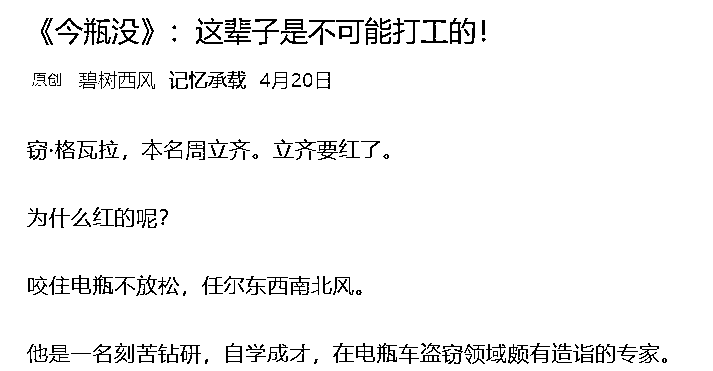
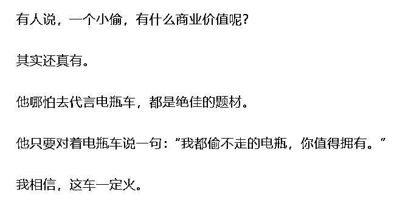

# 怎么看今生不打工的周立齐真的当上了电动车行老板？

> 原文：[`mp.weixin.qq.com/s?__biz=MzU3NDc5Nzc0NQ==&mid=2247495360&idx=2&sn=a3201c21076b115f49380a87ded66b6b&chksm=fd2e4c1eca59c508cd4c8cd3fe731661c0d51a3d3622084a8c74922076a077fd4434d377cdd2#rd`](http://mp.weixin.qq.com/s?__biz=MzU3NDc5Nzc0NQ==&mid=2247495360&idx=2&sn=a3201c21076b115f49380a87ded66b6b&chksm=fd2e4c1eca59c508cd4c8cd3fe731661c0d51a3d3622084a8c74922076a077fd4434d377cdd2#rd)

读者问我一件事。

说出那句“打工是不可能打工的，今生都不可能打工的”周立齐，因盗窃电瓶车电瓶入狱 4 年的窃格瓦拉，出任广西飞驴电动车科技有限公司联合创始人。

你看，言必信，行必果，他果然做到了。

我关于这个问题的看法很简单，翻开大号今年 4 月 20 日的文章：[《今瓶没》：这辈子是不可能打工的！](https://mp.weixin.qq.com/s?__biz=MzU0MjYwNDU2Mw==&mid=2247489036&idx=2&sn=61216535029bd66013366749e1beaf7a&chksm=fb197a70cc6ef36644b706fb0d08ed50ec01a0ff65686399648ec1c320d48bb3322d1239d9cd&token=1614851456&lang=zh_CN&scene=21#wechat_redirect)

看到了吧，七个月前就告诉你这场合作了。咱能看得到的商机，经营电瓶车的也能看得到。

我知道大家不喜欢听，你说我辛辛苦苦的做一个打工人，他去号子里蹲了 4 年，反而不用再做打工人，让人跟哪儿说理去？

你不喜欢听很正常。

**只要是个正常人，一定不喜欢听不利的分析。**

请记住我这句话。这句话很重要，**你不欣赏一个小偷做老板，我也不欣赏。**

**我非但不欣赏，而且很厌恶。** 

咱俩的区别仅仅在于我在市场里浸泡 12 年了，我厌恶的事情天天发生，我已经学会站在没情绪的机器人的角度思考与分析。 

有些事是烂事，但**提前知道烂事会发生，总好过不知道。** 

窃格瓦拉其实跟咱没啥关系，但是，如果能够通过这件事的预测看到自己性格中的缺陷，那你就赚到了。

你注意，看到不等于改掉，但看到很了不起，这世上七成的人绝对看不到自己性格上的缺陷。

资本市场里有句话：八亏一平一赚。哪部分人在亏钱，你琢磨。

皇帝的新装这个故事我们都学过，但那是站在别人的视角，常人都是灯下黑的，照得见别人，照不见自己。 

你之所以能够看到皇帝没有穿衣服，是因为你不是他，如果你是他，你比他还傻。 

你不仅看不到自己没穿衣服，而且别人告诉你，你是绝对不会接受的。 

一个人，只要能够接受对自己不利的分析，他已经超过了 70%的人，妥妥的。

但这一点很难。 

因为**你会下意识的去训练一切给你提供信息的人。** 

皇帝为什么不知道自己没穿衣服？ 

因为跟他说这句话的人，都被他杀了。

你以为你不是么？你也是的。 

不信去做个试验。 

打开今日头条，或者随便什么网站，你专门点预测房价涨的那些分析，或者专门点预测房价跌的那些分析，连续点 10 条以上。

接下来你就会发现，你接受的信息变得单一化了。 

如果你点的是房价涨的信息，10 条以后，那些预测跌的，就自动消失了，再也不会主动出现在你的推荐页上。 

如果你点的是房价跌的信息，10 条以后，那些预测涨的，就自动消失了，再也不会主动出现在你的推荐页上。 

是崇祯临死前大喊的“诸臣误我”吗？是网站故意误你么？ 

不是的。这是你自己选择的。

你把网站，也就是你的大臣，训练成了那样。

大臣清楚，说的话不动听，就会被你杀了；网站也很清楚，只有说的话动听，你才会看它第二眼。 

久而久之，你再也听不到不动听的。 

回到咱们的主题，周立齐当老板。

大号 4 月 20 号那些骂我的人，他们反驳的点就一条，你为什么不去阻止？ 

很简单，我阻止不了。

我连改变你们都不可能，我能改变压根不看我文章的人么？

**谁也叫不醒一个装睡的人，人是不可能被改变的，除非他自己愿意改变自己。** 

咱们 2019 年 5 月的时候，被关过思过崖。

因为在股市开盘前，通知了读者一件事，我的本意很简单，让一部分人规避损失。但因此去了思过崖，关禁闭一周。

为什么呢？事后有个别读者告诉我了。 

他说，是他奋力的举报我，我就很好奇，何以恩将仇报？ 

他告诉我，我通知大家的事情，他们看到了，但是他怀着侥幸的心理，没有做，结果承担了很大的损失。事后看到自己有朋友听了建议，规避了损失，甚至还有反手赚到钱的。

于是心里很气。 

气谁呢？气的不是自己，气的是我。 

他觉得，不是他自己导致的损失，而是我导致的。 

要是我不说，那他也不知道，亏了也就亏了。 

但是我说了，他没听进去，他朋友反而听进去了，结果原本可以俩人一起亏，现在变成他亏人家赚，他恨死我了。

这就是人性。

我觉得这哥们说的很有道理，很感谢他的坦诚。

他说中了问题的核心，我不应该去试图改变别人的命运，没有人有权力改变别人的命运。

改变自己的是神，企图改变别人的，是神经病。

于是后来我再也不谈术了，我只谈道。

能不能从道里面找出来术，那是你的本事。

两年前我聊天，十分直接，就这么干，...... 

两年后我聊天，滴水不漏，你一丁点儿话柄都抓不住。

你要是能从矿泉水里提炼出砖，那说明你天资绝顶，你要是提炼不出来，那就当相声听。 

大家都舒服了。 

还是像以往一样，老规矩，文末最后几句话，是给极个别不听相声，来思考的读者看的。

皇帝为什么不喜欢别人告诉他没穿衣服？ 

是因为不爱听真话么？不是的，他只是损失厌恶。 

假如这个皇帝很帅，你说他很帅，也是真话，他爱听的，因为这句话不是提醒他损失，而是提醒他盈利。 

扁鹊见蔡桓公，蔡桓公为什么讳疾忌医？因为损失厌恶。 

部分读者为什么忌讳别人告诉他，几个小时候后股市要跌？因为碰巧他持仓，损失厌恶。

当一个人站在铁轨上，火车扑面而来的时候，有两种办法。

第一种，克服损失厌恶，**主动寻找**多元化的信息面。

第二种，解下裤腰带，把眼睛蒙上。

对于大多数人，我建议选第二种，眼不见心不烦。

对于极少数人，我建议你们选第一种。

你如果只是想被动的站在铁轨上听真话，是听不到的，因为没人敢说，你旁边站满了第二种人。 

一旦有人喊：火车来了，就会被暴打。

所以你得主动学习，主动思考，主动寻找，这是唯一的办法。 

还是同一个结论：改变自己的是神，等待别人为自己改变的是神经病。 

你不能指望你身边的人有所改变，你也不能指望有人好心抱着必死的决心就为了给你说句不中听的真话。

你唯一能指望的，就是你自己。 

<mp-qa class="js_uneditable custom_select_card qa_iframe" data-pluginname="insertquestion" data-id="1606504670162698241" data-bizuin="MzU3NDc5Nzc0NQ==" data-title="留言区"></mp-qa>