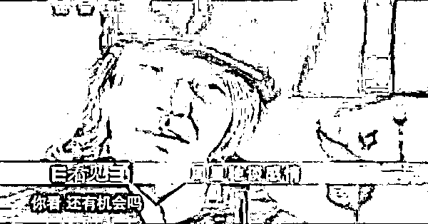

# 二十一、年前的今天，是我参加高考，假如人生可以重来...

> 原文：[`mp.weixin.qq.com/s?__biz=MzU3NDc5Nzc0NQ==&mid=2247490157&idx=1&sn=8b25f253cacaef4dca6d94dd14249615&chksm=fd2db8b3ca5a31a58d855adc0a31d6b4f1308f7c7b8c93ba93e69f3cbef97dceb2f56e186d6c#rd`](http://mp.weixin.qq.com/s?__biz=MzU3NDc5Nzc0NQ==&mid=2247490157&idx=1&sn=8b25f253cacaef4dca6d94dd14249615&chksm=fd2db8b3ca5a31a58d855adc0a31d6b4f1308f7c7b8c93ba93e69f3cbef97dceb2f56e186d6c#rd)

因为疫情的缘故，很多人的高考延迟了，延迟到了盛夏，和我们当年一样。 

二十一年前的今天，我也参加了高考。 

那时候也有很多报纸集中报道，提前几天就封街，疏通马路，出租司机免费接送考生，全社会向考试让步，一切都很隆重。

当然，今天更隆重。

我昨儿个还看到 B 站上的视频，各种励志电影小片段剪接在一起，为考生加油。 

我个人的高考经历很平淡，21 年前的今天，我在家里阳台上坐着，漫不经心的玩水缸里的一只小龙虾。 

就是你今天吃的那种，夜市上的那种小龙虾。

我小时候也很喜欢吃那种东西。 

那段日子也不知道为什么，我爸连鱼缸的鱼都不养了，提前几天把一只烧剩下的小龙虾放在一个水缸里。我就钓它玩。 

我爸说我吊儿郎当的，一点也没有把考试放在心上。 

我确实没有状态，不是高考那几天没状态，而是此前大半年都没有状态了。 

我当年的野心是很大的，如果回溯到高二的时候，我的目标是冲状元。 

但后来的成绩距离那个十分遥远。

我高二如果正常发挥，平时的成绩大概在全年级第 12 名左右，省 50 名到 100 名之间，大部分时候都是这样。 

本来打算高三拼一把的，但是遇到了一些不可测的力量，最终选择了放弃。 

这个不可测的力量是高三那年忽然冒出一个高手。 

这哥们以前是年级前十，但也不是年级第一，第一是个女生，我们那时候都以为那一年理科要出女状元了。

她很稳，常年稳居第一，通常我们高中的第一，不是状元也是前三。

结果半路杀出个程咬金，一个平时在年级五六名的男生，忽然表现得像神一样。 

真的是神一样，高三后半年就是不停的考试，他每次摸底考试都是第一。 

这不稀奇，稀奇的是，他每次考试都有故意犯规。 

就好比比武的时候，只用一只手。 

比如有的时候，数学选择题，故意不填，那时候是读题卡，机读，一张卡不填，几十分就没了。

或者作文不写，几十分没了。

理解这意思吧，他是在少了几十分的情况下，年级第一。 

这是历年未见的怪事，他的水平超过了过去十年，二十年，所有最优秀学生的最高水平一大截。 

这哥们本来是保送清华的，清华北大通常给我们十几个保送名额，他年级前五，原本就有。 

但学校建议他放弃，很显然，状元必然是他的。

这哥们也很奇怪，自从高三开始，就没有来过学校。据说是生了病，而且很重。 

他只有考试的时候才来，平常都住院。 

具体是什么病，也不让我们打听，何况我和他也不是一个班的。 

他们班是重点班，很牛，全年级前十名通常都在他们班，第十一名是隔壁班的第一，第十二名就是我。

你想嘛，有这么一个不世出的大神压着，我根本就没有任何战斗的欲望了。 

以卵击石的事情，我看不出有什么意义。

所以我最后一年非常颓废，成天在家里看小说，看武侠，看红楼梦。

我高三那年把红楼梦看了几十遍。

最后成绩也掉的很凶，我从年级 12 掉到了年级 19 左右。 

高考成绩是省 100 多名。 

当然，与此同时，我也见证了很多人最后一年逆袭，从只能上 211，逆袭到 C9，这样的故事也有很多。 

我后来很后悔，因为状元不是那哥们。 

理科状元后来的分数很低，也不是我们学校的。 

那哥们病的太重，根本没能参加考试。

我后来想这个事，很耻辱，比少林足球里铁头功大师兄脑袋上顶个内裤还耻辱。

李云龙说过一句话，狭路相逢，打输了不丢人，不敢打才丢人。 

相比较而言，我们隔壁班的那个第一，那个女生，物理竞赛我的同桌，比我强得多。 

她初中开始每天就只睡 5 个小时，到了高中，只睡 4 个小时。 

我此前睡 9 个小时，高三睡 10 个小时，反正醒来也无心恋战，不如睡去。

我老考不过她。 

她人很好，曾经给我建议，告诉我，你对自己再狠一点，加强反复练习，增加熟练度，少一点低级错误，就能超过她了。 

我没有去做。

我的看法是如果第一拿不到，那第二我也不想要。

她一直拼到最后，一直都是年级第十一名，高考成绩全省几十名。 

她没赢，或许也没想过赢，但是她尽力了。

有意思的是高考结束了，大家都去旅游，她在家里狂复习了两个月，进了大学比高三还猛。 

这姑娘现在在 C9 做博导，一直都很努力，一直都很优秀，一直都不留余力。 

她没有给自己留下过遗憾，我留下过。

任何时候想起这件事，我都很窝火。 

因为一个最终没能来参加考试的，吓的自己不敢出战。

我并不像老师或者其他家长那样，喜欢对着学生们谈人生能有几回搏。 

我也不认为拼搏一定赢。 

但换个角度，结论是一样的。 

**不拼博，我们又能干嘛呢？**

混吃等死么？ 

生命是什么？ 

生命就是一坨时间。

**考不好，那是命，不努力考好，那是认命。** 

既然认命，何必此生？ 

人这一辈子，不是什么时候想做什么就能做什么。

**有些事情，你当时不做，后来再也不会有机会了。**

你年轻的时候不对心爱的姑娘表白，等七老八十，还有机会吗？

**回答我，还有机会吗？**

当年那件事，打个比方。

就像你年轻的时候，暗恋一个美丽的姑娘。

一直以为自己配不上人家，不断地压抑，从不表白。

直到她结婚多年后，告诉你，其实当年她暗恋你...... 

你什么感觉？

五雷轰顶？

我问你，你能再年轻么？人生可以重来么？

**花有重开日，人无再少年。**

时光这东西，过去，就过去了。你们谁也回不到过去。 

留给你的，只能是在雨地里痛哭，让雨水掩盖你的泪水。

送给考生们一句话。 

不要让自己后悔。