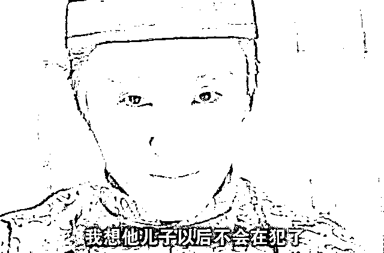

# 美媒称遇害黑人死于心脏病，警察压他脖子只是诱因？

> 原文：[`mp.weixin.qq.com/s?__biz=MzU3NDc5Nzc0NQ==&mid=2247488761&idx=2&sn=665c41f8f98b96a36a3592225ff10555&chksm=fd2db627ca5a3f31c0e4a2ad7a468d2e0b03377e710c57c113bda1abbb0c379cb8aabccbf97f#rd`](http://mp.weixin.qq.com/s?__biz=MzU3NDc5Nzc0NQ==&mid=2247488761&idx=2&sn=665c41f8f98b96a36a3592225ff10555&chksm=fd2db627ca5a3f31c0e4a2ad7a468d2e0b03377e710c57c113bda1abbb0c379cb8aabccbf97f#rd)

这个问题非常有意思，是咱们读者在后台转给我的，来自知乎上的一个问题。

ABC 报道，尸检的结果表明那名黑人男子乔治有基础病，心脏病。

警察长时间压迫他的脖子令他窒息，在他反复求饶不能呼吸之后，仍然压迫他的脖子，并不是致死的主因，这只是一个诱因。 

换句话说，黑人服务员致死是因为心脏病，是因为他不够健康，而并非被压迫窒息而死，这是美国对此事的检查报告。

报告一出来，舆论哗然，我也看到了读者分享给我的很多公知的反应。 

有很多公知表示，你看，果然是这样吧，早就言中了吧，灯塔是不会弄错的，一定是他不够健壮。

好吧，咱们今天改个形式，不再写议论文了，我尝试写一篇短篇小说。

小说的题目叫：

**《我想他儿子以后都不会再犯了》**

小说的前半段来自周星驰的电影，《审死官》，星爷在里面扮演状师宋世杰。

一开场是这样的：

县官老爷拿起状纸问：你们两家互相告对方的儿子打自己的儿子，到底是谁家儿子打死了谁家儿子呢？

张彪哭着说：大人，是我家儿子被陈老爷的儿子打死了。

县官老爷恍然大悟：哦，原来张彪你是原告，陈老爷父子是被告。 

宋世杰马上跳了出来：大人，您弄错了。其实我们才是原告。我们的状纸，天没亮就送来了。 

于是到桌子上翻出自己的状纸，摆在县太爷面前说：我们递交状纸的时候，张彪的儿子还没咽气呢。

县太爷就问：那你们准备告张彪他们什么呢？ 

宋世杰说：我们告张彪的儿子张小四把陈祥富的儿子陈大文的左手小指的指甲打断。

说着拿起陈大文的手给县官看。

县太爷问：伤的重么？

陈大文捂着手，嗷嗷乱叫。

张彪哭着说：可是我儿子死了。

县太爷反问宋世杰：对呀，他儿子死了，你这只是断了小拇指的指甲。

宋世杰：大人，人都会死啊。

县太爷想想：说的也是。

张彪：我儿子真的是被他打的重伤死的！

陈大文说：**你怎么不说你儿子没用呢？他有基础病呀**，我只是飞身过去随便打他了两拳。打他不是主因，仅仅是诱因。

宋世杰问：随便飞身过去打了他几拳？

陈大文说：两拳，就两拳，我随便飞身过去~

宋世杰当场打了陈大文一拳，陈大文流了点鼻血。

宋世杰问：有没有这么用力？

陈大文张大嘴：有~

宋世杰又猛的踢了陈大文一脚，然后转身说：应该是这种劲道了。

接着走到张彪身边问：你儿子何时被打？

张彪说：昨天下午。 

宋世杰又问：何时断气？

张彪说：今天下午。

宋世杰：关他屁事啊？！

然后走到县官面前说：刚刚我何止揍了陈大文两拳，如果十年八年之后他死了，请问大人，你可不可以告我谋杀？

县官摆摆手：不行，这可不行。

宋世杰摇摇扇子：大人英明。

县官笑笑。

张彪哭着爬向宋世杰：我儿子本来好好的，如果不是他，我儿子不会死！

扯着宋世杰的裤子说：宋状师我求求你，帮帮忙啊！

宋世杰闭上眼睛说：**你儿子死，是因为他命短。**

张飙说：我儿子他不像短命的，他不像短命的呀！

宋世杰说：那么请问我们的命又有多长呢？

张彪说：我不会看......

宋世杰说：既然不会看，你凭什么说你儿子不是个短命相？

踢开张彪，走上前问：大人，闲话少说，有结果了吗？

县官：有，能不能给本官一点小小的提示？

宋世杰：没问题。

转身向大家陈诉：原告陈大文被人打伤，但是被告突然归西，死因不明，原本应该赔偿 50 两医药费.....

陈老爷赶忙说：哎，哎，我们不追究了。

宋世杰翘大拇指：上路。

转身催县官：大人，有结果了吗？

县官：有。

宋：快点判吧。

县官：好。

张彪呆呆的看着儿子的尸体……

县官：张彪纵子张小四行凶，姑念初犯，不予追究，叫你的儿子以后就不要再犯了。

然后转身问宋世杰：这样对吗？

宋世杰看看张飙儿子的尸体，说**：我想他儿子以后不会再犯了。**

年迈的张彪，一瞬间须发皆白，木木的看着儿子的尸首，默然。

当年我一直以为这个故事发生在大清，现在看，它大概发生在灯塔吧。

对着这份尸检报告，何必找心脏病这么麻烦的理由，干脆这么判： 

起诉这名黑人服务员两个罪名：

第一、他的脖子长得不是地儿，碍着白人警官老爷的脚落地了。

第二、白人警官老爷的膝盖长时间顶着黑人服务员的脖子，造成膝盖磨损。

因此，判罚黑人服务员，赔偿白人警官老爷五千美金……

当然，念及被告已死，罚款就免了。

大统领出于人道主义，还特地打电话对罪犯家属进行了慰问，体现了总统的关怀。

我猜，懂王大概会这么说：

没有人比我更懂窒息，没有人比我更懂民主，没有人比我更懂自由，没有人比我更懂正义。

一个季度感染两百万人，死亡十万，体现了美国第一；

抓捕 CNN 的记者，体现了美国的新闻自由； 

装甲车对手无寸铁的平民扫射，体现了美国的民主；

黑人服务员的脖子损伤了白人警官老爷的膝盖，体现了美国司法的正义。

......

姑念你的儿子乔治初犯，不予追究，叫你儿子以后就不要再犯了。 

乔治的妈妈，看着儿子的尸体，眼前浮现起他小时候......

一个小男孩，睁着黑亮的眼睛，举起双手，笑着从远处跑过来，喊着：妈妈，妈妈。

忽然，她被惊醒了，看着身边儿子冰凉的尸体，默然良久，对懂王说： 

**总统，我想我儿子，他以后都不会再犯了......**

