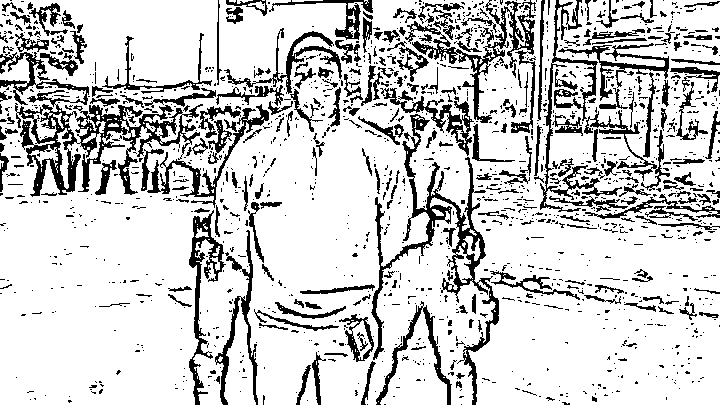
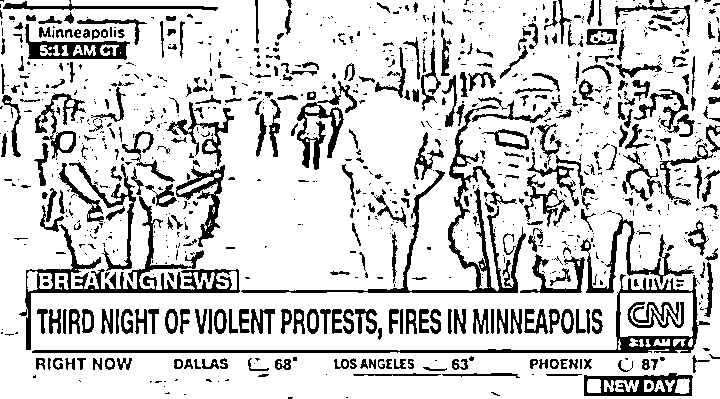
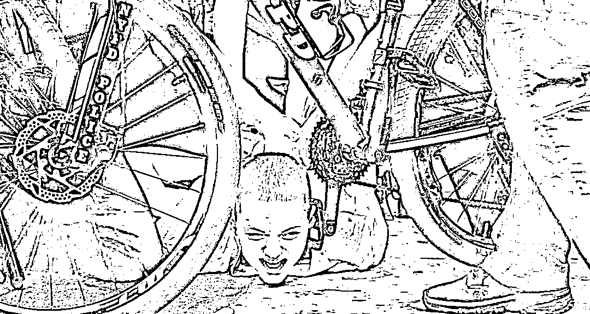
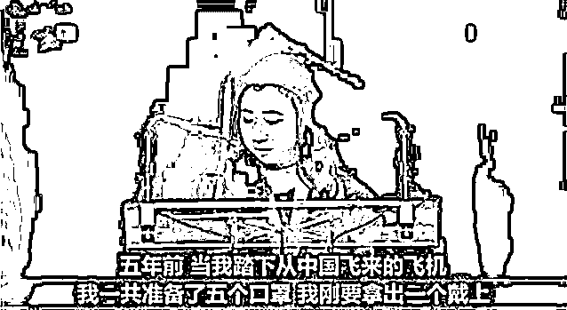
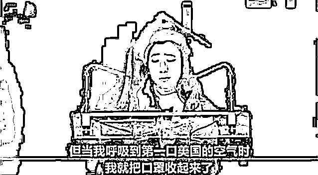
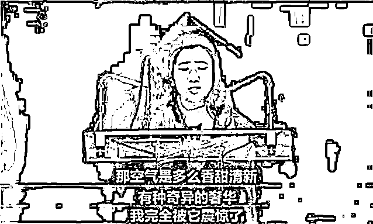
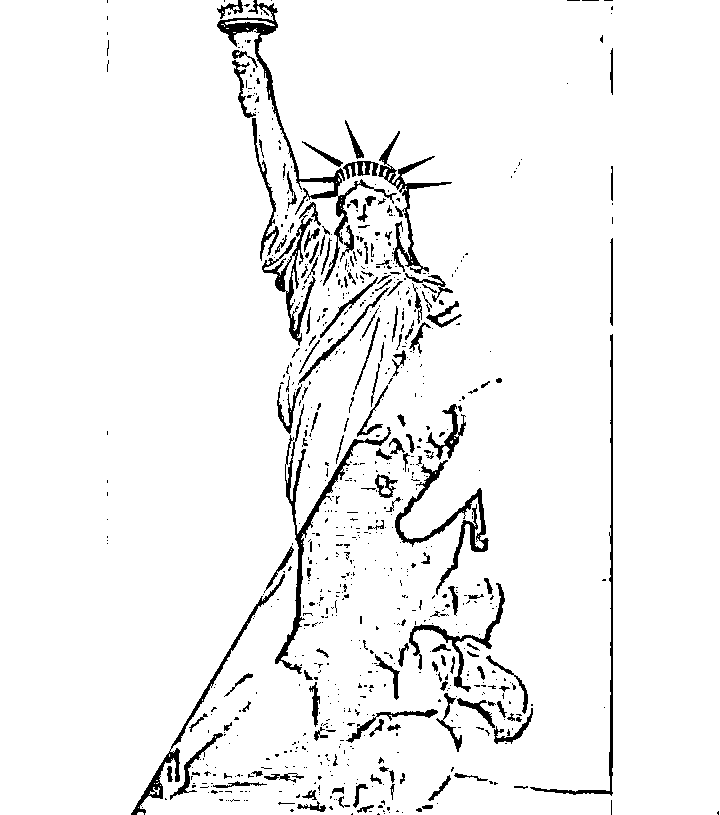
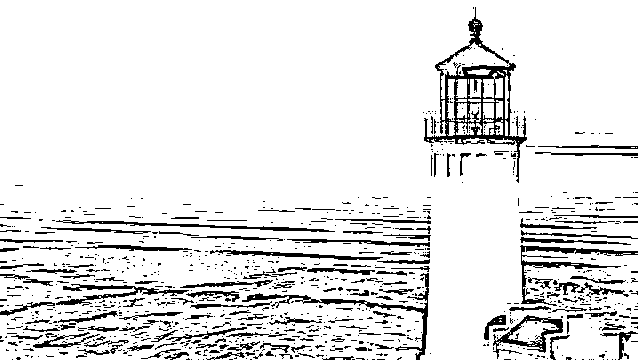

# 我不相信逮捕 CNN 记者的国家，会是这个世界的灯塔！

> 原文：[`mp.weixin.qq.com/s?__biz=MzU3NDc5Nzc0NQ==&mid=2247488718&idx=1&sn=53f96db50d49a7d1af7b6d741510bf8d&chksm=fd2db610ca5a3f0673565088f285c2682f71974fe12910b02801f95a7f1028c7c59b4f0700c6#rd`](http://mp.weixin.qq.com/s?__biz=MzU3NDc5Nzc0NQ==&mid=2247488718&idx=1&sn=53f96db50d49a7d1af7b6d741510bf8d&chksm=fd2db610ca5a3f0673565088f285c2682f71974fe12910b02801f95a7f1028c7c59b4f0700c6#rd)

昨天，CNN 报道，他们的记者奥马尔·希门尼斯在美国明尼苏达州明尼阿波利斯抗议现场进行现场直播时，被警方拘捕。

不止希门尼斯，他的制作人，摄影师都被铐上一同抓捕。

手无寸铁的白人底层老百姓走上街头向天祈求，他的脑袋竟被死死按在地上......

第一时间，我在推特上推送了一篇英文文章，翻译过来就是：

时代的一粒灰，落在美国黑人脖子上，就是一座山。

文章平平无奇，仅仅是问了三个问题。 

第一、为什么白人警察的腿可以压在黑人服务员的脖子上？

第二、为什么 CNN 的黑人记者仅仅是报道，也要被拘捕？

第三、百姓何辜？一个季度死了十万人不见警察，手无寸铁的走上街头祈求，却被总统下令可以向他们开枪？

我援引了美国宪法第一修正案：“不得剥夺言论、出版和新闻自由；不得剥夺人民和平集会和向政府请愿伸冤的权利。”

结局就是，我从此失去了自己的发推特的权利......

我在西方的一些朋友，对我表示了遗憾。 

一位华尔街的爱尔兰裔美国人，跟我开玩笑，他说：所谓的美国新闻自由。是指美国新闻有抹黑中国以及给美国洗地的自由。

。。。。。。 

so，我也不知道该说什么好。 

失去推特账号之后，我默默的关上手机，在家里看电影，看了一本欧美片，叫做《至暗时刻》。

影片一开始作为孤悬欧洲之外的岛国，保守的英国一直利用欧洲各国之间的矛盾执行着自己的“欧洲均势”政策，但希特勒的出现让英国人惊慌失措。

一方面，希特勒和墨索里尼这两个狡猾的政治家把好说话的英国首相张伯伦拉进无尽的政治谈判之中，使英国政府对和平始终抱有奢望；

而另一方面，德国闪电一般的装甲洪流迅速的吞并了欧洲诸国，很快便将英国在欧洲大陆的军事力量和政治力量挤压殆尽。

在这种情况下，丘吉尔成为了英国首相。

上面这些都是历史课本都有讲，而在《至暗时刻》中，我们还看到了来自内部的压力。

张伯伦虽然被迫下台，但在执政的保守党之中仍有着强大的政治势力，而除了他之外，哈利法克斯子爵也是党内的一大政治势力。

不幸的是，张伯伦与哈利法克斯都是“主和派”的坚定拥护者，他们就是英国版的公知。

在他们看来，让丘吉尔成为首相只是应急之策，不乖乖听他们的话，丘吉尔就面临着滚蛋的命运。

丘吉尔不是个讨喜的人，他名声不好，家族名声都不好。他老爸死于梅毒，老妈也很风流。

他从 1900 年就踏入政坛，直到 1940 年以前，40 年间他当选了无数次议员，做了数个头衔的内阁大臣（内政、海军、军需、殖民事务、陆军、财政），但换来的结局是在内阁里毫无威望，没有人会听他指挥。

他的政绩一塌糊涂，尤其“一战”中由他指挥的“加里波利之战”，英军一次性损失士兵 2 万余人——这成了他在英国政坛上最大的丑闻。

这就是丘吉尔上台之时面对的烂摊子，既有内忧，还有外患。

同僚都是公知，只会给他背后捅刀子。

丘吉尔就像站在钢丝上，稍有不慎，便会堕入深渊。 

内有忧患，外无强援。在这个局面下，哈利法克斯子爵联合皇室以辞职胁迫丘吉尔与希特勒议和。

站在当事人的立场去看，哈利法克斯子爵和张伯伦想要保全英国不参战的想法不无道理。毕竟，就算欧洲彻底沦陷，英国人顺从希特勒，起码不用流血牺牲。

而一旦参战那就像丘吉尔在《热血、辛劳、汗水和眼泪》演说里说的那样：

“我们将在法国作战，我们将在海洋中作战，我们将以越来越大的信心和越来越强的力量在空中作战，我们将不惜一切代价保卫本土，我们将在海滩作战，我们将在敌人的登陆点作战，我们将在田野和街头作战，我们将在山区作战。我们绝不投降。”

你要知道，扛着枪上去流血牺牲的可不是胖胖的丘爵爷，而是老百姓。电影里感人的一幕就此上演。

当整个上流社会都不支持他的时候，他去坐了一趟地铁，亲自询问一个个的普通英国国民。

得到的答案是，老弱妇孺，皆愿一战。 

这是电影里最感人的一幕。丘吉尔了解清楚民众的想法之后，前往下议院发表了著名的演说。

核心思想只有一句。

我情愿英国的历史，在我们这一代人手里终结，也绝不投降！

这一点，得到了民众的支持，下议院的支持，以至于皇室的支持。从此彻底翻盘。

星星之火，可以燎原，人类自由世界对霸权的抗争，就此拉开帷幕。

这部电影有趣的并不只是这里，而是电影之外的话题。我想到了另一方，就是没演出来的那一方。

希特勒。

我们来想想，希特勒到底为什么无法领导世界？

其实就是丘吉尔的一句话：

**他不相信一个对内残酷镇压犹太人，对外侵犯别国利益，拘捕本国记者，向百姓射击，还全世界四处煽风点火的霸权国家，可以胜任世界的老大！**

中国人的老祖宗说过一句话，内圣而外王。 

爱情不是做买卖，想买就能买，信仰也不是靠征服，不信就不信。

我们来假设下历史，假如历史上希特勒暂时逼降了英国，会如何？

就如同电影里英王乔治六世说的那样，他会流亡去加拿大组织流亡政府。而英国人民，会像历史上的爱尔兰人民一样，你征服的了人家的身体，征服不了人家的心。

爱尔兰的舞蹈是很有意思的，只有下半身动，上半身是不动的，就叫踢踏舞。据说是被英国人奴役之后，英国人见不得他们快乐，不允许他们跳舞。

于是他们就发明了这种姿势，这样英国统治者透过窗户只能看到他们不动的上半身。

人终究是无法被束缚的，即使别人捆绑了你的手，你还有脚，即使捆绑了你的脚，你还有嘴，即使捆绑了你的嘴，你还有心。

这一切就是美国自称世界灯塔的由来，电影把希特勒比作漫无尽头的黑暗，而把美国比作那照亮黑夜的灯塔。

可是，昔日标榜灯塔的美利坚，将自己的国民践踏脚下，将自己的新闻记者刑拘押解，对着自己无辜的百姓开枪，到处侵犯别国利益，把自己的霸权凌驾于世界头上。。。。。

昔日的屠龙少年，变成了今日的恶龙！

这一切，和他们曾经抗争的黑暗，何其相似？！

他们的总统为了自己的竞选，罔顾 4000 万人失业，罔顾 10 万人失去性命。

对本国尚且如此，何况他人乎？

我不清楚，我不理解，我不明白，为什么我们的公知能够如此颠倒黑白，罔顾事实？！ 

什么叫公知？

空气香甜？空气清新？有种奇异的奢华？

来，公知，出来走两圈，请你告诉我，你 TMD 怎么呼吸？

回答我，你 TMD 怎么呼吸？ 

张麻子：我让你翻译给我听，什么叫公知？

汤师爷：不用翻译，如图所示就是公知啊。

黄四郎：难道你听不懂什么叫公知？

张麻子：我就想让你翻译翻译，什么叫公知！

汤师爷：公知嘛.....

张麻子：翻译出来给我听，什么 TMD 叫公知！什么 TMD 叫 TMD 公知！！

汤师爷：什么 TMD 叫公知啊？

黄四郎：**公知就是脖子上压着一个人的重量，还能呼吸到香甜、清新、奢华的空气，明白了吗？**

汤师爷：这就是公知啊！

这就是灯塔么？这就是公知嘴里的灯塔，这就是 TMD 公知嘴里的灯塔！

我忽然明白为什么全世界海外的朋友们，这些天都在转发这张图。

**驱散黑夜，靠的不是灯塔，而是东方，太阳升起来了！**