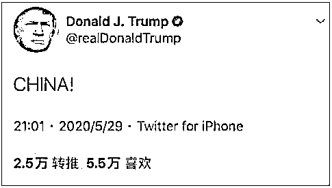

# 川普说 CHINA，那咱们回复一个 America！

> 原文：[`mp.weixin.qq.com/s?__biz=MzU3NDc5Nzc0NQ==&mid=2247488655&idx=1&sn=9eb7a130d93754f54e0fbba1f02b97e6&chksm=fd2db651ca5a3f47407aab5ce3929c174f89843f45e3eb258c25f21a9b07cf545190b73a355b#rd`](http://mp.weixin.qq.com/s?__biz=MzU3NDc5Nzc0NQ==&mid=2247488655&idx=1&sn=9eb7a130d93754f54e0fbba1f02b97e6&chksm=fd2db651ca5a3f47407aab5ce3929c174f89843f45e3eb258c25f21a9b07cf545190b73a355b#rd)

好些读者连续问了几个问题。

第一个，

川普昨天搞事情，发个推特，就一个词。 

正疑惑他要搞嘛，该睡觉了，一觉醒来，看到川普取消了香港的特别待遇优惠，说白了以后和内地一样了。

这不是什么大事，早在意料之中，昨天道指微跌就表明符合市场预计，已经被吸收了。

第二个，

还是川普，这哥们把愤怒的明尼苏达州的黑人义士视作暴徒，还威胁对他们开枪。

这简直是人神共愤。白人警察虐杀了黑人服务员，你还把路见不平的义士们视作暴徒，天理何在？美国真该六月飘雪。

第三个，

有读者问蓬佩奥，这哥们又到处嚷嚷靓丽的风景线。

这厮典型的双标，人家明明事出有因的黑人义士，他怎么不说是美国靓丽的风景线呢？

第四个，

有读者问我对至道学宫这个公众号怎么看？

.......

问题实在太多了，我们倒叙。

至道学宫，这个名字我听过。

因为我看微信号排行榜的时候，看到它总是出现在榜首，是原创的全榜的榜首哦。

这就是 No.1 的意思。

咱们大号也不过是原创类里面的职场分类里面 36 号，可想而知，和人家的差距无比巨大。

但我这人没有好奇心，公众号在我这里不是主业，所以其实我不怎么读别家的文章。

至道学宫虽然排名第一，但是他们家的文章我还没有机会读到。

当然，我找了编辑，帮我侧面整理了材料，大致了解了一下这个号。

就目前我看到的材料，我觉得这是个傻叉号。

比如我看到的有两点：

第一个是至道学宫造谣说老美把疫情病死的人做成了汉堡。 

我靠，这个太狠了，有点孙二娘开黑店的味道。

第二个是超时空打击。 

他说，基于国际日期变更线，我们的时间比美国早一天，也就是咱们今天发射导弹，昨天就打到美国去了。

我一共就看了这两点，还是别人的文章里看到的。 

仅从这两点看，充分证明了我很久以前就反复强调的观点。

绝大多数人的认知，是有问题的。

否则，为什么常年阅读量雄霸榜首的，是他们家呢？

换句话说，不是至道学宫在反智，而是绝大多数人的智力就在反智的那个水平线上，他们只是迎合了市场。 

作为自媒体，完全迎合市场，是不道德的，完全不迎合市场，是活不下去的。

所以一个有良知的自媒体，必须把大多数人听不懂的内容，夹杂在听得懂的话里面。 

经常有读者问我要我看的东西。

我看的东西，很多都不是中文版，很多只是前言不搭后语的一堆数据，我把这玩意丢出来，没有任何可读性，只会让咱们号读者吓跑，立刻倒闭。

这就像一家面馆，人家是来吃面，不是你端出来一碗麦子就行。 

读者是来看我分析后的想法，而不是纯粹意义上的干货。 

当然，遗憾的是大部分人都是情绪化的，要么爱要么恨，很少真的能思考。

昨天大号《[无论中美关系怎么波动，都不会改变结局](https://mp.weixin.qq.com/s?__biz=MzU0MjYwNDU2Mw==&mid=2247489728&idx=2&sn=d0e72fc2e4bc7b9429508ddc374b93cd&chksm=fb1974bccc6efdaa7d171f3192cf6f3e450d4a1d105be6a41d07f77a09f524ee1d0ac9a42301&token=1463701432&lang=zh_CN&scene=21#wechat_redirect)》聊到蒋百里。

他是日本人的学生，但最大的功绩在于指出抗日的战略纲领。这不矛盾，他喜欢当时日本的技术，科学，也愿意学习，但他终究是个中国人，这一点不能改变。

就像华为过去今天未来，都会持续向美国学习，但这不意味着就要忍受美国的霸权。

当然，这一切对于大众平均线，过于复杂，把两种看似冲突的观念融合在一个大脑中是高等智力的体现。

我希望咱们的读者，是远超于大众平均线的。

就像那个至道，无论他是不是爱国的，他首先是个弱智。

我们不需要一个弱智小伙伴，这没有意义，尤其在现代文明下。

就像今天大号的文章《[明尼苏达的黑人兄弟们，静下心来，听我讲](https://mp.weixin.qq.com/s?__biz=MzU0MjYwNDU2Mw==&mid=2247489742&idx=1&sn=bb50b674facaabdfec9368e6d385614e&chksm=fb1974b2cc6efda4e67eadbc4e1d3b8a9fc752ddeae76180a6a8ab94fe56691d7c6d96045e87&token=262258177&lang=zh_CN&scene=21#wechat_redirect)》。

你觉得打砸抢是个技术活么？不是的。

弱智都会打砸抢，记住，弱智都会。

问题是，弱智会的那点事儿，能解决什么问题？

玩过游戏么？ 

什么叫做打砸抢？

无差别攻击就叫做打砸抢。 

无差别攻击就是乌合之众，能有作用么？ 

我们要的是集中火力，而不是无差别攻击。

无差别攻击只会给自己树立更多的对立面，而集中火力才能让朋友变得多多的，让敌人变得少少的。 

得道者多助，失道者寡助，这不是弱智能理解的。 

所以我在今天大号的文章里，给美国的黑人义士们的第一个建议是什么？ 

是要有纲领，一切围绕纲领行动。不要无差别攻击，要集中火力。

纲领的本质就是要追求“美国人民当家作主”。 

美国的黑人服务员为什么没有人权？为什么被白人警官肆意践踏，虐杀？

归根结底，美国是资本家的美国，美国不是美国人民的美国。

疫情期间美国 4000 万人失业，美国 600 名富豪的财富增加了 4000 亿美金。 

川普一意孤行，任由将近 200 万人确诊，10 万人丧命，而他，为的只是竞选。

临终前喊妈妈的，岂止乔治一个人？

十万生灵今何在？他们都有自己的妈妈...... 

所以要有纲领，要明白，这是正义的，这是为了美国人民，而不仅仅是为了某个人复仇。

那么落实到诉求上，我把什么排在第一？ 

把要求让非洲大陆的黑人可以自由移民美国排在第一。 

这个道理很简单，黑人成为美国的主体民族，才能真正解决他们在美国长期受到歧视和不公待遇的根本。

事实上，这是有法理根据的。 

昔日美国是个大农场，是谁付出了劳动？是白人庄园主还是黑人奴隶？

劳动者为什么不可以拥有财富？他们的非洲家人为什么不可以移民美国？美国黑人应该拿着这一点，作为第一诉求的核心理论，去争取。

要集中目标，输出火力。

说白了，暴力不是目的，暴力是手段，任何手段，都要围绕目的。

这是我给那些在美国受苦受难，没有人权，被虐杀，被欺凌的黑人朋友们，发自内心的，真挚的建议。

你看到了，这是我们号的风格。

我不仅仅有善良，有同情，有国际人道主义，有对美国黑人，对美国人民的真挚的感情。

更重要的是，我给了方法，给了策略，而且，这一切始终是正义的，是拿得出手的，是摆的上台面的。

而且，同时也要让咱们的读者，有思考，有所得。

毕竟你花了 5 到 10 分钟阅读，这就是你的成本，我还是希望我们的读者，这 5 分钟没有浪费。因为时间是有价值的。

你想一想，巴菲特午餐为啥那么贵？动辄几百万美金？

因为他一下午赚的钱，不止那个数。

我年轻的时候，没觉得知识是有价值的，甚至没觉得信息有价值。 

当然这个观念后来变了，尤其是做投资做久了。

我曾经写过一篇文章。

人世间最大的不平等，是信息不对称。

这是我最大的感悟。

这世上最贵的，就是信息，最有价值的，也是信息。

给你再多的本钱，不给你信息，几乎会被一个没本钱，却身处信息节点的人完虐。

虐到你的钱全都归了他，你都还不知道发生了什么。

而理解信息的价值，首要是理解时间的价值。

我记得本科毕设的时候，带我们的那个副教授，很年轻，25 岁就拿到博士，我们系两位泰山北斗之一的徒弟。

脾气很暴，经常骂我们几个，反正怎么样都得被骂。

来实验室晚了，害他等了一个小时，被骂，耽误他宝贵的时间。

还不许顶嘴，理由是，你知不知道，跟他说一句话，就要浪费他 50 块钱。

因为他在校外有公司，每年还是有很多进账的，他一句话的时间，就要损失 50 块。

到第二天我们刻意提前来，早来一个小时，门锁着，在门口坐着，他来了，又骂。

怎么来这么早，还傻坐着，你们的时间不是时间么？反正一通骂。

那时候，我第一次意识到，其实时间是有价格的。

当然，这都是马后炮。

那时候，在我眼里，众生平等，哪怕我真的是个乐色，你也该免费的教我。

但在他眼里，我的单位时间太低了，而他的单位时间，比我贵的多。

让他花费时间来教我，完全是不值得的，起码他是这么看。

人在法律意义上是平等的，在生命意义上是平等的。

但在商业体系里，每个人单位时间的价格，确实是不等的。

我曾经在甲方做架构师的时候，认识了一个比我大一岁的哥们。

他在一个挺大的民企集团做销售副总裁。

很多年前，他还是个小销售的时候，为了等着见我们领导一面。

楞是在办公室门口，站了三天三夜。

饭是有的吃，厕所是有的上，但自始至终，人都没离开过。

当年我觉得这是一种让人很不舒服的行为，起码搁在我身上，我觉得，挺憋屈。

但后来，我不这么看了。

因为每个人单位时间的价格，真的相去甚远。

以他当年的状态，即使等一生，所耗费的价值，未必有见面那一次，我们大老板沉没掉的价值多。

所以，他知道是划算的，这就是对时间的价格，有了充分的认识。

还记得小学老师怎么说的？

你们的父母花钱送你们来这里，是有成本的。 

你父母付出了成本，老师付出了时间成本，其实你自己，也付出了成本。 

你的生命就是一坨时间，怎么分配，全看你。