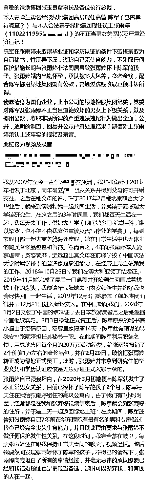

# 这绿地，真够绿地

> 原文：[`mp.weixin.qq.com/s?__biz=MzU3NDc5Nzc0NQ==&mid=2247488341&idx=1&sn=e5d71a915e76844b6afba0fe10b73189&chksm=fd2db18bca5a389d633c1914937fe769009d85e48257702703abdaf2f5bf30fd3dae6a48e6fc#rd`](http://mp.weixin.qq.com/s?__biz=MzU3NDc5Nzc0NQ==&mid=2247488341&idx=1&sn=e5d71a915e76844b6afba0fe10b73189&chksm=fd2db18bca5a389d633c1914937fe769009d85e48257702703abdaf2f5bf30fd3dae6a48e6fc#rd)

有读者问热搜上的一个大瓜。 

一名叫史睿生的微博用户实名举报绿地集团下属京津冀事业部营销部负责人和他妻子之间的不正当关系以及经济问题。

直接上图。

这个瓜很八卦，我知道读者想听我对这几个人，人品的评价。

但我觉得这不是重点。

说句实话，林子大了，什么鸟都有，这件事最大的问题在于举报的内容显示这名高管用公款给他的情妇报销奢侈品。

从举报材料的数额看，只有 2 万，还不构成职务侵占，因为不足 6 万。 

但如果举报属实，我不相信只有这点金额，这里面值得深挖详查。

更重要的是，绿地是国企，这个瓜就比民企更严重，因为这名主管侵犯的资产，与全民都有关联。 

而且我们还可以看到，这名主管做了很多违规的事情，比如给这名秘书的转正手续。 

我为什么说这些是问题的关键，来源于自身对职场的了解。 

八年前，我也曾就职于国企，应该说那时候开始有变化，我们都知道，2012 年开始严打，后来越来越严格。 

在那之前，曾有过很多问题。

我举个例子，比如报销，早些年，漏洞很大，大到员工签个集团名，丢给财务，就给报了，也不说谁参加了，也不说为啥。

以至于集团门口有家常接待的餐饮店店主，虚开，乱开，偷偷让员工拿去报销，这样也未被发掘了好些年。

后来怎么发现的呢？因为那家店主胃口越来越大，账目完全不合理。那家餐饮店光来我昔日集团的报销发票，就远远超过了它们可能的营业总额。

弄到这样的地步，才被发现，你可想而知，早些年，相当乱。

后来的好转，得益于严打。

我记得差不多到 2014 年的时候，正常的礼尚往来，领导们连阳澄湖大闸蟹，都不敢吃。

这是好现象。但这其实不够。

因为你真正要看住的不是某几个主管，而是主管身边的所有人。

企业里面，尤其是国企，最要严防死守的是不正当男女关系，尤其是内部的。

为什么这么说呢？道理非常简单。

你仔细想一想，主管自己消费，哪怕是公款，他就算再多吃多占，肚皮就那么大，他能导致多大的损失，是我们看得见的。

这就相当于烂了一个点，范围至少是可视的。

可如果他身边有一群情妇，更糟糕的是情妇与他是同事关系，是上下级关系。那这里面的猫腻，就完全不可控了。

这就像冰山，你以为只有水面上那么大，其实下面远比你想的大。

你以为只有他一个人有问题，其实他通过不正当的男女关系，把整个职场生态搅乱了。

你想一下，给秘书报销几个包，刚开始看起来没什么，但如果继续发展呢？

秘书继续被提拔，也做了主管呢？

谁与他发生关系，他提拔谁，与他有关系的人提出的方案即便有问题，他依然采纳，这种不正当的男女关系一旦在职场里漫延，就会形成山头。

而且是山头里最稳固，最长久，最深入的形式。

这种山头造成的损失，是不可估量的，这就相当于企业的身上烂了一个大疮。

如果在民企，这是老板的大忌。下面乱搞，串通一气，指不定哪天侵吞公司财产。

如果在国企，谁是老板？全民就是老板。

这样的事情，值得媒体死盯，深挖。因为它不是一个八卦问题，不是一个男女问题，它的本质，是职场生态问题，是财务安全问题。

也是关乎我们所有人的，利益问题。