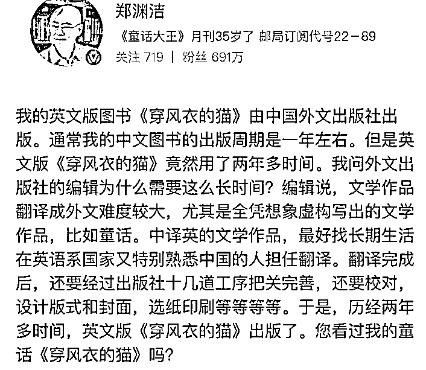
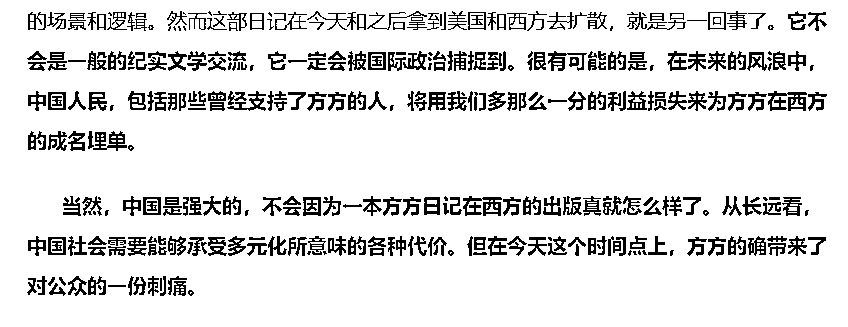

# 我没啥想对方方说的，倒很想对普通人家的孩子们说点啥

> 原文：[`mp.weixin.qq.com/s?__biz=MzU3NDc5Nzc0NQ==&mid=2247487372&idx=1&sn=ca60100b28a4348e046c3aaf7c39fd39&chksm=fd2dad52ca5a24448dfdb4fa2b38ef5f4fa88c31679de34ad0a55e25e3767eb6790e8ea85b7e#rd`](http://mp.weixin.qq.com/s?__biz=MzU3NDc5Nzc0NQ==&mid=2247487372&idx=1&sn=ca60100b28a4348e046c3aaf7c39fd39&chksm=fd2dad52ca5a24448dfdb4fa2b38ef5f4fa88c31679de34ad0a55e25e3767eb6790e8ea85b7e#rd)

读者问我对于这件事怎么看。

方方的日记，两周之内就被翻译成英文，德文，在全球同步发行，售价高达 20 多美金一本，而且给她的分成高达 10%。

不仅如此，诞生过多名诺贝尔，普利策的美国著名出版公司哈珀柯林斯亲自操刀帮她发行，而且国外关于她即将被提名诺贝尔文学奖的报道是铺天盖地。

这本日记的英文翻译，副标题，都花了很多心思，扣死了病毒来自哪里，而且不断地强调，日记才是真相，以及种种让人匪夷所思的说法云云。

关于这件事，我并不想评价，我可以给你摘两个文人的看法，你可以认为一个来自民间，一个来自半官方。

来自民间的是郑渊洁，这位小学毕业的童话大王，我们打小很多人看他的书长大，尤其是 80 后。

郑渊洁的说法很有意思。

如图，很显然，老郑委婉，委婉在两点。

第一，强调他那是童话，全凭虚构瞎编，用童话影射日记。

第二，明确告诉你，全力翻译，也要两年。事实上大刘的《三体》，用了六年。

可现在，人家两周书都卖出来了，你可想而知，这本日记，到底是临时起意，1 月份现写的呢？还是早就规划好了？

也许是去年，甚至更早，或许都还没这事儿，人家的日记，就在筹备工作中了。

更重要的，多半是先有英文德文版，后有中文版。 

当然，这是文人之间的猜测，人家常出书，人家是专家，咱不懂，我只是给你提供一种民间文人的看法。

还有一种呢，是半官方文人的看法，胡锡进，老胡。

老胡的说法是这样的：

这意思说穿了也很简单。

他认为，你想写什么，是你自己的事儿，哪怕你早有预谋，哪怕你如何如何，我也拿你没辙。

但是，你能不能顾及一下大家伙的利益，能不能不要在这个紧要关头捅自己人刀子，这个大的国际背景，你是否能顾及一下，所有族人的实际利益，你是否能体谅一下？

方方对此的回应也很简单。头条标题： 

OK。你看到了。

你觉得我还有必要掺和到这场辩论中去么？

老胡的身份是半官方的，人家都可以直接这么正面怼回去，说明什么？

说明人家早就安排好了一切后手。

理解这意思吧？

这就像下棋，后面的棋人家都安排好了，这会儿说白了，你能把人家咋？

所以，我压根儿不想去做这种没有实际意义的举动。

对不起，即使我去指责她什么，也没法挽回任何损失了。

所以你看我的标题，我一句话都不想说，**我只想对普通人家的孩子们，说点心里话。****因为在我看来，这是当下唯一有用的。**

你注意我的说话对象，是普通人家的孩子们。

您要是老爹捞够了，把您送出去海天盛筵，我也没什么要对您说的，因为您的利益，不在这里。

就像某些日记作家的家人，全在海外，人家再获个诺贝尔，会理睬我们什么呢。

我今天说话的对象，是普普通通人家的孩子们，是当今的年轻人，是普普通通的 80 后，90 后，00 后。是需要挣钱养家的这帮人。

您要不是，就没必要往下看了。

目前的大环境，不需要我讲吧。

各个行业，各个企业，裁员成什么样，如果咱们在这里列公司名，可以一直写到天亮。

这就是内部就业环境，你们自己感同身受。

外部环境是什么呢？

美国我就不用说了，制造业回归那是美国一直以来在做的事情，碰见疫情，更是发狠一样的执行。

即便是日本，4 月 9 号，日本推出 108 万亿日元的抗疫救助方案，其中有 2435 亿专门用来支持日本制造商撤离中国。

这么做你要理解人家，这不是针对你。

他们需要一个多元化的供应链体系。

说白了，如果鸡蛋都在一个篮子里，如果企业都在你家，等到危急的时候，人家家里的商品供应，就等于被你拿捏了。

这意思我们应该懂。我们的粮食采购不也是多元化，而且重要的品种要求自给自足的么？

就是为了防止特殊情况。

疫情加速了这种局势，这就叫做去全球化。

全世界发现太多产业链在我们这里，极大的影响了他们的安全。

人家原来只是觉得你抢了人家的工作机会，现在觉得，不仅如此，你还影响了别人的供应安全。

日韩都这样，欧美就不用说了，马云上赶着送物资，丹麦人都骂他，这就是外部环境。

如果你要挣钱养家，我说的这些，你都会懂。

在这种局面下，方方和她的日记，成了捅向我们所有人身上最好的一把刀子。

因为来自内部嘛，你都无法向国际社会解释什么。

你注意我说的是所有人，不只是生活在这片土地上的，哪怕是在国外做生意的，海外华人，甚至移民了的华裔，全都在内。

为什么这么说呢？

4 月 7 号，纽约一名华人女子被泼硫酸，重伤。

很遗憾，真的很遗憾，连海外华人都跟着遭殃，无他，我们被集体污名化了。

方方对此的解释很简单。

她说，中国这么大，也不是她一刀能捅成什么样的。

她的意思就是说，我们有十几亿人，即使因为她，被添油加醋的污蔑，导致很多人失业，那又如何，又没有全都失业。

即便有些人被不明所以的老外泼了硫酸，那又如何，又不是每个海外华人都被泼了硫酸。

理解这逻辑吧。

神逻辑，我都没法反驳，因为我觉得，反驳很无力。

说白了，就是那句话，我就算反驳赢了，又能拿人家咋嘛。

人家要利有利，马上又要得诺贝尔的人了，哪怕老胡这种人，希望她顾念下族人的利益，她都能一句“你算个锤子”打发了。

我们真的奈何不了她。

但我，很希望年轻人吃一堑，长一智。

你一定要想清楚你的利益在哪里。

对于年轻人，尤其是 90 后，00 后，除了把蛋糕做大之外，你别无出路，别无出路。

说白了，你的利益已经和这个民族的利益彻底的拴在了一起。

如果这个民族不能上一个台阶，你这辈子，也就只能洗洗睡了。

擦亮自己的眼睛，想一想，自己的工作机会，想一想，自己的核心利益。

想一想，自己年迈的爸妈，自己年幼的儿女，家中等待自己的妻子。

想一想，自己究竟加了多少班，受了多少罪，才换来的一份工作，才换来一个想让自己家人过好的机会。

就因为某些人想出名，某些人想牟利，就让人家把刀子捅在自己身上，还不自知，甚至还帮着人家捅。

等你的公司没了订单，等你的家庭没了工作，谁会心疼你？

谁？

你告诉我，谁！

我们这个民族，被人晃点被人阴的教训还不够深么？

还不够吗！

摸摸自己父亲辛劳一生粗糙的双手，摸摸自己孩子天真无知的小脸，扪心自问：

谁最苦？谁最累？

我们的每一分钱，都是祖祖辈辈这样辛辛苦苦赚来的啊，孩子们！

咱们被阴了，被阴了，被阴了，今夜，你的心，不痛么？！

不痛吗！