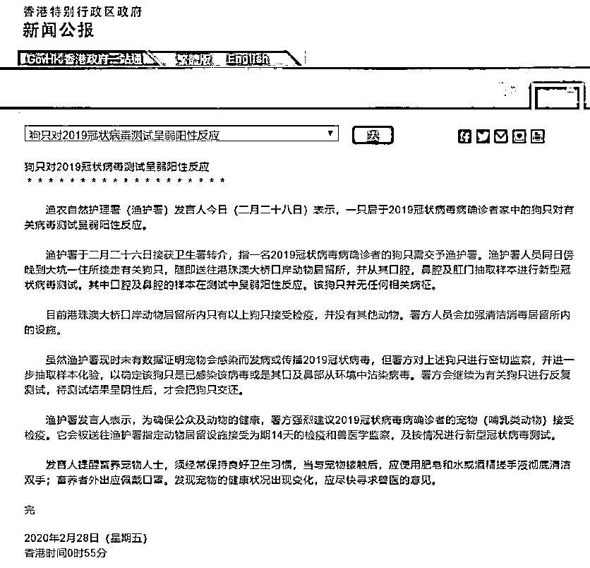

# 宠物狗对病毒测试呈“弱阳性”到底能说明什么问题？

> 原文：[`mp.weixin.qq.com/s?__biz=MzU3NDc5Nzc0NQ==&mid=2247486764&idx=2&sn=a167498c3bc34b17772d20e35b7dcf16&chksm=fd2daff2ca5a26e41ea9da7df81544751cf4c9532f899090780d1898cf78fd7206b960ce0f52#rd`](http://mp.weixin.qq.com/s?__biz=MzU3NDc5Nzc0NQ==&mid=2247486764&idx=2&sn=a167498c3bc34b17772d20e35b7dcf16&chksm=fd2daff2ca5a26e41ea9da7df81544751cf4c9532f899090780d1898cf78fd7206b960ce0f52#rd)

有人问我一则消息。

消息来自香港的渔护署。

问这个问题，显然是对于宠物不安，担心它们会成为传染病毒的中介。

有这种不安，真正常，因为我也看到了很多大 V，在胡说八道，加剧了不安。

他们无非分两派，一种是同情动物的，一种是大义灭宠的。

然后在那里 P 叨叨的对骂。

在我看来，这两拨所谓大 V，都是脑残。

对骂都骂不到点子上。

如果你静下来，认认真真看看新闻，会发现这个问题非常简单，它都不算是个医学问题，而是一个简单的逻辑问题。

这则新闻，有两个要点：

1、该宠物狗是确诊病人饲养，长期跟随主人生活。

2、检测了它的口，鼻腔与肛门，但是，只在口与鼻腔内找到了病毒。

我想说明什么？

我们讲，什么叫做“活的传染源”？

是说该名生物，自己能够源源不断的制造病毒。

比如人，患病期间有一段时间，他的分泌物，唾液，眼泪，尿液，粪便，等等，都含有活病毒。

这个人，自己会制造病毒。

比如，有一个确诊患者，他用舌头舔一块砖。

此时你把砖拿去做检测，这块砖也将处于弱阳性反应。

然后呢？

你要打死这块砖么？

听懂这段逻辑了吧，这是个多么幼稚的话题。

那条宠物狗，如果它自己没有能力患病，没有能力成为病毒的宿主，没有能力内生的，源源不断的的创造病毒，而且创造的病毒要能够传染给人类的话。

那它和一块被确诊病人舔过的砖，有区别么？

那你打死它，有啥意义呢？

你要是觉得它有危害，那以后你拿根棍子，跟在确诊病人背后，他走到哪里，你打到哪里。

把他脚下每一块砖都敲碎，嘿哈，嘿哈，就这么一路敲下去好了。

你还得把他呼吸过的空气都敲碎，这什么拳法？天马流星拳？能够打的时空凝滞？

我看，很多人，长期不思考，已经变弱智了。

退一万步讲，假如该名宠物的肛门处也检测出病毒，那这件事要升级。

因为这事严重了，它嘴里有，也许是舔了主人用过的东西，可它肛门里，不该有。

如果也有，我们就要进一步检查，它是否患病了，它是否被病毒感染了。

假如这一步也确诊了，接下来我们要判断的是，它是否有能力把病毒传播给人类。

因为能让狗感染的病毒，不一定能让人再感染，要进一步判断。

即便我们走到这一步，真有这回事。

那也不是你看见一条宠物狗，杀一条，就能解决的问题。

你仔细想想，假如一个城市里有 100 万只宠物狗，它们以什么方式分布？

一部分在人类家里寄养，一部分是流浪犬，一部分在店里。

你打死的，仅仅是你看到的几只，这能起啥作用？

100 万只，就算你干掉 10 万只，对于传播模型来说，没有丝毫改变。

该咋，还得咋。

你看到了，即便宠物能患病，能传染给人类，靠这么瞎来，毫无意义。

再退一万步，如果狗能被传染，还能传回给人类，难道猫不会么？鸟不会么？自然界的野生动物不会么？

你准备干啥？

你要当灭霸，你要灭生物界么？

生物界灭了，你自己还在么？

这就跟一个人企图把自己举起来一样，都不知道脑子里在想啥。

我从头到尾没有聊过一句医学，没有讨论过一句什么神爱人间，还是大义灭宠，没这些。

脑子只要不搭牢，逻辑只要尚清晰，阅读新闻只要够仔细，没有断章取义，我说的，分分钟都能想到。

病毒再可怕，终究有的医，可是人傻没药医。

任何时候，都不要缺了思考，缺了思考，就算不得病，在这个充满智力角逐的时代里，也混不下去。