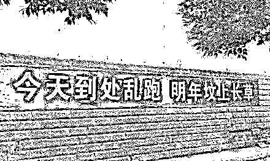
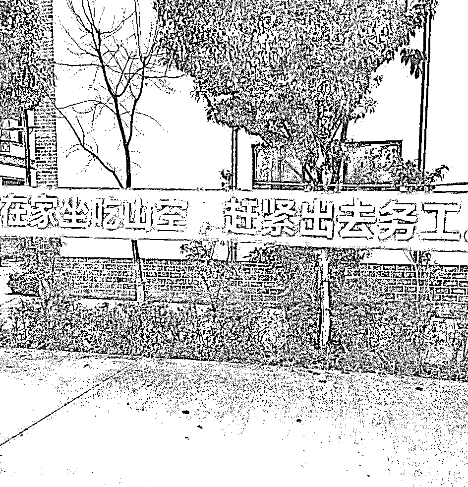
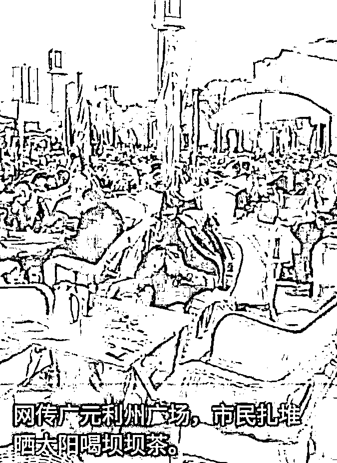
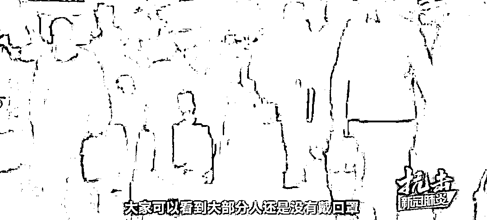

# 今天到处乱跑，明年坟头长草；在家坐吃山空，赶紧出去务工

> 原文：[`mp.weixin.qq.com/s?__biz=MzU3NDc5Nzc0NQ==&mid=2247486674&idx=1&sn=34bc50d726c34c68ce707a8db33a796c&chksm=fd2dae0cca5a271ac327c0e5a13a88f1eb309101f522d8cf92500cac2f7a1d71773d6a3bb9f4#rd`](http://mp.weixin.qq.com/s?__biz=MzU3NDc5Nzc0NQ==&mid=2247486674&idx=1&sn=34bc50d726c34c68ce707a8db33a796c&chksm=fd2dae0cca5a271ac327c0e5a13a88f1eb309101f522d8cf92500cac2f7a1d71773d6a3bb9f4#rd)

给读者看网上两幅口号，合起来正好是个对子。

这当然是个笑话，但引出一个问题，到底该听谁的？

我们来看看很多人是怎么做的。

这是网上流传的一副图片，四川广元。

很多店又开始营业，人群聚在一起，喝茶，打牌，不戴口罩。

还有这副图片，是江西瑞金的某处集市，市民们报复性的出门购物。路鼓喧天，人山人海，而且，大部分人都不戴口罩，拥挤到拍视频的博主，挤都挤不进去。

上海金山，北京香山，人头攒动，杭州大厦恢复营业，5 个小时就卖了 1000 多万......

很显然，大家憋不住，开始报复性消费想要找回点花钱的快感了。

站在商家的角度，这是必要的。

很多消费类的商家是熬不过长期冷清的，何况很多员工手停口停，他倒是有负债，却没有积蓄。

但你注意到了么？

手不停是让你戴着口罩手不停，而不是裸奔着手不停。

很多人不戴口罩，这才是最危险的地方。

从数据上，湖北省外的确诊人数持续的下降好些天了，很多人的警惕心已经开始放松了。

在这个局势下，再配上赚钱的需要和消费的欲望，就构成了上述的情景。

像当当网就中招了，他们 2 月 10 号就急着开工，开工也不注意防护，不戴口罩交头接耳。

结果有人被确诊，几十人被隔离，公司老板也被约谈。

关于这个问题，很显然，我也不是专家，我劝你，你也不会搭理我。

毕竟，西风算个 P，这又不是打麻将，咱也不胡西风。

但我可以给你讲个故事，请君侧耳听。

这个故事，名字人尽皆知，叫做西班牙大流感，但详情很多人都不知道。

首先，西班牙大流感和西班牙半毛钱关系都没有，它源自美国。

最初是 1918 年的春季，流行于美国堪萨斯州的军营。

同月，中国，法国，两个月后的西班牙，三个月后的英国相继爆出疫情。

当时正处于一战，各国为了打仗，害怕动摇军心，都禁止报道这件事，只有西班牙人大肆报道。以至于全世界还以为这事儿来自西班牙，所以把它命名为西班牙流感。

这个流感在第一阶段更像感冒，患者的死亡率很低，就像今天你看到的那样，所谓的传染性极强，致死率不高。

但是转眼到了 8 月，这次流感的病毒发生了演变，它的毒性加强了。

8 月，在英国的一条船上，3/4 的船员都被感染，1/15 之一的船员都会死亡。

因为它的症状从感冒变成了肺炎。

紧接着，欧洲，美国，乃至中国，到处都是因为这场流感死亡的人群。

根据清朝的记载，是十室九空。他说，一个村里，十户人家，有 9 户都会染病，每户人家如果有十个人，九个人都会死于这场瘟疫。

你自己算下，感染率 90%，死亡率 90%，这是什么数据？

按照西医的算法，这场流感导致 2500 万到 4000 万人的死亡，美国在这一年的人均寿命直接降低了 12 岁。

一战因为这场流感提前结束了，德国都已经攻进法国，因为这场流感，退兵，还特么主动认输了。

无他，瘟疫导致彻底丧失战斗力，直接崩了。

到了来年，1919 年，死亡率又下降了一些，范围波及全世界，哪怕是澳大利亚这种当时的蛮荒之地。

下一年，也就是 1920 年，它又主动消失了，至今都不知道原因。

你注意，当年的西班牙流感有两个特点。

第一个特点是最初阶段，它致死率并不高，第二个特点是它不只一波。

我们现在遭遇的肺炎病毒的特点是怎样的，谁也不知道，在科学家没有告诉你之前，我们谁也不知道。

它到底有几波？它的死亡率是否会变化？我们谁也不知道。

但有一件事，我知道，你肯定也知道。

这就是：你的命，我的命，都只有一条。

如果你像猫一样，有九条命，就当我没说，如果你是个寻常人，好好琢磨这句话。

复工肯定是要复的，赚钱肯定是要赚的。但你以为你是采蘑菇的小姑娘，跨个篮子你就敢上森林里去了？

口罩，总是要戴的，防火、防盗、防同事。这会儿，你要防的是人。

人与人之间，隔的远远的，能不说话就别说话，都有手机，有事儿咱不能微信上聊？

面对面也可以微信上聊呀。

起码等到再也没有新增的疑似或者确诊之后，再过一个月，才敢恢复正常的沟通。

在这之前，别想的那么美好。

就像我们昨天大号聊的：[这世上大多数人，是活在梦中的](https://mp.weixin.qq.com/s?__biz=MzU0MjYwNDU2Mw==&mid=2247488430&idx=2&sn=5ec4544ada745aa772930d5bf8f4b6ab&chksm=fb197fd2cc6ef6c446e7b06517334d685f8378d85df5fe18114d9d302f62819a62c1118a8d5f&token=600579528&lang=zh_CN&scene=21#wechat_redirect)

凡是把世界想象的过于美好的，都提前去上帝那里报道了。

疑心重，是活下去的不二法门，从来都是，一直都是。

而且，把话说的更直白一点，这事儿不光是个死亡率的问题，新型肺炎一旦重症，治疗过程是极其痛苦的。

你自己想嘛，又没啥特效药，一开始就是给你送纯氧，全靠自己扛。

如果扛过去了，血氧饱和度上去，你就挺过了呼吸衰竭，如果扛不过去呢？

无创呼吸机很多人配合不了的，过程很难受，最后就得有创呼吸机，那就是切开气管，所谓的插管。

插管是抢救过程中非常痛苦的一件事，很多时候不到万不得已，急救都不用。

如果插管都不行呢？那就是 ECMO。

所谓 ECMO 就是说你的肺彻底废了，给你换个人工肺。

你的肺如果彻底白了，下面就是纤维化，这东西又不可逆。

换句话说，就算给你一直急救着，那回头肺呢？重新移植么？

很多事情，站在医疗的角度，它有办法把你救过来，但不等于你一定有生存质量。

就像癌症病人，很多种癌症的 5 年存活率也很高呀，把你救回来，5 年内能呼吸，这就算救回来了。

可你去看下那些重症晚期病患，每一天都极其痛苦。

作为医生，他只管救回来，作为病患，你得想清楚，你想要的是什么？

是医学上的救回来，还是幸福的想吃啥吃啥，想干啥干啥的下半生？

即便你无所畏惧，新型肺炎重症患者临终的过程也极其痛苦，因为头脑完全是清醒的，只是呼吸上不去。

有过在游泳池里溺水的体验么？一直溺水，一直溺水，直到最后......

这种结局，还是好好想清楚吧。

即便无惧死亡，死亡也有很多种。我宁愿冲锋陷阵，高喊“向我开炮”，也不愿意被人家切开气管，体验很多天的溺水，这太痛苦了。

而这一切，起点也许就是你过于乐观，也许只是你想逛个街。

很显然，不值得，不值当的事儿啊！