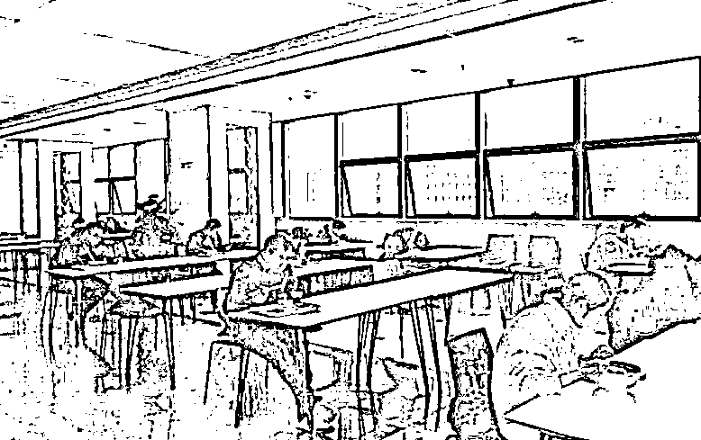

# 单位食堂吃饭，已经有高考的感觉了

> 原文：[`mp.weixin.qq.com/s?__biz=MzU3NDc5Nzc0NQ==&mid=2247486431&idx=1&sn=9f2ba33a4fc8aaffd6f234abff0a2acc&chksm=fd2da901ca5a201761dd9c6cbce7c8705cfd5ffd696d1f76160cffc8fcc3c353131de2c9d198#rd`](http://mp.weixin.qq.com/s?__biz=MzU3NDc5Nzc0NQ==&mid=2247486431&idx=1&sn=9f2ba33a4fc8aaffd6f234abff0a2acc&chksm=fd2da901ca5a201761dd9c6cbce7c8705cfd5ffd696d1f76160cffc8fcc3c353131de2c9d198#rd)

这是网上流传的一张图，北京的某个食堂吧。

有部分单位开工了，但是按照规定，中午吃饭的时候，单人单桌，间隔两米，不许交头接耳，吃完就走，不得逗留。

不仅如此，而且全程有人监督，这个感觉像什么呢？

像极了高考。

有人说，你看，有吃饭看手机的，这属于作弊。

其实规定严格的话，这种情况下吃饭，是不可以玩手机的。

进餐前，要用含酒精的消毒洗手液洗手，全程进餐手不可以触碰食物，吃完后，再次洗手，离开。

离开后，才可以玩手机。

因为手机最不干净，你平日里成天摸，也许沾染了病毒，你一边吃，一边玩，确实有传染的风险。

还有人说，给别人夹菜，算不算打小抄。

这都是废话。

间距两米，你能夹么？看都不许你看别人的餐盘。

看着不近人情，看着是特事特办，实际上，我觉得，这是一件好事。

我们的文化里面有太多扎堆，太多热闹，人与人的距离太近了。

孔子怎么说的？

近则不逊。

**距离太近，就没有规矩，没有原则了。**

我们特别喜欢搞小团体，搞山头，不尊重规矩，都是这种文化氛围下的产物。

我曾经对比过国企与外企的聚餐文化。

有两个非常大的不同。

外企吃饭前，会问你，要不要去，这不是客气，而是真随意，你不要去，就不去好了。

当然，这个外企不包含日企，日企和我们是一样的风格。

但我们吃饭，那就是工作的一部分，他不会问你要不要去，他只会通知你，今晚聚餐。

默认选项就一个，去。

不去，有很多问题的，吃饭都不积极，这人肯定有问题。

如果真有公事，也许还能推，但如果为了私事，别人会告诉你，家家都有情况，就你特殊么，所以你不去也得去。

否则会得罪一大片。

第二个差别在于饮酒。

外企都是随意，因为自助餐居多。你哪怕全程喝饮料，拿着饮料和人家干杯，都随便你。

我没有遇见过被老外灌酒这种事。

但我们就不是这样。

酒不是一种饮料，它成了战斗力的指标，甚至是身份的体现。

酒量根本不重要，你要体现的是胆量，尤其是身处下位。

前段时间，某个浙大的教授，在网上掰扯，说本门弟子录用的标准之一是高度白酒，一次半斤。

他认为，没有酒量也能强喝半斤，是胆量的体现，这才是战斗力，执行力，这样的学生，跟他读研才靠谱。

我曾经写过文章，这哥们从头到尾，在瞎 BB，但你拿他，还真没辙。

文化它不是一天形成的，那是漫长的历史中，逐渐形成的。

比如扎堆，吃饭的时候要热闹，说话大声，烘托气氛，灌酒，等等。

你看十几天前，那时候多数人都没有意识到严重性，还大大咧咧，还准备串门走亲戚聚会。

直到现在，发现多起传染都是聚会引发。

所以瘟疫，有时候也是一种改变的契机。

日本人平日里没事也戴口罩，自己平常感冒了也带口罩，怕口气重，影响公共空间的气味，也戴口罩。

这个习惯非常好，这才叫彼此尊重。

我在想，如果这个瘟疫，爆发在日本，估计根本闹不出这么大动静。

很可能最初那几个人自觉戴口罩，迅速就停止传播了。

因为日本人特别怕麻烦别人，特别怕给别人带来不便。

这就是昨天我们说，为什么那个日本负责撤侨的官员，轻生的很重要一个原因。

我们看着撤侨的人里面有几个被传染的，是意外，是小事。

他看着就是添了麻烦，就是羞愧，就是失职，就是自责，甚至轻生了。

在我们与世界打交道的过程中，很多时候，是因为习惯的不同，带来了很多误会。

比如我们的大妈，在游轮上扎堆，大声喧闹，抢食物，占位子。

她们也许兴高采烈，但在人家看来，安静是一种美，安静是一种修养。

我们自己人，其实明白，这里面也不见得是我们的人，有多大的问题。

很多时候，是误会。

但你总得融入呀，你总得有一天，消除这种误会。

你去观察下，发达国家，人与人之间大都是保持距离的，无论日本，还是欧美。

尊重个体，保持距离，是好事，也是我们迟早要进入的社会形态。

我们早晚有一天，也会变成发达国家，我们早晚有一天，会被大部分国家免签，会和这个世界的交流越来越密切。

如果这次瘟疫，能让我们多学一些规矩，减去一些旧习俗，或许，就是它带来的长远利好之一。