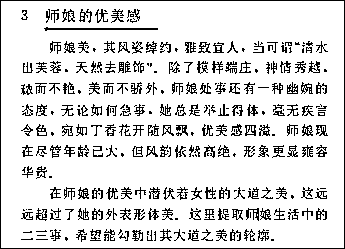
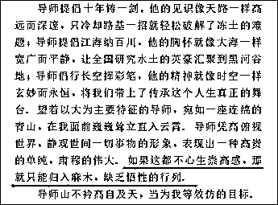
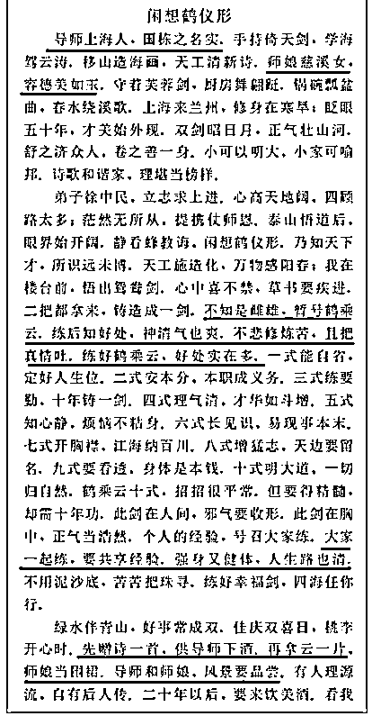
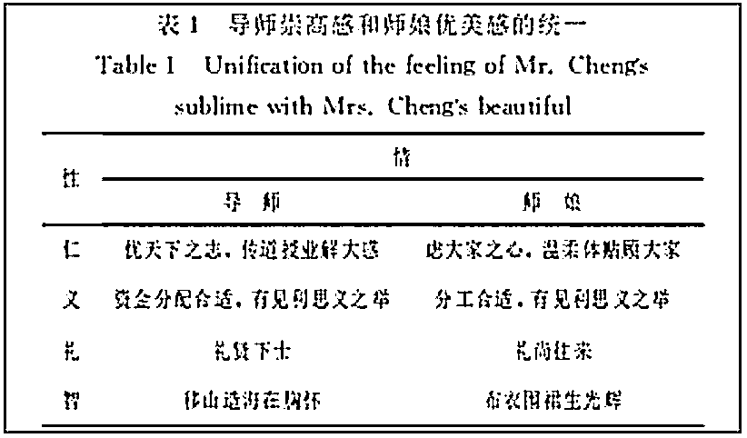
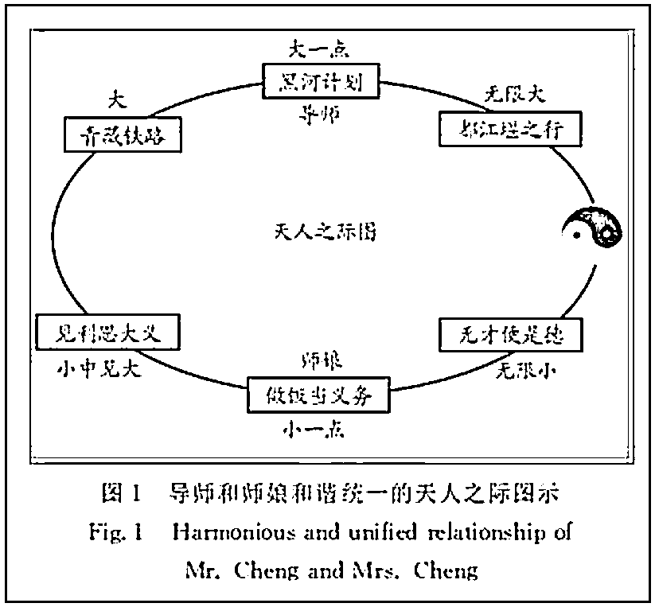

# 千金纵买师娘赋，脉脉此情谁诉

> 原文：[`mp.weixin.qq.com/s?__biz=MzU3NDc5Nzc0NQ==&mid=2247486283&idx=2&sn=848bab36e16d785ca124c0b0c57fc663&chksm=fd2da995ca5a20837e19e6cad0f17675e1d69f985cc799788ef4baec48d7fd30876259574e73#rd`](http://mp.weixin.qq.com/s?__biz=MzU3NDc5Nzc0NQ==&mid=2247486283&idx=2&sn=848bab36e16d785ca124c0b0c57fc663&chksm=fd2da995ca5a20837e19e6cad0f17675e1d69f985cc799788ef4baec48d7fd30876259574e73#rd)

我第一眼得知此事，是从网上看到的如下片段。

这是一篇论文的节选，2013 年发表在核心学术期刊《冰川冻土》上，作者是研究员，而文中提到的师娘的先生，就是他的导师，正是该期刊的主编。

很不好意思的向读者坦白，第一眼，我八卦了。

脑海里浮现出了很多古今中外历史上曾经发生过的故事......

此处省略五百字。

你们不要想歪了，我浮现出的，都是好故事。

比如我们众所周知的那个爱情故事。

111 年前，有个外国的白胡子老头，他叫勃拉姆斯。

那一年，六十三岁的勃拉姆斯拖着病躯从瑞士赶往法兰克福，等他赶到的时候，葬礼已经结束，墓中埋着他再也见不到的一个女人。

他在墓碑前，拉了一首小提琴曲，倾诉四十三年的情愫与四十年的思念。

四十三年前，勃拉姆斯作为音乐家舒曼的学生，第一眼就爱上了师母，克拉拉。就是墓主人。

此后，他与师母一起照顾病重的师父，三年后，师父撒手人寰。

暗恋了三年的勃拉姆斯在舒曼的葬礼上不告而别，从此再也没有见过师母。

此后的四十年，他做了下面几件事。

1、离开克拉拉的勃拉姆斯，曾经资助克拉拉全国巡回演奏舒曼的所有作品；

2、他曾经无数次写给克拉拉情书，**却始终没有寄出去**；

3、他一直和克拉拉保持联系，时刻关心着对方的生活；

4、一八七五年，他完成献给克拉拉的《C 小调钢琴四重奏》,前后用了二十年；

5、他一生所创作的每一份乐谱手稿，都寄给克拉拉；

6、他一生未婚。

最后，就是开场的那一幕，他在克拉拉的墓前拉了那首不知名的曲子，第二年，撒手人寰。

说实话，这就是我看到这篇报道第一眼脑海里浮现出的东西。

人都说西方人奔放，东方人含蓄。

人家勃拉姆斯忍了四十三年，直到临终都一言不发，只是拉了首曲子。

咱们这位研究员，相当于教授级别，这是咋了？

咋写的这么直白，而且就在导师主编的刊物上公开发表？

Oh, My God！

我忍不住用了李佳琦的口头禅。

抱着一颗八卦的心，往下看，越看越是一脑门子黑线。

他不仅对师娘表白，还对师父表白......

Oh, My God！

他不仅对师父表白，还对师父的父母表白.......，篇幅所限，我就不摘了。

Oh, My God！

这瓜实在太大，我 hold 不住。

但是看着看着，我忽然看出门道来了，我看到这位作者，赋诗一首。

说实话，我确实有一点呆若木鸡。

这该不是发错地方了吧？

他这是要投文学期刊，编辑出错？

发现也不是，因为我看到了一张表，一张肯定是理工科的表。

然后我就沉默了。

大概的原因，我已经猜出来了，好歹咱也是读过研的，学术嘛，知道一点。

我看到网上很多文章把当事人骂的狗血喷头，说实话，这位研究员，确有不当。

我们后面分析。

但我相信，这里面没啥八卦。

因为我看到论文中一段文字，贺导师与师娘结婚四十周年。

你就算一个人二十岁结婚，四十周年，该多少岁了？

想看如何个风姿绰约的网民们，还有兴趣么？

那你说，这是不是拍马屁呢？

肯定有这个成分，但我猜，事情大概是这么回事。

读过研的都知道，自然科学基金，很多时候，是养士用的。

研究生跟老板，都不乐意跟那种只能申请到自然科学基金的老板，因为确实相对清贫。

那种研究，大都是基础学科，即使计算机这种工科，涉及自然科学基金的也往往是理论研究。

啥意思呢？

就是说这东西，企业是不要的，因为无法落地，无法变成产品推向市场。

可是理论也好，基础也罢，总得有人去研究，所以就成立了这类基金，用以资助此类研究。

实际上，最终往往只要交一篇论文上去就行了。

至于这个研究成果，未来真的有用，或者被束之高阁，很难为外人道。

大众听到这些，肯定觉得这是浪费，甚至这就是某种不正当。

但实际上，你读过研就能体会这里面的无奈。

知识分子他也得吃饭呀，如果你不设立这一类的基金，那都去跟商人混了，谁去研究基础学课或者理论呢？

有人要说，研究你就好好研究嘛，你写这都什么跟什么呀。

把师父，师娘夸两句得了，还没完没了，一夸就是几万字，你这个科研项目拿了 200 万，都干这个去了？

辛弃疾说“千金纵买相如赋，脉脉此情谁诉”。

人家一代文豪，司马相如写的《长门赋》，帮皇后陈阿娇打动汉武帝的，也不过卖了千金。

这个千金到底是一千两黄金还是一千斤黄铜，姑且不论。我们按贵的，就算它一千两黄金。

西汉的一两是 16 克，一千两就是 16000 克。

按照今天的金价折算，大概 550 万。

司马相如的《长门赋》才卖了 550 万，这一个普通研究员，瞎掰了半天，也卖 200 万，确实，贵了。

这么指责的人，说的一点问题都没有。如果你按照文章来计价，的确是那么回事。

但我前面说过了，基础基金，很多时候，是养士用的。

说白了，那就是在资助你这个人从事科研行为。

最终你也可以用术语扯那么一通，似模似样的交上去一篇，别人也没法指责。

这在学术中是很难较真的。

就像我昔日也写过、发过一些论文，除非我自己站出来，自己指责自己，否则你很难真的去说我曾经发表过的那些论文，究竟算是有成果的，还是瞎 BB。

科研毕竟不是富士康的生产线，不可能安排一堆人去研究同一个方向，然后大家彼此互为印证。

很多时候，你研究的那一个点，全球就没几个同行。

这就是我所谓的如果你自己不站出来，别人也很难证明你到底在干啥，到底干了没干。

因为证明的成本太高了。

出于成本起见，对于高级知识分子，往往只能靠信任。

所以很多时候，很多期刊对于文章本身，乃至对于文章引用过得那些文献，都是不复查的。

因为查，也只能是走个过场。

除了 EI、SCI 这种也许会让全球同行彼此检验，很多时候国内的核心期刊，它没有足够的成本去做这件事。

这意思就是说，主编未必有空去一篇一篇的看，就算看，很多文章，也看不懂。

学术学术，已经走到人类文明的边界了，它是没法量化的。很多时候，只能靠单纯的信任，但信任这东西，太没谱了。你懂得。

我相信这位研究员，对这里面的弯弯绕，门清儿。

何况他从事的又是个极其冷僻的专业，什么冰川。真够冷的。

我怀疑那期刊除了他，师父，师娘，也没有第四个人会看了。

或许正因为如此，他觉得，那就是张纸嘛，版面浪费也就浪费了，与其掰扯一些自己也觉得是凑数的，倒不如为师父和师娘写一篇见证四十年婚姻，甘守清贫坚持基础科研的祝福。

站在我个人的角度，我完全相信他的师父与师娘，在过去的四十年里，风雨携手人生路，肯定是经历了很多的苦难，为了这个社会做出了杰出的贡献。

我相信他歌颂的那些师父身上的品格是高尚的，师娘追求的爱情是感人的。

这些我都信。

但是，这毕竟是个互联网社会了。

一切都联网了，再冷僻的东西，一旦联网了，那就肯定有第四个人看到。

你让网民们怎么想？

是觉得你师父师娘喜欢听马屁？还是觉得你师父主导的期刊，从来不校勘？

甭管找什么借口，这位作者本人的行为，极其不负责任，而且，事实上，他给他的师父，师娘造成了非常恶劣的负面影响，甚至有可能导致晚节不保。

在娱乐至上的当下，在一个互联网的时代，不会给你任何解释的机会。

和其它媒体相比，我隐去了当事人的姓名单位，还替他们做了某种程度上的解释。我相信，其他自媒体，绝没这么好心。

做人，要自重，尤其做学术。

人必自重而后人重之，人必自侮而后人侮之。

已经是高级知识分子了，这点小学生的道理不至于不明白。社会给予信任，就要自己反省，对得起这份信任。