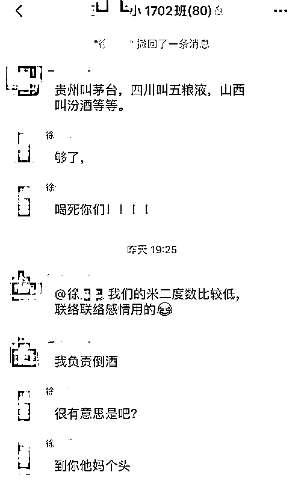
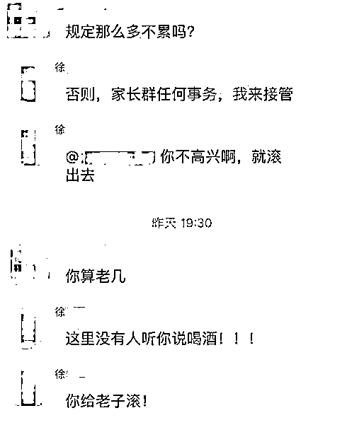

# 你不去告我，怎么知道我的优秀？！

> 原文：[`mp.weixin.qq.com/s?__biz=MzU3NDc5Nzc0NQ==&mid=2247486086&idx=2&sn=6a25d3932d14e8671cfb80049f90e0cb&chksm=fd2da858ca5a214ebc737c83688bb83b70f10a8f7e7f8a70113ab6a7daf713277c6e5e044c0f#rd`](http://mp.weixin.qq.com/s?__biz=MzU3NDc5Nzc0NQ==&mid=2247486086&idx=2&sn=6a25d3932d14e8671cfb80049f90e0cb&chksm=fd2da858ca5a214ebc737c83688bb83b70f10a8f7e7f8a70113ab6a7daf713277c6e5e044c0f#rd)

我发现这两天很有意思，接连三位高校教师上了热搜。

这次倒没有整出什么幺蛾子，只是一群家长在群里吵架，把网友们给逗乐了。

故事的起因是广西的玉林，几位家长在家长群里讨论喝酒。

话说确实有点不合时宜，但没想到有一位妈妈飙了。

她怒斥，喝死你们。

没有醒过神的那几位家长表示，喝酒挺好的，联络感情，你管得着么。

这位妈妈更受不了，直接冒脏话，巴拉巴拉，什么都有。

老师一看，没法潜水了，浮上来维持秩序，但没人鸟，于是老师愤而退群。

据说她们吵了整整四个小时。

都飙了些什么内容呢？都是没营养的脏话，其中逗乐网友们的是如下这段自爆身份。

这位妈妈表示：

你们应该去告我，你们不告我，又怎么会知道我的优秀？

下面是三点优秀。

1、我优秀，本人社科院博士，京户，当地引入的人才，某高校教师云云。

2、先生优秀，孩子的父亲，清华土木工程本科。

3、孩子优秀，本班学霸。

接下来没想到还真有家长把她给告了，当然，高校表示算了，毕竟私底下扯淡，也不是个事，都消消气，不至于。

但媒体热闹了，因为觉得很搞笑。

其实我本来没觉得有什么值得聊的，毕竟这就是一群成年人没控制住，吵了一场架而已，谁也没有被伤害到。

但她吵架的内容，恰好应证了我在大号历史文章里多次聊过的那个话题。

“任何牛 B，换个领域，都是傻 B。”

我常说牛 B 不见得是通用的，因为评价标准是不一样的。

就像在炒家心目中，巴菲特是大神呀，绝对的众神之神，炒家里宙斯的存在。

但企业家不一定这么看他。

比尔盖茨曾经评价过巴菲特，觉得他一辈子就是在买低卖高，是个非常乏味，无聊的家伙。

这一切直到什么时候改变呢？

直到巴菲特把他大部分财产捐给比尔及梅琳达·盖茨基金会，收了人家的钱，盖茨才改口，对巴菲特赞不绝口，称他是此生见过最伟大的投资人云云。

呵呵。

很显然，在这位博士妈妈的心目中，世界是按照学术地位来划分的。

她觉得自己是京里的人才，到广西玉林这么个地方，大约是来帮助当地的。

本意是觉得自己有话语权，起码应该能够引领一个家长群里的讨论方向。

其实单单这个出发点，没啥问题。

家长群嘛，聊教育，聊学习，确实是应该的。

但很遗憾，大家没把她当回事，没有给她那种她误以为会得到的尊重。

这使得她怒了，这是很多没有经历过社会的学霸的通病。

我们说一个人从读书，到教书，其实就等于始终待在象牙塔里，这就是常说的没有经历过社会。

没经历社会，你很难察觉社会是个多元化的评价系统，尤其她爱人似乎也是没经历过社会的那种。

于是两者发生了冲突。

通常我们说没吃过猪肉，还没听过猪哼哼么？

一般来说象牙塔里的人，哪怕通过影视剧，对社会也多少有些了解。

这位家长可能是那种纯粹搞学术的，平时连肥皂剧都不带看，所以一上来就搞出这么大的冲突。

我曾经反复讲牛 B 换个领域就是傻 B，其实就是在建议读者，如果可能，还是要让自己的思维方式或者价值体系尽可能多元化一些。

单一的思路，很难长期适应于社会。

我曾经聊过，我祖母是某著名高等学府的子弟，她的亲戚朋友里都有很多搞学术的。

我小时候又是跟着祖母长大，耳濡目染，这种围绕学术的价值观听过很多。

比如小时候我喜欢港台明星，我爸爸就告诉我，只有学习不好的才去当明星，学习好的都去当科学家了，所谓明星，旧社会就是卖唱的云云。

你说这种价值观我会不会接受呢？其实不会的。

因为每个人的爱好不一样。

我打小不是那么喜欢荣誉，虽然也长期是班级第一。我小时候属于比较喜欢钱的那种。

所谓的那些学术大拿，甚至某些开山鼻祖级的，我很小的时候都见过一箩筐，毕竟祖辈之间有亲属关系。

他们的生活大概是个什么样，我心里有数。

有学术地位，不见得说了算，有学术地位，不见得有钱。

我前面说了，每个人喜欢的本就不一样，人的天性有别。

一个人很喜欢钱，你给他一堆的荣誉，他也不见得快乐。

这就是为啥会产生不同的评价标准。

你有没有发现我不是特别喜欢讲道理？

我不喜欢讲道理，这就体现了最大的道理。

因为我是个投资人，市场从来不讲道理，市场只讲结果，我既然喜欢，主动的成为了投资人，那就说明我认可市场这种不讲道理，只讲结果的模式。

我们评价一个投资人的唯一标准就是回报率，不可能是他道理讲得好。

假如一个投资人没有回报率，那跟一个博士没有学历一样好笑。

如果你让一个投资人和一个博士见面，我说的是内心认同的那种。

有的投资人未必认同自己是投资人，就像有的博士也未必认同自己仅仅是个博士。

假如两个纯粹的人，一个纯粹的投资人和一个纯粹的博士来讨论谁更牛 B，就会显得很好笑。

前者的评价体系围绕着回报率，后者的评价体系围绕着学历。

什么叫做成熟？

我下面体现给你的，就叫做成熟。

我见到一个投资人，而且内心也是认可投资人标准的。就会恭维他，您的回报率真的很不错，您是个被市场证明过的人。

我见到一个企业主，而且内心也认可自己是办企业的。就会恭维他，您的公司做的真的很不错，您和投资人不一样，您是提供了就业的人。您非常的有影响力。

我见到一个象牙塔里的人，而且内心深处也认可自己是做学术的。就会恭维他，您真的是著述等身，内心清高，是这个浮躁社会里的一盏明灯。

甚至我见到一个酒量好的人，一个健身教练，我都会站在他的角度恭维他。

您真是海量，我一直都想像您一样豪气的畅饮；您的肌肉真是发达，这身材像希腊的雕塑一样完美......

你觉得我是虚伪么？是违心的么？

不是的。

我是真心的，每一次都是真心的。

因为我替换了评价标准，我按照对方能够理解的角度去评价他的所有表现。

当然，人不见得会只有一个身份，但内心的自我评价体系，往往只有一个。

我曾经是个学霸，我曾经是个企业高管，就像我也在写作，我也在健身，但对于这些，我不以为意。

我只有在自己投资回报率下降的时候，才会抽自己嘴巴子，就像一个博士拿不到学位时一样。

这说明在我心里，自我评价标准就是投资人，其它的，也许是一些爱好。

**拿自己的评价标准评价自己，拿别人的评价标准评价别人，不要拿自己的评价标准去评价别人**，这是成熟，也是该有的一份涵养。

文末替家长们回答这位妈妈的提问。

她说：“告我呀，你不去告我，怎么知道我的优秀？”

我说：“我不需要知道你的优秀，因为你眼里的优秀和我眼里的优秀，未见得是同一份优秀。”

今日大号文案链接：[范闲和他的“爸爸们”](https://mp.weixin.qq.com/s?__biz=MzU0MjYwNDU2Mw==&mid=2247487885&idx=1&sn=6a5e9bd0375744f7b38c61beadeefc47&chksm=fb197df1cc6ef4e783722d528dabb275c60f793deea73cbdd8efd6169512945b2545eaf96660&token=289215979&lang=zh_CN&scene=21#wechat_redirect)