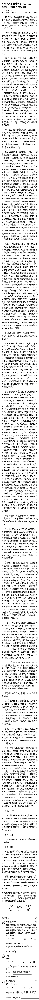

# 我来教这位华为 HR 小姑娘如何写告状公开信

> 原文：[`mp.weixin.qq.com/s?__biz=MzU3NDc5Nzc0NQ==&mid=2247485744&idx=1&sn=6b1f28bf149dbffd0edd7bbefde7b761&chksm=fd2dabeeca5a22f85fbe1388382775d0b8a9a4123a307d483d6c152b62f7edb625de14e8fc42#rd`](http://mp.weixin.qq.com/s?__biz=MzU3NDc5Nzc0NQ==&mid=2247485744&idx=1&sn=6b1f28bf149dbffd0edd7bbefde7b761&chksm=fd2dabeeca5a22f85fbe1388382775d0b8a9a4123a307d483d6c152b62f7edb625de14e8fc42#rd)

华为心声社区展示了这位刚毕业两年的 HR，MM 的公开信，先看信，内容如下：

说实话，信的内容很感人，可见这小姑娘是真把研发当兄弟，真把公司当自己家，当然，你注意她的年龄，刚毕业两年，这么想不足为奇。

信的内容很好，如果经查属实，应予表扬，也应该对她反应的事情有所处理。

但是，作为一个职场老兵，说句实话，这孩子写的信太幼稚了。起码有三点严重问题。

**第一、HR 的职能是什么？**

HR 要让研发觉得她们是知心小姐姐，这是她们的职能之一而不是职能的全部。

古话说将心比心，你待人真心人家才有可能会真心回报，但这句话不等于说你只有真心就足够了。“我本将心向明月，奈何明月照沟渠”并不少见。

如果说你只有一味的相信研发，为研发解决具体问题而没有其它制约或者甄别的手段，那你很难成为独当一面的 HR 的头。或者说，你只有安慰的作用而失去了监督的作用，你只有胡萝卜的一手而没有了大棒的一手。

**第二、什么是主要矛盾，什么是次要矛盾？**

这封信里说了很多人和事儿。

比如反应自己的领导不关心研发，人家一个月加班 160 个小时，几乎 30 天，天天在上班，每天到深夜，他还嫌人家加班时间去健身跑了个步；

比如研发对食堂有意见，这位领导用公司的钱吃着 200 块一对的阳澄湖大闸蟹，还说把有意见的研发都开了；

比如这位 HR 的头自己在美国别墅都有好几套，却不关心员工的切身问题；

比如 HR 部门在他管理下很混乱，有人长期异地办公，有人拿了好几个 B 仍在打酱油，上上下下成天组织活动，穿着高跟鞋，看着电影，悠哉悠哉。

而自己呢？成天加班解决研发的问题，却被领导视而不见。

如果她说的经查都是事实，她这个说法也非常糟糕。

因为这么做等于把公司尤其是整个 HR 部门和研发对立起来了。所谓团结一大片，打倒一小撮，如果要告状，针对 HR 的头一个人即可，而不是把自己先孤立起来。

部门里其她人的问题，说到底，都是部门经理无能，管理混乱，所谓将熊熊一窝。不要牵扯别人，这样才能把主要目标，就是这个 HR 的头孤立起来。

**第三、告状信的目的是什么？方法是什么？**

前面我说了，目标要集中，针对这个 HR 经理，集中一切火力搞他一个人就是主要目的，不要为了旁的分散看信人的注意力。

而方法是什么呢？绝对不是这封孩子气的信件里的絮絮叨叨。

那么接下来，我来教这位职场新人，如何写一封合格的告状信，我的建议有两点。

**1、打蛇要打七寸，要让老板干掉一个人，你就得给老板足够的理由和足够的好处。**

这位 HR 的上司犯的所有那一堆的错误，其实在老板眼里，都不是什么大不了的事儿。

老板看一位中层管理者，主要看的是他带团队的能力，而不是他本人到底有什么缺点。

所以，要干掉他，重点在哪里？

重点在于这位 HR 经理反复的问这个 MM 要账户。

什么账户？

她与上百位研发兄弟们私下聊天的账户，他想通过这个账户收集人家的黑材料，想要整人。

我为什么单单把这一点拎出来，你想过么？

因为这一点是杀他最好的理由。

关于这一点，这位 HR 小姑娘可以这么发散。举两个历史中的例子。

一个是武则天时代的来俊臣，这哥们是个酷吏，专门以招人告密，罗织罪名著称。

曾经有人问过武则天，为啥要用这种小人。

武则天回答：我是个女人，正人君子也不跟我混啊。

你要知道在古代男女不平等，她当老大，人家说牝鸡司晨，不服她，她无可奈何只有小人可用。

即便这样，后来她有了狄仁杰这种名相，也就把这些过渡性质的小人给干掉了。

你看到了，武则天一个女子，尚且不用告密的小人。

还有一个例子是谁呢？是曹操。

我们都知道《三国演义》里罗贯中给曹操安插了一句名言：“宁可我负天下人，不可天下人负我”。

甭管真的假的，深入人心了。

可你要知道，即便是这个形象的曹操，官渡之战后，把在袁绍处搜罗来的自己属下投靠袁绍，通敌的信件当众一把火烧了，既往不咎。

他为什么这么做？这么做岂不反过来了？成了“**宁可下属先负我，不可我先负下属**”？

你说对了，加粗的这句话就是本文的题眼，就是重点。

想当一个好老大，想带好自己的团队，切记这句话。就算你对下面不满，也得后发制人，绝不能先对不起下属，否则注定众叛亲离。

尤其不能用这种窥伺别人隐私，盗取别人账户的方式来收集下属黑材料，这是大忌中的大忌。

你看看现代法律，法律尚且不认可那些用违法手段收集的证据。

为什么？因为这么做，只会失去公义性，失去别人的信任。那就得不偿失了。

所以重点是什么？

重点是这位 HR 经理不应该用强迫索取聊天账户的方式去整研发兄弟们的黑材料。

这一点违背了公司利益，会令公司失去人心，你是为了公司的利益一片丹心，实在受不了公司利益受损，不得以才站出来。

你看到了么？**故事是同一个故事，角度全变了，你不再和上司有私人矛盾，你也不再与研发有私人感情。**

**从头到尾，你是为了公司，你是为了老板，你大义凛然。**

你把这番道理讲出来，然后给老板一顶高帽子，你就说，在一个刚毕业两年的小姑娘眼里，我深信自己的老板雄才大略，岂会连武则天，连曹操都不如么？

这样的公开信写出来，老板怎么想？

这是给我送好处来了。

杀一个中层，收复一片人心，还给公司打一个大大的广告，太特么值了！

**2、夸人要会夸，骂人要会骂。**

**这姑娘研发出身，心疼研发，我看了很感动，因为我也是研发出身，我带过研发团队多年。** 

**但正因为如此，你反而不能这么强调。** 

**你越强调自己研发出身，你说的话的可信度就越打折扣。** 

**比如你要夸研发，不光是要体现他们加班时间长，你更要体现自己多次抽查，发现研发确实在加班。** 

**这句话很重要，这表示你是站在怀疑者的角度，可是，最后人家还是用实际行动征服了你。**

**这比你一开始就站在对方的角度为对方说话，令人信服的多。**

**再比如，你觉得自己工作认真努力，十分勤奋，和 HR 部门其她人不一样。**

**这种话不要在告状信里讲，要让别人替你讲，你讲的越多，副作用越多，你讲的越少，反而效果更好。**

**如果你一定要讲，那就要有技巧。**

**比如，你可以夸研发，说，自己经常在深夜的时候还能与研发谈工作，看到他们确实有在努力的工作。**

**你注意细节，深夜，谈工作。** 

**人家在工作，你岂不是也在工作么？你夸的是对方，可是把自己不也捎带进去了么？**

**再比如，你对这位 HR 部门经理平日里的种种实在气不过，也可以捎带进去，但是要有策略。** 

**你可以说，自己在深夜与研发们谈工作的同时，听到很多人反馈这位 HR 经理，什么偷懒，什么吃 200 块的大闸蟹，什么管理松懈，什么在美国有很多套别墅，还成天四处炫耀云云。** 

**你看，话还是那个话，可意思全变了。这不再是你对他有看法，而是大家对他有看法。**

**一个 HR 经理，大家私底下都议论他的人品，而且与公司的企业文化违背，不杀他立威，杀谁呢？**

**最后，说实话，内部矛盾，本不至于对他用这样的手腕，可是如果这小姑娘说的属实，那这个 HR 经理的确应该从行业里除名。**

**一个用窥伺他人隐私的方式去收集员工黑材料的 HR，绝不可留，这样的人，不再是兄弟，不再是同事，他是小人，是敌人。**

**有句话说得好，对同志，要像春天般温暖，但对于那些自绝于公司，自绝于兄弟们的败类，要像严冬一样，冷酷无情。**

**在任何一家公司里，用窥伺员工隐私，告密的方式整黑材料，此类风气绝不可开！**