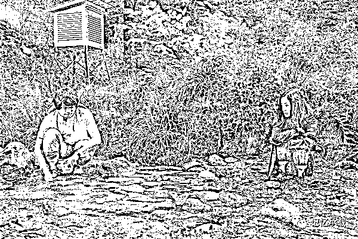

# 来聊一个女性出轨的话题

> 原文：[`mp.weixin.qq.com/s?__biz=MzU3NDc5Nzc0NQ==&mid=2247485101&idx=1&sn=63c1af69248a4d1cc7d3f5f2a743a13c&chksm=fd2da473ca5a2d65ea5b120830ddb4994dc917fce3af8ac8feb82adb2f382e3bb7344ea4f1d3#rd`](http://mp.weixin.qq.com/s?__biz=MzU3NDc5Nzc0NQ==&mid=2247485101&idx=1&sn=63c1af69248a4d1cc7d3f5f2a743a13c&chksm=fd2da473ca5a2d65ea5b120830ddb4994dc917fce3af8ac8feb82adb2f382e3bb7344ea4f1d3#rd)

3 年前，《昼颜：工作日下午 3 点的恋人们》的电视剧版风靡全球，一度成为热门 IP。

3 年后《昼颜》的影片延续了剧版的故事。

开始就是上户彩饰演的纱和因婚外情离婚，并与斋藤工饰演的北野签了不见面、不说话的协议。

为了远离这段感情，她搬到海滨小镇，在餐厅打工过上了与世无争的日子。没想到在北野来到小镇的一次讲座上，两个人再度重遇，感情瞬间被点燃，并越烧越烈。

终于，两个人下决心在一起生活，没想到事情开始失控，发展到了所有人都没想到的结局。

导演能把出轨拍成初恋的感觉，相信很多人已经找不到自己的三观了……

电影中大量使用长镜头来展现日式小镇独有的美景。

暖光色的基调搭配清脆的音乐，男主女主坐在潺潺小溪边看萤火虫飞舞，彼此情愫饱满却极度抑制。

单车、布鞋串联起微笑、暧昧的表达，甚至男女主凝望对方的眼神都显得清澈透明。

当然，影片的后半段也许是为了通过日本的内容审核，硬是安排北野的妻子开车带着他出车祸，把他弄弄死。

也不答应满屏观众的呼声“在一起，在一起...”

最后纱和怀上了北野的小生命，没有卧轨随之一同逝去。

那个后来在萤火虫野外工具箱里找到北野留下给纱和的婚戒的小男生，该不是北野的遗腹子吧。

这个脑洞开的也有够奇葩。

说实话，这不是一部优秀的作品。

电视剧版的《昼颜》之所以火，是因为它打动了日本主妇们寂寞的心，似乎让她们在平淡的生活里找到了爱的火花，在出轨之中找到了初恋的感觉。

因为这种小清新角度描述出轨的影视剧，也只有日本才能拍的出来，而且日本也是头一遭。

因此这个 IP 的电影，仍然能收割昔日电视剧迷的票房。但**一部优秀的作品，它首要的因素是矛盾。**

《昼颜》里当然也有矛盾，纱和逃离东京来到了滨海小镇，可是她打工的店主，因为也曾经遭遇妻子出轨被抛弃。

出于嫉恨公布了纱和的行为，她和有妇之夫的婚外情遭到小镇居民的嘲讽与鄙视。

北野也要面对妻子与情人之间的心理纠葛。

纱和似乎偶尔也会感到内疚，毕竟她与北野的爱情，伤害了很多人。

但这些描述的力度都不够。而且它的小清新特色恰恰是它的硬伤。

它企图刻画的初恋的感觉与男女主已婚的身份以及 30 多岁的年龄并不相符，更与出轨这件事本身要面对的复杂形态不符。

当然，好与坏要看跟谁比。

如果你拿《昼颜》与《失乐园》相比，就很会认同我的评价。

要知道题材，人设，背景都有很多接近之处。但是后者明显高出前者八个段位。

当然，这么比较本就不公平。《失乐园》是日本情爱大师渡边淳一的作品，而且源自真实的历史事件。

《失乐园》一开始便是 55 岁的男主人公久木和 38 岁的女主人公凛子的做爱场景。

各有家庭的两人是几个月前相识的。当时久木刚从一家大出版社的出版部长位子上下来，凛子正在一家文化中心临时讲授书法。

久木欣赏凛子端庄的书法、高雅的气质和美貌，凛子则为久木“带有抑郁味儿的孩子气”所动心。经过频繁的交往，两人终于一起走进了旅馆。

后来，久木妻子几次催他在离婚书上签字，出版社在出示一封恶语中伤的密告信的同时通知他将被调往下属的一家分社。

凛子的丈夫则以偏不离婚作为对她的惩罚，母亲宜布同她断绝母女关系。

最后，久木留下房子和存款，只提一袋秋令毛衣告别妻女，同凛子一起悠然走向人生最后一站，在一家山庄式旅馆里相拥服毒自杀。

在致“大家”的遗书中写道：“原谅我们最后的我行我素吧，务请把我们合葬一处。”

这里面有强烈的矛盾与挣扎。

比如凛子的婚姻是无性的，而男主久木正值中年，在事业最如日中天之时，被贬到调查室每天无所事事，成为不被公司重视的一名窗边族。

两个内心充满矛盾之人相逢之后，擦枪走火，无法自拔。

而且他们的爱实际上不纯粹是肉体的，也不纯粹是精神的，而是肉体与精神水乳交融般的结合。

这也导致了他们选择疯狂地去爱，疯狂地去燃烧，乃至不为世人所容，疯狂的一起自杀。

整部片子是压抑的。无论电视剧版还是电影版。

《失乐园》的女主是日本国宝级明星黑木瞳主演，无论是剧版还是影版。而且那正是二十几年前黑木瞳年轻的时候，最好的年华。

最重要的是，它不仅仅展现了矛盾的一面，而且跳出了矛盾。

它实际上是向观众发出了一个问题，就是它通过婚外恋，揭露了人的生存悖论。着力表现的是一种对待生、死、爱的观念和人生态度。

这就升华为一部伟大作品了。