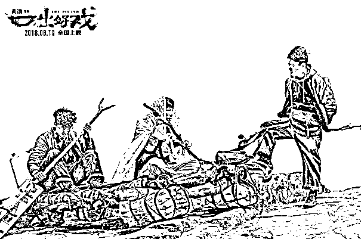

# 公道不在人心，是非关乎实力

> 原文：[`mp.weixin.qq.com/s?__biz=MzU3NDc5Nzc0NQ==&mid=2247485092&idx=1&sn=897521e42336855f47e4adfcd9536c36&chksm=fd2da47aca5a2d6c497a2c9587361a9d14e15029760da6046f50f947ac4012d05d7330d53e67#rd`](http://mp.weixin.qq.com/s?__biz=MzU3NDc5Nzc0NQ==&mid=2247485092&idx=1&sn=897521e42336855f47e4adfcd9536c36&chksm=fd2da47aca5a2d6c497a2c9587361a9d14e15029760da6046f50f947ac4012d05d7330d53e67#rd)

这是一篇影评。是黄渤自导自演的《一出好戏》的影评。

为什么拿这句话做标题呢？

这句话出自徐克导演的《笑傲江湖》的第二部，任我行从地牢脱身后和向问天的一段谈话。

向问天说明了东方不败神功一日千里，忠心护教者惨遭迫害，投机钻营者、搬弄是非者却深受重用。

任我行：“我相信公道自在人心”。

向问天：“公道不在人心，是非在乎实力”。

任我行又请求令狐冲陪他铲除东方不败，却被令狐以退出江湖为由委婉拒绝。

任我行凄然笑道：“果然公道不在人心”。

黄渤的电影拍的很复杂，它几乎把人类社会形成的过程揭露了出来，实在很难用一篇文章去讲清楚这部电影。

我只能选取一个维度，就是这个标题。

故事一开始，是一部冒险大片的感觉：一个公司准备外出团建，租了一辆水中大巴准备到达目的地，突然一个巨浪打过来，一车人被放逐在荒岛之上。

明明前一刻还风和日丽，后一刻马上就掀起滔天巨浪，为什么？一颗陨石落到了地球，人类面临着世界末日。

“外面的世界已经没了，我们可能是这个地球上唯一存在的人类了。” 流落荒岛上的人，从此再也没有离开的念头。

他们一心想的，都是生存下去。唯有一个人例外：黄渤饰演的男主角，马进。

马进是一家公司里工作多年的老员工，但能力所限，仅仅是一个普通员工。偏偏他就爱上了公司最漂亮的女孩——舒淇饰演的姗姗。

姗姗结婚，他用冥钱凑份子钱，姗姗离婚，他在门外放鞭炮。他心心念念的，是“用三层大油轮把你拖回家去！”

能力不靠谱、勤奋得不到报酬，他唯一的希望都寄托在买彩票上。而且，还真让他中了六千万。

然而中彩票是在去团建的船上。大浪一来，将他拍到了荒岛上，也差点将他的发财致富娶妻生子的美梦拍死在沙滩上。

“中六千万不夸张，夸张的是在这里中了六千万。” 

兑奖日期是 90 天，他要在 90 天之内离开这座岛。

全岛人都想着活命，马进只想拿到那六千万。而对于其他人来说，世界都没了，那六千万连个屁都不值。

在荒岛上，钱是假的，填饱肚子生存下来才是真的。

而谁能让大家填饱肚子呢？驯养过猴子的，王宝强演的导游小王。

于是乎，小王，就变成了王。

他暴力镇压了老总、经理、教授，还得到了胸脯最大的女人，建立了第一个社会。

**“王”成功的因素是什么？**

****答案很显然。******能力不对称。******

******你注意三皇五帝时代，黄帝发明了天文历法，神农氏发现了五谷，草药，燧人氏发现了火，大禹治理了洪水，早期的领袖都是依靠能力不对称获取超然地位的。******

******但是社会形态从这一刻开始分裂了。******

******除了马进不服小王的领导，原来的公司领导——张总也不服。  ******

******他在外面身价六亿、公司都快上市了，习惯了人上人的生活，怎么肯屈服在一个小小的导游之下？******

******他纠合了自己最忠心的手下，在岛的另一边开辟了乐园，这一切，都源于他发现的邮轮残骸。******

******邮轮虽然只剩下半截，而且被翻了个底朝天，上面却应有尽有。******

******粮食，红酒，现代设备包括电力，娱乐设施比如扑克，相对于小王组织起来的原始社会，在这里活脱脱就是资本主义的天堂。 ******

************

********张总的成功源于什么？********

******非常经典的信息不对称，他发现了邮轮残骸。******

******可是马进想要的是在 90 天内回到那个大家认定消失了的世界，于是他与张总分裂了。******

******天天看着日历，数着 90 天的兑奖期限过去，等到最后一页也翻过去了，他彻底失望了。******

******食物没了，身边只有表弟小兴（张艺兴饰演）陪着他，彩票也彻底指望不上了。******

******他和小兴躺在河边的石头上，万念俱灰。******

******突然起了龙卷风，天降一阵大雨，顺便降了一车大鱼 —— 你没看错，真的是降了一车大鱼。******

******马进欣喜若狂：“我明白了，这一车大鱼就是上天给我兑换的奖金！” ******

******因为有数之不尽的鱼，他叫别人来用自己的食物换他的鱼，建立了独立于小王和张总之外的第三套体系。******

******他挑拨小王势力和张总势力，让两伙人发生火拼，从天亮拼到天黑，双方精疲力竭，打得跟鬼一样。******

******最后马进在游船上，靠着小兴手动摇出来的大瓦数灯光，以救世主的形式出现，呼吁大家停战：******

******“你们想见到光明吗？那就让我们齐心协力，去寻找属于我们的新大陆！” ******

************

******疲劳不堪的众人被煽动起来了，纷纷喊：“寻找新大陆！” “一年没找到，我们就找十年！十年没找到，我们再找十年！”******

******马进从船上一跃而下，底下的人用手接住，那一刻，屌丝变成了上帝，成为了新的宗教领袖。******

********马进成功的因素是什么？********

********能力不对称。********

**********他有一个唯一懂电工的表弟。他能为大家带来光明，能让手机充上电，能让大家看到手机里残存的家人的图片和视频。**********

******张总会甘心么？******

******张总用纸牌发明了原始货币：纸牌上的点数代表金额，一点可以换三条鱼。船上的东西，比如渔网，他都可以出租，但要收取“租金”。******

******本来张总告诉大家，他手上只有两副牌，大家有多少货“市场”上就有多少纸牌。******

******但马进等人最后发现，纸牌流通到他们手上的时候，一共就有四张红桃三。原来张总手上，不止有两幅纸牌。******

******看来张总把通货膨胀，滥发货币这一套学的很熟。******

********张总的成功源于什么？********

********信息不对称。********

**********大家以为只有两幅扑克牌，但他知道不是。**********

******这一切即将被打破。******

******因为马进，小兴和“王”发现了每隔 12 天经过岛屿的游轮。******

******原来外面的世界还存在！******

******小兴用删掉张总手机里女儿的视频做要挟，要他写下无偿转让外部世界里的公司以及一切财产给小兴以及马进。******

********小兴的成功靠的是什么？********

********信息不对称。********

**********他知道外面的世界还在。但是张总不知道。********** 

******影片到这里远没有结束，......******

******有意思的是另一个视角。“王”，张总，马进，小兴这四个主角之外剩下的几十个吃瓜群众的价值在哪里？******

******在每一轮社会变革的过程中，他们只是随波逐流，并无法决定自己的命运。******

******史教授觉得张总说的对，不能在“王”的欺压下过奴隶般的生活，但是他并不知道张总已经发现了邮轮残骸。******

******当“王”一巴掌扇在他脸上的时候，问他，你是要吃饭，还是要饿死？他诺诺不敢言语了。******

******当马进，小兴建立最后一个半机械化社会的时候，其实岛上吃瓜群众被利用价值是最低的。******

******似乎真的像史教授说的那样，唯一的作用就是尽可能让每个男女都充分的交配，以便繁衍出 DNA 序列尽量不同的后代，维持人类的基因多样性。******

******这似乎成了他们存在的唯一价值。******

******影片揭示的淋漓尽致：******

********所有的成功都源自能力不对称，或者信息不对称。********

****而随着技术和社会形态的演进，吃瓜群众的被利用价值在不断的降低，以至于从被剥削的劳动者，变成繁衍维持基因多样性的基因储蓄罐。****

****随着人工智能社会的到来，随着基因技术的大规模突破，这个残存的价值还能维持么？****

******这都会在我们有生之年发生，到那个时候，社会形态又会是如何呢？******

******这是电影深刻的地方。******

******岛上的吃瓜群众，在面对“王”的压迫的时候，在面对张总的通货膨胀的时候，在面对马进的忽悠、欺骗的时候。******

******他们何尝有过希望呢？******

******他们只是一次次的怀有希望，一次次的得到失望而已。******

******每一次反抗都源于能力不对称，或者信息不对称。******

******张总反抗“王”靠的是信息不对称，马进和小兴反抗张总靠的是能力不对称，小兴最后企图让所有人死掉，他和马进带着张总的遗嘱单独离开回到外部世界，依靠的又是信息不对称。******

******你觉得韭菜应该有希望的原因是因为你拿自己当回事。******

******可问题是，别人并没有拿你当回事。就像“王”，张总，马进在岛上做的那些一样。******

******公道不在人心，是非关乎实力。******

******你想改变不满的底牌是什么呢？******

******是你有优势的能力？******

******还是你有优势的信息呢？******

******即使你想去一个你认为更加优势的环境，门卫问你的仍然是那两句话。****** 

******请出示优势的能力，或者优势的信息......******

******你可以说某些团队对弱者的照顾要比其它团队更好。但你要注意，这种好仅限于对自己人。******

******马进为啥放不下舒淇演的姗姗？因为他想娶她。******

******小兴为啥准备弄死所有人还要带走马进？因为那是他表哥。******

******任何一个企图照顾自己团体里弱者的制度，一定是源自这个道理。******

******这些被照顾的弱者的祖辈们，必定曾经是建立这套制度的强者。******

******而外部的强者如果想要自己的弱者后代加入被照顾的福利制度，必定要缴纳巨额的投名状。******

******而一个外部的弱者如果想被强者团体接纳并照顾，除非他自己通过能力不对称或者信息不对称变成强者，赚取巨额的投名状。******

******你不相信这一点么？******

******很多人说某些地方的福利很好，是很好，问题是，对你好么？******

******要么你生在那里，要么你很有钱或者很有能力，能证明你对别人有利用价值，否则，会对你好么？****** 

******每个看似比当前处境更欢乐的城堡，进入的通道都只有三条，血缘，婚姻和奋斗。******

******而奋斗，本质上就是取得能力不对称，信息不对称里的优势地位。******

******而当你真的通过奋斗取得了优势的能力位置和信息位置的时候，恐怕你又不想去那个你曾经身为弱者的时候向往的美好环境了。******

******比如影片里的马进。他明知道有邮轮，但他不想回到现实社会。******

******现实社会虽然整体比岛上先进很多，可他在那里，只是个普通员工。可他在岛上，却是领袖。******

******这非常现实，你好好想想，非洲好还是欧洲好？******

******其实取决于你自身的位置，如果你在非洲做大酋长，难道不比你在欧洲领救济快乐么？****** 

******这影片深刻的揭示了除了血缘，婚姻之外，这世上最有价值的东西就是能力不对称，信息不对称。******

******而当你一旦取得了这种不对称。其实你待哪儿都很舒服，哪怕待在看似最落后的荒岛上......******

******当然，电影最后留下一个矛盾的选择，马进选择了 6 个亿，就要失去姗姗这个人；******

******放弃 6 个亿，回到现实变成没钱人的马进，同样也会失去姗姗的爱。******

******世间安得两全法，不负如来不负卿。******

******呵呵。******

******我相信马进不会为了 6 个亿就放弃对姗姗的爱，我也相信姗姗会爱上虽然没有 6 个亿但是有一份真诚的穷光蛋马进。******

******当然，黄渤也相信，他就这么拍的结尾。******

******当然，黄渤不这么拍，你也就看不到这本电影了。******

******黄渤真的相信么？******

******电影结束后有三个彩蛋，最后一个埋的非常深，在音乐字幕全都结束后才跳出来。******

******彩蛋说什么呢？******

******黄渤，张艺兴和徐峥三个人在公交车上。徐峥受不了黄渤与张艺兴两个人充满美好幻想的满嘴跑火车，抄起电话，说要叫 500 个兄弟来砍死面前这俩 SB。******

******这份黑色幽默充满了嘲讽，导演黄渤对美好结尾的无情嘲讽......******