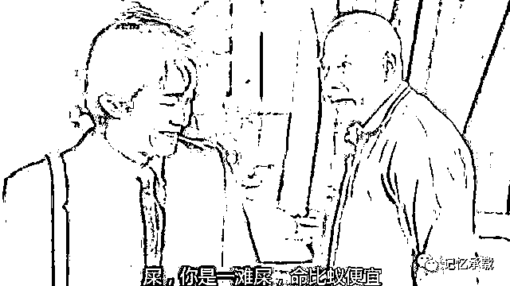
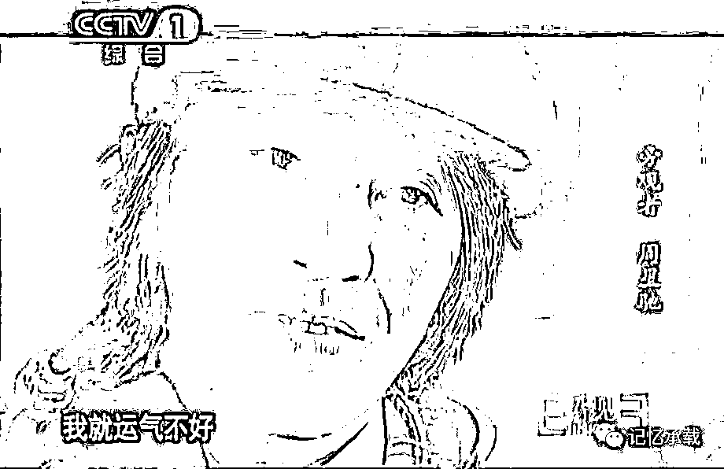
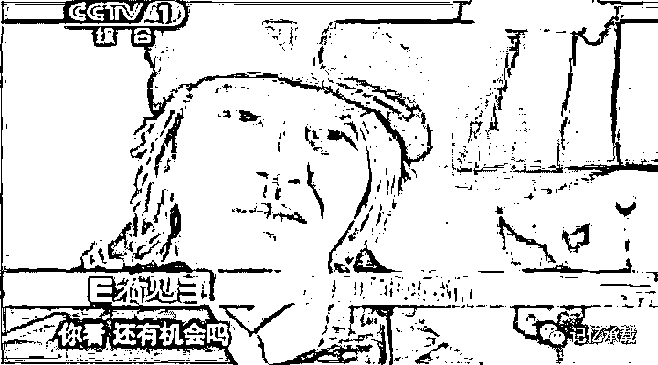
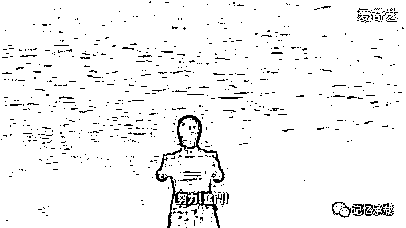

# 年少只知无厘头，读懂星爷已中年

> 原文：[`mp.weixin.qq.com/s?__biz=MzU3NDc5Nzc0NQ==&mid=2247484992&idx=1&sn=1d33b6be7069ce6be905a9b377c45177&chksm=fd2da49eca5a2d8891b05acf0dedcd46dd0731461b1fdc66b39890b7f603d9ecab58ab0b7fbf#rd`](http://mp.weixin.qq.com/s?__biz=MzU3NDc5Nzc0NQ==&mid=2247484992&idx=1&sn=1d33b6be7069ce6be905a9b377c45177&chksm=fd2da49eca5a2d8891b05acf0dedcd46dd0731461b1fdc66b39890b7f603d9ecab58ab0b7fbf#rd)

大家都知道，星爷演的都是小人物，但他在我心里，是个大人物。

因为他不是在搞笑，他是搞命运的笑。

我们说什么是大人物，不是那些成天号称改变了什么的人，而是那些什么也没号称，但是真的改变了某些观众命运的人。

人家说笑一笑，十年少。

他一直都在努力的让世人笑，却也终究没有被岁月绕过。从少年青涩的阿星，到满头银发的星爷。他的电影陪伴了我整个青少年。

我看过很多星爷的采访，他自己说他演的最好的那场戏，是在他 7 岁那年。星爷 7 岁的时候父母就离婚了，住在香港九龙的贫民窟，母亲一个人打两份工，养活他们姐弟妹仨人。

有一次，母亲已经两个月没发工资了，好不容易弄来些钱，给他们三人买了鸡腿。

他啃了几口就“不小心”让鸡腿掉在地上，母亲又生气又心疼，拿起藤条开始抽了十几下他，“让你顽皮，让你不知珍惜！”

哭了好一会儿，才开始吃饭。母亲把鸡腿捡了起来，舍不得扔掉，用开水冲洗一下自己吃了。

睡觉的时候妈妈问他打得疼不？以后还顽皮不？

他笑嘻嘻的说：“睡觉啦，我明天还上课呢。”

2001 年，周星驰和母亲做客凤凰卫视时，又说起了这件往事。

 周妈妈慈祥地说：“那时他可真顽皮啊！全不知道，这饭菜来得多不容易，一点也不珍惜。”

周星驰接过话茬：“那几年里，你把好东西全部给了我们，我要不是把鸡腿故意弄到地上，您会舍得吃吗？”

这场最精彩的戏，唯一的观众，就是他的妈妈。

中学毕业之后，他就去跑堂，做电厂工人，认识了梁朝伟，俩人一起去考 TVB 的演艺班。

后来的故事众人皆知。梁朝伟很快就火了，星爷做了少儿节目的主持人，从 20 岁到 26 岁，一做就是 6 年。开启了他漫长的跑龙套生涯。

星爷经历过人情冷暖，无论是向太的封杀，还是王晶的辱骂，乃至昔日好友的攻讦。

我们不想参与未知真相的事情，但是黄秋生有句话很有意思，“你们只看见别人说周星驰，你有见过周星驰说过别人么？”

柴静在采访周星驰的时候，问他什么时候会结婚，他落魄地说“你看我现在这样子，还有机会吗？”

或许曾经有份真挚的爱情摆在星爷面前，可是他没有把握住。

星爷不是至尊宝，等不了一万年。白晶晶嫁给初恋，紫霞也已经觅得真爱，世间只留下星爷形单影只。

**他演了一生的喜剧，却把自己的一生，演成了悲剧。**

作为骨灰影迷，星爷每本戏我都看过 20 遍以上。哪怕是天龙、射雕里的龙套小兵的镜头，我也看了 20 遍。

小时候，你让我们笑。

长大后，你让我们笑着哭。

是你告诉我们，笑对坎坷。

文章到这里没结束，而是刚开始。

星爷的影迷有十四亿，光是描述我对他的敬仰犹如滔滔江水连绵不绝，又犹如黄河泛滥一发而不可收拾，这不足为奇，也不足以让我在十四亿影迷里脱颖而出。

复述一遍他的人生，表达一遍我对他的仰慕，十四亿影迷人人都能做到，不缺我一个。

事实上，周星驰，人中俊杰，他不需要我去歌颂他的传奇，更轮不到我去唏嘘他的命运。

正如同他的名字星驰，出自《滕王阁序》：“雄州雾列，俊采星驰。”

他这样的俊杰：

知道自己有什么，

知道自己要什么，

也知道自己不得不放弃什么。

正如同圣经里第一位先知，亚伯拉罕带领部族寻找流淌着奶和蜜之地。

星爷，用他那无论是传奇，还是悲剧的一生，不是只想逗我们笑，而是想让我们笑着面对人生。

星爷教给我们三件事：

**第一个问题：知道自己有什么？**

我说星爷是个俊杰，俊杰什么意思？

《三国志》里裴松之注引《晏子春秋》里话评价诸葛亮，“儒生俗士，识时务者，在乎俊杰。”这是说诸葛亮、庞统等能够通晓天下大势。

在我看来，俊杰不一定是要能识天下大势的。能认清自身的现实，亦不妨是个小俊杰。

星爷生来穷。这是不是事实？

这是事实。

所以他没有一毕业就开一家电竞公司然后去捧网红。因为这事他做不了。

识时务没什么难的，认识自身的现实，面对它，做自己能做的事情。这就够了。

我小时候生下来有病，我有两篇历史文章都讲过。问题是，so tama what?

有病就去死么？嫌自己运气不好，死了然后重新投胎？

我想过，5 岁就想过，所以 5 岁才问我妈，人活着是为了死么？

问题是我没这么干。所以今天你们才能读的到我的日记本。

因为死解决不了问题。我就是不主动死，我耗下去，迟早也得死嘛。那我干嘛不耗呢？

**咸鱼只是咸了点，它并不是死鱼呀。你咋知道它就不能翻身呢？**

这就是识时务。我小时候的理想是变成 007，豪车美女生死决战。但是现实是，一年十二个月，生病的时间四个月。

如果你折算下，我平均一天只有 16 个小时。16 个小时的 007？

显然，走不通。走不通，就改变目标。找一个符合自己有什么的目标。就这么简单。

**第二个问题：知道自己要什么？**

星爷想要做电影明星。所以他做的所有事情都是围绕这个。如果星爷最后运气不好，就是成不了明星。那就如同他在《喜剧之王》里说的。

他是个跑龙套的，但可不可以把死字去掉。他是跑龙套的，但不是死跑龙套的，他是个认真，努力的跑了一辈子龙套的跑龙套的。理解？

秦始皇生下来是秦国的太子，所以他奋六世之余烈， 振长策而御宇内。这是他的追求。

而如果你生在十八线山沟里，那你能够在一线城市立足，那是同样牛逼的追求。

如果你知道自己有什么，就会知道自己当下该要什么。

朱元璋生来是个乞丐，叫朱重八。他要的只是不饿死，所以做了和尚。做和尚吃不饱所以才做了起义军，做到将领才企图割据地盘，地盘大了才企图统一天下。

他永远都知道他当下有什么，随着当下的状况的改变，他在不断的调整自己要什么。

**第三个问题：知道自己不得不放弃什么？**

如果你现状也认清了，目标也树立了。那剩下的，就是怎么做了。

我说过我小时候平均每天只有 16 个小时。so tama what？

我已经只剩 16 个小时了，还去浪费 1 个小时嫉妒？再浪费 1 个小时抱怨？再浪费 1 个小时平复嫉妒和抱怨留下的坏心情？

你当我傻么？这是弱智儿童欢乐多？

所以，我只能提高效率。很多年后，我的下属跟我说，你这人连一个多余的动作都没有；我的上司跟我说，你说话太快了，我第一件事还没想明白，你把这件事未来的演化都预测完了。

无它，我没时间嘛。

人说长期的贫穷会让人把一分钱掰成两瓣花。那长时间的缺时间，会让人去掉所有多余的情绪。

你见过的瞎子，听力都特别敏锐是吧？

因为天底下的瞎子们，就只有两种选择，要么，躲进阴暗的角落，从此不为人知；要么，让听力取代视力，像正常人一样活着。

所以，能让你看见的瞎子，当然是第二种呀。

再不要对着一个瞎子说，“哇，你好有天赋啊；哇，你好有眼光啊......"

所有的天赋都不过是不幸的产物，如果你没有，只能说明你还不够不幸，亦或者，你选择了放弃。

所以我能够理解星爷一头银发，落魄的回答柴静：“我都 50 岁了，还可以么？”

任何事情都有代价，你要有所得，一定有所舍。

可惜这是一篇文章，如果这是一本电影，我们可以把镜头用时光倒叙的手法，切到星爷小时候。

你问他，怎么选？

他可以什么都不放弃，他可以什么都不追求，他可以拒绝面对现实的一手烂牌。每天活在妒忌，抱怨的负面情绪里，痛苦一辈子。

他也可以拿着一本《演员的自我修养》，面朝大海，喊“努力！奋斗!”

很幸运，我听到了。

但我却欠了你那么多年的电影票......

今日大号文章链接：

[投行美女与阿里前 CEO 卫哲，究竟谁的数学好？](https://mp.weixin.qq.com/s?__biz=MzU0MjYwNDU2Mw==&mid=2247486888&idx=1&sn=7248379393adac95bb3bd9ac2393aa59&chksm=fb1961d4cc6ee8c20c9a5d06afc4a15f3bfde90218ff27db8b64273004426288d4a4b0b47f15&token=1867334067&lang=zh_CN&scene=21#wechat_redirect)