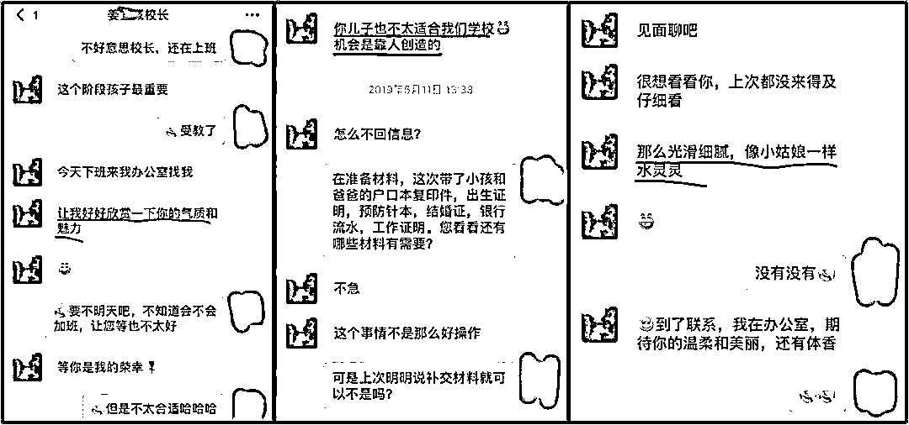
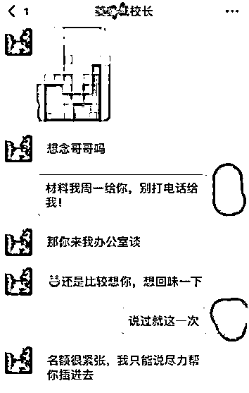
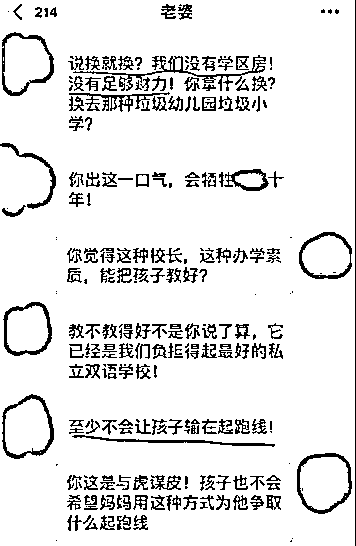
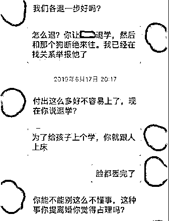
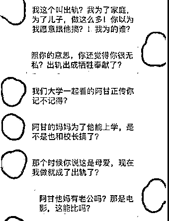
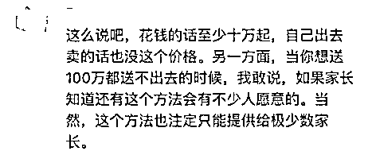

# 被潜规则的不只有这位家长，还包括我们每一个人

> 原文：[`mp.weixin.qq.com/s?__biz=MzU3NDc5Nzc0NQ==&mid=2247484936&idx=2&sn=a05640a635556e7e2755d42f8c43f689&chksm=fd2da4d6ca5a2dc06436f4807c6bebc21930d088105de39df5abf411f82999307454fe9dcc38#rd`](http://mp.weixin.qq.com/s?__biz=MzU3NDc5Nzc0NQ==&mid=2247484936&idx=2&sn=a05640a635556e7e2755d42f8c43f689&chksm=fd2da4d6ca5a2dc06436f4807c6bebc21930d088105de39df5abf411f82999307454fe9dcc38#rd)

有读者很想听我对最近魔都妈妈圈里曝出的大新闻。

事情大概是这样的，一位家长为了孩子上幼稚园，被校长潜规则了。

结果没想到校长一次之后还要二次，没完没了。

这位家长不同意，还告知了丈夫，结果两口子为此事发生口角。

俩人的分歧是巨大的，这位女家长还提出了一个看法，就是类比电影《阿甘正传》。

也不知道为什么，这个聊天流传到了网上，结果变成大讨论。

毁人三观的并不是这对罕见的家长，而是下面的评论。

这个新闻很多大 V 解读过了，基本上都在讨论教育焦虑论，教育精英化乃至人品的沦丧。

但我这么说，这类话题我不喜欢讨论，因为我觉得公开讨论这种话题，对女性不尊重。

所以，我换个角度给你谈我对潜规则的看法，换谁呢？换男性。

当然，这话题对男性同样不尊重，两性是平等的。

可我是男的，而且男同胞的口味都比较重，所以拿男的打比方，问题不大。

这种两性关系的潜规则，在生活中只会发生在极少数人身上，不是因为大部分人道德高，而是因为大部分人都长得不好看。

我相信长成林志颖那样的，这辈子少不了被性骚扰，但是长成郭德纲那样的，就不需要操这份闲心。

虽然郭老师只比林志颖大一岁。

我们仔细想想，所谓的潜规则道德败坏的实质在哪里？在于发生了那种事么？

其实不然。

讲这种带有侮辱性质的道理，只能拿自己打比方，那就牺牲一下我吧。

假如，我是指假如凤姐对我说，她要潜规则我，你觉得我听了之后什么感觉？

两个字：愤怒。

我相信大部分男同胞都这感觉，觉得被深深的侮辱了。

那我们换个人。

假如，我是指假如范冰冰对我说，她要潜规则我，你觉得我听了之后什么感觉？

多少也有些愠怒。

但仔细想想，又有些得意。

虽然人家是强迫你，虽然听起来不舒服，但是，回头想想，人家可是大美女哦，这个，不管怎么说，自己还是挺有魅力的嘛。

是不是这么想？大部分男同胞都会这么想。

当然，长成鹿晗那样的，也许还是会觉得被侮辱了，那是另一码事。但大部分人，都会有稍许得意之情。

这就很有意思了。

事情有本质的区别么？

都是人家要强迫你，没区别呀。

何以前倨后恭？

我告诉你为什么，因为我们所有人，早已被潜规则惯了。

**我们骨子里，反感的并不是人家侮辱了自己的意志，而是这个侮辱自己意志的人，究竟是谁。**

看过鲁智深暴打镇关西吧。

鲁智深是怎么骂的？

“洒家始投老种经略相公，做到关西五路廉访使，也不枉了叫做镇关西。你个卖肉的操刀屠户，狗一般的人，也敢叫做镇关西！”

看到了吧，问题不在于镇关西，而在于谁叫？

我相信要是宋江哥哥自称镇关西，鲁智深一定说：“哥哥叫的好，我去给哥哥摇旗！”

即使是水浒里的好汉，见识也不过如此而已。

所以我才说，我们被潜的太久了，早已深入骨髓。

当然，现实生活里，凤姐不会来潜我，范冰冰更不会。我们人类不是动物，没那么多两性需求。

但并不是只有那件事才叫潜，生活里，时时处处都是潜。

比如，我小时候，认为某些事，不是那个道理。但我有办法么？没有。

如果我不那么回答，某些功课就没法及格，我也没法毕业。

这也是潜。

再比如，你工作了，面对大客户，面对甲方的大头，总得说很多不愿意说的话，总得做很多不愿意做的事儿。

这是不是潜呢？当然是。

只要违背你的意愿，本质上都是潜。

你仔细想想，假如两性之间，没有利益往来，没有任何其它因素，纯粹的那种事。

那叫什么？那就叫那种事。

假如未婚，最多定性为私生活混乱；假如已婚，那叫做不忠诚。

跟潜有没有关系？半毛钱关系都没。

所以潜这个字，它只和违背意愿有关，和别的没关系。

我看那个新闻下面的评论，很多人的三观落入我的描述之中。

很显然，他/她们早已不介意被“潜”，他/她们介意的，只是个价格。

说白了，关键在于什么代价，而不在于这件事本身。

为什么会这么想呢？

因为常被强迫意志，早已习惯了。

有句话叫做生活就像强奸，既然不能反抗，那就好好享受。既然一定要发生，那不如要点回报。

这个关于被违背意志的话题，我聊过很多次。

我说我很反感职场，很大程度上就是因为职场里充满了不得已，不舒服，不尊重。

我记得有一年一个 500 强的外企的研发的头和我聊天，他聊到收购我们的那家很大的民企。

聊到的时候，很不屑一顾。

他是这么说的：

“虽然都是出来卖的，但我们就像应召女，好歹还跟人家谈谈感情（就是指和甲方谈谈技术方案），而那家呢，简直就是站街女，拎着麻袋去人家甲方......，此处省略几十字。”

这句话非常的粗俗，真不该从一个博士的嘴里出来。

但非常的形象。

我一直告诉问我企业文化的读者，外企和非外企的区别就这点。

骨子里是一样的，这一点全世界都一样，你千万不要被西方的很多观点糊了脑子。

除非你什么都接触不到，那也许觉得西方很完美。只要你做到管理层，只要你能接触到市场，接触到老板，东西方的企业骨子里，都是那回事。

但好歹人家蒙着一块遮羞布，这就叫做先进。

我曾经拿吃饭打过一个比方。

外企让你参加一个必须参加的聚会，会先问你是否有空，当然，无论你说是还是否，他都会一堆的重要性补充，言外之意暗示你去，但暗示终究比明示要让人舒服多了。

民企就不这样，就像民企的劝酒风格一样，那不叫喝酒，那叫战斗力。

虽然生活都像强奸，但外企会让你觉得更像通奸。

我讲这个，并不是想抱怨我们自己不好，而是觉得，我们这么多牺牲，这么多努力，究竟是为了什么？

就像饭桌上的酒，你强迫我喝了，我也就喝了，可是，我儿子长大了，是不是也得喝呢？

如果我儿子也得被灌酒，我孙子也得被灌酒，那我的自我牺牲，意义何在？

这句话其实就是我想问那个妈妈的，我不知道她有没有想过。

但我作为一个爸爸曾经想过很多很多次。

我没想过己所不欲，勿施于人，因为我没那么大权限。

但我希望己所不欲的，不要施加在我儿子身上。

假如我们一次又一次的选择妥协，教育的意义是什么？或者说，我们自我牺牲的价值又是什么？

是为了让自己的孩子走上自己的老路，依旧如此么？

有些读者觉得我似乎跳出了坑，其实没有。

我不被工作强奸，不被客户强奸，其实也会被市场强奸。

能理解吧。

市场也会强迫我做很多我不想做的事情，这是以投资为生也不可不免的。

唯一的区别在于，如果说以工作为生，我要接很多客，那以投资为生，我只接一个大客户。

这就像同样是做鸭，但被市场这个富婆包养了，一样。

我提出的，不是方法，而是问题。这个问题无解，西方人那么先进也没解，只是他们意识到了，所以在很多细节上注重对人的尊重。

比如什么事都先问下你的意见，哪怕是孩子的房间也敲门经同意再进去......

我们能做什么，这是一个很广泛的话题，这不是你干掉几个幼稚园校长，或者批评几个家长能改变的。

这是每个人都该去想想看的。

作为父母，我们究竟希望自己的孩子，生活在怎样的环境中？