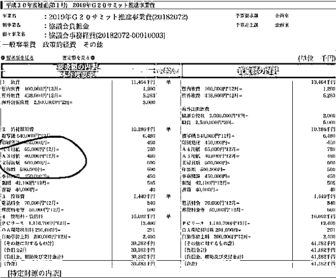
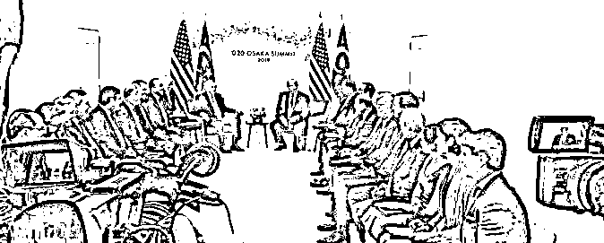
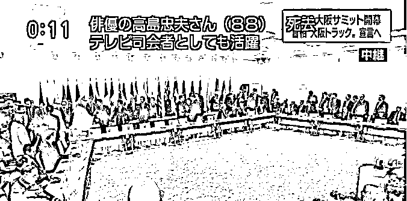
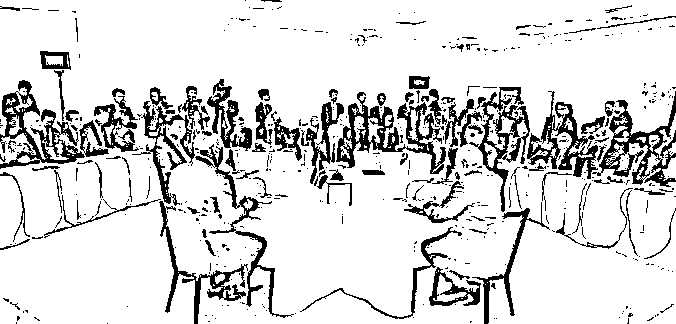

# 日本不再是日本，日本依然是日本

> 原文：[`mp.weixin.qq.com/s?__biz=MzU3NDc5Nzc0NQ==&mid=2247484931&idx=1&sn=fa558c1ac913dc8ac5af7c330aadf50c&chksm=fd2da4ddca5a2dcbefc27bb28e2a33d55743e77fe646d5ab12beddd78fdcc0a7be3bb81fb038#rd`](http://mp.weixin.qq.com/s?__biz=MzU3NDc5Nzc0NQ==&mid=2247484931&idx=1&sn=fa558c1ac913dc8ac5af7c330aadf50c&chksm=fd2da4ddca5a2dcbefc27bb28e2a33d55743e77fe646d5ab12beddd78fdcc0a7be3bb81fb038#rd)

最近被寒酸的大阪峰会刷屏了。

大阪峰会的花费在大阪政府的官网上可以看到详细清单。

其中协议会日常运作开销的经费，花了 4128.2 万日元，约 263 万人民币。很详细，差旅，话费，甚至 A4 纸都有。

当然，你要弄清楚，这个费用只是会场运作开销，不是全部费用。全部费用共花费 535.88 亿日元，约合人民币 34 亿元。

你看到了，整体花费并不低，很正常，一场峰会，花几十亿 RMB 是合理的。有大 V 说总体花费 200 多万，那真的是在胡说八道，刻意吸引眼球，且心怀叵测。

但是，这里面的分配确实有点搞笑，安保这种看不见的部分花了很多，会场这种撑门面的工程花的太少。

日本不怕媒体曝光后，有点掉价么？

我们来看看他们的会场究竟啥样。

就这样，感觉像个仓库。

有人说桌子是小学租的，上面盖了块白布。我觉得不太可能。因为这也就是折叠桌，真没几个钱。

有人说日本一直都这样，很重视里子，不太重视面子，所以酒店各种场所都是小小的，但是内部设计的很精巧，很好用。

日本真的从来不重视面子么？

起码 80 年代的时候肯定不是。

80 年代的时候东京的出租车司机一年的收入可以达到 1000 万日元。几十年过去了，现在收入反而大大减少。

因为那时候动辄有人掏钱要求从东京打车到 300 公里外的名古屋，现在都去坐公共交通了。

80 年代的时候学生没毕业就被公司签下来，然后以进修的名义送到夏威夷去度假，因为怕被其它企业抢走。

而一进公司，老板就拿出 10 万日元说“今天不用上班了，你拿着钱去银座买衣服。”

这不是最好的，名牌大学的学生上来就是公司替你租高级公寓，送上百万日元见面礼。

这不是最夸张的，有人干脆不上班，就到处应聘，一周就能赚上百万日元，你要知道现在的应届生，月薪只有 20 几万日元。

到 1993 年，日本的人均 GDP 已经是全球第一。现在 20 多位，排在香港后面。

那为什么会出现房价大跌，股价大跌，以至于日本几十年经济停滞不前呢？

这个核心触发点就是日美之间的贸易摩擦，日本几乎就是任美国蹂躏。

当然这也没办法，严格意义上讲，二战结束后，日本不是一个纯粹的完全能够自主的国家。

实际上作为战败国，它有很多不得已。

我经常说日本是很好的一个参考，它经历了什么，会有什么后果，就像有人提前把坑给你踩了一遍，把路给你探了一遍。

所以贸易摩擦一发生，我们号第一时间推文就表示，这种事情要坚持到底，绝不动摇，万不可走日本的老路。

后面你也看到了，硬气自有硬气的回报。

日本虽然自泡沫经济之后，政治动荡，内阁走马灯式的换人，导致他们的政策不连续，难以应对危机。

但是，绝没有一蹶不振。

换句话说，日本虽然早已不再是那个二战时期吃肉的民族，也早已不再是昭和时代经济飞跃的日本。

但是，它的强大，依然渗透到了骨髓里。

换句话说，经过泡沫经济之后的日本，不再像以往那么看重面子，它们越发喜欢把钱花在里子上。

日本的医疗保健系统覆盖所有国民，日本的所有医院都是非盈利性质的，日本的医疗制度被世界卫生组织（WHO）评价为世界第一。

日本实行全民医保。所有在日本居住的居民，包括外国人，都有加入国民健康保险的义务。

留学生或低收入者的保险费会有大幅减免。一旦生病，所产生的医疗费用，日本政府会负担 70%-80%，国民只需要负担医药费的 20-30%。

在日本，当一个人进入 65 岁的大关后，日本政府会给他一笔 20 万日元（大约 1 万 2000 元人民币）的钱，用于其个人住宅的改造，以创造一个适合于老年人生活的环境。

老年人购买轮椅、手杖、护理床等，90%的费用由政府承担，个人只需要承担 10%。政府还每年给老人 10 万日元，相当于 6000 元人民币，用于购买尿不湿等老人护理用品。

日本政府还会根据你的身体健康状况，对你作出护理等级的评定，然后根据不同的等级，支付给你不同金额的护理保险费，每个月最低的是 5 万日元，大约 3000 元人民币，最高的有 10 几万日元，相当于 1 万元人民币。

日本人的平均工资大概就是 RMB30 万不到的样子，但是各地的差异非常小。

无论是东京那样的大城市，还是乡村，大家的收入差不多，保障与福利差不多。

连行业之间的差异都不是很大，虽然金融与 IT 肯定高，但绝对没有国内行业间动辄多少倍的差距。

很多人说工匠精神，实际上，工匠精神是平静下的产物。

如果差异很大，大家都追逐热钱，内心很难淡定，也就很难具备工匠精神。

如果你问贫富差距过低，会不会导致优秀的人才失去进取心，失去创造力呢？

这确实是一个问题，年功序列制一向都是创新的对立面。

但我们来看四个指标。

在技术研发方面，日本有 4 个指标名列世界前茅：

1、研发经费占 GDP 的比例列世界第一；

2、由企业主导的研发经费占总研发经费的比例世界第一；

3、日本核心科技专利占世界 80%以上；

4、日本的专利授权率竟然高达 80%，可见其专利申请的质量。

不仅如此，80%日本企业不需要银行贷款，可见他们杠杆率之低。

百年企业 2 万多家，可见他们活的有多久。

换句话说，这是一个风险非常小的经济体，强大而平静的呆在我们隔壁。

最重要的是，曾经历史上还多次和我们发生过不愉快的事。

所以，日本不再是日本，但日本依然是日本。

我一直觉得，美国的经济模式，生活方式都离我们很遥远，而近在咫尺的日本，才是我们学习和参考的对象。