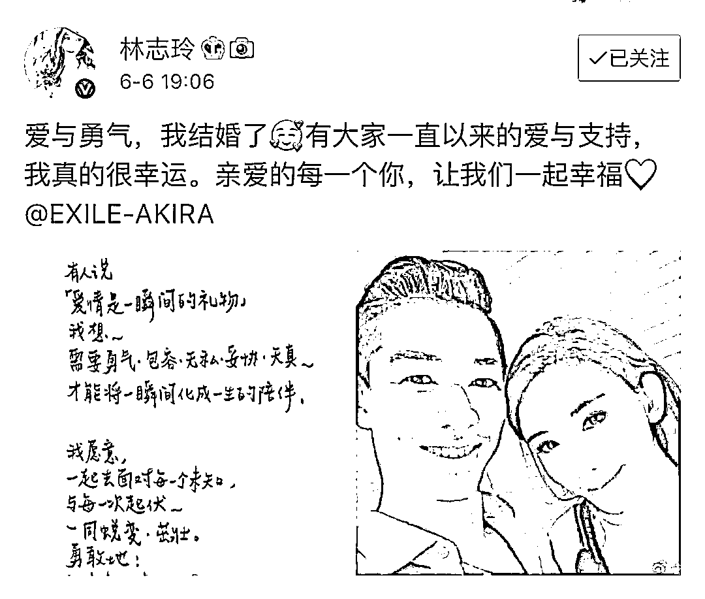
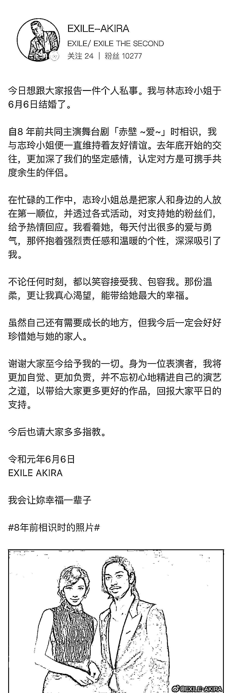

# 林志玲大婚，最恨新郎的人，你猜猜是谁？

> 原文：[`mp.weixin.qq.com/s?__biz=MzU3NDc5Nzc0NQ==&mid=2247484763&idx=1&sn=e00a6898cbf3757522a1dc79f407db78&chksm=fd2da785ca5a2e9333c1b72df5032c9d6673f541cb3191e711b7be8a2c6c5268688d1d83d065#rd`](http://mp.weixin.qq.com/s?__biz=MzU3NDc5Nzc0NQ==&mid=2247484763&idx=1&sn=e00a6898cbf3757522a1dc79f407db78&chksm=fd2da785ca5a2e9333c1b72df5032c9d6673f541cb3191e711b7be8a2c6c5268688d1d83d065#rd)

刚刚，林志玲宣布大婚。

读者肯定想知道，谁干的？

我也很想知道，谁干的？

马上就有日本艺人宣布对此事负责......

唉，说什么好呢。

我相信这会儿最恨新郎的不是志玲姐的粉丝团，而是刚刚拍下巴菲特午餐的孙宇晨。

这可是花了三千万哦，三千万哦。

三千万想上头条，没想到热度刚起来，就被志玲姐无情的压了下去。

这怎么有一种汪峰的赶脚......

我觉得吧，孙宇晨肯定在想，早知道自己去向志玲姐求婚了。

无论求的成，求不成，都能上个头条，还不怎么花钱......

林志玲给我们 80 后留下了深刻的印象。

应该说，上一个留下深刻印象的是周慧敏。

周慧敏留给 80 后的记忆，就像赵雅芝留给高晓松的记忆一样。

高晓松一直把赵雅芝当成他华人世界里的第一女神。

那周慧敏估计是 80 后印象中的第一女神。

很可惜，白菜都让猪拱了，30 岁的时候就为了倪匡的儿子，退隐了。

你看我的表达方式，倪匡的儿子，意思就是说，也就倪匡俩字值得我们写......

那么下一个，就是林志玲。

其实志玲姐比周慧敏小很多，小了 7 岁，但她出道很晚。

80 后对周慧敏的印象停留在她 18 岁的时候，清纯的不似人间所有。

但是我第一次认识林志玲，是在康熙来了。

那时候她已经 30 了，而且还不怎么红，只是众多节目嘉宾里的一个，一个模特。

康熙来了，对 80 后是很有影响力的一个节目。

这也是为啥后来蔡康永能在大陆这么火，因为有着很好的群众基础。

只是没想到，当时一个看起来普普通通的模特，居然熬过了岁月这把杀猪刀。

年龄像封禁了一样，永不衰老。

美人有很多，永不衰老的，就很少。

前两天，吃瓜群众还在热议，朗朗太丑了，配不上妻子。

估计现在又该热议，新郎太丑了，配不上志玲。

只留下上不了头条的孙宇晨一个人默默的哭泣......