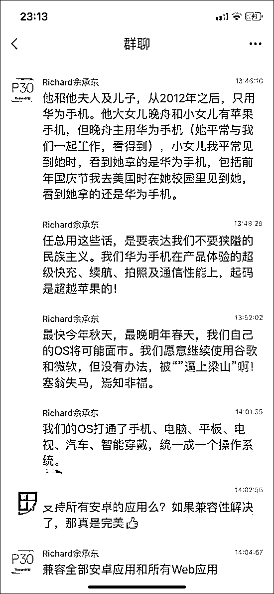

# 美国欲制裁更多中国企业，怎么看？

> 原文：[`mp.weixin.qq.com/s?__biz=MzU3NDc5Nzc0NQ==&mid=2247484652&idx=1&sn=3d49434da2f4187482210e1e6018f2d7&chksm=fd2da632ca5a2f24029c90a0a9c552e337db905ce52766e93305c2f6e3c8cd7dff7896db4ba5#rd`](http://mp.weixin.qq.com/s?__biz=MzU3NDc5Nzc0NQ==&mid=2247484652&idx=1&sn=3d49434da2f4187482210e1e6018f2d7&chksm=fd2da632ca5a2f24029c90a0a9c552e337db905ce52766e93305c2f6e3c8cd7dff7896db4ba5#rd)

有读者问我。

外媒说老美考虑对海康威视等监控企业也发起制裁，

什么微软企图下架华为电脑，以及中止 windows 授权，

还有台企担心老美打击报复等等。

问我怎么看。

其实我的答案就四个字：

洗洗睡吧。

天塌不下来，任正非的两万字回复用两个字解读就是：

淡定。

用两句话解读就是：

任凭风吹浪打，

胜似闲庭信步。

给大家看一张截图。

看到了吧。

任总手下的大将们，都很淡定。

这种淡定不仅仅是实力支撑，而是全世界的科技界，是一个共生共存的生态链。

说白了，科技界不是美国工会那套玩意。

这里面没有狭隘到谁赢谁输的问题。

资本，技术，运营，客户，他们之间的生态关系，是复杂的。

说白了，不是你单纯的理解，谁是谁的。

尤其当资本互相交叠，尤其当产业形成生态链之后。

今天的科技领域已经像一个花园，花园里谁也离不开谁。

没有鸟，树就没法传播种子，没有树，鸟就没有食物。

今天太晚了，不深聊，早点睡吧。

明天另一个号次条的原创文章里，我给大家解读任总的发言。