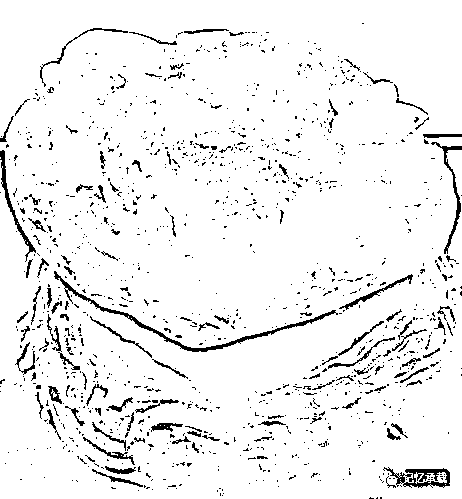

# 看不到希望的奋斗才是生活的真相

> 原文：[`mp.weixin.qq.com/s?__biz=MzU3NDc5Nzc0NQ==&mid=2247484454&idx=1&sn=5a5135eca447b57e44c88837bdc896d8&chksm=fd2da6f8ca5a2fee239196711b8f7ec59f20efbad8c45331d517800266dfd36a3520ee79090f#rd`](http://mp.weixin.qq.com/s?__biz=MzU3NDc5Nzc0NQ==&mid=2247484454&idx=1&sn=5a5135eca447b57e44c88837bdc896d8&chksm=fd2da6f8ca5a2fee239196711b8f7ec59f20efbad8c45331d517800266dfd36a3520ee79090f#rd)

我们今天来把所有的成功的要素分析一遍，看看里面的本质到底是些什么东西。

讲成功的书，无出易经之右，我们来看看易经是怎么讲成功学的？

一命

二运

三风水

四阴德

五读书

从上往下看，

什么是命？先天一出生自带的，叫命。

比如，王思聪的起点，比绝大部分人的终点还要高，这就是命。

什么是运？运就是后天里冥冥中不可琢磨的东西。

1988 年深圳做交换机的乡镇企业有 1000 家，你选择华为，他选择另一家，这就叫运。

2000 年互联网企业有很多家，你选择阿里巴巴，他选择阿里巴巴楼下的那一家，这也叫运。

什么是风水？风水就是舞台：

你也许非常优秀，什么都能搞定，但你只是一个小店主。

他也许没你那么优秀，但他的舞台很大，他是阿里巴巴的高层，所以，他的收入可能是你的十倍。

这，叫做舞台。

什么是阴德？阴德就是综合素质：

你永远不迟到，就会给别人留下自律的印象。

所有人都抱怨，你从不抱怨，就会给别人留下抗压的印象。

人家都提出问题，你每天解决问题，就给人留下靠谱的印象。

别人稍一努力发现没有回报就放弃，你坚持努力很多年从不气馁，就给人上进的印象。

这就叫综合素质，你的这些付出就会给你换来更多的机会，注意，仅仅是机会。

什么是读书？读书就是能力：

同一件事，他做不到，你能；

他要一月你只要一天，这就叫能力。

从上到下，每一层都比下面那层对成功的影响大出一个数量级。

什么叫量级？

西瓜就比芝麻大出一个量级。

我们来看看如果自下而上的打通关，轨迹是什么？

一个人，一直很努力的读书，考上名校进入名企 或者一个人很努力的打拼，做了一个小生意开了一个烧饼摊，这就是读书（能力）层面的努力。

但是如果你想混到管理层或者成为重要的业内人士，或者你想把你的烧饼摊变成胖子烧饼这样的区域内最火的一家店。

那综合素质也就是阴德要比能力更重要，因为同样优秀的人群里，人与人的能力是很难拉开太大的差距的，自律、抗压、靠谱、上进显然会成为重的多的筹码。

再往上呢？你想变成合伙人，或者把胖子烧饼做成连锁店。这就是舞台的力量，也就是风水。

你成为合伙人的那家公司是否会变成阿里巴巴，或者已经成为连锁店的胖子烧饼能否统一产业链，这要靠运气的帮助了。

你已经统一了产业链完成了垄断，不幸碰上行业整改。只能唱大不了重头再来。这，就是命。

实际上，命和运是完全无法左右的，而阴德和读书，是我们可以努力做到极致的。

那唯一的突破点就是风水了。或者叫环境，或者叫舞台，或者叫平台。

上一张图，啥叫风水？

这是一个鱼缸。一块天然的水晶，掏空了，可以灌上水，里面放只小金鱼，观赏它游动摆尾的样子。

给你放大点，看看金鱼。

这是一条玉雕的金鱼，活鱼没有，凑合着看吧。

我们来想象一下，假如它是条活鱼，它面临最大的问题是什么？

显然，就是这个缸。

缸限制了它的活动范围，如果它在湖里，就能在湖里游，如果它在海里，就能在海里游，如果它是只鸟，就可以在天上飞，如果它是外星人，更可以穿梭宇宙。

舞台有多大，你的活动范围或者说你取得的成就才可能有多大。

有没有人能够做出超越舞台的成就？你觉得一条缸里的鱼的活动范围能超过缸么？

今天流行的那些话题，无论是突破人生的玻璃天花板，还是教你如何突破阶层，其实种种，都是在讨论上三层的问题。

因为大家发现，芝麻里用功用到极致，也没有西瓜掉一点皮大。

但是，从上面的分析看得很清楚，上三层，不可捉摸，不可控制。

其实我们每个人都是缸中的鱼。

他命好一点，无非他生在海里，海还是个缸，大了一点而已。

他运好一点，无非主人把他从缸里放到池子里，池子还是个缸，大了一点而已。

如果他的阴德和读书配不上他的舞台，他游了一生都游不到边，或者他根本懒得游，这就叫纨绔子弟，实在太挫了，根本没机会遇到问题。

反之，只要他足够优秀和努力，把阴德和读书做到极致，人人都会遇到瓶颈，也就是面临游到缸边的问题，怎么解？

说个故事，曾经在职场里有个小姑娘问我，我觉得你那么悲观，却又那么积极，一面心里好像早已知道结局，一面行动上又比谁都积极。怎么这么矛盾？

其实小姑娘只能看到我的一个面，我比她看到的还要努力的多，也比她以为的还要绝望的多。

论语说，明知不可为而为之，说明那个正能量的鼻祖孔夫子，自己内心也是绝望的。

缸中的鱼，原本就只有两种选择，要么岁月静好、欣赏鱼缸；要么以头破壁，一次次撞壁，一次次撞的头破血流，一次次撞的头破血流，一次次撞壁。

运不来，没有外力的帮助，那只能用头一次次撞缸。要么缸破，要么它死。

有希望么？

看不到希望的奋斗才是生活的真相。

值么？

推荐一部日剧，大河剧，叫真田丸。

我小时候很喜欢丰臣秀吉这种有大气运加身的主角。后来反而很喜欢真田昌幸这样的 loser。

真田昌幸出生在一个被武田、上杉、北条三巨头环伺的小大名家。他父亲幸隆给他留下几万石封地，到他死，他们真田家也还是只有几万石封地而已。但就是这样一个失败的家族，昌幸被后世评为日本第一智将，他儿子幸村被后世评为日本第一兵。

真田丸就是讲他的一生。按说这么一个失败的人物有什么好看的呢？

好看就好看在他一生无命、无运、无风水。

400 多年后，一群像作者一样的外国 ID 们跑去日本九度山凭吊这位失败的老 ID。他自己的一生也被拍成了电视剧，硬是从一个 ID 混成了 IP。

谁说他失败了呢？

成功，只不过，迟到了 400 年，而已......