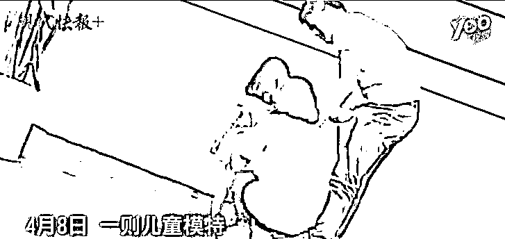

# 那些年薪百万的孩子们......

> 原文：[`mp.weixin.qq.com/s?__biz=MzU3NDc5Nzc0NQ==&mid=2247484364&idx=1&sn=622981428cd9f4b1e1c655f5a129b463&chksm=fd2da112ca5a2804cf2bddd18bea0201b3b6c54c56c946e609d878cf3fb7854deb4f15668cc1#rd`](http://mp.weixin.qq.com/s?__biz=MzU3NDc5Nzc0NQ==&mid=2247484364&idx=1&sn=622981428cd9f4b1e1c655f5a129b463&chksm=fd2da112ca5a2804cf2bddd18bea0201b3b6c54c56c946e609d878cf3fb7854deb4f15668cc1#rd)

很多人想听我聊最近挨打 3 岁童模的故事。

据说是这样的：

4 月 9 日，一位童模遭母亲脚踹的视频在网络热传。事后，女童母亲发声明称系教导动作稍大，并无虐童之意。

10 日下午，北京青年报记者从杭州市妇联了解到，关于该母亲是否存在家暴行为，目前市妇联正在进一步核实。

有媒体报道，被踹女孩名叫妞妞，是一名童模，当日正在给网店拍摄服装，而踹她的正是她的妈妈。

妞妞母亲告诉北青报记者，女儿今年 3 岁，当童模有半年时间。这个视频是当时在杭州给客户拍童装，妞妞在拍摄时不太听话一直在基地乱跑，她叫了几次妞妞也不听话，她便有些生气。

拍摄完毕后，妞妞的母亲和舅舅拿手机想再给女儿拍点照片，没想到孩子还是不听话，“我当时很累情绪有些失控，就做出了不好的行为。”

妞妞妈妈朋友圈封面是一张女儿的照片，下有文字介绍，“小妞妞 93cm，26 斤，24 码，欢迎各位金主约拍”。

根据报道，童模市场里，一个全职的童模，拍摄一年广告的收入大约在几十万到几百万之间。

配上这个挨打视频，网友们很生气，觉得这家人是在利用小孩子赚钱。

说实话，如果站在情绪上看，我是不爽的，因为我也是家长，这一点和网民的看法一致。

但是这事情里面的道理，其实非常复杂。

我们说从工作量上来看，模特是很累的，很多童模，拍照拍到晚上 12 点是常态。你要知道，这都是孩子，而且是幼稚园都不到孩子。

小孩是没有独立意识的，她都没办法约束自己的行为，甚至不知道自己在干嘛，是卖萌，还是表演可爱。

你要知道她的萌，是无意识的。而广告是有意识的，这就是可爱和卖可爱的区别。

这样的工作性质和工作量，对于这么低龄的幼儿，确实让人很不舒服。

但这个事情如果你往深里想，它很复杂。

这个复杂就体现在，同一份钱，对于不同的家庭来说，现在和未来的意义是不一样的。

比如有的家庭，你说每年多这几十万一百万的，并无改善，有它也就那样了，没它也就那样了。

那你让人家的孩子去做童模，人家肯定不乐意，因为没有吸引力。

但是，对有的家庭来说，挣钱是很艰难的。别说一百万，可能每年想挣几十万，都挣不到。

所谓的想挣，是说愿意加班，愿意出差，愿意夫妻分居，愿意让孩子成为留守儿童，什么都愿意的情况下，依旧没有这个机会呀。

我们如果站在前者家庭的角度看，显然做童模是荒唐的。

小小的孩子，应该快乐的成长，应该去娱乐和早教，然后按照正常的轨迹去发展。

可是，你忘了一件事，这一切都是要付费的。

没有哪个私立的幼稚园会对你的孩子免费开放，没有人会免费让你的孩子寓教于乐。

换句话说，快乐的成长，本身就是付费的，可是费用从哪儿来呢？

对于一个收入不咋地的家庭来说，当他们面对孩子可以做童模这个机会的时候。

他们也会有权衡。

这个权衡就体现在，究竟是牺牲当下，还是牺牲未来？

如果选择放弃这个机会，他们的孩子也许可以受到教育，但未必很好，将来长大了，赚钱也很艰难。

等几十年过去，这孩子长大了，也许会抱怨父母，为啥你们当年不狠狠心，让我小时候把这钱挣了，说不定长大了就做包租婆而不是快递员了。

如果选择接受这个机会，就意味着这孩子很小就要承担很多不该有的压力。

其实很多事情都会有这种两难的选择。

即使你的家庭不差钱，也不例外。

你孩子从小学钢琴，要不要受虐？你去问问朗朗，小时候，多可怜。

你孩子有希望成为奥运冠军，要不要受虐？你去看看那些被拉去集训的体育队员。

就是读书，打小头悬梁，锥刺股，也不是少数。

任何一条道路上，只要有竞争，只要有利益，都难免艰辛。

所以很多时候，很多事，读者问我，我没有标准答案。

因为你不在别人的处境里，你很难理解别人的选择。

当然，我并不是为这个母亲开脱，无论如何，那孩子那么小，你怎么能打人呢。

作为家长，自己挣不来钱，终究是自己的无能。

让孩子提前去为她的将来打拼，已然是一种不幸。那在这种不幸的选择上，如果缺少了爱，缺少了耐心，那真的是大不幸！

人生有很多东西，不可以再来。

你没钱的时候，会觉得钱是万能的。

可等这个孩子长大了，有钱了，也许母女俩都会发现，自己的一生，牺牲了太多本可以不牺牲的感情......