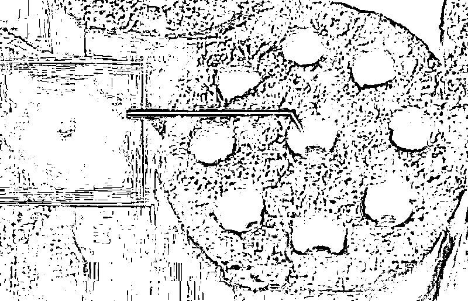

# 刚刚！人类第一次看到黑洞居然长这样！

> 原文：[`mp.weixin.qq.com/s?__biz=MzU3NDc5Nzc0NQ==&mid=2247484358&idx=1&sn=674905fb80151eb659e40060d527668d&chksm=fd2da118ca5a280e725fcec8f1009e61d1795c82fdf3efb8bbf441115db733694cd48c856678#rd`](http://mp.weixin.qq.com/s?__biz=MzU3NDc5Nzc0NQ==&mid=2247484358&idx=1&sn=674905fb80151eb659e40060d527668d&chksm=fd2da118ca5a280e725fcec8f1009e61d1795c82fdf3efb8bbf441115db733694cd48c856678#rd)

刚刚！我们有幸作为第一批人类，看到了黑洞的模样。

这都要感谢事件视界望远镜（EHT）的努力......

要知道，啥叫个黑洞？

就是连光线都能吸引进去......

本次拍摄到的黑洞位于星系 M87 中，质量相当于 65 亿个太阳。

你没看错，单位是亿。

这是一个由众多小黑洞合并而成的超级大黑洞。

牛哥怎么说来着？

质量越大，引力越大，所以 65 亿个太阳缩小成一个奇点，那它得有多大的引力啊。

幸亏有了（EHT）望远镜，要是普通一点，还真的拍不到它，要知道拍摄的原理就是利用光学。

而黑洞，连光都能吸引进去......

EHT 是一个望远镜阵列，所谓的阵列就是一个集群，它分布在全球各个地方，八个射电望远镜阵列组成一个堪比地球那么大直径的采光网络。

那得有多少照片啊......

2097152 这么多个 G 的照片......

最后，让我们看到的就是这张图。

话说，我怎么觉得它看起来很眼熟呢？

还真像啊，原来我小时候就见过了