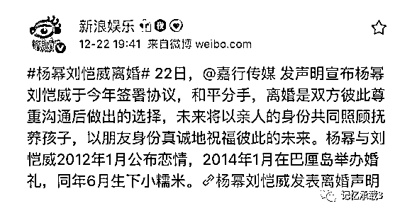
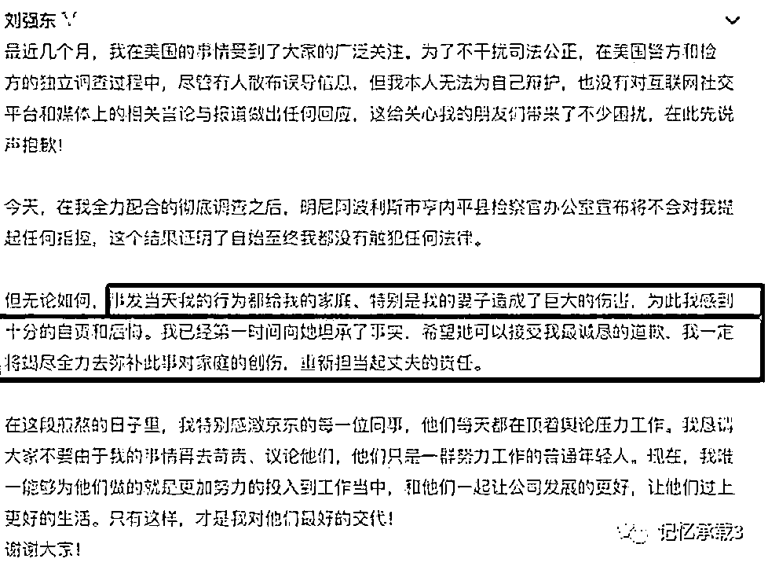

# 离婚的杨幂，秀"恩爱"的奶茶

> 原文：[`mp.weixin.qq.com/s?__biz=MzU3NDc5Nzc0NQ==&mid=2247483703&idx=1&sn=068a1f971c3411da22b1a2fef0febbff&chksm=fd2da3e9ca5a2aff339cbf77cc1c0793046dd127b230cf175cee2cc250e23ba4ad761663843a#rd`](http://mp.weixin.qq.com/s?__biz=MzU3NDc5Nzc0NQ==&mid=2247483703&idx=1&sn=068a1f971c3411da22b1a2fef0febbff&chksm=fd2da3e9ca5a2aff339cbf77cc1c0793046dd127b230cf175cee2cc250e23ba4ad761663843a#rd)

杨幂离婚了。

昨天，嘉行传媒发出声明，向所有人告知他们分手的消息。

在杨幂离婚的当口，东哥表示要回归家庭，做一个好男人。

当然，变成绿茶的奶茶表现的很大度，第一时间出来秀恩爱回应事件。

呵呵。

杨幂和刘恺威为啥离婚，我们不去八卦。

离婚不一定就都是痛苦的，正如同强行凑合在一起不一定就是幸福的。

当然，我们不是在影射抹茶妹妹，sorry，打错字了，奶茶妹妹。

**但离婚，确实是需要本钱的**，杨幂想离就离，这是一种能力。

人这一辈子，如果你想舒服，就一定得让命运把控在自己手里。

我不知道有多少人能听的懂这句话。

我不是在告诉你不要信任，你尽可以信任任何事。

比如有的人信任名气，我记得前奇葩说前几期傅首尔很开心的说，自己很成功。原因是因为她有个公众号，公众号里有很多粉丝。

转眼没过三集，那啥一纸令下，她的公众号烟消云散，同期消失的有上万个大 V。她在节目里说，她哭了好多天，这是她人生最大的打击......

比如有的人信任权力，其实你方唱罢我登场的那些故事就不聊了，我小时候就见过隔壁院子里文化局的局长在院子门口摆摊卖水果，因为 90 年代那个众所周知的原因，他失去了位置。

这样的故事我人到中年之后仍然见过无数回，所谓一朝那啥，一朝那啥，一个那啥一旦换了，下面连锁性的那啥和那啥，呵呵。

比如有的人信任财富，其实财富是个伪命题。你把它都换成流动性，它一定会贬值，按照每三十年贬值 97%的速度烟消云散。可你要不换成流动性，说白了，你就像换成了筹码。筹码还能不能换回流动性，它可不由你说了算，它由“赌场”说了算，“赌场”指什么，老读者自然懂。

这很正常，比如你去做生意。一个项目砸进去，你不知道消息面的，谁知道甲方给你的需求真的假的，真的你赚大了，假的，也许你就论成败，人生豪迈，大不了重头再来了。

有人看我们昨天大号里的文章：

[失信的 ofo，嗜血的啸虎，落寞的欧神](https://mp.weixin.qq.com/s?__biz=MzU0MjYwNDU2Mw==&mid=2247485439&idx=1&sn=67488dac34f6c1d0304077f4e92bbfd8&chksm=fb196b83cc6ee2950e8fa6b61fef887ec0a8737340b3bb367ec897fc24b2b43528e2ddbc9d9b&token=1283686236&lang=zh_CN&scene=21#wechat_redirect)

有疑惑。

有疑惑是正常的。我总不可能掰开手指头给你讲各种商业和金融市场里幕后的故事细节吧，这世上很多事情，本来就没法宣之于口，即便参与事件的当事人，平日里，也只是靠悟来领会很多事情。

**但凡做过事的人，但凡做成过事的人，都会明白事情不是那么好做的。**

我给你打个比方。

曹丕的出身够好了吧，曹操的儿子，长子曹昂死了，他就是长子。

曹丕够聪明够勤奋了吧，《典论》就是他写的，他与曹操，曹植在文学上，那是齐名的，一点水分不掺。

可你知道么？曹丕 17 岁就得了肺痨，得了却不敢医治。

为什么呢？怕父亲知道，曹操要知道他有这种病，还会传位给他么？

所以曹丕只活了 40 岁，这就是强行争储的代价。

可他有的选择么？他不这么做，他，和他的子孙，终将与大位无缘。

所以，我们并没有嘲笑抹茶妹妹的意思，不值得笑，每个人都有她不得已的一面。

有人可能觉得，曹丕是因为想要的太大了。我不要那么大呀，我只想财务自由，安安分分的过小日子。

但很多人忽视了一个问题。

你得到的大不大，与你的本金有关，与你付出的代价，未见的有关。

能听懂么？

你就算有曹丕的狠劲，你不是曹操的儿子，这事也轮不到你想。

我记得有本电视剧《你迟到的许多年》是黄晓明演的，在影射华为早期创业的故事。黄晓明和他带领的那些兵，都是丙等兵。就是工程兵。挖隧道的。

他们病了，拉肚子，不治疗，死撑着继续追进度，为啥？

因为对他们来说，没有别的选择，他们只有进度超越别人，不被部队裁，才不用回到那个贫苦的家乡去。

对他们来说，前途，比命重要。

他们要付出和曹丕一样大的代价，换的，也许只是一个继续当兵的机会而已。

同样的代价，结果不一样，是因为他们的起点太低了，本金太小了。

很多人问，有没有办法可以活的轻松一点，答案是真没有。

你要想身体轻松，你脑袋就没法轻松。

人想活的自在一点，凡事都任性，方法很简单，你手里拥有太多选择，你就可以很任性。

比如，你手持大量现金流，回报率还非常高，还不担风险。那你就不需要像上文中的商人们那样不得不押宝某些事，不得不去承担风险。

比如，......很多别的就不能聊了，打住。

那怎么才能让自己处于这种拥有大量的选择，拥有各种彼此对冲的筹码的优势位置呢？

其实，只有学习，只有思考。凡事你都先知道，凡事你都更高明，这就是趋吉避凶唯一的途径。

我们今天大号记忆承载就在聊金融市场里的思考，欢迎关注。

进入公众号首页，点击下方按钮，大号地址，立刻会弹出二维码，扫码可关注大号记忆承载。

或扫如下二维码可立即关注大号：记忆承载。

