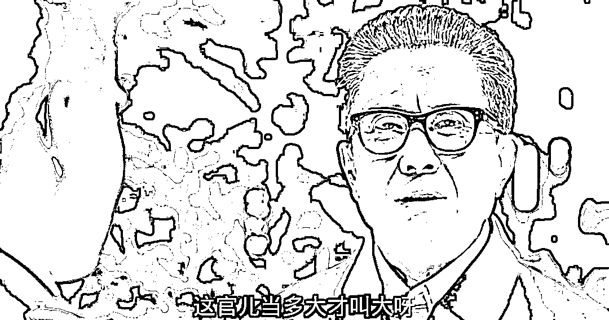

# 这官当多大才叫大，杭州要多厉害才叫杭州呢？

> 原文：[`mp.weixin.qq.com/s?__biz=MzU3NDc5Nzc0NQ==&mid=2247525661&idx=1&sn=c7c4d2e5499a1d82af6430e390de0530&chksm=fd2ec7c3ca594ed56da3a4f8207dc56da33ccb5b8cd56d3467a07b17d899d2a1e3ab65a44d7d#rd`](http://mp.weixin.qq.com/s?__biz=MzU3NDc5Nzc0NQ==&mid=2247525661&idx=1&sn=c7c4d2e5499a1d82af6430e390de0530&chksm=fd2ec7c3ca594ed56da3a4f8207dc56da33ccb5b8cd56d3467a07b17d899d2a1e3ab65a44d7d#rd)

咱们很少聊主流的话题，今天是个特殊的日子，杭州亚运会开幕式。

标题起得很拉风，内容会很平淡。 

因为平平淡淡才是真，用郭德纲的话说，牛 B 不是某一晚，而是每一晚。 

任何人，任何事，任何团体，包括城市，你要把时间拉长了看。 

大家这几年其实遇到过很多的挫折，包括今年年初，各路自媒体当时也都是预计报复性...... 

至少说明内心是热切的。 

我年初的态度比较平淡，俗称大家都很热切的时候，我有点冷。 

但是当大家都有些冷的时候，我想说的是，没必要，你放长了看，一切都在恢复，一切都在变好，而且会越来越好。

说穿了，我们一直在从好走向更好这件事，没有发生过变化。如果大家的心态能平和一点，目光能长远一点的话。

杭州在 20 多年前，其实就西湖那么丁点大的地方，包括所谓的西湖，当时都不是很干净，好像是淤泥拥堵，周边也很老旧。 

你去找一部老电影看看，就能穿越到那个年代，无非导游拿着小红旗，后面跟着一群游客，在西湖边转悠，等着坐船去看什么所谓的湖心岛，三潭映月。 

就这个样子的，和我笔下描述的大差不差。

当时你去上海，去南京路上转转，会发现杭州的那个武林门，所谓银泰，真就是个老旧商场，那个女装街，那个电子市场，也就那回事。 

反正你去过上海，看过高楼大厦就会觉得杭州顶多是个后花园，和苏州老旧的观前街，那些园林附近那一带，一样。 

一样老旧。 

但是你当时去下大阪，我们不说东京，我们就说日本的大阪，就是丰臣秀吉当年的都城，也是日本的第二大城市。 

你就会发现当年的上海被比下去了。

很正常，我们 20 多年前，上海对标的大约是大阪，但是这种对标，与其说是目标，不如说是自己人关起门来的想法。 

这个道理其实就像印度人关起门也说自己的孟买很牛 B 的，当然，如果你去过，就知道我啥意思。 

很正常，30 年前，我们和印度的人均 GDP 是一样的，说白了，往前推 30 年，我们就是印度。 

北京举办亚运会是 1990 年，别人不知道，反正我当时作为一个小学生是挺激动的。 

亚运会呀，居然能在我们国家办，一个字：牛，两个字：牛 B，五个字那就只能是牛掰格拉斯了。

后来北京举办了奥运会，广州也举办过亚运会，我们对亚运的关注就减少了。 

33 年之后，谁能想到，杭州，一个二线城市，居然也能举办亚运会了。如果你见过当年的杭州，你就会有刮目相看的感觉。

要知道，这些天男足踢球的地儿，黄龙体育中心，是 20 多年前刚盖起来的，最初那里就是荒地。

那里往西全是荒地，农田。 

拍非诚勿扰的西溪湿地，当年只是农民养甲鱼的池塘，再往西的所谓第三中心未来科技城，当年只是羊锅村，掏羊锅卖羊肉的地方。

而你今天见到的第二中心，拥江 CBD，亚运的主会场，城市界面，豪华的像迪拜一样的地方，当年只是滩涂，菜园子。

如果你让一个 20 年前同时去过大阪与杭州的人，今天再同时去下大阪与杭州，这种感觉，会非常鲜明。 

我并不是说杭州就已经迈入了什么，但是这个对比，这个 20 多年来的对比，是明摆着的。 

你去大阪会发现它还是那样，但是你去杭州，会发现，我靠，这是迪拜么？ 

当然，我不是说杭州全面超过大阪，这个还没有。 

杭州的城市 GDP 是超过大阪的，但是人均 GDP 远不及。 

可是，具体到收入，具体到生活质量，实际上是接近的。 

大阪的年轻人，刚毕业，最后到手的钱也就只有一个月 1 万多，一个年轻人在杭州，月收入想要赚到 1 万多，是概率不低的。 

大阪的生活成本很高，别说杭州，比深圳都高。 

有人会讲，大阪的房价比杭州便宜，这个是事实，但是你反过来看。一个城市的房价很低，也就意味着这个城市的人很难有资产性收入，他只能是靠打工赚钱。

杭州的房价比大阪高，对于想要入驻的外地年轻人来说，是不利的因素。但是对于本地拥有房产的人来说，这实际上是劳动以外的收入。

要知道，20 多年前，大阪人眼里，杭州人就是印度人。

所以如果今天一个连续二十多年没来过中国的大阪人到杭州看亚运会，他会惊掉下巴。

确实很厉害，你把时间拉长了看，相当牛。

这样厉害的城市，我们还有一打........，这一打上面还有北上广深四个一线城市。

当然，杭州属于强二线，也属于我们前十个城市里面比较拿得出手的，毕竟，南京这个强二线，广州这个一线城市都放开限购了，杭州还在扭扭捏捏。

强不强，身体很诚实。  

很多时候，为什么我们老觉得自己有问题，觉得自己这那那这的不好？ 

实际上是因为我们对自己有要求。

我儿子也经常和他妈抱怨，意思是说，无论我做到了什么，你都不会满意，你永远会有新的指标下达。 

每每听到他们母子吵架，我就想起职场，像极了。

其实你在公司里也是这样，无论你多快完成工作，总会有新的工作交给你。 

俗称永远有班加。 

这句话，我曾经听两个人说过，一个是 30 多岁的中年人，一个外企在国内某城市的公司 CEO，另一个是 50 多岁的外企在国内的大中华区总裁。 

前者说，仗是打不完的，后者说，这辈子也真奇怪，好像也不缺钱，但一辈子都被逼着跑。 

前者是在会议室里发了句牢骚；

后者是我送他上车的时候，无厘头来了句，那是十年前，当时他的司机还要连夜拉着他去另一个城市。

后者现在应该退休了，但是前者更忙了，升任某头部外企亚太区一把手了。

我不觉得这是一种抱怨。 

或者说，这两个人一生的选择都已经反映出了他们面对压力的态度。

很多时候，大家总是找出你的缺点，并不是鸡蛋里挑骨头，而是大家觉得，你有潜力，你还可以更好。 

或者说，你值得更好。 

就像雍正一年只休三天，其他时间都得面对来自各方的压力。

平心而论，过去的几十年里，杭州表现得很牛了，中国绝大多数城市相对于全世界，都变现得很牛了。

借用高育良的一句感慨：

同样，作为全球前一百的城市，杭州完全可以在今天这个特殊的日子里也感慨下，一个城市，要多牛，才算牛呢？

又或者直白点，厉害了，杭州。 

打了那么多年仗，也该荣光荣光，所以今天举办盛会。

我们祝福杭州，祝福这座城市亚运顺利，下回申请 2036 年的奥运，也祝福所有的城市，都申请亚运，乃至奥运。 

长长久久，城运昌隆。