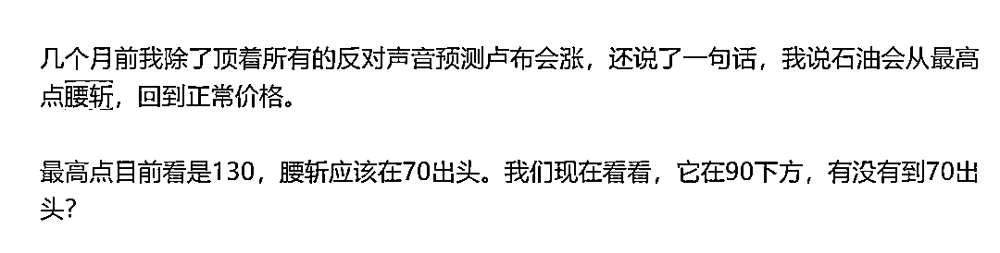
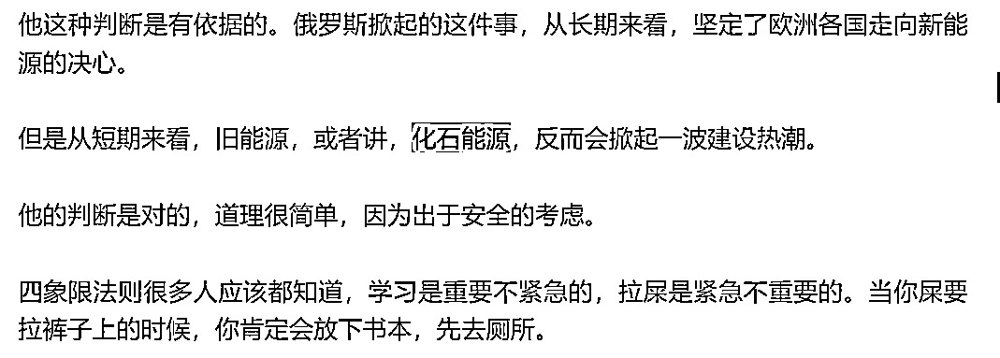

# 经济类话题，你一定要回顾我曾经说过什么

> 原文：[`mp.weixin.qq.com/s?__biz=MzU3NDc5Nzc0NQ==&mid=2247525043&idx=1&sn=0df4a4a052af7444d05126472d5b1c74&chksm=fd2ec06dca59497bba834e198f8e8e35110d54d274e6ebb820e242b8c5e973f8328050eb29b7#rd`](http://mp.weixin.qq.com/s?__biz=MzU3NDc5Nzc0NQ==&mid=2247525043&idx=1&sn=0df4a4a052af7444d05126472d5b1c74&chksm=fd2ec06dca59497bba834e198f8e8e35110d54d274e6ebb820e242b8c5e973f8328050eb29b7#rd)

今天是回答读者关于经济类话题的提问。 

经济类话题是长话题，长话题的意思是说，你得有足够的记忆力。

[我并不是说你要像上午我说的那样](http://mp.weixin.qq.com/s?__biz=MzU0MjYwNDU2Mw==&mid=2247511654&idx=1&sn=c08d4673eb7ff99081ddbd358c7b1e2c&chksm=fb1ac21acc6d4b0c18865d9fe77dc9a95b13171eee232dfd6caf424420607ef514e773c7b7cf&scene=21#wechat_redirect)，做个数字人，随时能够讲出来这个人十年前第一次和你见面的时候说过什么。 

但是一两年内的内容，你要能随时想起来。

这个能力没有，你只适合追热点，聊是非，顶多被启发一下思维方式，关注经济类话题是不现实的。 

今天我们聊两个问题，其实两个问题我全都回答过，只是时间太久，多数人都忘光了，我讲过的，又还给了我。 

**第一个问题是传统能源为什么没有被新能源彻底取代。**

读者问我为什么。 

[我在 22 年油价冲上 130 的时候讲过，我说油价会腰斩，会到 70 多](https://mp.weixin.qq.com/s?__biz=MzU0MjYwNDU2Mw==&mid=2247507270&idx=1&sn=86991ce6960bfc422f261d4dcd9b21de&chksm=fb1ab13acc6d382c426c60ee6a8b2410fc6ace0fe9b2bf9da678778b6ba095a9e3aa27036bf9&token=1371133455&lang=zh_CN&scene=21#wechat_redirect)。

你今天去看就是 70 多。但是，这不意味着传统能源行业要快速衰落，没这事儿。

[你去看 2022 年，我集中写俄乌战争时，](https://mp.weixin.qq.com/s?__biz=MzU0MjYwNDU2Mw==&mid=2247505599&idx=1&sn=5197598d00a7c3c37dbbccc172a243dc&chksm=fb1abac3cc6d33d53113229dff195185a9f1f15c4d18219d3b3261df636c237659993e5f9922&token=1371133455&lang=zh_CN&scene=21#wechat_redirect)多次提到传统能源行业，也就是化石能源与新能源之争。 

截取一段昔日的内容。 

我打的这个比方很通俗了。 

长期趋势看，新能源与传统化石能源是竞争关系，是取代关系。所以俄罗斯急于打能源牌，此时不打，等十年后大帝老了，时间窗口也不在他了。 

但是短期看，正因为这种新旧之争，反而会让传统能源行业迎来建设。这就是过去的一年你看到的行业现象。 

我一年前就聊过了，如果你还记得。

很显然，你不记得，如果经济类话题一定要等结束了再来问，或者忽然发现，原来都聊过的，那就没意义。 

经济类话题都有时效性的，又不是儒释道那种过了几千年读起来依然有用的。

经济类话题你早知道有价值，晚知道那信息含量就是零。

**第二个问题是美国的银行业。**

有读者问，为什么过去这么久了，也没有见美国再一次出现雷曼。

[这个话题我们也聊过，今年的 3 月。](https://mp.weixin.qq.com/s?__biz=MzU0MjYwNDU2Mw==&mid=2247510103&idx=2&sn=0da8eabb932eee38e6a244592b243352&chksm=fb1ac42bcc6d4d3daf675ae9d09b7f84e6e9f43adce69e3e9648431febec85db09598613c4ea&token=1371133455&lang=zh_CN&scene=21#wechat_redirect) 

有人讲我讽刺，我没讽刺。

你为什么不去看资产负债表呢？是你不知道要看，还是看不懂？

你不要听国内一堆自媒体瞎解读，他们当中很多人可能就是初中一毕业去工厂里拧螺丝，后来尝试做网红，红了。 

另外一些人可能是一毕业进了机关单位，啥能力都没有，领导也不看重，冷板凳熬不住，下海试图做网红，红了。

他们给你对比雷曼你就信？你为什么不看看他们的出身？ 

**红了只是一个人的传播力增强了很多，并不意味着他的见识会因此改变。** 

红了之后，此前是拧螺丝的还是拧螺丝的，此前是职场怨夫还是职场怨夫。 

我并没有讽刺谁，挖苦谁，我也没有说我就是对的。 

你可以不听我的结论，你有原始素材可以看的呀，我告诉你了呀。

美联储讲话公开的，美国的政府，企业，居民端的资产负债表都是公开的。

无论 08 年的数据还是今天的数据，随时供你调阅。 

我没有任何过人的见识，没有，我告诉你的都很朴实，类似于 1+1=2。 

你问我为什么年初国内一堆自媒体嚷嚷美国的银行要触发雷曼，嚷嚷美国要马上降息了。 

我不清楚他们的结论怎么来的，但是如果你有记忆，应该还记得我告诉你不会。

美国会维持利息高位很久，具体多久我不确定，反正看样子今年都这样，你可以等四季度看看明年会不会降息。

为什么会这样，我讲了一年多，通胀数据的变化，从供应链到服务费降不下来我都讲过。 

而美国的资产负债表，尤其是居民端的，没有到 08 年那种程度，也就是说他们还有能力维持利息高位。

这根本就不是什么神奇的内容，非常朴实无华，你泡在市场里天天都能看到。 

你说为什么你接受的信息和这些都对不上，那你要看看你成天都关注些啥人。 

有病了要去三甲医院，而不是找巫师。

你不能拿着一堆巫师的言论问医生，怎么解。 

医生根本看不懂。

我举这两个问题，重点不是问题本身，重点是，你有没有发现，在经济类问题上，伸手党其实是没有效果的。

因为经济类问题是个长周期问题。 

即便我一年前告诉你了，你能维持记忆多久？一周？还是两周？

一周之后你就不确定了，两周之后你甚至已经遗忘了。 

经济类问题往往牵扯决策问题，**决策问题从来都不是说我选择了一次，而是我选择了几千次。** 

你想一想，00 年加入阿里的那个人，他真的是只选择了一次吗？ 

当然不是。

入职的那天他选择了一次，此后每一天他都在选择，到底是留下，还是跳槽。 

这种选择从 00 年一直持续到 2014 年二次上市，中间每一年他都要选择 365 次，选择 14 个 365 次，闰年还要+1。

留下是这么多次相同选择的结果，而不是最初入职的那一次，这就是决策类问题。 

你毕竟不是和我生活在一起，我不可能每天都回答你一次，所以我的结论对你来说没多大用处。 

最多相当于 365 天里面某几天能够影响你的决策，此后，你一定会回归自己的原有体系。

所以我才说，你要升级，你的决策系统要升级，你的认知体系要升级，你要拒绝伸手党，你要学会像我一样，去阅读原始素材。 

等你变成一个医生的时候，你就会发现我只是你的一个交流渠道，有我的意见顶多作为参考，没我的意见，你也有自己的判断。 

这是对你有用的，因为决定你命运的，是你自己的每次选择，而不是偶尔从我这里听到了什么。