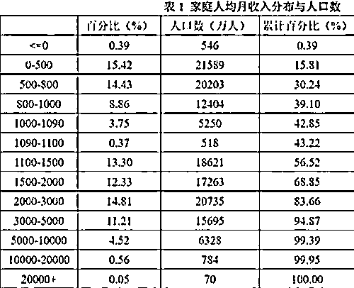

# 中金的数据，13 亿人月收入低于 5000？真的吗？

> 原文：[`mp.weixin.qq.com/s?__biz=MzU3NDc5Nzc0NQ==&mid=2247522424&idx=2&sn=3020828a9376f949f7d55f23a7d5452b&chksm=fd2e3aa6ca59b3b06f786ef51a7c7c703a0b491e92f53571f4bcbb7f9163e9ed73a4169079e7#rd`](http://mp.weixin.qq.com/s?__biz=MzU3NDc5Nzc0NQ==&mid=2247522424&idx=2&sn=3020828a9376f949f7d55f23a7d5452b&chksm=fd2e3aa6ca59b3b06f786ef51a7c7c703a0b491e92f53571f4bcbb7f9163e9ed73a4169079e7#rd)

有人问我一则数据，网传是中金披露的，说国内 95%以上的人月收入都低于 5000，也就是说，有 13 亿人月收入不足 5000。

我想起来一则疫情前的人均收入分析报告。

这是 2019 年的。家庭人均，据说得出月收入大于 2 万的人，全国只有 70 万。

难以置信。 

所以对于疫情后的这次数据，我也表示怀疑。 

我之所以觉得这些数据都没啥参考价值，是因为中国人的收入本来就是个传奇。 

你说你们公司楼下卖煎饼的那位，他的收入到底多少钱呢？ 

他的收入到底多少钱，只有他知道，因为你买煎饼的时候，基本都是支付宝或者微信扫码。 

再比如广州那个卖鸭腿饭的老板，有 7 栋楼在收租。

但是 7 栋楼到底收了多少租，是正的还是负的，就是一笔糊涂账。 

过去很多企业主是公私不分的，也就是说，公司账上的钱和自己个人名下的钱，是一笔糊涂账。 

你比如有的老板给自己一个月就开 3000 块，以至于十多年前，二胎还要罚款的时代，人家超生按照家庭收入三倍罚，也只有几万块。 

但是他可以把自己所有的消费都走公司账目，甚至买房也可以。甚至有时候直接支取。 

那年月我们管得真的不严，你可以拿着一麻袋现金去买房。这种故事在煤老板还是个传奇的年代，是很常见的。 

煤老板开着车，后备箱里都是现金，随便扫货。 

存钱超过一定额度，要你填写收入来源是今年才开始的。那之前都是一笔糊涂账。

因为那时候，也管不过来。

人一多，人际交往是呈指数增长的。十几亿人产生的连接，可不是美国几亿人的几倍，而是几十倍。这是我们发展互联网的优势，也是我们统计学上的难题。 

而且美国这个国家，光律师费就占了 GDP 的 1/20，我们这个比例微乎其微，可以认为不存在。 

咱们做律师的朋友们要努力了，你们的行业存在感太低。 

一方面因为弄清楚数据的人手不足，另一方面也因为我们的人数太多，交集太大，想要弄清楚也很难。 

所以所谓的统计中国人收入，本来就是一门玄学。 

你把中国人的收入统计的很高，大家发现自己被平均了，不相信。你把中国人的收入统计的很低，你说过去的这一二十年那些房子是谁买走的？ 

所以我一直觉得，统计中国人的收入是没有意义的。 

你不需要观察中国人挣了多少钱，你要观察中国人花了多少钱。 

我们的消费数据相比于收入，更容易统计，因为我们是一个网购大国。

线上消费非常多，而且线下消费往往也以无线移动网络支付为主。 

这就使得每个人的消费数据实际上是很准确的，因为一个人全年的现金消费占比，可能连一成都没有。 

消费能统计出来，负债也能。毕竟借钱大都是通过银行，有记录可查。 

现在买房子也不允许你拎着几麻袋现金了，所以大头基本上都能算出来。 

知道消费数据，知道负债情况，知道存款，知道个人名下的住宅市值，其实一个人，一个家庭大致的财务状况，是可以判断的。 

我是指毛估估，也就是给群体画像。

具体到个人是不准的，因为我们有很多民间的抵押，民间的债务，但是总体画像肯定是准的。

这个原理叫做肉烂烂在锅里。

民间的这种债务无论三角也好四角也罢，一般来说都不牵涉国外，张三欠李四钱，李四欠王五钱，王五欠张三钱。总的来说，是没有改变群体画像的。 

我们国家在这一块，正在投入精力。 

这件事很重要，意义也很深远，远比很多网民想的那点作用大得多。 

你观察下身边的情况，就会发现粗放式的投资建设效率很低，效果很差。 

有些地方综合体起来了，高档的商铺入驻了，结果生意冷清，没多久店铺纷纷倒闭转租。

最初为什么这么规划？因为误以为有钱人很多，误以为消费能力足够。

这就是数据不准确带来的。 

还有很多，是根本没有数据。

一个地区之前没有综合体，建了一个，火得不行。眼看人家挣到了钱，以为这就是参考数据，于是一股脑建了八个，结果一个都火不起来。 

这个就是粗放式的投资。 

这还不是最粗放的，最粗放的是 90 年代那波人，就像许半夏指着一片村民的滩涂盐碱地硬着头皮说这就是未来的维多利亚港。 

那时候你可以这样做的前提是起点太低，做什么都会成，无非大成与小成。 

就像深圳也是第一批，汕头也是第一批。深圳不用说了，大起，那汕头再起不来，也总比 80 年代初强多了。 

到了照猫画虎，到了跟风的时期，其实已经不算粗放了，比许半夏那批人细致多了。 

问题是，存量大了，起点高了，这种不是粗放的，也还是粗放。

说到底，当下这会儿，你只有特别特别精耕细作，才有可能打上来粮食。 

怎么精耕细作？ 

三军未动，粮草先行。弄清楚国人的消费潜力，就是决策大军的粮草。 

如果数据都不准，你把某个地区人们潜在的消费能力想得太低了，就错过了发展的机会；反过来，你把人们潜在的消费能力想得太高了，最后就是一笔烂账，债务堆积。

80 年代初期，交点学费无所谓，因为起点太低，你亏几十万，后面很快就因为高速发展把之前的账填平了。 

雷东宝作为支书，他怎么打都能赢，小雷村无非走弯路与走直路的区别，因为那个年代，顶天了亏几十万上百万了不起。

后来不是这样，今天城市土地贵得多，开发成本贵得多，稍有失误就是几百亿，上千亿的坏账。 

你站在自己的盘子的视角也应该明白粗放投资，野蛮生长是行不通的。

很明显，我们有短板。如果把国看成一个家，我们现在要弄清楚的就是每个家庭成员的消费潜力。

这很重要，尤其在 2023 年这个以消费为主体的年份。