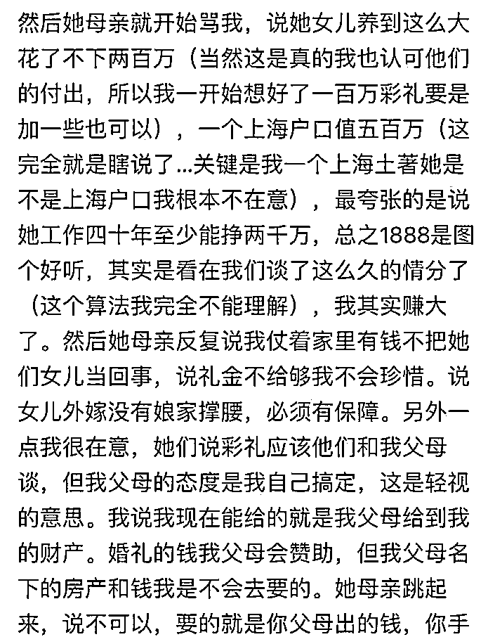
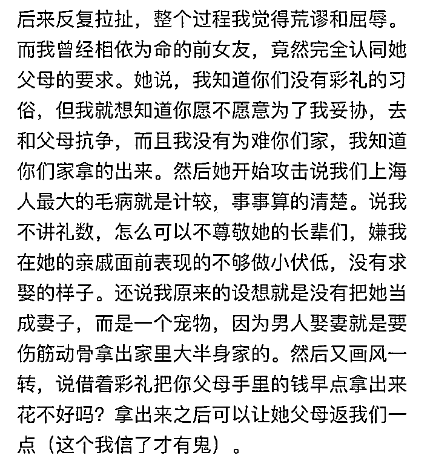

# 一千八百八十八、万的彩礼，只是个忽悠富老头没成功的案例

> 原文：[`mp.weixin.qq.com/s?__biz=MzU3NDc5Nzc0NQ==&mid=2247522198&idx=1&sn=1280a7b472f4eebef6f75e61477cdb5d&chksm=fd2e3548ca59bc5edd6016968971dcd60993e6a63aaae498a606e1d069fbe8972c2ab924578e#rd`](http://mp.weixin.qq.com/s?__biz=MzU3NDc5Nzc0NQ==&mid=2247522198&idx=1&sn=1280a7b472f4eebef6f75e61477cdb5d&chksm=fd2e3548ca59bc5edd6016968971dcd60993e6a63aaae498a606e1d069fbe8972c2ab924578e#rd)

有人说，上海的这位富二代，以一人之力，把江西黑惨了。 

原因是网络传闻，江西本来就以彩礼高而出名，大家都听说过高，不知道有多高。 

有一对留学生，在美国相识，男生来自上海，女生来自江西。经过对男方家庭的了解，男生的父亲是富商，母亲是高管。 

于是女方家庭开价，彩礼 1888 万，4500 万的原来在男生名下的全款婚房过户到女方名下，本地再买一套几百万的房子给女方，再加女方家庭上百个亲戚，每人十万的改口费。机票头等舱加某个著名酒店的全程往返观礼。钻戒首饰不计，每生一个孩子奖励 1000 万现金外加 2000 万房产。 

上面这些加起来不止一个小目标了。 

男方父母从头到尾没有吱声，而这个男生本人表示谈崩了，把对方的要求发在网络上，一夜爆火。 

很快就有人出来说，江西省的平均彩礼在 30 万附近，这种上亿的要求，是个案。 

但是网络上关于地域黑的讨论并没有就此平息。

首先这个段子我个人觉得可信度很低，原因很多，我不赘述了。因为没意义。

网民来问我，又不是考据的，他们实际上想知道的是，假如是真的，我怎么看。

假如是真的，我的看法是，网友们被带偏了。

彩礼多少是双方自愿的，她要价 1000 亿也是她的自由，你可以不给，是你的自由。

这里面不存在对了错了，或者地域黑。 

[就像今天上午我们聊罗永浩](http://mp.weixin.qq.com/s?__biz=MzU0MjYwNDU2Mw==&mid=2247509368&idx=1&sn=b2248f672c8bc6f220c558825b4faa9e&chksm=fb1ac904cc6d401209ce2ecb24f9fa65d7336a2b715db7b83c51e9a4e14716677191650bb9f3&scene=21#wechat_redirect)，罗永浩忽悠投资人说他是乔帮主转世灵童，他是东半球手机未来做的最好的创业者。 

你说他有没有错？没有。 

他可以那么说，你可以不投的呀。 

这东西本身就是一种策略，销售策略有两种模式，一种是细水长流，另一种是三年不开张，开张吃三年。 

我曾经聊过忽悠富老头的这种模式。 

这种模式下的创业者根本就没有想过要赚卖货的钱，他的利润来源不是进出产品之间的差价，而是投资人本身。 

这种创业者想要的就是我给你编一个高增长的神话故事，让投资人入局，然后我出局，套牢你。 

这是不是一种商业模式呢？是，而且广泛存在。 

我们好几年前就兴起了新消费的浪潮，所谓新消费到底是一种什么消费模式？ 

其实就是一种消费资方的模式。 

创业者建立一个奶茶品牌，咖啡品牌，冷饮品牌亦或者糕点品牌，然后定价高端，到处返补贴，拼命抢占市场。 

他们实际上是赔本的，因为钱都拿去做宣传了，他真正要维持的并不是利润率，而是扩张速度。 

扩张速度快，资本市场才会相信你的故事。 

当然，大家都知道这个游戏有天然的桎梏。互联网巨头做平台的当年可以这么做，可以烧钱走量的本质是因为他们的成本和服务客户之间不成正比关系。 

互联网平台服务 1 万个客户的成本是 1 千，服务 1 亿的客户的成本只有 1 万，远低于线性增长下的 1000 万。

这就是互联网巨头搞补贴抢市场的底气所在，就像一份操作系统，成本取决于研发，卖给 1 万个人和卖给 1 亿人，成本差不了多少。 

可是卖咖啡不是这样，每一杯咖啡的原料，制作，包装，店铺，人工，水电，物流的成本都是单算的。

但是没关系呀，资本市场信就可以了，快进快出就可以了。总有可以忽悠到的富老头。 

所以这种模式一定是存在的。 

**但是你要注意，这种模式只适合什么？只适合光脚的创业者。**

老罗之所以被盯上了，就是因为他现在已经穿鞋了。他当年一直是光脚的，一直是只赔钱从不赚钱的，所以他可以尽可能的耍流氓，想怎么忽悠怎么忽悠。

一旦他赚钱了，一旦他有钱了，一旦他穿鞋了，对不起。你就变成猎物了。

你想想看，那什么咖啡，在华尔街，是怎么被做空机构狙击的？

没上市前你拿这一套去忽悠富老头无所谓，一旦上市了，一旦圈到钱了，就会有专门的做空机构来盯着你。 

人家派人去你的门店收集买咖啡的小票，收集证据，就为了从你口中把你忽悠来的钱，再抢走。

这是动物世界，这是个生态链。**螳螂捕蝉黄雀在后。**

所以忽悠了富老头的钱，完成了圈地的这些打着所谓新消费旗号的商家，要做的事情是艰难转型。 

成功标准你要去参考无印良品，优衣库这种走性价比模式的日系品牌。当然，在国内你不觉得他们性价比高，那是因为两国的收入差距。我们的人均收入比日本低很多。而人家的产品定价是日本平移过来的。 

在日本国内，无印良品和优衣库就是日本境内消费水准下的性价比的代名词。

说穿了消费者手里的钱就那么多，你想要跟消费者过日子，你只能指望好的性价比，而不是忽悠。 

你忽悠不了消费者的，尤其是 2020 年，你知道的，那什么云的一次错误言论，包括那种忽悠年轻人负债去维持被割韭菜的那种高消费的模式被打断之后。 

这条路更走不通。 

已经忽悠到富老头第一笔钱，已经圈了地，自己又没法套现离开的这些新消费商家，能做的就是转型。 

而转型的路就是我前面说的，你最后还是要过日子的，性价比。

因为这时候你已经穿鞋了，你没办法再像光脚时那样想干嘛干嘛了。 

那么对于还光着脚的创业者来说，他们当中，当然有可能有很多人就是像年轻时的老罗一样，能怎么吹怎么吹。 

这就是我前面说的，三年不开张，开张吃三年。 

你觉得这个姑娘狮子大开口，那是她没成，她要是谈成了呢？她的目的就达到了呀。

她的策略就像企业招投标时的产品报价，报价 1 个亿，人家是等着你还价的。说不定你还价 1000 万，人家也签了。

人家就不是冲富二代去的，人家是等着富二代背后的富老头还价的。

从头到尾只有这个富二代傻乎乎的以为自己在谈恋爱，其实双方父母包括这个姑娘都清楚，没他什么事儿。

对话看明白了吧？都是明白人，包括这个富二代背后的富老头，只有他自己一个人脑子拎不清。 

人家姑娘家是创业团队，想要和真正的资方谈，真正的资方，富老头夫妻根本就不接腔，那就意味着不存在漫天要价和就地还钱的过程。

对于这个姑娘来说，下家没还价就拒了，拒了就拒了呗。她还会去找下一个下家的。

忽悠的本质和卖古董一回事，都说这是天底下独一号，全世界没有第二个的绝品。你愿意接，就接，不愿意接，人家还会找下家。 

你不要觉得别人都是来和你过日子的，就像你不要觉得进了店铺的门，人家都是卖性价比的。 

**你不要太一厢情愿了。**

这个世界上本来就存在着很多商业模式，就像上午说的，早期投资老罗的人，也未必是信老罗不会骗自己。 

他们想的可能是老罗既然有本事骗自己，就有本事带着自己一起骗别人。

或者看着老罗这么鸡贼的一个人，早晚会发财，到时候自己威胁威胁老罗，说不定也是条赚钱的路子。 

这大概才是老罗早期投资人心里的小九九。