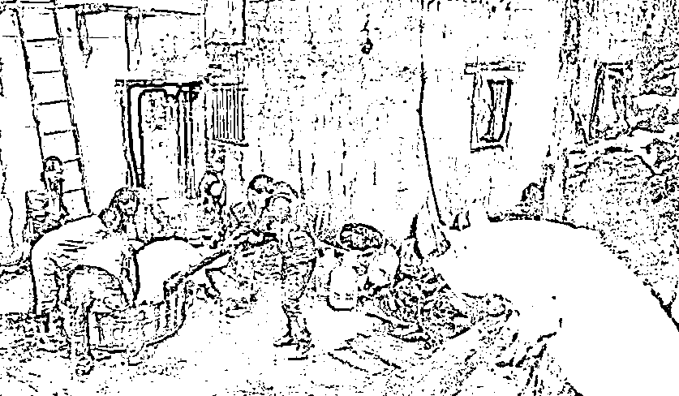

# 朋友圈基本都阳了，好像只剩下我待在原地不知所措

> 原文：[`mp.weixin.qq.com/s?__biz=MzU3NDc5Nzc0NQ==&mid=2247521910&idx=1&sn=79f203bbbfaf3a73896492020af1678f&chksm=fd2e34a8ca59bdbe1b82113b472d43bca082e273af668c123c5df87b13806d9caa4ff5a50d60#rd`](http://mp.weixin.qq.com/s?__biz=MzU3NDc5Nzc0NQ==&mid=2247521910&idx=1&sn=79f203bbbfaf3a73896492020af1678f&chksm=fd2e34a8ca59bdbe1b82113b472d43bca082e273af668c123c5df87b13806d9caa4ff5a50d60#rd)

有人一直问，问我咋还不阳，[你看阳播这个词儿都是咱们第一个发明的](https://mp.weixin.qq.com/s?__biz=MzU0MjYwNDU2Mw==&mid=2247509062&idx=2&sn=f71abdd965204d3dc36d8fe0d540c081&chksm=fb1ac83acc6d412cf3b2fb2181199f7c429b89ba7bc23a6da7af760f4cabe163ec6faa7f0a74&token=344398488&lang=zh_CN&scene=21#wechat_redirect)。 

自从我提示这条发财路径之后， 很多大 V 都阳了，没阳的，上赶着各种亲密接触，为了赶上这波流量，也一定要阳，一定要及时的给粉丝朋友们分享自己的成功渡劫经验。 

你没有听错， 阳好像已经成为某种修仙秘籍，你必须渡过劫，才能位列仙班。 

于是我就很尴尬，按说咱们虽然不是职业自媒体，作为业余自媒体，始终拿不出阳的经验给大家分享，确实有些落后分子的感觉。

我个人的态度大家是清楚，就十个字，不要惧怕阳，不要主动阳。 

实际上，在我看来，只有一种人需要先阳，就是领导。所谓让领导先阳，让一部分人先阳起来，先阳带动后阳，先阳指导后阳。

为什么这么说，实际上是为了工作需要。 

你比如我孩子读书的学校，校长是最先阳的；我居住小区所在的社区，社区的管理一把手也是先阳的；包括我所在的区，听说区领导也是最先一波阳的。

他们也谈不上故意，但是据说，都是在月初的时候，就不做自我保护了，然后到处见人。 

为什么这么做，实际上是工作需要。 

你仔细想想，就比如收官的那部剧，咱们聊过的，胡歌的那部剧。胡歌作为一个县的一把手，如果他不阳，大家为了保护他，就会缩手缩脚。 

你想，如果校长第一个阳，大家都还没阳，校长休息三天也不影响工作。等大家阳了，校长好了，校长就可以做顶梁柱。 

反过来，如果大家陆续阳了，校长就很尴尬。一方面学校里老师人数不够，压力大，自己再阳，更加难以运行；另一方面，那些阳了的老师，你让人家怎么做？是接触自己？还是不接触自己？不接触自己，怎么汇报工作？接触自己，别人也会觉得是不是自己把领导传染阳的，难免尴尬。

所以我猜，我见到的身边的和生活有关的三波领导，校领导，社区领导，区领导，也许就是有意主动阳的。 

这套逻辑，放到企业里也是一样的，作为 CEO，执行团队一把手，你也可以主动阳，早阳早回归工作。 

但是对于不在上述之列的，实际上没必要。你阳不阳的，也不影响什么。

当然了，晚阳这个事情怎么说呢，会有一种很奇怪的感觉。 

我现在就是这种感觉，每天看着朋友圈一群人刷阳，好像一个个都飞升了，都位列仙班了，只剩下我还留在下界继续为妖。 

主动阳呢？没必要。我不是上述人群，我是做投资的，我随时停工，并不会影响别人的开工。顶多公众号停更几天。

可是人都有从众心理，谁都难免。看着朋友圈里的人一个个阳，难免也会胡思乱想，我啥时候阳？我到底啥时候阳？ 

有时候我无意识的就被朋友圈里的人带了节奏。 

你比如朋友圈里成天有人讲，要多喝水，不是抱着瓶子猛灌那种，是相当于可乐罐，每天 5，6 罐。

错开喝，两个小时一罐。注意，不是喝可乐，是喝水。过一会儿喝点水，过一会儿喝点水，不断地补充水分。

这个水，有人是加了乌梅，有人是加了陈皮，有人是加了柠檬，为了有味道，也为了润喉，或者补充维 C。

除了这个之外，每天补充维 C，喝牛奶，吃高蛋白的食物，就不用说了。 

我也是这么干的，但是某一天，我忽然想起来，他们是在发烧期间，可我没有发烧。 

人发烧的时候不断地补充水分很正常，因为这就是最好的退烧药。 

发烧本身不可怕，发烧是你的免疫细胞在驱逐病毒细胞，但是发烧的同时会带来你身体水分的蒸发，就像你被加热了，你被架在火上考，水分蒸发了。 

水分流失之后，你的某些器官的核心温度会进一步上升，这个过程就像你煮东西，水被煮干了，现在干烧锅，就很危险。

既然你不能干烧锅，要及时往锅里补水，那么同样的道理，发烧的时候你也要不断地给身体注入水分，而且最好是盐水。

就是为了让身体保持水分充足，平衡电解质，不至于干烧，最后出现危险。

但我现在没发烧。 

我只是不由自主的被那些发烧的人，带偏了生活习惯。 

按照很多小阳人分享的经验，第一阶段是发烧，第二阶段是身体痛，第三阶段是喉咙痛。 

我没有发烧，但是每天看到朋友圈里这么多人说自己发烧，我也会觉得自己身体发热。 

然后量一量体温，发现正常，再量一量体温，还是正常。

同样，每天听到这么多人分享自己身体痛，我也觉得自己身体痛，觉得自己颈椎痛。

不过仔细想想，可能是被太多人的紧张情绪带动，脖子僵硬导致的颈椎痛。 

还有，听到这么多人说自己喉咙痛，像吞刀片一样，我也难免咽口水。 

这个过程怎么说呢，就像一只猪，它趴在墙根上，看杀猪。 

杀猪嗷嗷叫，虽然刀没有落在这个趴墙根的猪身上，可它难免感同身受，觉得好像每一刀都落在自己身上。 

趴在墙根上看久了，自己没挨刀，也有一种心惊肉跳的感觉。 

这是一种精神折磨。 

什么时候会好呢？我想，大约只有两种情况，一种是我终于阳了，和那些渡劫飞升位列仙班的大多数一样，一颗石头落了地；另一种是自始至终我都没阳，可是这事儿的热度已经彻底过去了。

至少吧，大面上过去了。 

就像即便还有其他亚株那样类似日本的第七波冲击，第八波冲击，但是从总体上，大家已经不觉得这是一件能够吸引这么多人目光的事儿了。

到那个阶段，无论我是阳了还是没阳，心情都会平复下来。不会有现在这种待宰的猪的感觉。

很遗憾，作为落后分子，没有能够给正在阳的读者们分享经验。但是，我个人的这种煎熬心理，想必那些未阳待阳的读者们，也都正在经历。 

权当我对这部分人，分享了经验吧。