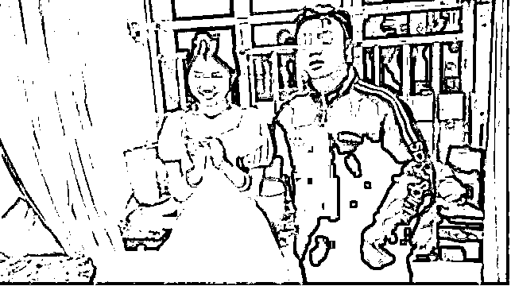
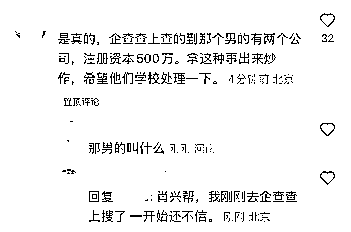

# 怎么看社科院女研究生休学嫁给 tony 哥？

> 原文：[`mp.weixin.qq.com/s?__biz=MzU3NDc5Nzc0NQ==&mid=2247520422&idx=2&sn=ce18eedc26839e80b31c86820f648328&chksm=fd2e3278ca59bb6e9058b4361f6139fe999776dc0997fe9a31d0da53be42082ccad4de5fd23b#rd`](http://mp.weixin.qq.com/s?__biz=MzU3NDc5Nzc0NQ==&mid=2247520422&idx=2&sn=ce18eedc26839e80b31c86820f648328&chksm=fd2e3278ca59bb6e9058b4361f6139fe999776dc0997fe9a31d0da53be42082ccad4de5fd23b#rd)

有人问我怎么看图中这位女研究生，嫁给 tony 哥，还为他生子，为他休学。

这个姑娘是 00 后，少数民族，出生在贫困山区，她是社科院的研究生。本来是一个非常励志的故事。

没有得到网友们的祝福，反而被骂上了热搜。

原因是什么呢？是因为她嫁给了一个理发师，在老家开店，中专毕业，她怀孕了，准备休学，在家安心生产。

她发布这个消息，本意是希望得到网友们的祝福，结果遭到了无止境的谩骂。

骂她的理由是什么呢？是说，你怎么可以放弃大好的前途，嫁给一个居然只有中专毕业的男人，而且是个 tony 老师，你难道不知道，他配不上你么？

我们都希望你成为一个居里夫人那样的女科学家，结果，就这，就这？

读者问我怎么看网友们的评论，我的观点很简单，这一届网民闲的蛋疼，吃饱了撑的。

真的是吃饱了撑的，你要是有功夫，为什么不操心操心自己？

这个月的工资有着落了吗？失业的有重新找份工吗？房租交了吗？水电呢？......

我越发觉得自己之所以比大多数网民都混得好，是一个必然。因为我年轻的时候，从来不操这份心。

你比如东京奥运会的冠军，杨倩，发博客，展示自己吃吃喝喝逛街的日常，结果被骂上热搜。

大家骂她的理由是，你不是冠军吗？冠军难道不应该是天天挥汗如雨地待在训练场上吗？

你怎么能逛街呢？你怎么能享受生活呢？

[就像咱们今天大号记忆承载的推送，我本意是赞扬这位令人敬佩的县长。](http://mp.weixin.qq.com/s?__biz=MzU0MjYwNDU2Mw==&mid=2247507842&idx=1&sn=0359bc7e8f4d050a4e7aaa0b35085c4f&chksm=fb1ab3fecc6d3ae839cb46da417080eb1f6013bdd043527b8e9db3f804231d48d6b0b2f5ccbb&scene=21#wechat_redirect) 

结果很多人留言，跟我说，他看到的今天的这些人，怎么就没有人能够为了工作，把自己饿到腿上一按一个坑，比如只能吃咸菜就馒头，渴了就一口自来水呢？

这才是他心目中的科学家呀，如果连这点清心寡欲你都做不到，你怎么好意思说自己是科学家呢？

诸如此类，要求种种。

怎么说呢，两个字，幼稚。

改变自己的是神，指望别人为了你改变的，是神经病。

人家科学家要不要吃馒头就咸菜和你有什么关系？人家又没有吃你们家的馒头。

就像一个奥运冠军逛街，人家逛的是街，又不是逛你家。如果你不服气，你完全可以拿一个奥运冠军，把人家比下去，你来当冠军，你不逛街，让人去当亚军。

你可以的呀，没有人拦着你。

我曾经说过一万次这话，我说人世间最容易的就是读书，我就没有见过比这更容易的事情。

如果你不满意于清华北大的学生没有变成你心目中的科学家，你完全可以去自己读清华北大，自己来当你心目中的科学家。

这个真的很容易，太容易了，你这么能，你就应该自己去做到，而不是总指望着有人为你做到。

下面这句话我也说过一万次，一个人的见识是根据你自己的阅历提升的。

你这辈子一个清华北大的都不认识，你就会活在幻想中，你满脑子充满了对那个世界的幻想。

你以为别人是什么样的。

我从业以来，面过的人里面，绝大部分都是 C9 的，没有什么神奇的。因为整个行业里充满了 985。

别说今天这个年代，我年轻那会儿，我第二家公司里，70%的人都毕业于 TOP5。我第一家公司里，连前台收快递的漂亮小姑娘都是 985 的本科，211 的硕士。

那个年代就已经是这样了。

没有谁成为你想象中的科学家，都是打工仔。有什么问题呢？时代变了呀，受教育的人多了呀。

你以为是胡适那个年代，留个学回来就是大师了吗？怎么可能。

我告诉你，藤校毕业的，在那些开得起钱的公司里，给人画 PPT，把一根线粗了细了调半天，正常的很。

你不想做这份工作有的是你的校友愿意做。这就是事实，不是只有我们这里是这样，全世界都这样。

你以为沃顿商学院出来的就能进华尔街？想什么呢。

沃顿商学院里面特别优秀，而且有背景的，才能进华尔街，进去了也未必是让你做交易员，能做分析师不错了。更有背的，就是成天写材料，把一根线调粗一些调细一些。

连讲材料都轮不到你，如果你长得不漂亮。

沃顿商学院里面不那么优秀的，都去教书了。口才好，运气好，像郎咸平那样混成名人的凤毛麟角。混不下去的，甚至最后像美剧里老白那样不得志的，有什么稀奇的？

美国的人才比例比我们还高，受过高等教育的人的比例比我们还高。

**清醒地认识到世界的全貌，你的预期就正常了。** 

我们来看这个女研究生，社科院的，她执意要嫁的这个 tony 老师，她是这么说的：

你觉得她头脑发昏，被恋爱魔怔了？

来，我们来看看她这位中专毕业的，所谓配不上她的 tony 老公。

还有什么话说？她老公光已知的两家公司注册资本就 500 万了。

你社科院毕业，你去纸媒报社待两年，你看看付了房租之后剩下的钱，够不够你吃饭。

文科类本来就不好找工作，哪儿毕业的都一样。人是要吃饭的。

你觉得那些顶级名校毕业的，挤破头皮去画 PPT，每天把线调粗一点调细一点是浪费人才？

知道人家刚毕业第一年月薪拿多少？拿 5 万，第二年 7 万。are you OK？用雷军的话说，你还好么？

不要这么幼稚，大家都是要吃饭的。

你没有读过研究生不了解行情，人家是在读的还不了解吗。人家问问师兄师姐就清楚自己毕业后一年大概能挣多少钱了。

现在有个年入百万或者几百万以上的男人摆在你面前，为什么不嫁呢？

这是恋爱脑么？这是人家想得很清楚好吗？

那个男的也想得很清楚，他想要娶一个高学历的女生，有利于后代的教育。这个女的也想得很清楚，她很清楚自己可不可能变成居里夫人？

当然不可能。

你太幼稚了，你根本就不明白一个人要成为居里夫人需要哪些条件。

需要很多很多条件，很多都是先天的，这根本就不是说只要你想要，只要你努力，就能够做到的。

我为什么一直建议读者改变自己先，就因为这个。

你努力努力就清楚，考一个清北之类的学校，太简单了；或者毕业后被提拔到一个年薪百万的岗位，太简单了。

这种事简单的跟个一一样。

可是，接下来，你马上就会明白网友们描述的那些，或者期待中的那些，比登天都难，比一个凡人要修炼成仙都难。

你知道为什么大神啃窝头吃咸菜淡泊名利？

因为人家已经封神了，人到了那个层面，他看到的世界和绝大多数人已经不一样了。

而我描述的那些，通过自己的努力，考一个类似清北，或者拿一个年薪百万的人，他们正因为奋斗过，所以才理解自己和神的距离，遥不可及。

真要是啃窝头就能成居里夫人，打明儿起，窝头能卖出金子价。

问题是能吗？

人只有努力奋斗过，才知道自己不行。这个姑娘非但不应该被网暴，她反而应该被祝福。

因为她真的奋斗过，她能够走出大山，能够有一份靓丽的学历，还能够收获一个有经济基础的老公，夫妻之间还能互补。很完美了。这就是奋斗能够达到的地方。

不要总是指责别人为什么没有通过奋斗成神，你要好好想想，为啥自己活这么大岁数，连个妖都没成呢？