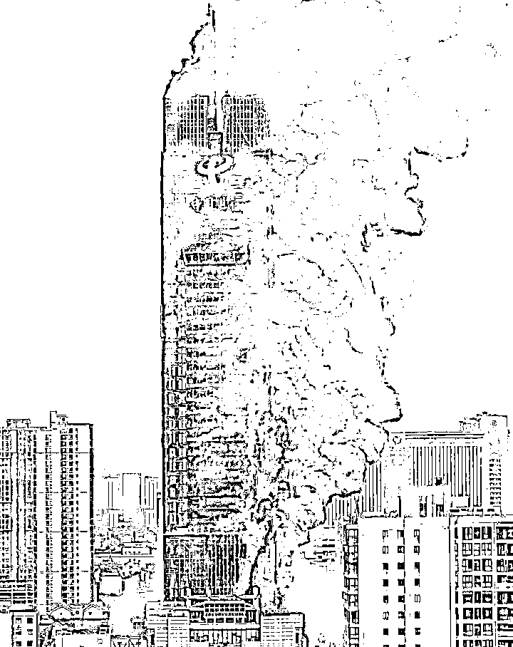

# 长沙电信大楼起火，值得考虑的不是火灾而是买房

> 原文：[`mp.weixin.qq.com/s?__biz=MzU3NDc5Nzc0NQ==&mid=2247520390&idx=2&sn=4b7aaf51ab41adca8c1212b7ae3d851e&chksm=fd2e3258ca59bb4e5b2e022f1bd8718e16c865830b3148fe0c4e34394bf65d7d726fd004081d#rd`](http://mp.weixin.qq.com/s?__biz=MzU3NDc5Nzc0NQ==&mid=2247520390&idx=2&sn=4b7aaf51ab41adca8c1212b7ae3d851e&chksm=fd2e3258ca59bb4e5b2e022f1bd8718e16c865830b3148fe0c4e34394bf65d7d726fd004081d#rd)

这是一张长沙电信大楼发生火灾的图，我还看到了一个视频，朋友圈里传的。一个在火灾现场的人，从办公室里面拍到的外面起火的视频。

大家都还蛮关注，关注的是他自己有没有逃出来。

后来看到湖南电信的通告，应该说是所有人都跑出来了。

很多人都在聊，遇到这种情况下，怎么逃生？

我反倒觉得，一般来说，这么高的建筑物起火，要是没事儿，你不作，总能随着大部队一起撤离到安全的地方，无论是撤出大楼，还是撤到避难层。

换句话说，真的遇到重大的灾难，你指望大家都逃不出来，只有你例外，这本身不太可能。

我记得有一年，印尼海啸，李连杰一手举着 4 岁的女儿，一手划水，也几乎丧命。

那时候我还年轻，都很好奇，怎么能够？

传说中的黄飞鸿黄师傅，不是可以腾空而起，无影脚连续踢几十下么？

他都能抱起十三姨，难道不能跑着一个小孩子水上漂？

现在回头想想看，电影都是扯淡的。人类面对灾难最靠谱的方式不是去解决它，而是去规避它。

确切地说，是尽可能地规避它。

你说电信大楼起火，有没有办法？没有。这是上班的地方，无论你是在电信工作，还是在拜访客户，一旦遇到起火，那就是命背。

可是有一件事情我们是能够避免的，那就是自己尽量不要住在超高层建筑内。

现在有很多地方的住宅楼，动辄盖到 5，60 层。如果你住在顶层或者接近顶层，要面对的，不仅仅是火灾的危险。

我们首先想一个问题，你住得高，风景好是自然的，可是你下楼用的时间，也会比较长。

这个道理很简单，你住在一楼，跨出门，就等于离开了这栋楼，你住在五十楼，跨出门只是到了楼道里，从楼道，要坐电梯，下到一楼，这是额外叠加的时间。

电梯涉及两个问题，第一个是与住户的配比，到底多少户共享一台电梯。

我们假设这栋楼 60 层，10 户人共享一部电梯，他们的使用时间是不是错开的？

云平台你比如云游戏，利用的就是这个概念。

平台方说他们卖给你一台虚拟的云端的游戏机，你以为你是独享机房立一台机器？怎么可能。

其实他们同时卖给了 10 个人。他们在赌什么？赌你们 10 个人不会同时上线玩游戏。

如果你们同时上线，那就只能调用资源池里的备用设备，如果这个也到了上限，那么后来者，就登录不进去。

这是云端。

电梯有云端技术吗？没有。电梯只能等，一旦 10 户人家，几十个人同时在早高峰或者晚高峰阶段用这部电梯，那么等待的时间会很长。

此其一。

这就够了吗？你等到电梯门打开，就足够了吗？不，这只是刚开始。电梯还涉及第二个问题。

那就是在上下楼的过程中，电梯要像公交车一样，把到站的用户，逐个放出去。

在当年没有高铁的时代，你有没有发现那种慢车与快车最大的区别是什么？

并不是时速上的，那时候火车技术就那样，开的速度是差不多的。可是中途停靠的站点，是不一样的。

慢车要停靠很多站，像公交一样，快车有时候是直达的，像出租车一样。

换句话说，出租车并非有闯红灯的权力，它不见得开得能比公交快，问题是，它中途不停呀。这就是为啥公交车动辄要花费出租车双倍的时间。

电梯就像公交车，你的楼层越高，也就意味着中途要经历的停靠越多。人家都到站了，你没到嘛，你是终点站。

把这两个点考虑进去，你会发现超高层，特别窝心。下楼不容易，上楼也不容易。出门不容易，回家也不容易。

如果出门和回家都不容易，人们往往会选择什么？会选择减少出门与回家的次数。

也就是说，你的居住体验变差了。

我们再来想第二个问题。

你去拿一根长长的竹竿，细竹竿，立在地上摇动它的底部，发现什么？

发现底部晃动的幅度与顶部晃动的幅度是完全不同的。

底部可能微抖，顶部已经是四处摇摆了。

对于摩天大楼也是一样的，不需要地震，可能仅仅是台风，都能让你有摇晃的感觉。

当然我相信安全是没有问题的，人类在摩天大楼的建设上已经积累了足够的经验，有的摩天大楼中间还有一个洞，里面有个巨大的摆锤，飓风刮过，通过它内部的摇摆，来降低大楼的晃动。

但问题是，作为居住者，你随风摆动，心不慌么？

第三个问题，我们假设的这一切都是新的，才只有上面这些问题。如果几十年后，你的楼旧了，就不止这些问题了。

电梯是需要定期维修的，行驶速度越快的电梯，安全等级要求就越高，定期检查的频率就越高。

为什么？因为更容易出现问题。

可是我们前面分析过，高楼的电梯就像公交车，本来已经够慢了，如果行驶速度再下降，你能忍么？

所以电梯老化，电梯更换，都是问题。这些都会在未来，影响到你的居住体验。

你注意，我说的这一切，都是大楼绝对安全的前提下。如果施工没有达到设计标准，比如设计标准 50 年，实际上施工只达到了 30 年，那么第 30 年，你住还是不住？

把这些问题都考虑进去之后，我认为，摩天大楼的顶层或者次顶层是不适合普通人居住的。

你说作为办公楼，那事儿没办法。有时候市中心很密集是因为交流的需要，但是作为居住，我说的难听点，你叫个外卖都不一定有人愿意给你送。

你自己想嘛，某某大楼 60 层，你让人家送外卖的等多久电梯？

一般来说，摩天大楼的顶层，次顶层，都是超大户型，卖点是无敌景观。销售对象是豪宅客户。

他们都是有专门电梯的，直达的。可能一层甚至两层都是他一户人家的，自己有自己的电梯，不会和外人共用。

他住顶层是为了风景好，私密性。真的有火灾，也许人家还有楼顶的直升机停机坪，坐上飞机就走了。

可是作为普通人，买普通住宅的，要尽量避开这些。

就像我们大多数城市的别墅区，都在荒郊野岭，或者说相对的荒郊野岭。

这是土地限制，本来就不允许富人在核心地带浪费土地。

摩天大楼的顶层，次顶层，是同样的道理。

说穿了，鸡肋本来就是卖给富人的，因为他足够有钱的时候，他可以解决一切问题。可是如果你没有那么有钱，你也把鸡肋买回来，那就真的是食之无肉，弃之卖不出去了。