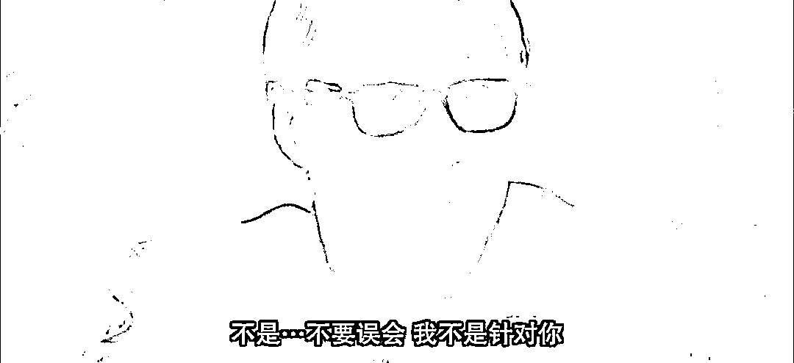

# 你可以不说话，说，就要说真话

> 原文：[`mp.weixin.qq.com/s?__biz=MzU3NDc5Nzc0NQ==&mid=2247519947&idx=1&sn=b2b80af65442dcfcecba541334e08c8b&chksm=fd2e2c15ca59a5039555f5775dc40b2e4d0000b901f2d341c73c357d610e4b8b199403531231#rd`](http://mp.weixin.qq.com/s?__biz=MzU3NDc5Nzc0NQ==&mid=2247519947&idx=1&sn=b2b80af65442dcfcecba541334e08c8b&chksm=fd2e2c15ca59a5039555f5775dc40b2e4d0000b901f2d341c73c357d610e4b8b199403531231#rd)

有人问我怎么看某些大 V，例如什么，什么的被暂时关了禁闭。

我不想揪着这一点去谈，我想延伸到因为此事触发的网络的方方面面。 

这两天某些公知很开心，开心的理由就是，你看，他们的反对意见者，正在面壁思过。 

网友们为此也吵得不可开交。所以我这里才会有人问起这个话题，问我怎么看。 

还记得当年，因为 FF 网络上也吵得不可开交，读者来问我，我第一句话是什么？ 

就是周星驰电影《破坏之王》里面断水流大师兄出场的时候，他的台词。

在学校举行的会议里，他怎么说的？他说请不要误会，他不是针对谁，他是说在座的诸位都是....... 

这句话很没有礼貌，但这是心里话。 

我当初说，双方都在吵情绪，没有一个人愿意分析事实，或者说，也许他们双方都没有能力分析事实。 

当年我表达的很清楚，我并不反对 FF 说话，包括胡说，但是，我很反对在那个特殊的节点下胡说，没有依据的所谓来自某个朋友的胡说。 

为什么？因为当时的特殊节点下，她那些不负责任的言论，会给我们的出口企业带来巨大的困难。

造谣一张嘴，辟谣跑断腿。这个世界不是只有媒体一个行业，想清楚。绝大部分人都是靠企业吃饭的。

曾经有人说，没有比说话更重要的权力，我不认同，我认为没有比吃饭更重要的。

人没有饭吃是没有力气讲话的，所以说话一定是排在吃饭后面的，这是一个基本的道理。 

这是我当年对 FF 不满的绝大部分原因。和辩论中的双方其实是不一样的，虽然看起来，好像我站了某一方。

回到今天这个话题，我对双方的态度，和断水流大师兄没有区别。 

虽然从立场上讲，我站在公知的对立面，可是从内容本身来讲，我并不认同你们提到的什么文，什么木的。 

我曾经多次写文反驳过这些人，是因为有读者转发他们的文章来问我。

我记得每次反驳的时候，我都把立场与内容拆开了。首先，从立场上讲，我几乎每次都认同他们的结论。

但是，他们的论证过程，简直是乱写。

而与此同时，我反驳公知类的文章更多，就不列举了。 

为什么双方我都在反驳？

就是因为我觉得这个网络太浮躁了，大多数人只看结论，只看情绪，你完全不关心那些细节，那些事实，或者说，可能网民的整体水平还够不上看得懂细节。 

可是这个世界是由细节组成的，是由事实组成的。

换句话说，**你到底是要看那两方的大 V 用煽动情绪给你勾画出的一个他们迎合你们想象的世界，还是要看一个真实存在的世界呢？**

你就比如围绕俄乌战争这件事，他们双方，展开过多次的辩论。可是那些辩论，你剥开它的皮，看看核心是什么？ 

核心就是情绪，你喜欢谁？你厌恶谁？你支持谁？你反对谁？

可这是一场球赛吗？不是啊。 

明明是一个政治，经济，军事的专业话题，最后愣是被那双方扯成一场球赛了，还面红耳赤的，就差打起来。 

我们回忆下我聊过的俄乌战争。这事儿我们聊了有大半年了，分很多个阶段。

第一阶段，我说这事儿是美国挑起的，原因是为了扰乱全球，尤其是扰乱欧洲地缘安全格局，为了增加避险情绪，使得欧洲资金流入美国。

我这番话说完，几个月内，市场的确是这么走的对吧？ 

第二阶段，我说这不是热战，这是能源战。与欧洲的新能源规划有关，俄罗斯在时间窗口的压力下，必须打出旧能源卡欧洲脖子的这张牌。否则十年后，就过期了。 

所以战争打得越久赚得越多，卢布会坚挺，油价可以卖得更高。 

我这番话说完，市场的确是这么走的对吧？甚至连战争都是这么走的。

我讲过的每句话，你都是可以自己查阅论证。很简单，翻出我的历史文章，找到相关话题最早一篇，列个 excel 表，最左边是我的看法，最右边你可以调出当时的市场各个品种的走势图。 

你去按照时间索引对比下，看看我有没有虚言。

第三阶段，我说俄乌这事儿到底怎么个收场法，或者说能不能收场，取决于拜登，不取决于俄乌。

我也说过，那个什么乌克兰的司机，他只是棋盘上的棋子，美国捧他是用得上他，一旦用不上，舆论马上就会反水。

后来我们看到了，事情就是这样发展的。如果拜登有希望连任，我相信他会想办法结束这场战争，让油价回归正常。 

问题是，他没有。后面我们都看到了，懂王王者归来，他这会儿在美国的声望，简直跟张角已经没有区别了。尤其是在被抄家之后，就差变身耶稣了。

在这种情况下，拜登想要通过降油价这么点功绩挽回支持率，别说门没有，窗户都没有。 

所以前段时间，连着几次聊到油价的时候，我都告诉你，下面有支撑。 

为什么？因为战争无意结束。美国的那些军火商他们还要卖武器赚钱的呀。 

这一点在年初俄乌开局我就告诉你了，你别把事情想得那么天真。你真以为人家打的是仗？ 

人家打的也许是发票。

你说钱呢？打掉了，乌克兰买了很多先进的，昂贵的武器，然后都打掉了。 

发票在这里，给报吧。 

你确定真的是先进的？也许就是陈年库存，反正打掉了，票据在这里，你给报吧。

人要成熟一点，别那么幼稚。 

拜登他总得讨好一方吧，如果有希望讨好选民，得罪美国的军火商也许是划算的，如果没希望呢？ 

所以我一开始就给你讲，各取所取。 

美联储需要避险情绪，拜登本人需要考虑自己的未来，军火商忙着卖武器，乌克兰的司机在演戏，而俄罗斯，巴不得能源始终维持在高位。

这是真实的世界，一切都会反映在盘面上。 

你今天去看那个什么司机，国内公知嘴里的乌克兰的这了那了，你不要信。你自己去外网上转转，看看司机在欧美舆论场里最近的风评。 

180 度大转弯。

为什么？被抛弃了呀。懂王上台会待见他么？不会的，懂王是个彻底的商人，他很怕花冤枉钱。 

睡王待见他么？也不会。反正已经没法挽回选民了，还要他干啥。 

这就叫实事求是的态度。你可以不讲话，但是你说，就要说真话。

这个真话，是要有事实依据的。否则那不是真话，那只是你自己的情绪，或者说，你把自己的情绪想象成了真话。

八个月前，他们双方因为美国的经济也曾经吵得不可开交。我的观点是什么？你去翻看历史文章。 

当时我说得很清楚，我说大概率美国将于明年后步入衰退。

为什么我当时这么看？因为大机构持仓显示，去年年底，做空美国的就已经大幅度增加了。 

这份国际市场上各大机构的持仓报告，在我说完话几个月后，由高盛向市场免费披露了。又过了俩月，逐渐成了市场的共识。 

你回到那个节点，就会看出我与他们双方本质上是不一样的。你们在讲情绪，我在讲依据。

所以我说，不仅要说真话，而且要说有依据的真话。[这就是昨天上午强调的那四个字：实事求是。](http://mp.weixin.qq.com/s?__biz=MzU0MjYwNDU2Mw==&mid=2247507393&idx=1&sn=9c8cc43f9d2f3cd537ef34c7419fd57b&chksm=fb1ab1bdcc6d38ab936224c34f1b1426903d9ba31008ae0b747f14af6666c941d104d322dd8e&scene=21#wechat_redirect)

昨天上午举的那个例子，《麓山之歌》。我为啥特别反感里面那个总经理？

因为我自己用人的过程中，最讨厌没用的人。

我只喜欢一种人，就是像侯勇演的那个，能做事，而且能做到。

一个没用的人，无论你是拍马屁的，还是唱反调的，在我看来，都是不挣钱的。没有哪个私企老板能够忍受一个不挣钱的人天天在自己眼皮子底下上蹿下跳。

只要你是个实打实能做事，能解决问题的，你不需要拍马屁，我来拍你的马屁，我可以半夜三更给你去买炒面。 

反过来讲，如果你没用，你只是在那里撩拨情绪，无论是阿谀谄媚，还是邀直卖忠，依我看，都应该是精减名单上的人。