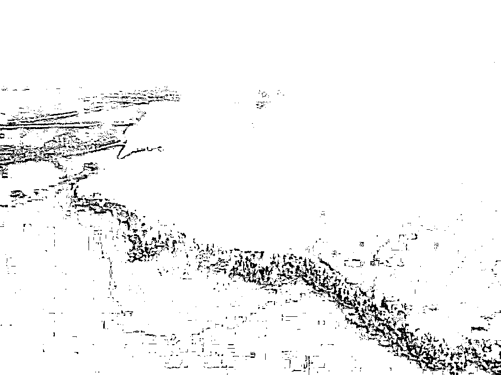
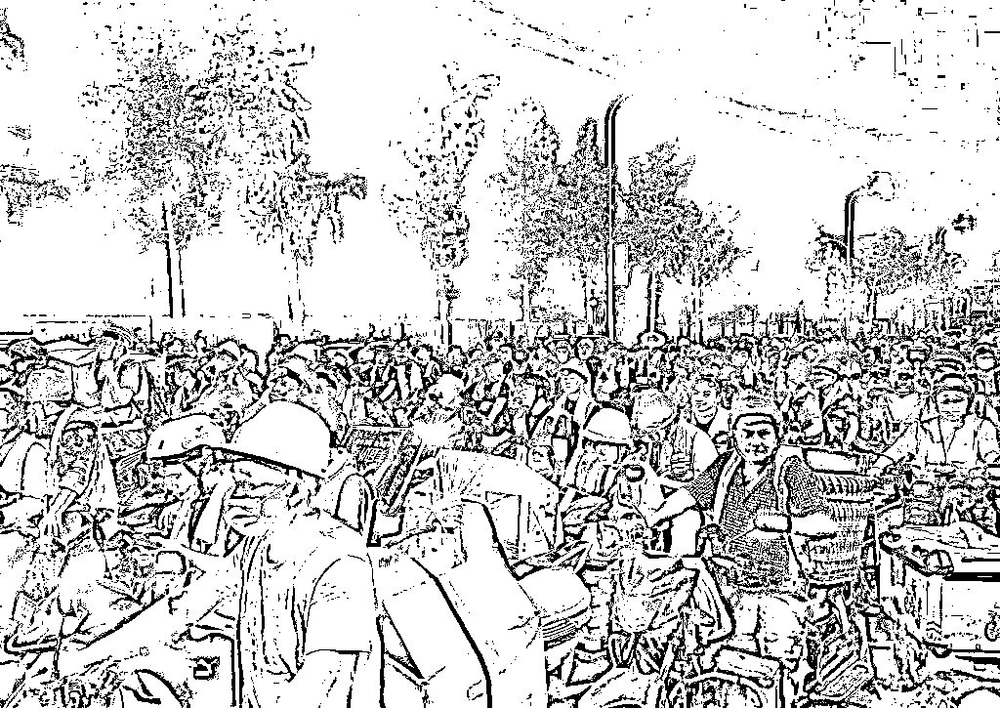
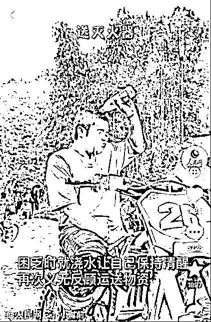
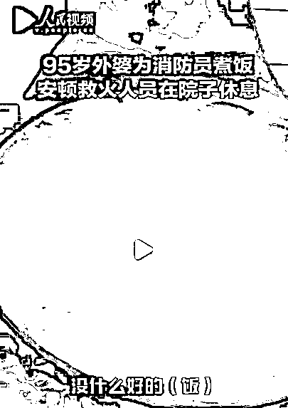

# 群众里面有好人，群众里面有坏人

> 原文：[`mp.weixin.qq.com/s?__biz=MzU3NDc5Nzc0NQ==&mid=2247519940&idx=1&sn=ddcb6ca19201359725036fff319caa10&chksm=fd2e2c1aca59a50c93f204313f176c81577e3f017279edfb0fabd0fcff2987a21daa7944dad8#rd`](http://mp.weixin.qq.com/s?__biz=MzU3NDc5Nzc0NQ==&mid=2247519940&idx=1&sn=ddcb6ca19201359725036fff319caa10&chksm=fd2e2c1aca59a50c93f204313f176c81577e3f017279edfb0fabd0fcff2987a21daa7944dad8#rd)

我一直想要跟读者讲，贴标签是愚蠢的。 

那是人类在幼崽时期，为了迎合脑容量的限制，不得不做的一种简化思维方式。你去看动画片拍的都很简单，为什么那么简单？就是因为观众的大脑正处在启蒙状态，你复杂了，他就宕机了。

但是我很难找到一种合适的表达方式让读者直观的感受到这种贴标签的思维模式的漏洞，或者说对你成长的阻碍。 

很巧，连续两天来了两条热搜，单独看，一个会让你气到想骂人，另一个会感动到你流泪。 

你去看单独任何一条热搜，都会有很多大 V 在煽情，或者说鼓动你的情绪。他们在反复强调，我的天呐，人怎么能这么坏，或者说，人怎么能这么好。 

单独看没有任何问题，合起来你马上就会意识到，贴标签是个问题。 

我们先来看第一个消息。 

最近有这么一则报道，武汉有一个 90 后的姑娘，投入上百万，其中大部分是贷款，承包上千亩土地，在种什么呢？种南瓜。 

但是遇到了小偷，团伙的小偷。这批小偷是大爷大妈。他们组团来偷，当着田主面，也偷，或者说得干脆点，就是明抢。 

那么报警有没有用呢？很难。毕竟南瓜的价值太低了，一个人偷走几个甚至十几个南瓜是够不上多大罪行的。 

你顶多说对方违反了治安管理条例，那么如果对方超过了 70 岁，你想行政拘留都很难，只能批评教育两句完事儿。 

遇到个狠角色，人家倒地不起，赖上你了，那更麻烦。

一个大爷大妈不是多大事儿，一群大爷大妈专逮着这个姑娘偷，她就面临破产。 

无奈之下，她想了一个办法，拍视频，网络曝光这些人的行为，希望他们要点脸，有所收敛。 

结果没想到遭来了报复，这群大爷大妈把偷不走的南瓜或者说还没有成熟的，通通踩踏，砍断，烂在地里。

这下子，姑娘欲哭无泪，濒临破产而且背负了很大的债务。

网友看了很生气，觉得没天理了，还有没有人来治这帮人。 

他们纷纷留言，说在瓜田里打含有剧毒的农药，或者埋通电的线路，等等。 

我告诉你，这是不懂法的行为。 

如果你在田里打符合标准的，国家允许使用的，低烈度，对人体几乎无害的农药，你要立牌子，警告，打过农药，切勿采摘。 

如果是这样，牌子立的够多，农药烈度够低，别人偷了去，吃了拉肚子，与你无关。

反过来讲，如果你立的牌子不够多，或者，你打烈度很高的，足以影响吃瓜人生命安全的农药。

那么你是摆脱不了刑事责任的。

明白我的意思吗？法律上不允许你用下毒的方式驱赶小偷。那样一旦出了事，你的责任恐怕就不是上百万的事儿了。 

所以我非常理解，也同情这个姑娘的遭遇，她真是蛮绝望的。面对人性之恶。 

我们来看第二个热搜，重庆的山火。

重庆，高温，大家都知道，停电，此前都聊过，现在又面临着山火。 

那么面对这样的山火，云南的救火队紧急驰援，那是全国最专业的扑灭森林山火的队伍。 

当专业队伍来到重庆之后，当地人是怎么给予支持的呢？ 

就是下面这张图： 

重庆的志愿者组成了强大的后勤，以摩托车的形式在保障整件事情当中的人，设备，水，食物，药品等等的运输。

这些人当中有年轻人：

这是个摩托车骑手，玩越野摩托那种，他把自己心爱的车子都给骑废了，因为在几十个小时内，顶着 40 多度的高温，连续多次往山上送物资。 

也有老人，有个 95 岁的老人深夜还在为救火人员煮稀饭。 

更多的就不提了。众志成城，涌现了非常多可歌可泣的故事，一点也不亚于两年前疫情下人们的自发自觉。 

这两条消息当中单独一条拎出来，无非让你哭让你笑。可是对比一下，就是我们的标题。 

群众里面有好人，群众里面也有坏人。不要动不动贴标签。

你站在足够大的样本空间上去看，林子大了，什么鸟都有。有好的，自然有坏的。 

你站在足够长的时间上去看，路遥知马力，日久见人心。人这东西，可能曾经是好人，后来变成了坏人；也可能曾经是坏人，后来变成了好人。

还有可能，他们面对不同的事情的时候，表现本就是不一样的。

这是我想分享给诸位的，**站在广阔的时间与样本空间下看待一切**。