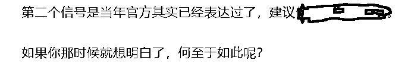

# 中暑坠江的老鹰

> 原文：[`mp.weixin.qq.com/s?__biz=MzU3NDc5Nzc0NQ==&mid=2247519690&idx=1&sn=1fbf236a67d6d4bc0a479dfd5d25c555&chksm=fd2e2f14ca59a602e24bc16d1a2f60ba9adfc1a5f7ba88236bce00fa2d91ebe85e01e5a6704b#rd`](http://mp.weixin.qq.com/s?__biz=MzU3NDc5Nzc0NQ==&mid=2247519690&idx=1&sn=1fbf236a67d6d4bc0a479dfd5d25c555&chksm=fd2e2f14ca59a602e24bc16d1a2f60ba9adfc1a5f7ba88236bce00fa2d91ebe85e01e5a6704b#rd)

我看到一个视频，南京有只老鹰在飞渡长江的时候，因为中暑，坠江了。

这只老鹰应该没有想过，它很可能经历了人类有史以来最热的夏天。

为什么说是有史以来呢？我看了报道，专业人士的说法是一百四十多年以来最热的夏天。

但是仔细看，一百四十多年前是没有气象记录的，也就是说，气象记录一共也就一百四十年。

这个夏天有多热呢？我注意到小区里的树冠，很多出现了大面积的枯萎，道路两旁的绿化带也出现了整体的枯萎。

这种事情以前从未见过。

我不知道庄稼地里会怎样，想必也不好过。对于农业来说，这是一个很糟糕的夏季。

当然，相比于植物，相比于动物，真正面对压力的，是我们人类。

因为我们面临四重压力，疫情，就业，极端天气，以及外部世界的不稳定性。

疫情就不用说了，持续的时间太久了，昨天还听到消息说，深圳有个核酸点的棚子，遭遇台风，被吹倒了。

大白赶紧说，散了散了，都回家躲台风。结果排队的人群不干，他们表示，今天不做，明天就没法上班，没有什么比挣钱吃饭更重要的，哪怕是台风。

于是大家齐心合力，就用人力扶着棚子与台风对抗，继续测核酸，直到结束。

这一件小事其实就反映出三重压力了，疫情，就业，极端天气。

之前长三角多次报道热射病的时候，我就引用了《药神》里的那句台词，徐峥怎么说的？其实没有病，只是没有钱。

病就两种，治不好的那不叫病，那叫命。能治好的，你得有钱去治。

热射病说穿了就是一个人不顾中暑，强行与大自然对抗，最后深度中暑无法救治的表现。

那他为什么要这么做呢？一定是有更大的压力。

第四重压力来自外部，在面对种种不确定性之下，人类并没有表现出合作与团结，而是纷争四起。

有人问我怎么看五大巨无霸撤离美国。[五个月前我就写过](http://mp.weixin.qq.com/s?__biz=MzU3NDc5Nzc0NQ==&mid=2247514520&idx=1&sn=fae620c5593fbec3d252ac907ab4daf7&chksm=fd2e1b46ca5992506c01de0cecc3d75d5d748cf3ca9103bc222ed020af43bade65d88947222c&scene=21#wechat_redirect)，我写过什么？

很多事无非早知道晚知道，无论早晚最后你都会知道，知道什么？知道有些事儿是不可避免的。

你玩过欧陆风云，就知道一个词儿叫 BUFF。

人类幸运的时候，开启黄金时代，各种好消息，各种加成层出不穷，这就叫 BUFF，反过来，不幸运的时候，战争，疫情，怎么极端怎么来，这也叫的 BUFF。

叠 BUFF。

我们曾经聊过就业的话题，[到当下为止，还有哪些行业是值得进入的](http://mp.weixin.qq.com/s?__biz=MzU0MjYwNDU2Mw==&mid=2247507287&idx=1&sn=3185c1d9b518e1f948fd40072426fb7d&chksm=fb1ab12bcc6d383d7b2034b3b1b3f1083184bdfe58244e082478c4f8bafdf359fe53df2dffdb&scene=21#wechat_redirect)。

我说，田里大旱的时候，水渠里还是有水的，重点植物所在的坑里，还是有水的。

但这不是一种解决问题的思路，这只是苟着的方式，我只是在教你如何苟得更久。等到下一次水来。

这一点，很多读者都发现了，你们很聪明，意识到了相濡以沫不是个办法。

相濡以沫的意思是说，水塘干了，两条鱼互相吐吐沫，用吐沫来湿润对方，想要苟下去。

所以相濡以沫的下一句是什么？是相濡以沫，不若相忘于江湖。

苟着是解决不了问题的，真正要解决问题，还得是游入大海。

什么是大海？人类的这次深刻的危机最后怎么解？

我觉得只能把目光投向基础科学。

疫情之前，虽然整个资本市场到处都在讨论长生不老，生物医学，讨论人工智能爆炸，但是怎么话说呢，这里面有两种可能。

一种是真的到了科技大爆炸的一个新的时代的边缘，另一个，则是资本的预期到了边缘。

你们明白我这种表达么？

有时候两种边缘是重合的，就像大家都买拳手 A 获胜，全场很激动，拳手 A 最后也获胜了，但是还有一种可能，那就是相反的结果。

所谓相反的结果就是说，即便人类没有遭遇疫情，没有急转直下，很可能最后也是难以突破。

如果不来一次科技大爆炸，不像工业革命那样，不像能源革命，不像计算机数据革命那种程度，人类是很难被从当下的泥淖中拉出来的。

说到底，卷的本质是全人类的问题，不是你遇到的问题。整个人类都遇到了瓶颈，生产力的瓶颈。

你仔细去看人类历史，通常在这种关口有两种可能，一种是技术突破了，一个新的黄金时代到来。

很可能每个人的寿命得到极大的延长，例如人均 200 岁。如果是这样，老龄化的问题就不是问题，因为你可能 180 岁的时候才觉得自己老了，在那之前，或许你都会觉得自己是个年轻人。

如果是这样，那么需求会大增，生产力也会大增。很多当下的问题就都不是问题了。

你看日本之所以走不出泥淖就是因为全民的平均年龄太大了，而解决这个问题除了生育率，其实还有第二条路，那就是人均寿命极大延长。极大延长和延长并不是一个概念。

延长是说从人均 80 到 100，那只是提升了社会负担，养老金缺口更大了。可是极大延长是说从 80 到 200，那么这些还是老人么？不，他们变成了年轻人。

所以刘慈欣前段时间说过一句话，他说人类要么走向星辰大海，要么，脑后插管。

他很希望是前者，他很担心是后者，就是在思考这个问题。

怎么才能是前者？人类需要一次科技爆炸，类似工业革命那种级别。而这件事很可能需要基础学科的推进，并不仅仅是一群资本围猎应用形态市场就能够搞定的。

你仔细想想，人类在核能上做出重大突破靠什么？如果没有爱因斯坦同时期的那一大批顶级基础学科家带来的飞跃式发展，是不会有后来一系列的科技爆炸的。

换句话说，今天很可能面临的是同样的状态。[这就是为什么我那天聊到了 P=NP](http://mp.weixin.qq.com/s?__biz=MzU0MjYwNDU2Mw==&mid=2247507273&idx=1&sn=e10b61b4a69add7065f7adaa69c2a25d&chksm=fb1ab135cc6d38238de50316ecd81c44540951068caf050c714f967318b221fe0b85ddc44519&scene=21#wechat_redirect)。

我忽然对这个话题感兴趣，是因为我想到了这个问题。我在想，也许真正能够把人类拉出泥淖的，就是基础学科。

如果你想要的不是苟着，不是哪儿有水就跟哪儿暂时苟着，基础学科是一种选择。

说不定未来的爱因斯坦，就在我们的读者群里。这世上从来没有救世主，换个视角，这话真正的意思是说，也许你才是那个救世主。