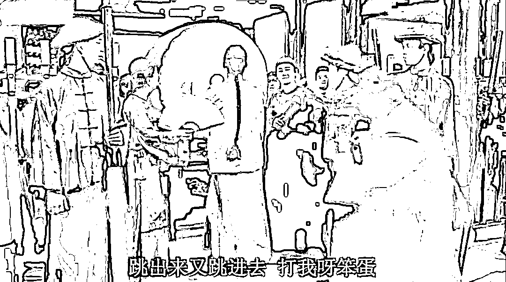
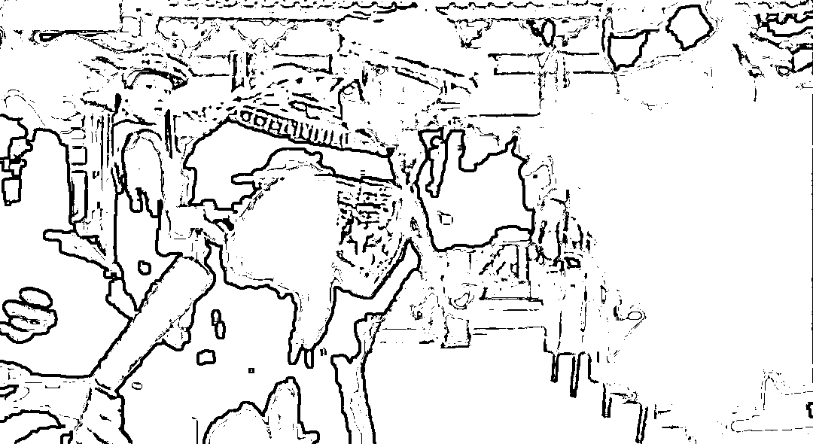
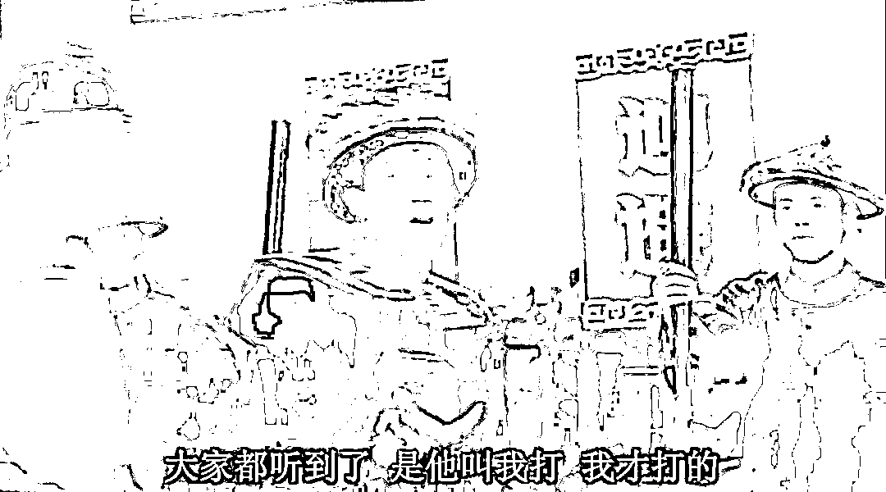
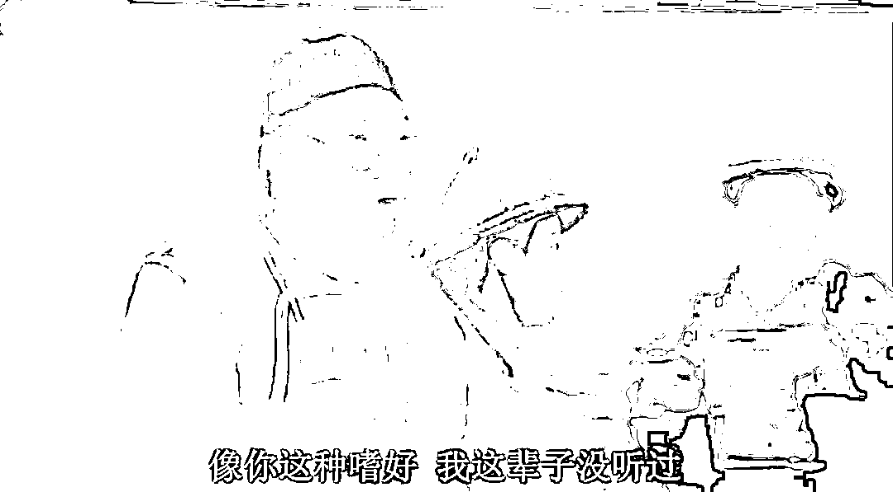

# 市场情绪开始启动了，唯一知道走向的，大约是佩洛西的老公

> 原文：[`mp.weixin.qq.com/s?__biz=MzU3NDc5Nzc0NQ==&mid=2247519514&idx=1&sn=898291e03bcd4fa5bb2e65cce432b3fc&chksm=fd2e2fc4ca59a6d2873b95659188cc6781aba9a4b99b84b29486209f240c214ef1cb2d0d0cea#rd`](http://mp.weixin.qq.com/s?__biz=MzU3NDc5Nzc0NQ==&mid=2247519514&idx=1&sn=898291e03bcd4fa5bb2e65cce432b3fc&chksm=fd2e2fc4ca59a6d2873b95659188cc6781aba9a4b99b84b29486209f240c214ef1cb2d0d0cea#rd)

我写的时候，半个小时前，市场开始启动了，避险情绪上升。很显然，是老女人胯下座机的方位时刻在牵动着全世界投资者的心。

一群精壮又有钱的华尔街的男人，为了一个 82 岁的女人今天晚上睡哪儿，以及接下来为了她到底打不打炮，可谓操碎了心。

事实上，这会儿连这个老女人胯下的坐骑，到底是 19，还是 20，大家还不能分清楚。

即便如此，都有几十万人不眨眼地盯着飞行路线，从半个小时前开始，19 的航线改变的时候，避险情绪才开始上升。

在那之前，金融机构做了很多操作，比如观察民航的动向，比如在据说她会下榻的酒店订了很多房间，就看是否取消。以此来判断她是否真的会落地。

关于今夜，各种分析在国际市场上已经过了八百遍，包括是否有可能 19 是一架无人机，只是用作试探，也未可知。

又或者 19 如果吸引注意力被拦阻，20 趁机溜进去了。还比如擦枪走火，坐人的那架被击落了，回头这个老女人，在大海里游啊游的，能不能游到酒店，还赶不赶得上 12 点前退房，就看体力如何了。

还有一种可能，飞机进去，机场没了，没地儿降落，所谓在外面蹭蹭，进不去。

最有创意的建议是网友们想出来的，布林肯不是说了么，那是佩洛西的个人行为，不代表美国，希望我们保持冷静。既然人家都这么说了，那不妨我们把导弹按钮交给胡锡进，回头按下去，打下来，是环球时报退休人员老胡的个人行为，也不代表我们，希望到时候美国也能保持冷静。

这一届网友还是很有才的。

不过我始终觉得，更有才的是佩洛西的老公，虽然号称酒驾被抓起来了。

但无论哪种结果，他都赢麻了。

我们有句古话，升官发财死老婆，如果他老婆真的最后遇到了点什么，挂了。那么她老公才是最大的赢家。

毕竟市场情绪波动，挣了这么一把，还不用分，回头还可以娶几个美娇娘，所谓揽二乔于东南兮，乐朝夕之与共。

羡慕，这么多精壮的男人关心她老婆今晚睡哪儿，结果他才是得利者。

那话怎么说来着？吃软饭的最高境界是让金主爸爸为你去赴死。佩洛西的老公做到了。

当然了，能不能让她老公如愿以偿，那要看佩洛西本人了。

接下来的一个小时，让我们拭目以待。一起来见证历史。

不过写到这会儿，我发现国际市场的情绪好像又退潮了，似乎资本认为这个老女人，没有赴死的决心。

呵呵。

说实话，我倒是很希望她有，因为我们这一代人等这个，等了几十年。

有些事儿，早晚要做的，很多人说没有准备充分，我告诉你，任何事都不存在准备充分，何况打仗。

你去看[今早大号的文章，佩洛西，来了。](http://mp.weixin.qq.com/s?__biz=MzU0MjYwNDU2Mw==&mid=2247507234&idx=1&sn=668d2183a73f6da2867f60fd3fd72e96&chksm=fb1ab15ecc6d384899e7562c4418ba51b6102e91465569cd38ab86eb71243646f76492fa5a59&scene=21#wechat_redirect)我说得很清楚，我们已经有三个理由，这已经很好了。

能拿到大义名分，老美陷入经济泥淖没有实力介入，这个局面真的很不错了。

我内心是非常盼望她成为导火索，让我们一举完成心愿吧。

有人老跟我说战争这了那了的，我是这么看的。如果是咱们主动打到夏威夷去，那我不赞同，也不反对，我保持中立。

如果人家凑上来给你打，你打一打有什么不好呢？

[那天分析《天道》，我觉得我把强者思维与弱者思维，彻底讲清楚了。](http://mp.weixin.qq.com/s?__biz=MzU0MjYwNDU2Mw==&mid=2247507224&idx=1&sn=48d8ac37ebb9a64a251b652dff7836f4&chksm=fb1ab164cc6d38721f04f5030f0073d6869beef853d9e210fb03cf2849d358a1e152ed0c0801&scene=21#wechat_redirect) 

一个人有一个人的寿命，人类有人类的寿命，就像地球也有地球的寿命。

没有永恒的，只有你想怎么活。

如果依着我的性子，别说当下这点小事儿，哪怕地球不长草，我也想灿烂的活。

毕竟，一本电影，好不好看，不在于时间长短。

人生也一样，哪怕人类，也一样。

网友们调侃老胡，是因为他有名，其实如果可以报名，我很想上。

毕竟，参与历史，比见证历史，更激动人心。