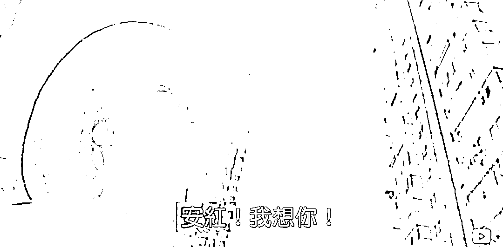

# 抖音小夫妻买房烂尾话题真正的悲哀在哪里？

> 原文：[`mp.weixin.qq.com/s?__biz=MzU3NDc5Nzc0NQ==&mid=2247518968&idx=2&sn=70a47148d9c67d0054d28b9cd2836e99&chksm=fd2e2826ca59a1308a38f48304859342321f5fa4bbaa9e06b2ac9242648fe44a8f80f2f52dd9#rd`](http://mp.weixin.qq.com/s?__biz=MzU3NDc5Nzc0NQ==&mid=2247518968&idx=2&sn=70a47148d9c67d0054d28b9cd2836e99&chksm=fd2e2826ca59a1308a38f48304859342321f5fa4bbaa9e06b2ac9242648fe44a8f80f2f52dd9#rd)

[大号记忆承载聊到抖音上那对买房遭遇烂尾的小夫妻与祥子的故事。](http://mp.weixin.qq.com/s?__biz=MzU0MjYwNDU2Mw==&mid=2247507108&idx=1&sn=94793cbb0535d1d2bbf6e34f070431ae&chksm=fb1ab0d8cc6d39cef7c922dc219f5200bab13940560aaff80d06edad67d46b327f8e185dc7c9&scene=21#wechat_redirect) 

很多读者跟我讲，好好一个话题，又被你聊偏了，就你话多，非要阐述问题的本质，你怎么就不能学学那些大 V 呢？

他们什么都不用说，只需要呜呼哀哉就可以了。

这对小夫妻真不幸，像他们一样的人真不幸，表示一下同情就足够了，顺带刷一刷自己的形象，讨好一下大众，又简单又轻松，三句话就能搞定的事情，每每被我用一百句话搞砸。 

谢谢读者的关心，问题是，那么写，就不是我了。我不需要刷形象，也刷不好了，我早就是泥石流。人家是清流我是泥石流，人家都是好人，就我是恶人。 

不是我不会讲情绪，而是如果你要我来讲情绪，那么我的情绪不在大家希望看到的那个点上。 

在我看来，整件事最让人悲伤的不是那对小夫妻眼中的光消失了，而是她的光，究竟因何而起？ 

她的光因何而起很容易回答，因为那套房子。当小两口凑足首付买下人生第一套房子时，非常喜悦，经常去自己的新房工地上转悠。 

似乎自己的人生围绕这个展开，似乎这就是自己青春的全部意义。

这才是真正让我觉得最不开心的地方，而不是最后遇到烂尾，她那失落的眼神。 

我们今天有太多的青年人，生活的重点就是一套房子。谈恋爱问你有没有房子，没有房子不结婚，没有房子不能生孩子。 

包括那天我批驳的上车论。香港人发明上车论是因为他们是一线城市，有接盘侠才有所谓的上车论。 

我们扣除北上广深之外，上车论其实是人口大规模城市化引起的暂时现象。 

你动动脑筋，所谓买房买房一直买房，最后靠收房租成为房东，这个投资理论，可不可能适用于人人，可不可能适用于广大地区？

人人都靠租房子过活，谁来租你的房子？ 

咱们过了几千年的农耕社会了，地主都不带这么二的呀。 

不断的买地出租仅限于人口稠密地区，换句话说，租的出去才行呀。 

这还是农耕文明下。 

商业文明下，大家都想着多攒几套房，回头当钱花，回头怎么当钱花？

你老了拿房子换年轻人伺候你，问题是，年轻人呢？ 

这是一个明摆着的话题呀。 

但凡当下年轻人少的地方，将来只会更少。

这还用得着我教么？人是怎么生出来的？人不是年轻人生出来的，难道是老年人生出来的？ 

一个地方，如果你要未来的年轻人多，除非怎么样？除非现在的年轻人多。 

这是在没有外来人口流入的情况下，我还没有给你提，我们很多省份，很多城市都是人口净流出的。 

而且流出的是年轻人，生育年龄下的年轻人。他们流出，也就意味着未来的年轻人，一并流出。 

那么你告诉我说你攒的那些个房子，将来养老，怎么养？ 

你 80 了，隔壁老王 82，你说老王，你伺候我，回头房子给你。老王说，你娃儿忽悠谁？谁先走还不一定呢。

看到了吧？这就是个笑话。当全民都这么想的时候，就是一个不好笑的笑话。

等老了你就知道，笑都笑不出来。 

我当然清楚怎么让这对小夫妻满意，让他们如愿的得到房子，房子如愿以偿的升值，然后他们置换更大的，然后买第二套第三套，最后老了，告诉孩子们，这就是爸妈当年省吃俭用创业留下的财富，以后你们就不用奋斗了，不用买房了，你们收租就可以了。 

是这样吧？

这样的幸福，这样的奋斗，这样的成功能普及吗？在人口不增反降的前提下，能普及吗？ 

幼不幼稚？ 

所有的年轻人都像这对小夫妻一样认定这是幸福的必经之路，只会在将来，带来更大的不幸福。 

年轻人要奋斗，要赚钱，是好现象。可是年轻人，所有的年轻人，什么都不思考，只认定买房子才能致富，这是荒诞的，也是最终一定会让大家都失望的。 

我讲过很多次了，房地产的支撑是什么？是高收入的工作岗位。 

高收入的工作岗位的支撑是什么？是优质的公司。 

没有优质的公司，没有高收入的岗位，此地区的房地产就难以支撑，因为随着城市化程度的大幅度提高，那种农民进城带来的绝对接盘侠红利，已经吃光了。 

未来只有相对接盘侠红利，那就是创造商业价值。 

谁来创造？年轻人。 

说到底，如果年轻人都想着，只想着造科技园，收房租，你收谁的房租呀？ 

得有人创造价值，才有房租可收呀。不就是这么简单的道理。

我们已经到人口增量的拐点了，年轻人一代比一代少，这已经是事实了。

换句话说，老方法过时了，不是买房子就能发财，而是发财了才能买房子。 

沿着老方法走在新道路上，一定会有人栽跟头的，不是这对小夫妻，就会是比他们年轻几岁的下一批人。 

人的思想就是栽跟头扭转过来的，只有女装店开不下去了，女装街都没了，他才会回头。 

十多年前有多少人痴迷商铺？我身边一堆人。一铺养三代。后来呢？ 

就是这一批人栽跟头，亏光了所有的积蓄，一蹶不振，下一批人才会意识到，原来老路不通了。 

而到了下一批人，他们反而会焕发出新的生机。 

我一直说，8，90 年代是我最喜欢的时候，你比如我聊过很多次的《我爱我家》。 

那时候的人，才真的活出了青春。

你看 90 年代张艺谋导的，姜文演的《有话好好说》，老谋子拿着个扩音大喇叭，在楼底下按照姜文的要求，冲着上面用陕西话喊：安红，我想你。 

安红刚认识姜文，可还是喜欢上他了，还是要和他打扑克。 

姜文做的那些事在今天的年轻人眼里叫不着四六，可是剧中，我看出了他身上的生气。 

他像个活人。

我年轻那会儿，2000 年以后，已经没有之前那批年轻人那骨子张力了。 

我们成天琢磨赚钱，可我们没有那么集中，没有说这辈子眼里只有房子了，没有。 

我们是俗多了，路也窄多了，可我们至少玩的品种还是很多的。 

抖音上 21 年买房子这对小夫妻，给你的感觉就是人生除了买房子，什么目标都没了。 

人活着就是为了工作省吃俭用买房子。 

如果所有年轻人都这样，怎么创造高收入的就业岗位？没有高收入的就业岗位，拿啥来支撑房价呢？

你看到了？我且不说你活得开心不开心，这辈子值不值，青春有没有虚度，单单从投资的视角看，这都没法形成闭环呀。 

这才是真正让人悲哀的地方。当年年轻人眼里的光至少为了安红，现在的年轻人眼里的光，怎么就只为了套房子呢？

