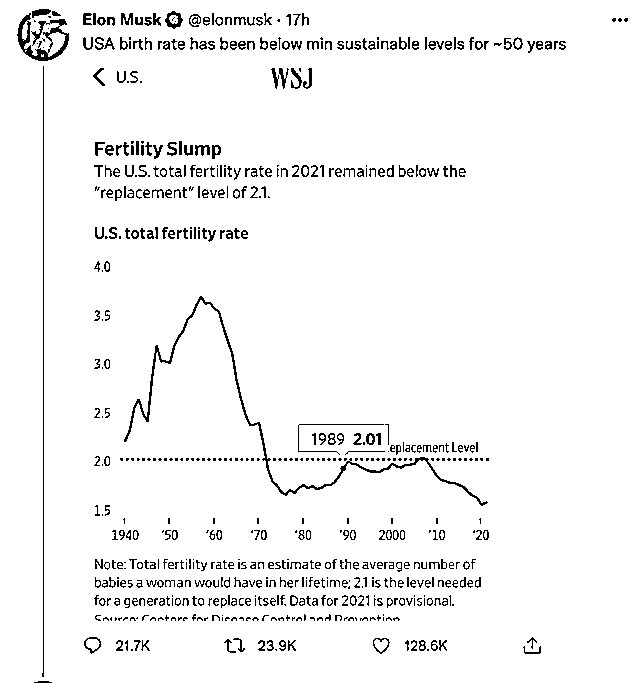

# 从美国最高法取消宪法规定的堕胎权聊起

> 原文：[`mp.weixin.qq.com/s?__biz=MzU3NDc5Nzc0NQ==&mid=2247518670&idx=1&sn=d36f0a9a058eff2540aad95063ea2a5e&chksm=fd2e2b10ca59a206c57b821c5e9461d384b9def78393295c9201c1196854039ae02a372e0e61#rd`](http://mp.weixin.qq.com/s?__biz=MzU3NDc5Nzc0NQ==&mid=2247518670&idx=1&sn=d36f0a9a058eff2540aad95063ea2a5e&chksm=fd2e2b10ca59a206c57b821c5e9461d384b9def78393295c9201c1196854039ae02a372e0e61#rd)

从昨天开始，很多人让我聊这个话题。

首先把这件事解释下，互联网上，很多说法已经变成了在美国堕胎不合法，这个说法是不准确的。

这件事要从半个世纪前的罗诉韦德案说起。

1972 年，得州两个年轻的女权，萨拉·威丁顿和林达·科菲试图挑战当时的堕胎政策。

这那那这一通操作，于第二年，1973 年，美国联邦高院以 7 比 2 的表决，确认是否堕胎这件事由妇女自己决定，且受到宪法保护。

你可以认为，从之之后，在美国各州，都是可以堕胎的，直到 2016 年。

特朗普在与希拉里的竞选中，对着选民许诺，如果他能够获胜，将会任命最高法的大法官，来推翻罗诉韦德案，至于是否堕胎，由各州自行决定。

那么此后懂王兑现了他的许诺，当然也是运气好，他任期内，三名支持罗诉韦德案的大法官先后去世。

大法官是终身的，如果不去世，懂王也没招。 

那么借着这个机会，懂王任命了三名支持推翻罗诉韦德案的大法官，于是就出现了今天的这件事。

站在美国的视角看，其实就是两派骚操作。大家为了拉选票，已经越来越无厘头了。 

我不知道你理解这意思吗？ 

就像一对夫妻，为了争取孩子的支持，一个表示我给买游戏机，另一个表示我给你买手机，一个表示我陪你玩游戏，另一个表示我陪你刷抖音。

你现在明白美国的通胀问题为啥这么复杂？ 

其实不是问题本身无解，而是在这个游戏下很难解决。

就好比两家医馆，面对唯一的客户，客户现在病了，他不想吃药，他就想吃糖。

你也知道怎么治病，问题是，你给他吃药你就得倒闭，对门医馆就躺赢了。

你怎么选？他怎么选？你们俩都只能撒谎，一个比一个邪乎，没法子，没得选。 

你首先得保证自己医馆的存在，而不是客户的病治好，自己不存在了。 

很多事儿很有趣的，你知道，我知道，美联储知道，睡王也知道，当年的懂王也知道，全球的投机者也知道。

大家都知道，but，该吃糖吃糖，该玩游戏玩游戏。

把话题拉回到这个法案本身，目前的做法并不是说在美国堕胎就违宪了，不是。

只是说，堕胎是否合法，由各州自行决定。你像德州，五十年前堕胎就是违法的。从此之后，是否会回到此前的状态，拭目以待。

那么懂王此前这个决定，到底合理不合理？或者说他六年前埋下的这个梗，是不是纯粹为了讨好部分选民？我们不讨论。

可是有一点是很清楚的，那就是生育这个问题，对美国来说，也是一个很严重的问题。 

马斯克上个月在推特上分享了一张图，是说过去的五十年，也就是罗诉韦德案的这五十年间，美国的生育率一直低于可持续水平。

图中你可以看到，近年尤其低。

其实生育率低是全世界发达国家的通病，我们随着发展得越来越好，生育率也屡破新低。

如果一直这样下去，可能以后全世界人口的主体就成了非洲人与印度人了，因为只有他们生育率高，他们欠发达嘛。

对于美国而言，这个问题还有一层隐忧，那就是人口组成。

美国的非白人占比越来越高，白人随着出生率的下降，越来越有变成少数族裔的趋势。

这给美国带来很大的问题，说白了，美国虽然还叫美国，但其实已经不是几十年前那帮人了。

懂王的上台就是白人的诉求，或者讲，传统白人的诉求。

恢复白人的出生率，恢复白人的主体地位，其实是解决美国根子问题绕不开的一件事。

至于你说，2016 年的时候，他想出来的这些听起来有些搞笑的招，到底管不管用，就不晓得了。

这个出发点我理解，有没有用，我不清楚。

就像他在墨西哥边境上修的那道墙，所谓的美式长城，后来被证明很搞笑，因为什么也防不住。

但是这个思路，大家是能够理解的，他想要什么，大家是能够理解的。

关于人口下降这个问题吧，我觉得是无解的，当城市化发展到一定规模，就是无解的。

你想一想，商品社会是围绕什么转的？

是围绕消费转的，那种所谓的断舍离，所谓的极简生活，是不符合商品社会内在逻辑的。

人人都极简，什么没了？工作没了。

商品社会的本质就是鼓励你消费，鼓励你去追求那些其实你用不着的东西。

有消费才有公司，有公司才有职位，有职位才有就业。这是商品社会的运转的条件。

所以你看到的是生育率低，实际上是结婚率低。结婚率低是因为大家都想过当下更好的生活，都不想给找麻烦，添负担。

女人不想和男人一起奋斗，想要直接嫁一个有房有车的，很正常，因为这是商品社会灌输给她的思路。

产品经理们就是干这行的，就是告诉你，一条裙子，如果你在 20 岁的时候买不起，那么到了 40 岁，就算买得起，又怎样？青春不再。

所以你要抓紧时间，留住青春。

事实上学过物理我们就知道，青春是留不住的，所谓留住青春的内在含义，就是让你赶紧消费了再说，这是一种心理学文案。

那么站在年轻男性的视角，他们也不愿意耗尽自己的时间去供养另一个人的消费，人家也想自己消费，今朝有酒今朝醉，自己先爽了再说。

再加上各种媒体，为了博眼球，为了吸引流量，刻意地挑唆两性对立，所以结婚率是很低的。

这不是什么个案，全世界但凡发达的国家与地区，都这样。

说明这是商品社会的本质，你想要得到当下的消费，就不得不失去未来的人口。

甘蔗没有两头甜。年轻人又要负责当下的消费，又要负责给生孩子，除非他们都是富二代。

所以我说这个问题，其实没有解。

当然，话说回来，懂王这人虽然做的每件事，最后都不怎么靠谱，但是有一点挺让人佩服。

那就是他真的去做了，包括修美式长城，也包括这次的推翻罗诉韦德案，实际上就是他间接完成的。