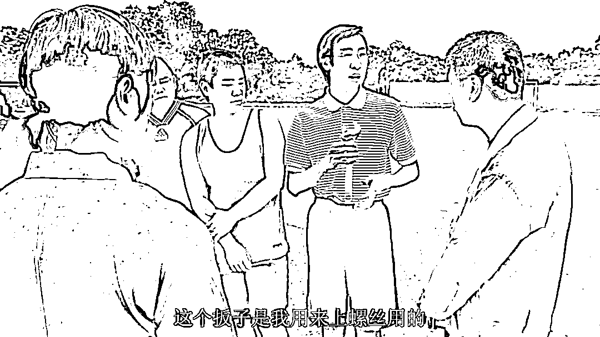

# 唐山这件事的重点在于轻伤二级吗？

> 原文：[`mp.weixin.qq.com/s?__biz=MzU3NDc5Nzc0NQ==&mid=2247518619&idx=1&sn=38587a46fe064f3afbb918e5b17725b7&chksm=fd2e2b45ca59a253f17ee42e7742e29a5ff4888a2076fe5052718a31020aad3d836f3593c65f#rd`](http://mp.weixin.qq.com/s?__biz=MzU3NDc5Nzc0NQ==&mid=2247518619&idx=1&sn=38587a46fe064f3afbb918e5b17725b7&chksm=fd2e2b45ca59a253f17ee42e7742e29a5ff4888a2076fe5052718a31020aad3d836f3593c65f#rd)

那张号称史上最长的警情通报，我就不贴出来了，否则太占篇幅。 

这个通报里面，吸引全网最多注意的是什么？是轻伤，而且是轻伤二级。

大家觉得打成这么狠，只有轻伤二级，是不是定轻了？ 

这个焦点其实不重点，那只是法律上的用词和平常大家的用词不一样。 

法律上把人打成植物人，这叫重伤一级。 

把人打成脑袋开花，进 ICU 生死不明，这叫重伤二级。 

把人打成脑袋开花，但是确定不会死，这叫轻伤一级。

把人打毁容，这叫轻伤二级。 

那么多隆那种算什么？

就是周星驰的电影里，多隆潜入吴三桂府邸，被打得连妈妈也不认得了。打得非常严重，这个算什么？

对不起，这个入不了刑。

所以吴三桂其实并不需要拿出免死金牌。 

我知道你觉得好像有点别扭，对吧。 

我也觉得很别扭，但目前的规定就是这样。我们的讨论，只能依照现有的法律范畴。 

不可能像爽文那样，看谁不爽，就把谁拖出去。 

那么也就是说，如果要量刑，轻伤二级是起点。

这个量刑有多重呢？轻伤二级的顶格，就三年。 

我们第一次聊这个话题的时候，[怎么看唐山发生的暴力殴打事件](http://mp.weixin.qq.com/s?__biz=MzU3NDc5Nzc0NQ==&mid=2247517746&idx=1&sn=d6e2a16a6331e70a9bfab67a3b6266ae&chksm=fd2e24ecca59adfa6d83be0f07180a9caeb25c02b6a83c892ebafe4fd064612b784eb550aaac&scene=21#wechat_redirect)。

就在思考这件事。 

我当时就在想，怎么才能让对方判十年呢？要看受伤程度。 

如果只是轻伤二级，那就是顶格三年，如果重伤，那就是顶格十年。 

所以我那天说，要等医疗报告出来才知道，到底怎么界定。如果要突破十年，除非重伤且致残。

所以我那天在讲第三点的时候，就在想，怎么才能超过目前法律规定的限制。

想来想去，黑社会才是这个案件中的核心要点。 

你去看那个很长的警情通报，对于轻伤二级只是一笔带过，真正大段篇幅都落在了这批人可能涉黑的调查上。

如果从组织，经济，行为与危害性上符合涉黑的要素，那么这个案件，就一下子升级了，就可以突破我们前面说的限制。 

一旦涉黑，突破十年，甚至判无期，都是可以期待的。 

所以我在第二天，蛋糕店主实名举报的时候，就写了一篇，[怎么看唐山蛋糕店主实名举报黑社会团伙](http://mp.weixin.qq.com/s?__biz=MzU3NDc5Nzc0NQ==&mid=2247517760&idx=1&sn=bd00582c435753aa0fcdeca69c4d97fa&chksm=fd2e249eca59ad88fea7ed762493426b9600c504ff447b8a898737501e6f526b7631650c6dce&scene=21#wechat_redirect)。 

详细解释，为什么涉黑与不涉黑，有那么大的差别。

其实当天我看到报道，说两个受害者已经脱离生命危险，就怀疑，大概率不是重伤了。 

那既然如此，涉黑才是重点。 

我那天解释得很清楚，犯罪有很多类型。 

第一种是没有预兆的。

张三和人吵架，瞬间火起，失手把人打了。这是没有预兆的，我们很难讲，张三那会儿到底哪跟筋不对。 

第二种是有预谋的。

张三早就看李四不爽，准备了很多天，某天用管制刀具，把李四捅伤了。

你想想，大号记忆承载里面聊[陈鹤皋的防身术](http://mp.weixin.qq.com/s?__biz=MzU0MjYwNDU2Mw==&mid=2247506184&idx=2&sn=6049b969e2cd0a770203bf3712f6bdb1&chksm=fb1ab574cc6d3c62f1b56a128606d92844cd0f332b6ff49a6a3bdf52979964fa5979d82423d7&scene=21#wechat_redirect)，为什么他总是建议你用剪刀，铲子，板砖之类随手可得的东西？ 

其实就是为了这一条，证明你不是有预谋的。 

板砖和管制刀具在某些时候，作用是相同的，但是量刑是不同的。前者可能就是你随手反击，防卫自己，后者那只能说明你是有预谋的。

你想想看下面这张图：

第三种是有组织的。

有预谋和有组织，性质还不一样。

有预谋，也许你就是因为个人恩怨，看李四不爽，就这一次。

有组织，那就没完没了了。你可不一定是针对李四，你针对的范围大了去，你潜在的危害，也大了去。

所以我那天说，犯罪有可能只是针对受害者一个人，可黑社会，是针对整部法典。 

搁在古代，那就是，你要谋反啊？ 

**思路是不是一下子开阔了？** 

凡事都要动脑筋，不要一根筋。 

那我们看了这个陈什么的犯罪团伙，目前还是集中在赌博这一块。 

围绕赌博，或者讲开设赌场，有各种债务纠纷，聚众斗殴。

所以说赌博是什么？是一个很重要的突破口。 

内地是不允许赌博的，因为围绕赌博，会展开很多犯罪活动，很容易形成犯罪团伙，甚至黑社会。

这就是那天我说的，一群混混聚在一起，绝对不是为了义气，他们不为了钱肯定为了大嫂，反正不会为了大哥。 

这一点，你在很多允许赌博的地区，都能够看到，很容易形成黑社会。 

**因为有组织的前提是什么？就是有利益。**没有利益，组织不起来一拨人的。

要是没有大块吃肉，大碗喝酒，大秤分金银，你看还有人上梁山吗？

所以赌博是个非常好的突破点。 

网传，这个犯罪嫌疑人，陈什么，曾经在澳门，当过叠码仔。 

叠码仔是一种澳门独创的赌场中介制度，说白了就是拉客人去赌钱，然后自己抽佣。

不仅抽佣，叠码仔还会借钱给赌客，就是预支筹码。 

他为什么愿意垫资给赌客玩呢？因为他是按照交易量抽佣的。

我给你打个比方。

假如我从叠码仔那里透支了 1 万块钱，哪怕我一天之内，只玩了十把满仓，就相当于，交易了 10 万块。我连续玩了 200 天，那就是 2000 万。

它是从这个 2000 万里面抽取 1%，那可就是 20 万，是我当初透支的 20 倍。

你现在想明白了？这还是利息吗？这不是。

当然，利息还是问你收的，利息另算，也高到没边。 

所以有时候，赌客就是不打算还钱的，因为你这个明摆着也是见不得光的。 

那么叠码仔的背后，就往往伴随着各种黑恶势力，因为他不得不依靠见不得光的方式来收账。

你看，这就是解决问题的方法，你要抓住线头。 

一群人，为了利益聚集，你就要沿着利益去调查，就像我以前开的那个玩笑。

要么钱是突破口，要么大嫂是突破口，反正义气肯定不是突破口，除非你古惑仔电影看多了。 

你把一个人的钱调查清楚了，这人就被你摸清楚了。 

如果弄不清他的财务状况，那就沿着他的私生活去查，肯定会有所发现。