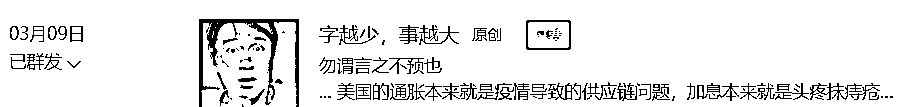
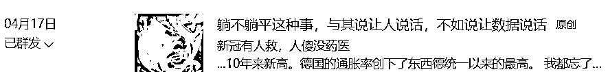
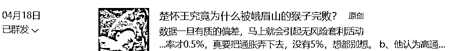
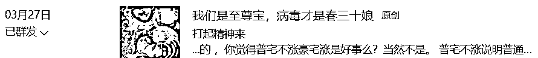
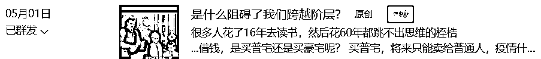
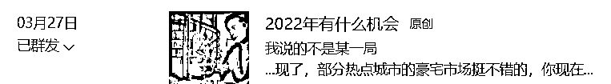
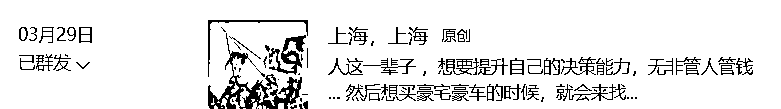
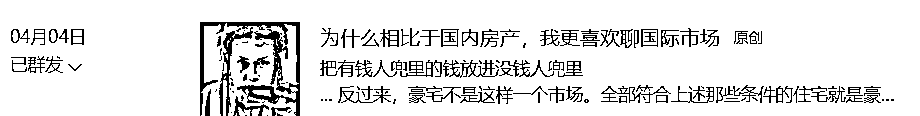
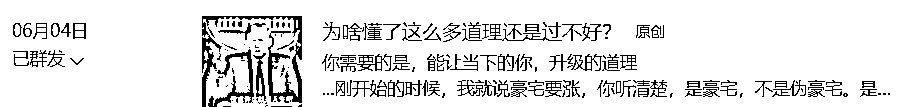

# 美国的股市，日本的债市，中国的楼市

> 原文：[`mp.weixin.qq.com/s?__biz=MzU3NDc5Nzc0NQ==&mid=2247518154&idx=1&sn=d0f3ff5d3d8f297d50e4490464c8c76a&chksm=fd2e2514ca59ac02f59d08665f2d675b3d0fb5b7bb809026f1354e0282e77f400d485ffbafa5#rd`](http://mp.weixin.qq.com/s?__biz=MzU3NDc5Nzc0NQ==&mid=2247518154&idx=1&sn=d0f3ff5d3d8f297d50e4490464c8c76a&chksm=fd2e2514ca59ac02f59d08665f2d675b3d0fb5b7bb809026f1354e0282e77f400d485ffbafa5#rd)

标题是世界三大核心话题，也是昨天大号记忆承载聊[陈鹤皋的防身术](http://mp.weixin.qq.com/s?__biz=MzU0MjYwNDU2Mw==&mid=2247506265&idx=2&sn=1f287d0546f0fb03e5d42a193d9caaeb&chksm=fb1ab525cc6d3c3339723ee3c3e60081a8e3cbb98667bdb8a18966eda1985b02593d3630b3c2&scene=21#wechat_redirect)时，有读者问的。 

问的读者不是一个，我只放出来一个，问得多了。我有时候都觉得我自己写了个寂寞。

美国的股市，日本的债市，都是国际市场的一部分，国际市场这个话题，是我们常聊的。所以我昨天回复读者说，等一件事被全网炒作，是个媒体都在讲，还有价值吗？或者说，还有解读的价值吗？ 

我认为没有。

就好像你知道一个品种要涨，提前俩月你去聊，这叫蕴含着丰富的价值。提前一天去聊，别人现学也来不及呀。 

等涨过了，你再去聊，那只有什么？那只有理论价值。俗称学院派价值。 

学院派都这样，等人家把仗打完了，他们在那里分析案例。

我不是说分析案例不重要，站在人类整体的视角，知识传承很重要，但是站在打仗的角度，事后再聊有什么意义呢？ 

当然，很多读者觉得有意义，那么很简单，我给你截图就行了，你去看看我们聊过些什么。你自己去像教授一样，去事后总结。 

美国的股市，日本的债市，是一个话题，就是通胀话题。 

美国的股市为什么跌？因为加息。或者说，一部分实现了的加息与预期中还没有结束的加息。 

那么为什么要加息以及持续地加息呢？因为通胀。

同样，日本的国债为什么暴跌？也是一样，通胀呀。

债务的本质是什么？或者说决定债务规模，决定债务风险等级的是什么？ 

其实就是利息。

就像如果你能够贷款买房，利率是零，那么理论上如果不要首付，你就可以把全国的房子都买下来呀，反正是零嘛，有什么风险呢？

风险当然有，如果某一天告诉你，不是零了，你瞬间慌了，因为从下个月起，你要还的利息是个无法想象的数字。

这个道理是不是很简单？ 

总结起来就一句话：

如果利息是零，或者是负的，那么扩大债务有没有风险？当然没有。反过来，当然有嘛。

而影响利息的是什么？是通胀呀。合理的通胀会刺激人们赚钱的欲望，推动生产力，可是不合理的通胀，只会导致满街的零元购，最后，最后你懂的。 

所以我们聊通胀，等于把国际市场上最核心的问题聊清楚了，剩下的，都是围绕它打转的。 

从大号记忆承载 3 月 9 号开始，[字越少，事越大。](https://mp.weixin.qq.com/s?__biz=MzU0MjYwNDU2Mw==&mid=2247504457&idx=1&sn=b0b3257cfcfbb2ef1c48c3693dfcb92e&chksm=fb1abe35cc6d3723f968a998345bd229c4ef54cb2dcc560d54c2415e267e570b9e9d36e6a3b5&payreadticket=HCqL6FXpjx_Pme5AJqJniMn-FH7pDhcg5FcIxiABec9EqXhFKEoWBBIU7B2-lc1_ThetgYk&scene=21#wechat_redirect)

那是收费文章，也是我们第一次提到通胀问题，到现在，提前三个月。 

重要的话题，我总是首先在付费文章里通知。

三个月前，我就提到一件事，就是我认为，加息不会有用的，最起码这个节奏下，不会有用的。 

这三个月来，关心国际市场的人应该会发现市场的情绪起起落落，曾经一段时间内被美联储忽悠，觉得加息有用。

事实上，最后大家都看到了，美国的通胀在加息，连续加息，拉升式加息的作用下，依然屡创新高。

对于职业投资人而言，**一个观点的价值不在于观点本身。而在于什么时候告诉你。** 

我 3 月 9 号告诉你，就有价值，今天把它再拿出来，就没有价值了，起码没有时间价值。

那么在此之后，4 月 17 号，免费文章里，我随口提到了美国的通胀，欧洲的通胀。 

我没有解读其内在逻辑，但是提到了，虽然那时候，全网都不关注这个话题。

第二天，4 月 18 号，问的人多了，于是我把这个话题展开解读。 

后来我在大号里写了一篇文章，6 月 12 号推送的，集中回复了很多读者的问题。 

因为说到底，很多人实在是太懒了，他们一定要我把写过的内容，串起来，链接给你挂好，顺序给你梳理好，然后你就可以像躺着吃棒冰一样，慢慢的享用。

当然，这没有什么不对的，毕竟听相声的是多数。 

这篇文章就是大号记忆承载推送的：[五月份数据出来，不是为了帮我打谁的脸](http://mp.weixin.qq.com/s?__biz=MzU0MjYwNDU2Mw==&mid=2247506131&idx=1&sn=43ccde6c8184ae5a74405081259ee1c3&chksm=fb1ab4afcc6d3db95f489ef4134852a1de1186e9460dce861d71e786cfa97fb74513237c73d9&scene=21#wechat_redirect)。 

至于国内的楼市，你听到这个话题，应该是最近的很多媒体，在给你讲，上海的豪宅市场波动。 

本月初，上海刚解禁，一群人就拿着麻袋去扫货，扫的都是高端楼盘，就是茶位费，都要给人家塞个 7，8 位数那种。

8 位数，一线城市都能买房了，在豪宅市场，仅仅是茶位费。

这个话题，我也是 3 月份就开始聊。我还专门起了一个名词，叫做冰火两重天。 

那么也是在付费文章里，我第一次解读这里面的逻辑。 

[是什么阻碍了我们跨越阶层？](https://mp.weixin.qq.com/s?__biz=MzU0MjYwNDU2Mw==&mid=2247505266&idx=1&sn=7488e2812c2e497ad86e9e901d469fbe&chksm=fb1ab90ecc6d301817c5c1b0eb4ec913de8f858a9b577c1e97190e470364aa80f1d39293fbd5&payreadticket=HAHoGDj3a4ko_iwKubVSjiLS2fZHTY02Vz0GlYdEEDtm2gnwHdrmfqwxl7EEX9a5UwA33kE&scene=21#wechat_redirect)

小号记忆承载 3 里面，也聊过。 

你注意，重点的是时间，我给你截图的重点都是时间。 

你现在回头去复习内容，没多大意义。因为全网都在告诉你，其中内在逻辑，全网都在告诉你。 

大家都知道的时候，你不需要来我这里看，别人也会说，会比我更有耐心。 

我比不上那些博主，如果论文采，论态度，我都是很差的，我的优点在于早，在于正确率。 

很多人为什么跟了很多年，并不是因为我是个人才，说话又好听。 

我说话很难听的，他们捏着鼻子忍着听，无非我说得早，我的命中率高，他们在别处，找不到这么早，也找不到这么高的。 

当然，我不只有两个优点，还有第三个。

即便你很早的知道了准确率很高的分析判断，对你个人而言，有什么用呢？

我的看法是，大多数情况下，都没有什么卵用。 

你想一个问题就明白了，你觉得我儿子在干嘛？

他是关注国际市场还是关注国内市场？ 

答案是都没有，他在复习考试，要期末考试了。 

他关注那些话题没有意义的明白么？ 

就像玩游戏，有个装备，再好，你不到 99 级，是穿不上去的。而你能在游戏里熬到 99 级，需要的不是一套装备，是一系列的装备。

10 级的时候，你需要 10 级的极品装备，20 级的时候，你需要 20 级的极品装备。 

装备是用来辅助人的成长，而不是反过来。

我儿子还在读幼儿园的时候，就知道我聊的那些市场类的话题，他还在床上爬的时候，就会算账了，这一单又赚了多少钱。 

so tama what？他第二天不还得去上幼儿园，还得去考试么？ 

为什么这样？为什么我没有办法让他绕开过程直达目的？

因为谁也没有办法，不只是我。

没有人可以不盖一楼，直接盖二楼，没有。

所以你现在明白为什么我们大多数时间聊的都不是金融类话题，而是职场？ 

为什么？

因为我发现多数读者的底气和我不同，你注意这个词儿，底气。 

我投资失败，亏的清洁溜溜，什么下场？ 

就是找家公司，做高管，每天出入五星级酒店，实报实销，花了多少钱，就可以报销多少钱。

不仅自己很开心，工资奖金福利股票，还可以给孩子买别墅，买豪车。

这就是失败的结局。当你知道自己从 50 层落下去，下面是 49 层接着你的时候，和当你知道从 50 层落下去，会直接砸在地板上的时候。

你的心态会一样吗？

你穿着软猬甲，知道自己不死之身，和什么都不穿，打架的时候，心态能一样吗？

我正是因为发现了问题所在，所以才聊那么多职场话题。 

而在聊职场话题的时候，我又发现，并不是说随便哪个人，想做高管就能做高管的。 

他们的思维方式，沟通方式，理解问题的方式，有很多问题。 

于是怎么样？于是我才会花很多时间，聊思维模式这件事。 

那么在聊思维模式的时候，我又发现，很多人不仅仅是思维模式有问题，他们连自律都成问题。 

自律就是终身学习，长期思考，专注，勤奋。所以我很多时候，就会去聊学习方法，学习态度的问题。

你现在看到我第三个优点了？

诚实。 

换做别人，他就会跟你说，信我者，得永生。既然我这么早，我这么准，你听我的就行了。

但是我不想忽悠你，我每次都告诉你，你听我的没有任何用。 

没有人能够不盖一楼二楼直接盖三楼，没有。 

你必须勤奋自律专注，这是一楼，你必须改变思维模式，使得自己成为一个人见人爱，花见花开，搁哪儿哪儿发光的人才，拥有自己的退路，这是二楼。 

这两层楼你不盖完，光想着盖三楼，那就是赌徒。 

市场里最不缺这号的，他们几乎占据了散户里的 99%。

说穿了，他们不是去投资的，他们只是寻求安慰的。 

他们是现实生活中的 loser，他们没有能力，也没有勇气去盖自己的一楼二楼，只是异想天开，每天在做梦，梦见自己的空中楼阁。

你想做个牌手，还是想做个赌徒？