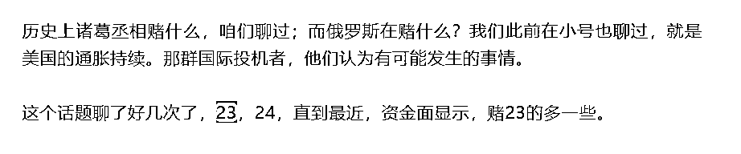
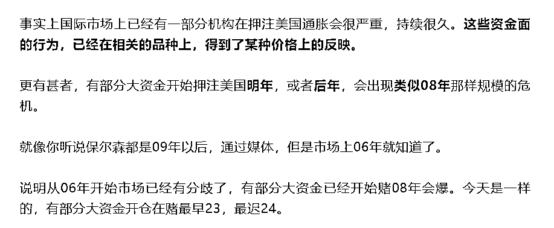

# 美股暴跌不是重点，重点是你哪天知道的

> 原文：[`mp.weixin.qq.com/s?__biz=MzU3NDc5Nzc0NQ==&mid=2247518040&idx=2&sn=19d8cffccb282a8f77e015ea2b4d3069&chksm=fd2e2586ca59ac90afc6d5281c9a7340fd19e97504eeb32977070987f9c709c1968666040e66#rd`](http://mp.weixin.qq.com/s?__biz=MzU3NDc5Nzc0NQ==&mid=2247518040&idx=2&sn=19d8cffccb282a8f77e015ea2b4d3069&chksm=fd2e2586ca59ac90afc6d5281c9a7340fd19e97504eeb32977070987f9c709c1968666040e66#rd)

有读者让我写美股暴跌，毕竟唐山的事情，大小号都发了好多期了。

知道的是我们关心时事，不知道的新读者，还以为我们是个写法律的号。

我没有写，也不想写，是因为没有意思。

美股遭遇黑色星期一，道指跌千点，纳指重挫 5%，标普 500 下跌接近 4%，进入熊市。

这事儿重要吗？

重要，也不重要。

重要不重要，看你哪天才知道。

你要是 6 月 14 号知道，或者 6 月 13 号知道，那是什么？那就是新闻。

你要是 6 月 12 号就知道了，那就不是新闻。

新闻，都是旧闻。该知道的都知道了，你最后一个知道，才叫新闻。

信息则不然，信息就是提前知道的。

你看我们好几年前，就因为提前聊国内的股市，就提前了俩小时，俩小时阅读量当时是不到两万，结果就去思过崖上待了足足七天。

但是咱们聊美股，就没这麻烦。

你去大号，6 月 12 号早上七点推送的文章：[五月份数据出来，不是为了帮我打谁的脸](http://mp.weixin.qq.com/s?__biz=MzU0MjYwNDU2Mw==&mid=2247506131&idx=1&sn=43ccde6c8184ae5a74405081259ee1c3&chksm=fb1ab4afcc6d3db95f489ef4134852a1de1186e9460dce861d71e786cfa97fb74513237c73d9&scene=21#wechat_redirect)。

妥妥的，啥事儿没有。

有人问，13 号发生的事情，为啥你可以 12 号聊？

12 聊算什么？如果你这么提问，说明连 12 号那天的文案你都没看懂，甚至我可以讲，你都没看完。

你去翻大号的历史文章，往前翻，5 月 19 号，[芬兰是俄罗斯的包围网吗？](https://mp.weixin.qq.com/s?__biz=MzU0MjYwNDU2Mw==&mid=2247505599&idx=1&sn=5197598d00a7c3c37dbbccc172a243dc&chksm=fb1abac3cc6d33d53113229dff195185a9f1f15c4d18219d3b3261df636c237659993e5f9922&token=1306821322&lang=zh_CN&scene=21#wechat_redirect)

直接给你截图：

小号聊什么？我们也聊过，就是下面这个链接。

[怎么看四月份的数据](http://mp.weixin.qq.com/s?__biz=MzU3NDc5Nzc0NQ==&mid=2247516778&idx=2&sn=0ab8f705780d6319feb58b88cca9d1bb&chksm=fd2e20b4ca59a9a25c886c4696282012b7dacbf60018997a2edd0d4df823bfd828d6337da801&scene=21#wechat_redirect)，5 月 17 号推送的。

再早，还有，大号 4 月 18 号推送的，下面这个链接：

[楚怀王究竟为什么被峨眉山的猴子完败？](https://mp.weixin.qq.com/s?__biz=MzU0MjYwNDU2Mw==&mid=2247504980&idx=1&sn=bec237a1437be36034afaf87499d4af1&chksm=fb1ab828cc6d313ec0b3eaa5448cb87c4233e6e8dff09febf68ac64d5a72bd1eeaac6bf37b74&token=1306821322&lang=zh_CN&scene=21#wechat_redirect)

不想看的看截图，如下：

还有没有更早，还有，我不想给你找了，我们大约是 3 月底开始聊这个话题，到现在两个多月过去了。

从我们第一次聊到现在，道指已经跌去 13%，媒体惊呼的，仅仅是某一天，某一晚的跌幅而已。

很神奇吗？一点都不神奇。

我讲过，我又不是神棍。神棍身上才有神奇，人类身上没有神奇的。

因为这个消息是什么时候开始讨论的呢？是去年年底，你现在回头去看，美股在去年年底，位置更高。

从去年年底到今年 3 月底，道指已经下跌了 4%左右。只不过从 3 月底开始，幅度变大了。

我们最早聊这个话题的时候，就提过，很多大机构，包括摩根，高盛在内，他们很早就在讨论这个问题，他们披露自己的做空仓位，都已经年初的事情了。就是，1，2 月份。

到了 5 月份，他们实际上已经公开披露了，就是对媒体叫唤，而这件事，到了 6 月份，大众里的第一拨人，才开始知道。

这就是信息传递的速度。

有时候你以为一件事全世界都知道了，实际上，70 亿人里，69 亿 9 千 9 百 99 万都不知道。

一点都不好笑，就是这么慢。现实不是打游戏，很多事情的节奏之慢，你难以想象。

咱们想想看，一个消息的传播需要什么？光速呀，理论上是通过光纤传递的呀。

高盛又不可能搞什么保密活动。他的客户只要做单做下去了，理论上讲，只要有一个客户，一个大客户没有保密，那么全世界都该知道。

最起码，你该知道高盛的态度。

你注意，高盛的态度不一定是对的，高盛经常做错方向，太正常了。

但是，你有没有发现，咱们无论他做对了，还是做错了，他的行为的传播速度，基本上都是按月计的。

就是这么慢的信息传递速度，这是为什么？

你不要管为什么，你只要知道一件事就行了，这就是人类的速度。

人类的速度其实远比你想象中慢很多。

传播消息，什么条件都不需要，都这么慢。

你现在回头去想想看，你觉得出警速度，能不能让你绝对满意？

我们想一想，两拨人打架，打起来第一分钟就有人报警，哪怕五分钟内，附近的巡警就赶到。

五分钟？在打架的过程中，一分钟就可能有人离开人世了。

你看到了，哪怕第一分钟有人报警，第二分钟警察接电话，三分钟内赶到现场，也可能是晚的。

这就是现实。我知道你不满意，但这就是现实。

我们的确生活在一个充满问题的现实生活当中。

当面对各种不满意的时候，人们的态度是割裂的。

有些人的反应就是愤怒，愤怒当然是应该的，愤怒无可指责，愤怒什么都好，唯有一个问题。

那就是当场有用吗？那五分钟内有用吗？

你仔细想想，那五分钟内有用吗？我相信五分钟后有人会踏着七彩祥云来救你，问题是，那五分钟内呢？

很多人说我对美国有意见，总是把老美写成昂撒匪帮。

其实我早就说过，和观点无关，和经历有关。

赚钱总是不堪的，花钱总是潇洒的。如果你是在国内赚钱，去美国花钱，那么美国就是好山好水好寂寞。

消费者呀，你是纯粹的消费者呀，你在哪儿都是上帝。你去阿富汗都是上帝。

可是反过来，如果你想要从老美兜里挣到银子，那你一定会得出，他们就是昂撒匪帮的结论。

他们何止以强欺弱，何止以多欺少，以专业欺不专业。这些都占全了。

我跟谁诉苦去？

我去找警察叔叔，警察叔叔也帮不了我，他们管得着国际市场么？

我难道去找 FBI 诉苦，可能吗？有人搭理你么？

人，只有没有了退路，才会长大。

你为啥哭？说到底，你还是觉得身边有妈。

你哭了有人心疼嘛。

如果你钻到深山老林，山沟子里，土匪窝里，你跟谁哭去？

你敢哭么？

美好，是我们追求的，可是美好，仅限于在家里。

我们写过很多文章，我连老胡都痛斥了，更不要说唐山。

为什么？

因为我们希望自己的家里，越来越好，越来越完美。

可问题是，我们的相当一部分读者，是要出门的，他们是企业主，是国际贸易的企业主，他们是投资人，是走遍美洲，欧洲，非洲的投资人。

他们出门的时候，不可能还抱着美好的期望，这是做不到的。

你去非洲开厂，不雇安保，甚至安保人员不配 AK47，有用吗？

没有的。

你出门做两天生意你就明白了，不是你理解的那个路数。

你看到的 UP 主拍的美国是什么？都是吃饭，逛街，就这。

你为啥不去拍拍华尔街的一天呢？

因为拍出来，跟《亿万》，跟《纸牌屋》没有区别的，有过之而无不及。

《亿万》里面有多少流氓行为？

你对比深圳的宾利姐路虎哥想想，你马上就会发现，国内赚钱，还是太容易了。

两个亿万富翁那么熟练的就躺平了，说明都是在妈妈的怀抱里成长起来的，还是习惯于有事儿先哭诉，会哭的孩子有奶吃。

你让他们去国际市场里试试，你看看躺倒吐白沫打滚那一套还管不管用。

我们很多时候，金融是限制的，是不放开的，就是在保护国内的这批人。

说到底，不是一个水平的。我们这些富翁，真的扔出去，都是好孩子。

你坏都跟人家没有坏到一个水平线上。

正因为不是一个水平线上，很多时候，大家底层的思维模式都是不一样的。

你像这几天还老有读者跟我讲，说我有背景，有关系，所以才每每料事如神。

以至于这两天我早上刷牙的时候，照镜子都忍不住发愣。

我就在想，这个背景是谁呢？难道我爷爷有个未曾谋面的亲生儿子，在美联储？

回头翻看下美联储里面那几个白色的面孔，我就纳闷，是谁呢？

是谁这么神奇，能够跨越人种的限制，成为我的二大爷？

为什么你有这种想法？说穿了，你还是习惯于用自己熟悉的那一套，来企图解读万事万物。

很多事儿，不是谁能说明白的。一个从来没有做过海盗的人，他一辈子都不可能真正理解海盗的逻辑。

就像人刚进城，看到俩亿万富翁比赛，谁躺的更快，谁躺的更平，他也觉得不理解，甚至觉得那俩怎么那么丢人。

其实[昨天大号记忆承载的留言](http://mp.weixin.qq.com/s?__biz=MzU0MjYwNDU2Mw==&mid=2247506184&idx=2&sn=6049b969e2cd0a770203bf3712f6bdb1&chksm=fb1ab574cc6d3c62f1b56a128606d92844cd0f332b6ff49a6a3bdf52979964fa5979d82423d7&scene=21#wechat_redirect)，已经有读者解释了。

你觉得丢人是因为你习惯了你们村里的逻辑，深圳不是你们村。不同的地方，有不同的逻辑，深圳就把他俩培训成了那样嘛。

所以我昨天回复读者说：

获利的本质从来都是熟读规则，确切的说，你要能够第一时间敏锐的发现规则的变化，然后一直沿着规则的边界走。

其实现实中没有人是无限对战的，打架是这样，交易也是这样。

大家都是被捆着手脚。你第一时间发现手被解锁了，你就可以动手，你第一时间发现脚被解锁了，你就可以动脚。

你就有优势了。

你以为美国是这样的？

其实美国，是这样的：

