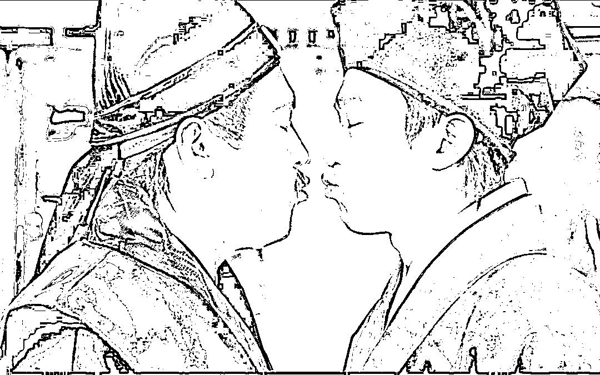

# 深圳宾利姐，真的愚蠢么？

> 原文：[`mp.weixin.qq.com/s?__biz=MzU3NDc5Nzc0NQ==&mid=2247517636&idx=1&sn=0b468e01436dde405d7b877594b68b2a&chksm=fd2e271aca59ae0c2934d76559c26968fa90ff494ef57ed050c883ac5b8e155658dd40bec7c2#rd`](http://mp.weixin.qq.com/s?__biz=MzU3NDc5Nzc0NQ==&mid=2247517636&idx=1&sn=0b468e01436dde405d7b877594b68b2a&chksm=fd2e271aca59ae0c2934d76559c26968fa90ff494ef57ed050c883ac5b8e155658dd40bec7c2#rd)

后台很多人跟我说，深圳宾利姐与路虎哥干架，还转给我视频，干架的视频。

什么原因呢？据说是一个车位，宾利姐说她买下了，有合同。但是路虎哥不认，因为深圳有规定，小区车位属于全体业主，于是占着，占了一个月。

是可忍姐不可，姐操起电话就摇人，让人把路虎哥的车子给堵起来，先堵他一个月再说。

没想到来人不给力，只是开了一辆 7，80 万的车，姐觉得没面子，掉份。 

继续操起电话摇人，让人把自己家里的 50 辆宾利开来.......

到这里其实我已经懵了，50 辆宾利？ 

很多网友都在议论，她为什么这么有钱？她家是干啥的？ 

我懵的原因是她为什么有 50 辆宾利？难道是开婚庆公司的？

你看，我比大多数都更懂人性一些。就像你去点菜，看到推荐菜里有一道叫花鸡，你会不会点 50 道叫花鸡？ 

洪七公来了也不会点 50 道叫花鸡。

正常人，无论她多有钱，她哪怕是唐僧的老婆呢，她为什么要连着买 50 辆宾利呢？

就像很多年前的一个笑话，如果在 KTV 里，你看到人家掏出一个宾利的钥匙，有没有可能是有钱人？有可能。 

但是如果对方掏出一把钥匙，什么宾利，劳斯莱斯，各种钥匙几十把.....

元芳，你怎么看？

这人多半是配钥匙的......

当然，宾利姐肯定不是配钥匙的，因为她也是那个小区的业主之一，那个小区房价每平米 18 万。 

接下来，轮到路虎哥登场，他一出场我就惊了。 

因为双方扭打起来，我以为到这一步，宾利姐完胜了，毕竟她是女的嘛，一般来说，公共事件，走到男女对殴这一步，男人就已经输了，舆论上输了，社死。 

没想到啊没想到，路虎哥不愧也是有钱人，他没有说，我大意了，没有闪。而是上来就躺平，倒地不起。

马保国老先生要是有路虎哥这觉悟，当初那场比赛也不会输。 

我相信对手一定跪地认输，表示，马老，您还是起来吧，我错了，我认输。

你要知道，路虎哥躺倒的那一瞬间，宾利姐根本就没有出手。 

他躺的是那么自然，那么娴熟，以至于我都开始好奇，他的路虎究竟是怎么来的？ 

难道就是在这一次次躺平中，碰瓷碰来的么？ 

接下来，再度刷新了我的认知，因为我发现，宾利姐，毫不犹豫的，也躺平了。

果然，同行碰同行。唐伯虎遇到了对穿肠。 

看来躺平碰瓷的确是发家致富的不二法门，难怪年轻人都这么喜欢躺，果然，躺平才是王道。 

我本以为俩人就这么一直躺下去，躺到地老天荒，就像唐玄奘与鹿力大仙比赛打坐，但坐个一二年，也无妨。

没想到啊，没想到，还是宾利姐先忍不住，犯下了全场最致命的错误。

她急了，她急了，她开始不顾一切的摇人，这次，被她摇到的，是一位国企的老总。

据她说，那是她老公。 

问题来了。你们以为重点什么？ 

互联网上，很多人都在议论，这个国企的老总，年薪只有小几十万的人，怎么就家里有 50 辆宾利呢？ 

很快，那家国企出来解释，我们老总和她不是夫妻关系，我们老总单身，她只是老总的女朋友。

这些是重点么？不是的。重点分两部分。 

第一部分，是非。这位老总，已经被展开调查了。无论他和那位宾利姐是什么样的男女关系，牵扯到公共事件当中，身为公职人员，被调查不可避免。 

这一部分，有相关职能机构去做，不是我聊的重点。 

我说过一万次，我不是法官，我是给你们提供服务的。咱们号大部分读者的诉求很简单，是通过阅读，自己能够得到什么。

这就是我要说第二部分的重点，人性。

我们是个看人性的号，不是个看是非的号。 

就像[昨天大号聊 120 的那件事](http://mp.weixin.qq.com/s?__biz=MzU0MjYwNDU2Mw==&mid=2247505848&idx=1&sn=a9e28093267855d1b356cf739bc1ba79&chksm=fb1abbc4cc6d32d2a185b6f118c8c49eb45c8920f210c3b388795e0c95139b15cd57d6a5dc33&scene=21#wechat_redirect)，我为什么阑尾炎急性发作当年打的是 110，不是 120？

因为 110 是行政主体，120 是民事主体。我拨打 120，是的，我们的对话是会被录音。但是，只有对方表示同意出车的那一刻起，我们之间才签订民法框架下的合同。

如果这期间有任何问题，比如 120 慢了，当事人会丢掉工作，但是你注意，丢掉的仅仅是一份工作。 

反过来讲，如果我第一时间求助的是 110，我们的对话同样会被录音，我拨打的那一刻起，对方就已经要承担行政责任了。如果这期间出了什么问题，对方担责丢掉的，可不是一份工作，那是一份公职。

工作根本就不值钱的，慢则三年一换，快则一年一换，就算不被裁员，自己也会跳槽。 

而公职则不然，你看近期的电视剧，讲派出所的故事。北大法学硕士，入职派出所，985，仅仅做辅警。电视剧也开始跟上互联网热点了。

说明什么？说明公职十分难得，不是今天才难得，20 年前我打电话的时候同样难得。

这只是其一。其二，我与 120 之间，是两个平等的民事主体，110 和 120 之间，是有行政命令的管辖权限的。 

你说 120 是接到我的电话紧张，还是接到行政主体的电话紧张呢？ 

你注意，我讲的都是人性而已。20 年前，在我打电话之前，我完全不清楚对方是谁，什么性格，是否足够负责，我统统不清楚。 

但是我理解基本的人性以及这其中彼此的关系。

我理解彼此的关系，不稀奇。因为我所有的亲戚，都是在体制内的。我出生在省军区干休所的子女家属院里，所有的直系的，旁系的亲属，要么在物价局，邮局，粮食局，电信局，公安厅，银行，医院，高校，印钞厂，等等等等。 

换句话说，还没走上社会之前，社会上各个部门之间的关系，人们的基本想法，我是清楚的。 

高校里老师们怎么想，医院的医生们怎么想，行政机构的工作人员怎么想，我在未成年之前，通过了解亲戚，大体上有个认知。 

那么我们回来看宾利姐的问题，她为什么第一反应是摇人，要弄 50 辆宾利来堵车？ 

原因很简单，四个字，以钱压人。

她习惯了，她默认钱多的压钱少的，所以她的第一反应才这么搞笑。 

你不是叫一只叫花鸡么？我叫 50 只，看谁撑死谁。

搞笑归搞笑，但是这个逻辑就打这儿来的。 

当第一反应不起作用的时候，她开始了第二反应，是什么？

也是四个字：以势压人。

这就是她为什么要祭出自己男友的原因。

她男友一年赚多少钱不重要的，重要的是，她认为有用。

有没有用呢？某种情况下，是有用的。 

有钱人的钱，有两种，一种是做生意的有钱，一种是纯粹流动性的有钱。 

前者的有钱，是有很大制约的。 

一个富翁，话说身家一百个亿，并不是说他能够掏出 100 个亿的现金。这个所谓的身价，很多时候是以非常复杂的形态存在的。

他名下的物业可能抵押出去了，钱投入到了某些公司，以股权的形式存在。这些公司可能又牵扯到某些大项目里。

换句话说，动一发而牵动全身，一处有问题，很可能就像胡雪岩一样，哗啦啦，楼塌了。

10 年前，我在头部甲方，伺候大领导，每天都见到乌泱泱的亿万富翁们，在门口排着求见。 

为什么？因为有求于人。这个有求于人的程度，不仅仅是在面对领导的时候。 

而是在面对所有人。

没有谁能成你的事儿，哪怕大领导力挺，也不一定有用。但是人人都能坏你的事儿，哪怕仅仅是个管网络的。 

真的可以，他让你们的设备慢点，你可能就中不了标。你中不了标，也许资金链就崩了，也许市场传闻怎么怎么样，股价就塌了。 

这就是为什么他们如此紧张，我以前开玩笑说，一个月薪 3000 块的底层的项目部打杂的，本科刚毕业的小伙。一通电话，让一个准上市公司的董事长，连夜飞过来。

都不用讲为什么，都不用讲是谁要见你，一句你来，对方巴巴的就赶夜班飞机连夜飞来了。

他也不敢问，到底为啥，也不敢问，谁有事儿叫他。 

因为他很清楚，生意就是这样，越大的项目不确定性越多，一点变数，就有可能让他从富翁，变成负翁。

所以紧张。

大家都是生意人，连躺起来的姿势都那么相似，所以宾利姐才会用这一招去吓唬路虎哥。 

她的潜台词其实就是说，你难道没有生意场上的事需要担心，需要紧张么？这就是一种威胁。 

但是她忘了，这么做，会坑死那位男友。 

也有可能，她根本不在乎男朋友的处境，她只是一个生意人，和你谈朋友，也只是为了自己有好处。

商人自古重利轻别离，也不会在乎什么名声。所以，我们的读者中，那些有公职在身的，要小心了。

你要明白，公职可不仅仅是一份工作，得来不容易，丢掉是很容易的。每个接近你的人，都可能另有所图，而每个和你走得近的人，都有可能无意的，或者有意的，让你失去自己终身奋斗的一切。

从这点上看，我倒还是蛮喜欢，[咱们之前没有聊的那位李达康同学](http://mp.weixin.qq.com/s?__biz=MzU3NDc5Nzc0NQ==&mid=2247517449&idx=1&sn=3b0a3cf392f136198bb327c3cb36e648&chksm=fd2e27d7ca59aec175b9860382553f2c67c33d9f1b01795bc04e017cfc2a06d1717bcd595ceb&scene=21#wechat_redirect)。 

是他过于爱惜羽毛么？ 

不，是身为公职人员，本就不应该与别人走得太近，尤其是商人。