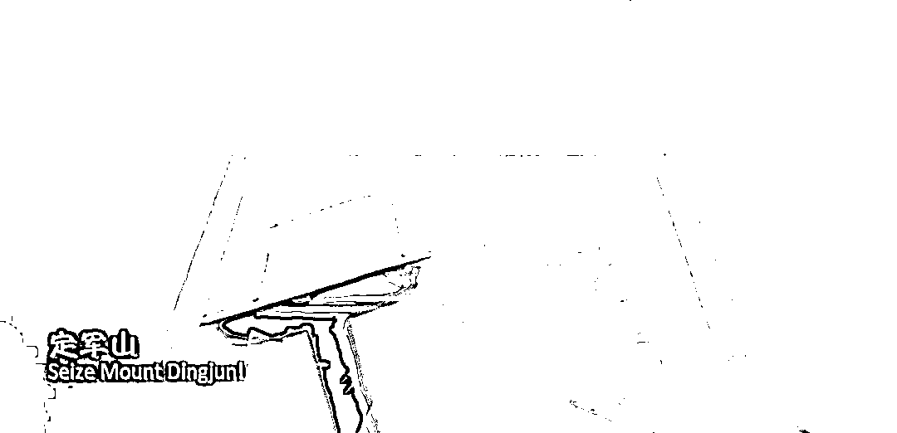

# 请记住：D2809 列车的司机，叫杨勇

> 原文：[`mp.weixin.qq.com/s?__biz=MzU3NDc5Nzc0NQ==&mid=2247517424&idx=1&sn=e9c020b17d90b4bc762c028c24c9270e&chksm=fd2e262eca59af38a2eb7ae9d49f428301c9b4de8dabb2ee3067593a05cb8ad6168e15c0a3d1#rd`](http://mp.weixin.qq.com/s?__biz=MzU3NDc5Nzc0NQ==&mid=2247517424&idx=1&sn=e9c020b17d90b4bc762c028c24c9270e&chksm=fd2e262eca59af38a2eb7ae9d49f428301c9b4de8dabb2ee3067593a05cb8ad6168e15c0a3d1#rd)

很多读者都在后台让我评这件事，D2809 次列车在贵广线榕江站突遇泥石流，导致 2 节车厢脱轨，造成 1 死 8 伤的重大事故。 

紧急救援已经展开，我们静待后续的调查结果。 

目前我看到的已经披露的内容只有这么多。但是这短短几个字里面，有一个人，让我十分动容。 

这个人就是事故中唯一的死亡者，他是本次列车的司机，他叫杨勇。

经车载数据显示，当司机看到泥石流埋了前方铁轨的时候，他没有选择第一时间逃往后续车厢，以避免自己的死亡，而是毅然地拉下紧急刹车，用尽全身力气拉下刹车，保持这个姿势，直到五秒后，车头撞上泥石流，以身殉职。

他如果不这么做，也许自己可以活，但是整辆车会有更高的伤亡。在生命的最后一刻，他选择了慨然赴死。 

主动的。 

义之大者，可以先人后己；义之尤大者，可以慨然赴死。

.......

有人可能希望我煽情，说一些一路走好的话，或者，...... 

这些我都不想说，我只想转发一个视频，今天的背景图就截自这个视频，定军山，来自官媒，人民日报与河南卫视。

我们先压下悲痛的心情，来看看这个视频。

📹 [`v.qq.com/iframe/preview.html?width=500&height=375&auto=0&vid=i3341xtuxdt`](https://v.qq.com/iframe/preview.html?width=500&height=375&auto=0&vid=i3341xtuxdt)视频中这个人叫做黄忠。与小说中不同，历史上没有五虎上将，有的是四位。 前将军关羽、右将军张飞、左将军马超、后将军黄忠。前两位就不用说了，主角，而且是刘备团队的创始元老，出场次数太多，大家太熟悉了。马超也不用说，累世公侯，名头不下吕布。 黄忠此前是刘表的手下，后来曹操南侵，黄忠归属长沙太守韩玄统领，可以讲，他的前半生，籍籍无名。 黄忠是凭什么身居后将军之位，与关羽，张飞，马超并列于历史舞台之上的呢？ 就是视频里的定军山之战。西风烈，吹长髯，须发如雪铁甲玄。定军山，大丈夫舍身不问年。 定军山，念人生如同雕翎箭。百战余勇，我以丹心见苍天。歌词里的雕翎箭，不只是寓意黄忠用箭，更重要的寓意是，雕翎，谐音凋零。**人的一生，有进无退，向死而生，如同一支射出去，逐步凋零的箭。** 大部分开悟的男性，都会困扰于一个问题，那就是我此生何为？或者说，怎么才算真的活过？ 在生命的最后一刻，杨勇已经做出了选择，视死如归，我们应该尊重他的选择。**此时此刻，他需要的不是眼泪，而是懂他的人。**看得懂他选择的人。......一个男人，不在于活多久。就像一本电影好不好看，不在于有多长。 我看过很多好莱坞的大片，很多了不起的英雄，这了那了。比如美国队长，蜘蛛侠，钢铁侠，...... 现实中灾难发生时，漫威系列中的人物我一个也没见到，但是今晚，我们都认识了这位司机，他叫杨勇。 黄忠，忠诚的忠；杨勇，勇敢的勇。 他死了。今夜，他死了。是的，那又如何？我们谁不会死？你不会死还是我不会死？我们每个人都会死，可是我们真的活过么？我们死后真的有人会记得我们吗？有多少人？又是什么样的人呢？他死了吗？杨勇死了吗？不，他只是活出了意义。他从此活在了我们所有人的记忆中。他活在了所有懂他的人的记忆中。.....他像一支箭，一支凋零的箭，射在泥石流上，那一刻，榕江站就是他的定军山。

定军山，我愿以今日换余年，定军山，我愿以今日换余年......杨勇。杨勇。杨勇。