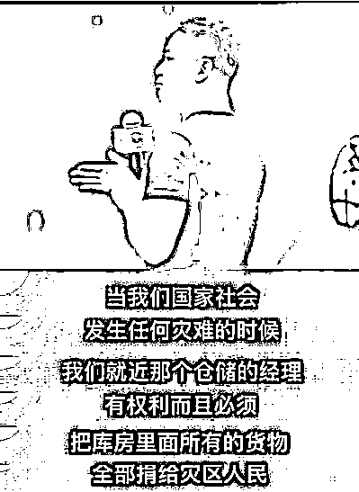
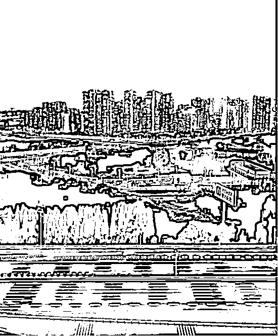

# 东的 stop，与京东的 Don't stop

> 原文：[`mp.weixin.qq.com/s?__biz=MzU3NDc5Nzc0NQ==&mid=2247515524&idx=1&sn=f96e0db651108ecd8e530a64a950380b&chksm=fd2e1f5aca59964c3c3549d29023bc6c0fd4a0807b88470fe24d55c3574d1aab25a44735751b#rd`](http://mp.weixin.qq.com/s?__biz=MzU3NDc5Nzc0NQ==&mid=2247515524&idx=1&sn=f96e0db651108ecd8e530a64a950380b&chksm=fd2e1f5aca59964c3c3549d29023bc6c0fd4a0807b88470fe24d55c3574d1aab25a44735751b#rd)

大号写过一篇[天价的团购，与进驻上海掉链的京东](http://mp.weixin.qq.com/s?__biz=MzU0MjYwNDU2Mw==&mid=2247504948&idx=1&sn=58133350952d6f76cccc22ffc36d8db6&chksm=fb1ab848cc6d315e49c90ed75e0b483d5b51bd7b17d494f8fd43dce876d8687c5a6d223c4013&scene=21#wechat_redirect)。

我曾经说，老百姓是很单纯的，赚钱了就叫蔡哥，赔钱了就叫菜狗。 

京东也曾经享受过同样的待遇。起初上海人民买不到平价菜， 京东说卖，直播间被挤爆了。 

回头东西的发货日期一个劲的延后，两个礼拜都到不了，京东被骂惨了。

按说这事儿就结束了，知难而退也不算啥。上海肯定是缺快递小哥的，但是快递行业没有任何门槛。如果真的受不了了，资金吃不消快递费的上浮了，一定有办法把部分阴性的居家隔离的青壮年男子就地划归临时快递小哥。 

没有这么做，说明里面一定有些博弈和考量，市场的，或者其他方面的，是我不知道的。

如果我是个商家，就算了，就当吹出去的牛皮没有兑现，拉倒吧。

我这人比较保守，不乐意搅合到不确定的生意当中。不晓得有多少麻烦要处理，有哪些人要得罪，还得亏钱。这买卖我不做。

但是京东没有，这家公司直接开了 14 路快递大军做自杀式服务。 

所谓自杀式服务，就是一拨人冲进去，不出来了，将来出来的时候，就地隔离 14 天。

不是一拨，是 14 拨。 

来自湖北的，来自河南的，他们抽调了全国的大军，浩浩荡荡开进上海。 

有没有质的变化？有。 

从数据上看，京东派往上海的快递人员是上海目前留存的快递人员的 50%。

这么大的量冲进去，肯定会有效的平抑快递的费用，让市民们感受到尽量接近平价的服务。某些人送两个月快递，回老家买房的梦想要破碎了。 

这么做有没有问题？当然有，别的不说，光京东自身的亏损就明摆着。 

这是个人情，也是个赌局。赌将来上海人民会不会记住，会不会还。

结果不清楚，但是他们要冒的风险，和当下账面上的亏损，都是实实在在的。 

这就是我们标题里的后半句，京东的 Don't stop，京东不要停，快递不要停，上海人希望京东，Don't stop。

前半句是调侃的，你们知道，曾经我调侃过那事儿。 

所谓学英语，东，stop 与 Don't stop，傻傻的分不清，以至于闹出了误会。

我今天在这里表个态，是我浅薄了。 

有时候，疾风知劲草，板荡识忠肝。评价一个人，确实不能只看小节。

难怪电视剧里刘罗锅对乾隆说：以貌取人者，岂是贤德人。

乾隆这人挺肤浅的，一辈子都喜欢那种漂亮的，体面的人才。后来就喜欢上了和珅这种。 

和珅肯定是人才，仪表堂堂，才华出众。遗憾的是大节有亏。

这个世界有时候就是这么奇怪，小节无亏的人，未必大节过得去，大节无亏的人，有时候不拘小节。 

我们来做个选择题。 

现在要三选一，下面是关于三个候选人的一些事实：

候选人 A：跟一些不诚实的政客有往来，而且会星象占卜学。他有婚外情，是个老烟枪，每天喝 8 到 10 杯的马丁尼酒。

候选人 B：他过去有过 2 次被解雇的记录，睡觉睡到中午才起来，大学时吸鸦片，而且每天傍晚会喝一大夸特威士忌酒。

候选人 C：他是一位受勋的战争英雄，素食主义者，不抽烟，只偶尔喝一点啤酒。从没有发生婚外情。

请问你会在这些候选人中选择谁？

如果是我，我完全不可能考虑 AB。 

A：婚外情说明一个人不可靠，老烟枪，酗酒，在我这个不抽烟不喝酒的人看起来，根本就是没有自制力的表现。 

B：解雇一次也许是行业变迁，解雇两次，该不是这人能力有问题吧。何况睡到日上三竿才起来，还有过吸毒记录。这种简历我看都看不下去。 

C：完全符合我看人的标准。这些已经披露的生活细节会让我第一印象就产生好感。

但是看了答案之后，我默然无语。 

A 是罗斯福，B 是丘吉尔，C 是希特勒。

其实这种错误，人们时常犯，就比如蒋介石与汪精卫。 

如果只看艳电之前的部分，汪精卫一表人才，是学霸，中过秀才，广州第一名，刺杀摄政王载沣，写过引刀成一快，不负少年头。

对比过去，蒋介石是青帮弟子，炒股破产，寻花问柳得过那种病，据说就是因此光头。

这俩人简直不能比。 

但万没想到，前者最后在大是大非面前，一百八十度大转弯。 

所以，人这东西，真的是好复杂。 

当然了，上面举的这些例子，不能改变我们对于小节的看法。 

错的始终是错的，但是，在大是大非面前，我们往往更能看到对方的底色。 

他是这么说的，也是这么做的。

京东此举，超越了一个商业团体的本职，令人肃然起敬。 

即便是素日的反对者如我，也愿意放下成见。 

这样的企业不多，希望疫情过后，上海的消费者真的能够记住他们，他们值得。