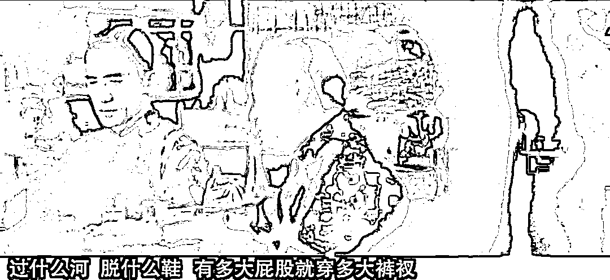

# 这对上海来的母女怎么就不能在杭州自由的逛街呢？

> 原文：[`mp.weixin.qq.com/s?__biz=MzU3NDc5Nzc0NQ==&mid=2247515245&idx=1&sn=d95aa5a3e85525adf60fd18496bb617e&chksm=fd2e1eb3ca5997a5c6557b784ac99bc179fa9da31fdb8c00424295ede68729a22c151c4bc930#rd`](http://mp.weixin.qq.com/s?__biz=MzU3NDc5Nzc0NQ==&mid=2247515245&idx=1&sn=d95aa5a3e85525adf60fd18496bb617e&chksm=fd2e1eb3ca5997a5c6557b784ac99bc179fa9da31fdb8c00424295ede68729a22c151c4bc930#rd)

昨天我被骂了，因为大号一篇文章：[这对掀翻半个杭州的母女，相当反常](http://mp.weixin.qq.com/s?__biz=MzU0MjYwNDU2Mw==&mid=2247504805&idx=2&sn=87a83f90ead2223382ceefa4ed5c8a58&chksm=fb1abfd9cc6d36cf98b71be571cbbfcc00453edbb8cdf675aa1ec5c883b2d5dccbf7845780db&scene=21#wechat_redirect)。 

骂我的理由简单地讲，一句话，如标题。 

有些读者问我，人家想逛街是人家的自由，碍着你碧树西风什么事儿了？人家逛街又没花你钱，你就那么见不得人逛街？ 

........

此处省略五百字，各种骂我的话。最后的结论很简单，西风，你欠那对母女一个道歉。

对不起，我不打算道歉。 

第一、这对母女有手机，她们从上海到杭州，逛了一整天，最后被大白定位到的时候，就是因为开机。 

此前她们一直不开机，所以定位不到。一开机，大白就赶到了。

有手机是怎么从上海到杭州的呢？ 

她们撒谎，说自己没有手机。没有手机就没有健康码和行程码，于是在上海南站用检测点工作人员的手机上的绿码上的火车。

到杭州后，理由仍然是没有手机，所以填写了一份承诺书。接下来就开始了早高峰地铁之旅以及各种商圈闲逛。 

第二、这对母女逛街的时候，被监控拍下来，她们摘掉了口罩。 

也就是说，她们进商场安检的时候戴着口罩，一进去，就摘掉。

第三、她们在杭州没有定酒店。没有午休，晚上闹腾到 9 点，10 点，11 点，仍然不定酒店。

请你给我一个合理的解释，既然你这么力挺她俩。 

没手机？没手机后来怎么开的机？一开机就被定位，就被大白找到了。大白们心急如焚找她们找了十几个小时。 

没钱所以不定酒店？这天气在杭州睡公园？你开玩笑呢吧？杭州又不是三亚。 

何况你说没钱我也不信呀，你看看这对母女逛的都是什么地方？都是高级商场。你要是真没钱，你挤早高峰的地铁跑去四季青批发市场逛去，没人怀疑你。

何况，说一千道一万，你为什么撒谎呢？ 

你明明有手机，你只要开机就知道自己是阳性了。你就是不开机，你借别人的手机，你信誓旦旦的跟人说你没有手机。 

这一路上你得跟多少人说你没有手机？你得写多少份保证书？ 

你都写了，你们母女俩是一路撒谎撒过来。

是可忍孰不可忍。叔可忍，婶都不可忍。

我把话撂下了，如果不好好查查她俩，干脆来查查我得了。

我虽然有点近视眼，可我脑子没近视！ 

昨天一直有读者跟我杠，杠的理由居然是她们有撒谎的自由。 

有手机不开机，是人家的隐私，人家乐意，西风你管得着么？ 

是，我管不着。

但是我清醒且理智的告诉你，在大是大非面前，你一味的强调个人自由，是要付出难以忍受的代价的。 

我们很多人张口自由，闭口自由，你懂你在说什么吗？ 

我这个在国际市场里浸泡了十几年的人，这个听美联储讲话比听相声还适应的人，今天来给诸位普及普及西式自由的起源。 

众所周知，我们是源自农耕文化，这一点我提过很多次。 

农耕文明的积累财富是与时间线行相关的，你种地的时间越久，积累的财富就越多，所以很容易就产生地位与时间的关联。

我们尊老。并非老头能力有多牛，而是因为老头种地的时间久，他积累的财富多，话语权就大。

海洋文明则不然，出海交易很大程度上取决于概率，也就是不确定性。

你如果顺利返航，就会有十倍百倍的利润，一夜暴富，反之就葬身海底。

也就是说海洋文明下，一个人的财富获取与时间没有那么强的关联性。 

所以海洋文明更崇尚冒险，更尊重力量。

一个老头在海上活下来的机率有多大？可想而知。而且概率本身就告诉你久赌必输，如果你一辈子都在出海，迟早死在风浪里。

所以海洋文明从来不崇老，他们更看重某一次的暴富。 

其实这一点在游牧民族身上也能看到，游牧民族同样不尊老，他们尊重力量。你力量最高光的时刻，就是你地位最高的时刻。 

正是基于生存模式的不同，所以对人生的追求就不同。

农耕文明正是因为开启了种地属性，所以更看重传承。老子种下的地，希望留给儿子，《白鹿原》里的祠堂就是这么诞生的。 

作为海洋文明，是不可能诞生祠堂的，你脚下是条船不是陆地，所以他们对生命的理解就是高光时刻。

比如曾经在某一次抢劫中，你第一个踏上对方的商船，你的故事在海盗圈里流传。

这个演变到后来就是奥林匹克，更高更快更强，你人生中最高光的瞬间被记住。

这里面无所谓对错，仅仅是文化形态的不同。我们今天其实大部分农民都已经进城了，问题是， 农耕文明的文化属性的变化，可没有那么快。人们观念的变化，可没有那么快。

站在这个基础上，你去看疫情对人的影响。

美国死于疫情的人已经突破 100 万了，真的只有这点吗？按照各国的统计，这两年来，全球死于疫情的人是 600 多万，可是如果按照以往的死亡数据统计，这两年比此前的那些年，全球多死亡了 1800 多万人。 

能理解这意思么？就好比这个地球，每年死亡人数都差不多，一直是 X。可是自从有了新冠，每年都要多死 900 多万。 

什么是真实数据？这才是真实数据。否则这两年来多死的 1800 万人怎么解释？

换句话说，美国死于新冠的，绝对不止 100 万人。 

我们用 1800 万除以 70 亿，是 1/400。直观点说，如果你在小公司，有个同事消失了，如果你在大公司，部门里有个同事消失了。

这就是用你能感受到的死亡来给你描述过去两三年里发生的事情。

有人可能会讲，我看也都好好的嘛，一个公司消失一个人，消失就消失呗，天也不会塌。 

是的，不过这里你要注意，这就是我前面给你讲的，文化属性。

海洋文明当中，父母与子女的关系没有那么紧密。当爹的不会给儿子买房子，老了也不会要子女赡养。 

他们追求的是人生当中的高光时刻，并不是儿孙满堂。 

换句话说一个美国老人死了，死了就死了。没有你想象的那么大的波动。 

所以在整个西方，新冠肺炎的检测到治疗，都是自费的。你愿意掏钱，掏巨额的医药费确保自己的安全，那就掏，不乐意，那就听天由命。 

中国人很难做到这一点，很难。 

如果你老爹得了新冠肺炎，如果是自费的，一天治疗费上万，隔离老王掏得起，你掏不起，你什么感受？你就告诉我你难受不难受？ 

美国人不难受的，可是你会难受。

我们今天是免费的，所以你感受不到。你自己想想，如果是自费的，你什么感受？ 

美国人没有感受的，明白吗？没听过哪个美国老人生病了看不起，会找儿子买单医药费，没听过。 

他们的整个文化，价值观和我们完全不一样呀。

好，我们来想一想。如果我们的感染人数比例和美国一样，那是多少患者？以亿计。 

如果有这么多人感染，还可不可能像现在这样，治疗免费？可不可能？ 

当然不可能。所以如果这么多人感染，治疗一定是自费的。因为负担不起了。

你想想看，如果你年收入超过 500 万，你亲爹感染了新冠，你会不会让他跟家躺着听天由命？会不会？ 

绝对不会。 

那会出现什么？会出现你爹占用别人的医疗资源。

隔壁老王他爸脑溢血，送去抢救，你把医生拦下了，说，别给他爸看，先给我爸看，我出双倍。哪怕医生你被感染了，回头你的误工费，我也出。

谁是受害者？隔壁老王他爹。

就这么现实，这就叫医疗资源挤兑。老王只能眼睁睁看着医生被你叫走了，他爹跟那儿继续脑溢血。 

最后只剩一件事了，以后跟我这儿抬杠之前，都请先摸摸自己兜里到底有几个子儿，想一想，自己会不会是老王。

不是你风叔非要挖苦你，本山大叔怎么说来着？ 

话糙理不糙，骂你是为你好。

叶问都听进去了，你以为你谁呀？！