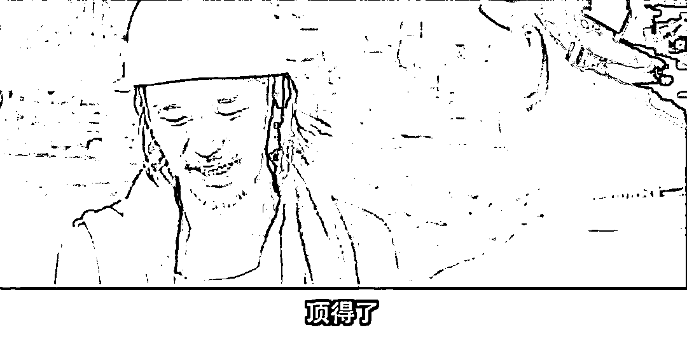

# 上海与深圳，注定要做先锋

> 原文：[`mp.weixin.qq.com/s?__biz=MzU3NDc5Nzc0NQ==&mid=2247514960&idx=2&sn=501d7da1880afc06fb1cc9275f4c55da&chksm=fd2e198eca599098e1cc1eb2ed565f7e6134369ee137d99ecd8160a02dca09500ab593212105#rd`](http://mp.weixin.qq.com/s?__biz=MzU3NDc5Nzc0NQ==&mid=2247514960&idx=2&sn=501d7da1880afc06fb1cc9275f4c55da&chksm=fd2e198eca599098e1cc1eb2ed565f7e6134369ee137d99ecd8160a02dca09500ab593212105#rd)

我看了下读者分布，咱们的读者位于长三角和珠三角这两个地区的人数占比高达 42%。

如果加上北京，那就妥妥的过半，我们有超过 53%的读者位于北京，长三角和珠三角。

我曾经说过，我们经济活力最活跃的地区就是这三个，看来和读者分布很接近。

因为上海的疫情，也因为此前深圳的疫情，很多读者在问我对于后续的看法。

首先我没有那么乐观，很多读者跟我说，疫情明年就会消失了，问题是，我每年都会收到这些说法。

那么我看问题，倾向于在最糟糕的情况下，就是说，我们不去思考疫情到底什么时候消失。

如果这样的话，最有可能发生的状况是什么？

我个人的判断，最有可能发生的就是长三角和珠三角顶在前面，这就是我此前说的所谓三级防御。

长三角里面上海顶在最前面，珠三角里面深圳顶在最前面，围绕上海和深圳，这就是第一级防御圈。

长三角，珠三角，构建第二级防御圈，其余的地方构建第三级。

越靠近前沿阵地，就越倾向于两手都要硬，所谓两手实际上就是非常困难的。

说白了就是既要又要也要还要。

既要保持对外接触，又要动态清零，也要保障生产，还要防止传给内地。

我清楚这 42%的读者的感受，情绪，包括怨言，都清楚，咱都是人，你说没有牢骚只有觉悟，那是不可能的。

不过我为什么有这样一个预判，很简单，往大了想，往小了想，两件事想明白，你就知道这很可能是个大概率事件。

往大了想，其实财政盈余的，或者说经济活力很强的，也就两个区域，长三角，珠三角。

古时候江南财赋半天下，那么站在今天的视角看，长三角珠三角加起来还不止半天下。

所以从大的角度想，如果你把不同的区域看作一个家庭的成员，这俩成员就是负责挣钱的，你是顶梁柱嘛，你没有办法退缩，也不允许你退缩。

任何时候，挣钱都是必须的，没有讨价还价的余地。

那么往小了想，站在个体的视角，你也没啥退路。

你说每天背个电脑往家赶，或者在公司里打地铺，成天这样被检查来检查去，打仗一样，都要神经衰弱了。辛苦不辛苦？

辛苦。

可是，有多少人，就说咱们这 42%的读者里面，有多少人可以不用工作？不用遭受这份辛苦？

内蒙古草原上倒是天苍苍野茫茫，见不着人很安全，问题是，你跟那儿待在，怎么挣钱呢？

我这话说的很难听，但这就是事实嘛，事实上你也没啥选择呀，就算你想当个逃兵，也没这家庭条件。

难听的说完了，开导大家两句。

有些事儿，你得学会自己想开。

所谓权责对等，能力越大，责任越大，或者说得更实在点，钱难挣，屎难吃。

如果经济压力很大，你跑去第三防御圈，或许更安全些，可是挣钱的机会就更少些。

能理解我这意思么？如果上海深圳都不好找工作，长三角珠三角更不好找，出了这个圈子回老家就更不好找。

想挣钱那就只能硬着头皮往上顶，这就叫权责对等。

你看到很多总经理常常被资方骂的狗血喷头，甚至跳楼的都有，他们从来没地儿诉苦去，说什么压力太大，说什么资方不人道，没机会的。

资方给总经理打电话的时候从来不管现在几点，哪怕是凌晨三点，想骂就骂。

这就叫总经理待遇。

部门经理跟员工打电话还真不能凌晨三点，人家真的会告你，这就叫拿多少钱，办多少事儿。

普通员工拿的钱少，承受的压力也小。

可是你撤了总经理，让他去做个普通员工，他乐意么？他还不乐意呢。你提拔一个普通员工当总经理，他乐的屁颠屁颠的。

这说明什么？说明人还是爱钱的嘛。

只要人性不会变，模式就不会变。说到底，大家都是为了生存，或者更好地生存。

有些苦，你爹吃了你就不用吃，你吃了你儿子就不用吃。

就像《长江七号》里包工头问星爷的那句话，他说：你拿什么顶？

星爷说：顶不住也要顶。

其实大家都是人，谁也不是铁打的。

但是有些话怎么说呢？算了，没必要说。