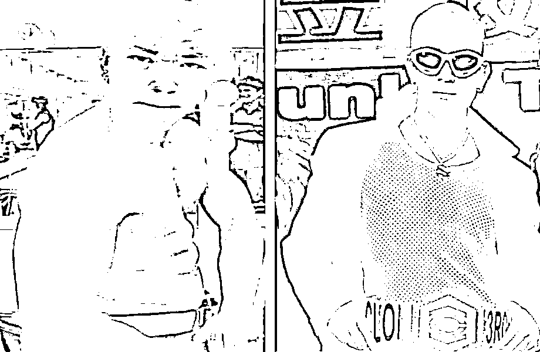
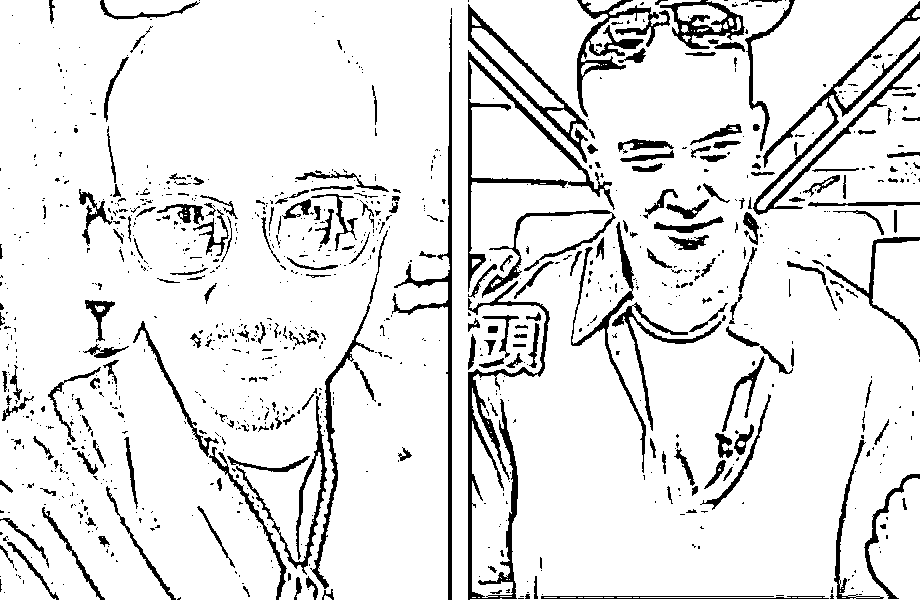
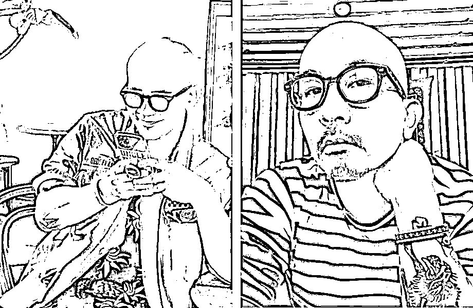
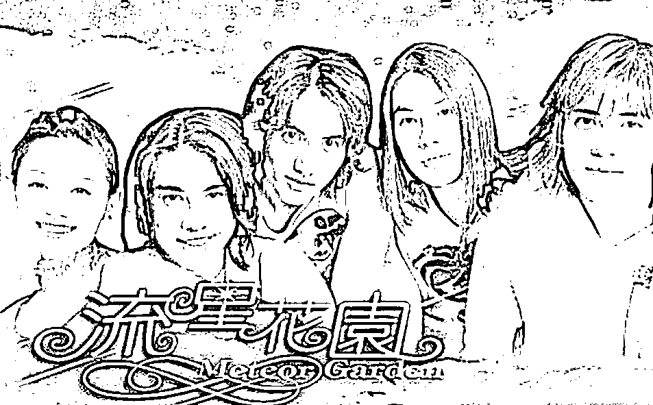

# 从爱你老，爱你不洗澡的韩国歌手，到韩国版懂王的上台

> 原文：[`mp.weixin.qq.com/s?__biz=MzU3NDc5Nzc0NQ==&mid=2247514194&idx=1&sn=f00be26550c396b786eec64b62b7767f&chksm=fd2e1a8cca59939ad43ac2bf3fe1111ef164d0021a6eed6fc3ee8a502ec3ffcf75a56b822d58#rd`](http://mp.weixin.qq.com/s?__biz=MzU3NDc5Nzc0NQ==&mid=2247514194&idx=1&sn=f00be26550c396b786eec64b62b7767f&chksm=fd2e1a8cca59939ad43ac2bf3fe1111ef164d0021a6eed6fc3ee8a502ec3ffcf75a56b822d58#rd)

连续的宏大叙事，该引入一点庸俗的话题了。 

有句话怎么说来着？哪怕地球不长草，在那之前，也得让咱把相声先听了。 

大 S 再婚了，想知道新郎是谁吗？ 

我不认识，但这个长相，我只能表示，呵呵。

我第一次知道有大 S 这么个人，是大学里，二十年前了，流星花园。我一直为杉菜能看上的，起码长这样。

而且还得是贵公子。 

后来嫁给了汪小菲，虽然不帅，但至少比王思聪看着瘦点，而且据说，还是一个每次吃虾都为大 S 剥壳的男人。

当然，后来就不提了，很明显选错了，所托非人。

那么大 S 与汪小菲离婚后，很快闪婚了，对象就是我们前贴的，某个韩国的过气歌手。

不过据说是大 S 的初恋，至今未婚。

但是这个相貌，呵呵。

也难怪，大 S 的妈妈气得高血压发作。 

话说这，到底看上他什么了？真是爱他老，爱他不洗澡？ 

当然大 S 自己也不年轻了。 

我忽然间发现一个道理，身为男性，只要有耐心，万年的备胎也可能转正。

身为女性，有时候还是要管理下自我预期的。

刚开始的时候，心高气傲，或许真的是非普京不嫁，生活中遇到一点挫折，所托非人，目标又急转直下，什么要求又都无所谓了。像极了散户的作风，入场信心满满，一个浪头打翻，急忙割肉。

不过无论怎么选，这个选择真是亮瞎了我们的眼。段子们手又要沸腾了，互联网上从此留下一个梗，你猜猜看，杉菜最后嫁给了谁？ 

很多人都不看好这段婚姻，不过我还是很看好的。 

听闻，这个韩国过气歌手，不仅事业无成，似乎生活能力也有问题，50 几岁的人了，吃鱼都要他妈给他剥刺。 

一个吃鱼要剥刺的妈宝男，配大 S 这样一个傲娇的老公主，说不定反而很幸福。

祝福他们，这次是真诚的。

聊完大 S，回答一些读者问题。

[自从那天大号文章之后](http://mp.weixin.qq.com/s?__biz=MzU0MjYwNDU2Mw==&mid=2247504457&idx=1&sn=b0b3257cfcfbb2ef1c48c3693dfcb92e&chksm=fb1abe35cc6d3723f968a998345bd229c4ef54cb2dcc560d54c2415e267e570b9e9d36e6a3b5&scene=21#wechat_redirect)，一直有读者在问，既然欧洲明知道美俄的剧本，为什么还要配合？

尤其是德国，即便德国失去了默克尔这样一个政治家，难道连基本的判断能力也没有了吗？

这个问题，我给你转一段小说，古龙的小说。你自己慢慢琢磨。 

旁白：最好的酒楼，最好的酒，他们一直都是派头很大的人。

燕十三道：“杀过人后，我一定要喝酒。”

乌鸦道：“没有杀人，我也喝酒。”

燕十三道：“喝过酒后，我一定要去找女人。”

乌鸦道：“没有喝酒，我也找女人。”

燕十三大笑，道：“想不到你竟是个酒色之徒。”

乌鸦道：“彼此彼此。”

他们喝得真不少。

燕十三道：“你既然是个酒色之徒，今天我就让你一次。”

乌鸦道：“让我什么？”

燕十三道：“让你付账。”

乌鸦道：“不必让，不客气。”

燕十三道：“这次一定要让，一定要客气。”

乌鸦道：“不必不必。”

燕十三道：“要的要的。”

旁白：别人吃饭通常都是抢着付账，他们却是抢着不要付账。

燕十三道：“要杀人时，我身上从不带累赘的东西，免得碍手碍脚！”

乌鸦道：“哦？”

燕十三道：“银子就是最累赘的东西。”

乌鸦同意。

一个人身上若是带了好几百两银子，还怎么能施展出轻灵的身法？

乌鸦道：“你可以带银票。”

燕十三道：“我讨厌银票。”

乌鸦道：“为什么？”

燕十三道：“一张银票也不知经过多少人的手传来传去，脏得要命。”

乌鸦道：“你剑上的明珠可以拿去换银子。”

燕十三又笑了。

乌鸦道：“这是笑话？” 

燕十三道：“天大的笑话。”

他忽然压低声音，道：“这些珠子都是假的，真的我早卖了。”

乌鸦怔住。

燕十三道：“所以今天我一定要客气，一定要让你。”

乌鸦道：“我若没有跟你来呢？”

燕十三道：“那时我当然会有别的法子，可是现在你既然已来了，我又何必再想别的法子？”

乌鸦也笑了。

燕十三道：“你笑什么？”

乌鸦道：“我笑你找错了人。”

他也压低声音，道：“我也跟你一样，今天本来也是准备来杀人的。”

燕十三道：“你也讨厌银票？”

乌鸦道：“讨厌得要命。”

燕十三也怔住。

乌鸦道：“所以我今天也一定要客气，一定要让你。”

燕十三正在叹气，掌柜的忽然走过来，赔笑道：“两位都不必客气，两位的账，楼下已经有人付了。”

是谁付的账？为什么要替他们付账？他们根本连想都没有想，问也没有问，对他们来说，这些都不重要。

能够白吃白喝，总是件很令人愉快的事。

我问你，是谁替他们付的账？ 

....... 

掌柜的这时候苦笑着走出来说，我不替他们付账行么？他们这样要死要活的，不就是做给我看，来吓唬我么？无论是打坏了桌椅板凳，还是弄出人命，他们一走了之，我开店的，跑得了吗？

说穿了就这点事儿。把世界看作江湖，这个江湖是五大流，哦，不好意思说错了，四大流氓，外加一位大善人制定游戏规则的。

如果两大流氓非要吃白食，大善人埋头赚钱假装没看见，那最后出来买单的，只能是一众小国。 

这不是欧洲愿意不愿意的问题，愿意又能怎么样，不愿意又能怎么样呢？

如果你是古龙小说里那位掌柜的，你也会出来买单的。没办法，权当给二位大侠一个面子。

给也得给，不给，也得给。

你没听出来么？人家出门吃饭，从来不带银子的.......

欧洲不是一个大一统的国家，这就使得一旦霸主崛起，欧洲不可避免的成为后院的肥羊。

没辙的，谁要他们历史上没有过秦始皇呢。

有些事情说穿了就那点事儿，舍得舍得。 

就像一个人很可怜，辛苦一辈子，最后在一线城市买了房，他这辈子是挺可怜的。问题是，他儿子一生下来就是京二代，沪二代，深二代。

你说这个二代，是该反思他爹当年吃苦那么傻，还是感恩得亏有个这么傻的爹呢？

历史上孟姜女也挺可怜的，但是换取了此后数千年的共识，以至于我们始终认为，在一起更安全，在一起更划算，无论经济上还是军事上。

生命就像接力赛，与其去感慨，去反思前人吃过的苦，受过的难，不如好好想一想，怎么跑好自己这一棒，怎么打好自己面前这局牌，怎么对得起前任换来的那一张张的牌。

文末，再回答一个问题，有些读者问，怎么看韩国版懂王以微弱的优势当选。

这个答案真的很简单，一言以蔽之，懂王我们都当个笑话来看，韩国版懂王，你觉得是什么？ 

有些读者觉得，这位有敌意的韩国版懂王的上台，我们值得反思，反思什么？反思为什么没有讨好他？ 

你太幼稚了，反思的话题，明天大号聊。

这里我就说一件事，[大号那天的文章](http://mp.weixin.qq.com/s?__biz=MzU0MjYwNDU2Mw==&mid=2247504457&idx=1&sn=b0b3257cfcfbb2ef1c48c3693dfcb92e&chksm=fb1abe35cc6d3723f968a998345bd229c4ef54cb2dcc560d54c2415e267e570b9e9d36e6a3b5&scene=21#wechat_redirect)，已经告诉你们一个事实。 

即便没有疫情，西方世界的资本主义在始终没有科技大爆炸续命的前提下，本身就会因为贫富差距带来深刻且尖锐的内部矛盾。 

疫情只是把一切都加速且放大了。如果这场俄乌之间的能源危机持续，通胀还会加剧，矛盾还会更尖锐。

换句话说，无论美国还是欧洲还是日韩，通通会有这个内部问题。这是人家的内部问题，不是你讨好能解决的。 

人家要你养，你养么？你就说你养不养？你不养活他们你就不可能讨好。

就这么简单。

年轻人，没有吃过苦头，蹦跶两下，让他们蹦，美国在懂王的鼓动下蹦跶了四年，蹦出什么了？只能蹦出更大的内部撕裂。 

撕裂就撕裂，谁也不是吓大的，我们又不是欧洲，我们可不是掌柜的，我们是燕南天。关公面前耍大刀，你当你是谁？ 

美国四年的戏都看过来了，有啥我们没看过的？ 

不要想着这个世界会回到从前，不可能。除非科技大爆炸，否则所有的资本主义国家都会出现各自的懂王。

他们折腾他们的，我们做好自己的事。