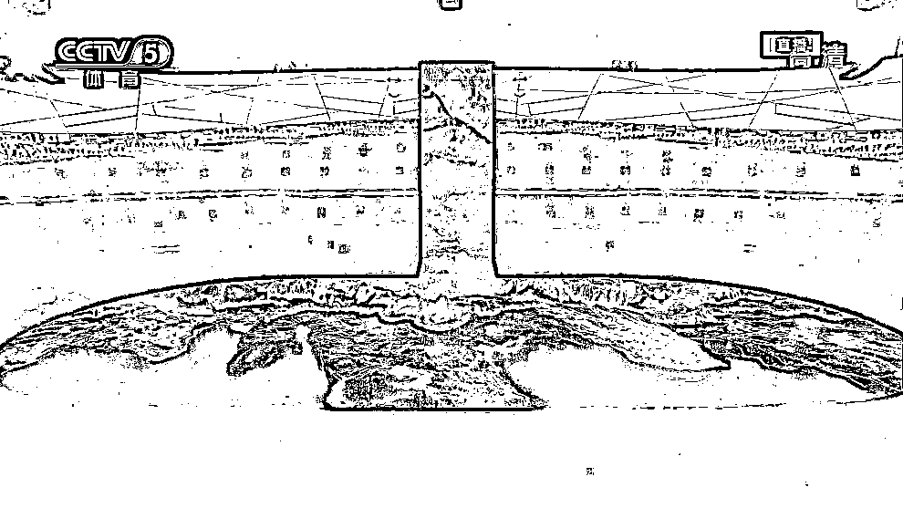
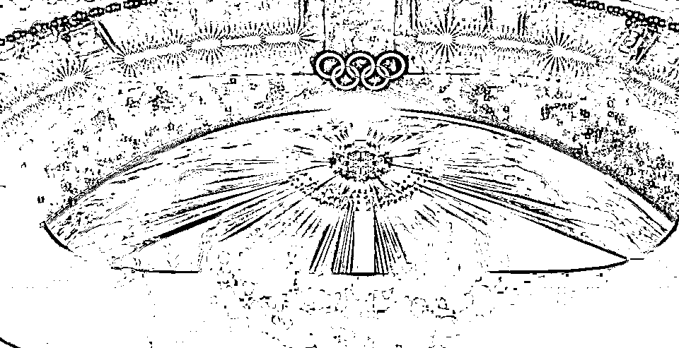

# 美联储还是那个美联储，张艺谋已经不再是那个张艺谋

> 原文：[`mp.weixin.qq.com/s?__biz=MzU3NDc5Nzc0NQ==&mid=2247512515&idx=1&sn=da134d42a4437a3c29b40050a807bb9a&chksm=fd2e131dca599a0b5ca274e269f9758da17f4739fb18a251e62f871c08102c5f5661387b75b7#rd`](http://mp.weixin.qq.com/s?__biz=MzU3NDc5Nzc0NQ==&mid=2247512515&idx=1&sn=da134d42a4437a3c29b40050a807bb9a&chksm=fd2e131dca599a0b5ca274e269f9758da17f4739fb18a251e62f871c08102c5f5661387b75b7#rd)

这个假期我们已经写过四本电影了，大号的[《水门桥》](http://mp.weixin.qq.com/s?__biz=MzU0MjYwNDU2Mw==&mid=2247503657&idx=1&sn=4b8b1a506a6f19ae7b8534fde302aed2&chksm=fb1aa355cc6d2a43970fa861e8a19a0a70e9af725e63e0f87443e6342de9b0ee583af0432957&scene=21#wechat_redirect)，[《狙击手》，](http://mp.weixin.qq.com/s?__biz=MzU0MjYwNDU2Mw==&mid=2247503731&idx=2&sn=c49b2425a524c0fdf560f84355bfb577&chksm=fb1aa30fcc6d2a19b1600146c30ad436eba8af4cdb66991c61b60b7ac13be6c194b5c6bd80fb&scene=21#wechat_redirect)[《笨小孩》](http://mp.weixin.qq.com/s?__biz=MzU0MjYwNDU2Mw==&mid=2247503753&idx=1&sn=97856a9f71402bdc33f0e3f6ed2879c9&chksm=fb1aa3f5cc6d2ae30bbb9a09b1e56660b1963bfe2a70eb9e99064723cd260ea9ffecde97dcfc&scene=21#wechat_redirect)，还有小号的[《四海》。](http://mp.weixin.qq.com/s?__biz=MzU3NDc5Nzc0NQ==&mid=2247512423&idx=1&sn=47ea0929785a5084ad9981f0371db3d8&chksm=fd2e13b9ca599aafb5c10b53d852fbc3e06a87db1fea7b2278c249b6eb107297843c40685626&scene=21#wechat_redirect)唯一没写的是杀手，这个不方便写，纯搞笑片，一旦剧透你就笑不出来了。 

按理说，老谋子靠电影在咱们号已经出场一次了，还是第一个出场的，就没打算写他的冬奥会开幕式。 

但是他这个开幕式，的确是有点意思，不得不写。 

说实话，我不是很喜欢张艺谋的风格，很多读者都叫他国师，我叫他老谋子，说明我不是他的粉丝，不怎么崇拜他。

我很早就看他的电影，小学的时候就在电影院里看他的古今大战秦俑情。他不是导演，他是演员，演秦俑，呵呵。

说实话，不怎么招小孩子喜欢，这人长得就像个秦俑，也不帅。而且这个西影厂摄影师出身的导演，所谓的镜头感，我也不是很欣赏。

他几乎每部戏我都看过，不是后来看的，是一上映就看。当然，包括他导的所有开幕式。 

这里面有个很大的问题在哪儿，在于我个人的确不是很欣赏整齐美。 

我小时候住那院子是省军区干休所的子女家属院，隔壁驻扎着一个警卫团，我见过太多军人出操的过程，所以比较喜欢那种不整齐美。 

人都是喜欢少见的东西，你见多了整齐对称，你就喜欢不整齐不对称，反过来也是一样的。 

所以我对张艺谋的审美，是有个人偏见的。我觉得他总是很喜欢用大量的人堆砌一种整齐美，包括他拍一部黄金甲，连每一片树叶都要挑选过，这和我个人偏好不对称美，或者讲意外美，是冲突的。

但是他这次确实很精彩，因为他给我带来了好几次想象中的意外。 

第一个是烟花放成了迎客松。

这个太有创意了，黄山迎客松我们小时候课文上都学过，传说周公当年就很喜欢迎客松。

能够用烟花来模仿迎客松，向全世界表达有朋自远方来的诗意，非常有内涵。

第二个让人惊艳的是黄河之水天上来。 

你感受一下，美轮美奂。

确切的说，黄河之说本来就是天上来的，我们地形西高东低，黄河发源于青藏高原的巴颜喀拉山，本来就是冰山上的雪融化之后形成了黄河。

现在他把这一切反过来解读，黄河之水天上来，流下来之后，化作了冰川。

很有意思。 

第三个让人惊艳的是你把他选的特别微弱的那个火炬，雪花中的火炬和下面这个镜头放在一起联想。

星星之火可以燎原么？不，是星星之火，可以照亮全世界。寓意很美。

再看最后这个，也是我觉得最牛的，24 节气倒计时。

📹 [`v.qq.com/iframe/preview.html?width=500&height=375&auto=0&vid=z0042t7h9cc`](https://v.qq.com/iframe/preview.html?width=500&height=375&auto=0&vid=z0042t7h9cc)

为什么牛，卖个关子，后面再说。 

张艺谋这个艺术家牛就牛在他艺术生命之长，十分罕见，更罕见的是，不断地自我突破。 

你看十年前的张艺谋，二十年前的张艺谋，三十年前的张艺谋，会发现那不是同一个张艺谋。

他一直在不断的突破自我，曾经不认可他审美的人，曾经不认可他艺术的人，几十年后，在他 70 岁的时候，终归还是成为了他的新粉丝。

这一点，在艺术家群体里，很罕见。

艺术生命都有周期的，或者讲，人都会江郎才尽的。江郎要是才不尽，还能自己一次又一次的突破自己，超越自己，那是非常非常罕见的。

我忽然明白为什么你们叫他国师了。这个称号还真不是随便能给人的。 

哪怕你再有才华，你说你 40 岁的时候红极一时，你也不适合这个称号。因为国家是不停的往前走的，不断地在创造奇迹，你个人，怎么可能跟得上这种节奏呢。 

张艺谋人家还真跟上了，他个人的艺术生命确实是不断地自我突破。我很小很小的时候就看过他的《红高粱》，真没觉着吸引我。如果你拿他今天的作品去对比他年轻时的作品，会发现他真的是在进步，而且进步了很远。

有人可能会说，这不一定是他个人的审美。有可能是他团队里很多年轻人的创意。 

我相信，但是他作为总的设计者，负责人，能够采纳，能够最终带领团队展现出来，这就是他的艺术作品。

为什么忽然被他的作品打动了？因为有对比。

春节期间你们看了我几篇影评，但我的主要时间并不是在忙着看电影，而是在看更有意思的“电影”。 

[前段时间我们聊过几次鲍威尔的讲话](http://mp.weixin.qq.com/s?__biz=MzU3NDc5Nzc0NQ==&mid=2247512309&idx=1&sn=88829a9dc9da8cca934bf3be7ab6dc76&chksm=fd2e122bca599b3d994703f52139c2d05c7939585731e8e19b93ddfe1026d3780f980b4acf59&scene=21#wechat_redirect)，我当时说市场不太相信，前几天，欧洲央行行长拉加德就证实了我此前的观点。

拉加德也不信鲍威尔，他说甭管供应链端是否能够缓解，美国的通胀都将持续。

这话其实挺重的，说明他对美联储嘴炮式的收缩流动性，都持怀疑态度。

宏观基金，指数机构，对冲基金，甚至连养老金近期都在关注大宗商品，这也侧面应征了大家对于美联储能够有效的控制通胀，不抱什么信心。 

事实上，美联储的嘴炮并没有阻挡物价上行的步伐。更有意思的是，春节那天白宫暗示非农会很差，后来看还挺好的，反正比市场预期好多了。但即便如此，也没能如预期的提振美元。这是很好玩的。 

[我们以前说过这套逻辑](http://mp.weixin.qq.com/s?__biz=MzU0MjYwNDU2Mw==&mid=2247503641&idx=1&sn=ff56f8c476db5512d0cc87456f5606ab&chksm=fb1aa365cc6d2a737154e2f03168756e2951436e4f9951ec8b20fb975d7b732d3d520637a508&scene=21#wechat_redirect)，美联储做的所有事情都是为了提振美元指数，而提振美元指数所有的目的都是为了给拜登进一步放水的空间。而放水，纯粹为了非农。现在非农挺好的，意味着什么？意味着市场对于目标不信任了，而目标不信任，导致市场对美元指数能否上升也不信任。

是不是很好玩？能不能想通这套逻辑？非农夜好几个读者在后台问，数据好呀，数据好呀，为啥美元指数不涨呢？问这种问题，[说明你此前关于美联储的文章，就没看懂过。](http://mp.weixin.qq.com/s?__biz=MzU3NDc5Nzc0NQ==&mid=2247512309&idx=1&sn=88829a9dc9da8cca934bf3be7ab6dc76&chksm=fd2e122bca599b3d994703f52139c2d05c7939585731e8e19b93ddfe1026d3780f980b4acf59&scene=21#wechat_redirect)

言归正传，那天晚上看着美指不涨，萨默斯这个前财长也急了，跳出来说美联储要连续 7 次加息。而且连拜登都出来讲话，表示他在努力地降低物价。

这个真的很有趣，美联储和现财长出来都不稀奇，前财长出来了，连总统都出来了，这个非农夜很充实。

从 08 年到今天，我几乎看过美联储演过的所有戏，一场不落。我平日里那句操控预期，也是从看戏中得出的体会。 

毕竟全世界论职业操控预期，或者说主要工作是操控预期的，舍美联储其谁哉。

为什么忽然对老谋子有好感了，可能全靠衬托。 

就像周星驰的唐伯虎里，你起初觉得巩俐演的秋香也不怎么漂亮，但是当春香，夏香，冬香出来的时候，你就发现秋香的确很漂亮。因为另外仨太丑了嘛。 

我对老谋子的欣赏，也是美联储衬出来的。 

毕竟老谋子的作品不断的刷新我的认知，而美联储十几年如一日，感觉真的有些江郎才尽了。 

我举一个例子，你就说倒计时。 

为什么说美联储江郎才尽？我发现骨子深处是一种文化属性的问题。 

你比如西方式的倒计时，是怎么计时的？987654321，发射，是这样吧。 

美联储的操控预期的游戏始终都是这个表达方式，我要加息了哦，我要降息了哦，你不信，987654321，说了算，或者不算。 

始终这个套路，十几年如一日。

我前面卖了个关子，我说老谋子这次最打动我的是倒计时，就是指这一点。 

我从来没想过还能搞个 24 节气倒计时的。 

你注意，这可不是什么 10 进制与 24 进制之间的区别。这是线性思维与环形思维的区别。

24 节气是个什么？是个圆啊，这东西就像钟表上的 24 个小时，它是个圆，起点就是终点，终点就是起点。 

换句话说，**线性思维是有始有终，环形思维是无始无终。**

你说环形思维到底跟投资什么关系，暂时我没想清楚，我只是忽然间觉得好像被老谋子触动了一点什么。 

他好像给我模模糊糊的打开了一点什么东西，一点我过去十几年从美联储身上没有学到的东西。 

当然具体是什么，我也没有想明白，所以也就无法给大家继续分享了。

最后，再推一把老谋子的《狙击手》。如果你说好看，整个春节档期可能还是《杀手不太冷》更好看，因为从头笑到尾。

但是说实话，杀手只有搞笑，笑完你什么都记不住。《狙击手》你可以说张艺谋在捧自己的女儿张末。问题是，这部电影本身和投资很像，确切的说，是和短线投资很像。

短线投资本质上讲，就是一个放冷枪的过程，就是一个不断地设伏挖坑埋对手，以及破解对方挖的坑的过程。 

所以我看了之后感觉特别好，这就是连续推荐它的最重要的原因。

当然，也感谢此片纪念了志愿军那些神枪手的故事与他们的功绩。