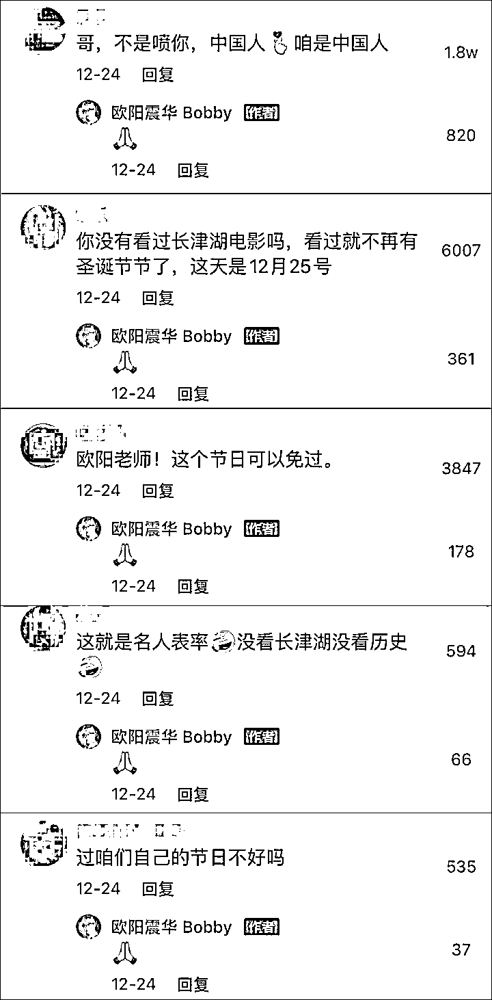

# 如何看欧阳震华过圣诞，被热心网友们“警告”？

> 原文：[`mp.weixin.qq.com/s?__biz=MzU3NDc5Nzc0NQ==&mid=2247511388&idx=1&sn=045263944f25ba60c45575e0a8f2d2f2&chksm=fd2e0f82ca598694648df17b3d7559cc4b988e18703ecd0fbbdf7f41bdcd792b09a38d0354e6#rd`](http://mp.weixin.qq.com/s?__biz=MzU3NDc5Nzc0NQ==&mid=2247511388&idx=1&sn=045263944f25ba60c45575e0a8f2d2f2&chksm=fd2e0f82ca598694648df17b3d7559cc4b988e18703ecd0fbbdf7f41bdcd792b09a38d0354e6#rd)

演员欧阳震华，在抖音上发了一条自己在家里装扮圣诞树的视频，本意是想过节，讨个喜庆。 

然后就这样了：

欧阳震华老戏骨了，很恭敬的一一回复，最后表示感谢网友们的热心建议。

这个事情没有闹开 ，如果他性子硬一点，和网友们拌几句嘴，会不会发酵就不好讲了。 

我们今天聊的不是是非，就是欧阳老师的这个处世之道，很多事情，你想明白了，就不是事情。 

[我们昨天在大号里聊到许知远](http://mp.weixin.qq.com/s?__biz=MzU0MjYwNDU2Mw==&mid=2247503192&idx=1&sn=d78460b806fe11e786ec6388572688a6&chksm=fb1aa124cc6d2832fb8d294930e397b64f0386787b268a77605b56aff243335199f5f256f3e9&scene=21#wechat_redirect)，我说他和蔡澜争辩的那一期，就感觉他不明白。 

如果他不明白，蔡澜也不明白，俩人就掐起来了。可现实是他不明白，蔡澜已经活明白了，所以掐不起来。

无论许知远用多少方法，各种激，各种引导，蔡澜始终只谈风花雪月，只是请他吃美食，与他谈美女，别的一概不讲。

蔡澜是个活明白的人，他明白世界不可能是纯粹的，就像人体内充满了细菌，人体里要是干净到如同手术台，那这人也就死了。 

活人就是一个寄生菌的组合体，你不是化学药品构建的，你是生物链构建的。 

生物链就是平衡，而且是**迟滞的平衡**。 

什么叫迟滞？就是很多事都是慢半拍的，这个半拍放到人生中，也许就是你的一辈子。

换句话说，你本来就是糊里糊涂的活着，你非要拒绝，那你把自己浸泡在福尔马林里去吧，泡完你自己也就消失了。 

蔡澜想通了，活通透了，许知远还拧巴着，这就是我昨天说的，我对他的观感。

你说这些热心网友，对欧阳震华到底是好意还是恶意？ 

天知道，也许兼而有之。

无论是什么意，这种意思在欧阳震华看来，都很无聊，因为过了。 

我们和西方世界的关系远没有差到彼此过个节日都无法接受的地步，如果是这样，那这世上就不该有寿司店。 

毕竟翻开历史，我们和日本的关系那才叫差，可是日式料理不还是满大街都是么？

你反对什么，我理解，但是你反对到什么程度，反映着你的成熟度。 

一个成熟的人，反对不干净，于是每天洗澡，病了吃药。 

一个不成熟的人，无法忍受任何意义上的不干净，每天喝酒精消毒，把自己彻底消死了，这就叫过度。

度在哪里？对于成熟的人很重要。 

对于不成熟的人，他脑子里没有概率，没有程度，只有非黑即白，因为他脑容量有限，只能理解二元。 

你现在想明白为啥投资人里面七亏二平一赚？因为七成的人，脑容量都有限。 

他们只能理解非黑即白，要么涨要么跌，要么猜对了要么猜错了，理解到这里，打住了，再深刻的话题千万不要跟他们讲，一讲，他们脑子就炸掉了，短路了。

人只有理解了二元之外的量化，也就是到底多少多，多少空，什么时间多，什么时间空，怎么多，怎么空，只有把一切量化了，他才能进入那三成，所谓的二平一赚。 

他必须理解了概率，量化之后仍然有概率，多少多，多少空，这之后仍然要乘以概率，才是数学期望，理解到这个程度，他才能进入一赚。

你听听看很简单，仔细想想，很复杂的。这么点简单的事情把绝大多数人都排斥在外了。

这也就是昨天大号聊的主题，你说大部分人为什么无望？因为人真的不一样啊，人真的分三六九，人真的从理解力上的差异就天壤之别了。

你怎么可能指望一个认知力这么低的人，过的很自在呢？ 

很多时候，我们感受不到自己的认知力有问题 ，是因为面对的题目很简单，就比如我举例子，就着容易理解的例子展开。 

欧阳震华过个圣诞节，就受不了了，很明显，过度了，很明显，这些人脑子里没有基本的量化概念，大家一听，哇，好容易，我也懂，我比他们强多了，为什么我去投资，我还是七亏呢？ 

对呀，因为例子太简单嘛。 

同样还是量化，我们把例子升级一下。 

[此前我们也聊过西安，在大号里。](http://mp.weixin.qq.com/s?__biz=MzU0MjYwNDU2Mw==&mid=2247503098&idx=1&sn=9be0c180b0a17aea98d8b2c948d89f58&chksm=fb1aa086cc6d29907188fcb38e3ab149fa3e66d362dc47bebe6c0fb9759cf1fe57a6773d5a50&scene=21#wechat_redirect)有部分读者跟我讲，买菜贵，比平日里贵。

这是不是问题？这肯定是，但这是不是当下的主要问题？

肯定不是。

你视角稍微宏观一点，就应该知道对于一个上千万的城市，一旦按下暂停键，必然各种问题都暴露出来。 

你习惯了的物价，本来就是原有的市场机制下形成的，可是现在不是原有的市场机制，现在是按了暂停键的。 

你希望有公共力量介入，让大家都待家里的同时，使得一起都一如既往，这只是你的希望。 

可是这个城市的公共力量是按照平日里的配备的，并不是时时刻刻按照这种突发情况配备的。

有没有足够的力量来解决按下暂停键后的所有问题，并且是及时解决？

明眼人稍微过过脑子就知道肯定没有。就像一个孕妇平日里要怀胎十月才能生下宝宝，就算我给你补足人力，给你十个孕妇，难道只要一个月就能生下宝宝吗？能吗？ 

非常简单的常识，《人月神话》，很多很多年前一本软件工程管理的书上讲过的。 

问题是，有几个人看过？

并没有，那本来就不是给大多数人看的书。 

其实站在量化的角度，这事儿本就无解。你能做的就是先按贵的买，无非买的同时保留下来收据，将来怎么样？将来投诉呗。 

你可以给物价局打电话呀，等解禁以后，以扰乱价格机制的名义再把钱要回来。 

这就是你能做的呀，否则呢？ 

你不吃？人家卖贵点你不吃了？那你饿着呗。

又或者，你一定要现在告？你可以现在告，问题是，现在这会儿公职人员也许都被抽调上街做检测去了，没人能够及时处理。 

更何况，现在告，告赢了又如何？告赢了人家不卖了，你饿着？

你只要看过人月神话这本书，你马上就会知道你身处的当下环境，你马上就会选择我说的那个办法，因为那是唯一能做的。

那就是先高价买下来，先吃饭，等半个月，一个月之后，秋后算账，你还能把钱要回来的，当然能。

因为半个月一个月后，物价局的工作人员恢复本职工作了，他们也想趁机修理下之前暂时没空管，也没法管的刺头，你正好递刀子。 

你看到了，一起都是延迟的，也必然是延迟的。 

这个例子和欧阳震华的例子是一个级别的，无非稍微复杂了一丁点儿，我估计已经有一部分人想不通了。 

所以，如果你把量化这个概念再复杂一点，不断的复杂下去，放在某些专业领域里，那很多人就彻底懵了。 

我们大号写过一篇，标题是：[我建议你不要看完。](https://mp.weixin.qq.com/s?__biz=MzU0MjYwNDU2Mw==&mid=2247502667&idx=1&sn=2e41ecbf67f6a389ba23e129cb322ce2&chksm=fb1aa737cc6d2e21a778279184bac9ada47215c2dcb87628a52db33ff691d7d1f4350dcb5e87&payreadticket=HDTZFQZu5oZCyZQSuHxfcLx6gqau0j5E1k_42PoZ7jyTXwJf1OsgcAKauB_ArdyYlztgy1s&scene=21#wechat_redirect)

引言里我就写的很清楚，我本来的用意是写给 50 个人看的，最后，光留言的人数就好几百人。

看完留言我心哇凉哇凉的。 

回到许知远访谈蔡澜的那个话题。 

不是蔡澜有意躲避，而是蔡澜觉得没意思，蔡澜知道你许知远今天想不明白，蔡澜也知道他没有办法让你想明白。

那吃菜吃菜，就是一种很好的交流方式。 

就像大人和孩子常有的那句对话，等你长大了，你就明白了。 

至于你的心理年龄能长多大，那要看你的阅历了。